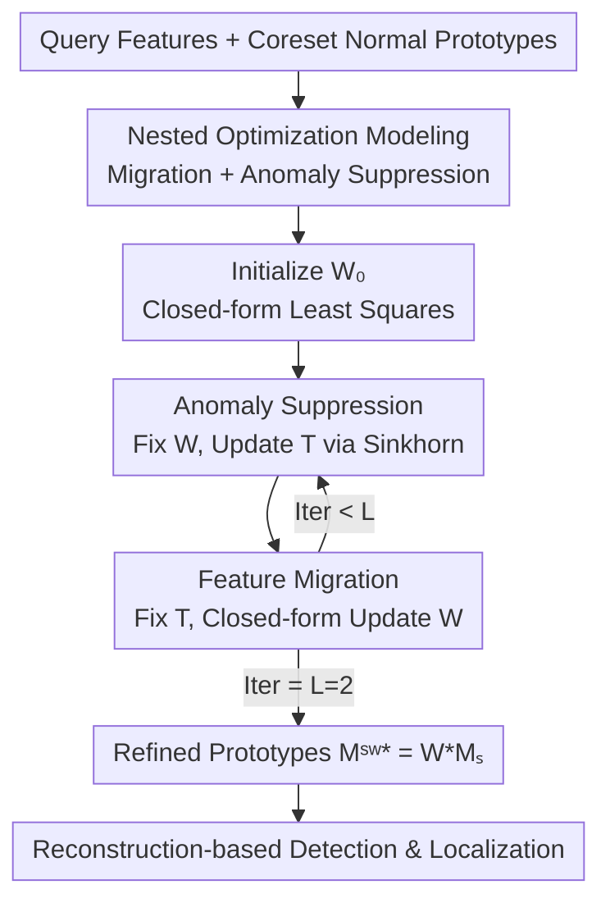

# FastRef: Fast Prototype Refinement for Few-shot Industrial Anomaly Detection

**Conference**: CVPR 2026  
**Paper**: [CVF Open Access](https://openaccess.thecvf.com/content/CVPR2026/html/Li_FastRef_Fast_Prototype_Refinement_for_Few-shot_Industrial_Anomaly_Detection_CVPR_2026_paper.html)  
**Code**: https://github.com/liyufei25/FastRef (开源承诺)  
**Area**: Object Detection / Industrial Anomaly Detection  
**Keywords**: Industrial Anomaly Detection, Few-shot, Prototype Refinement, Optimal Transport, Sinkhorn  

## TL;DR
FastRef formulates "refining normal prototypes with query features" as a nested optimization problem involving **feature migration + anomaly suppression**. During inference, it uses a transform matrix with a closed-form update to migrate query information into prototypes, while employing Sinkhorn Optimal Transport to suppress incorporated anomalies. As a plug-and-play module for PatchCore, WinCLIP, and AnomalyDINO, it consistently improves detection and localization AUROC under 1/2/4-shot settings while meeting real-time requirements.

## Background & Motivation
**Background**: Industrial Anomaly Detection (IAD) aims to automatically identify defects on product surfaces. Prevailing unsupervised methods require extensive normal images for training. However, many products lack sufficient normal data during the cold-start phase, making **Few-shot IAD (FS-IAD)** a practical necessity—where only one or a few normal images may be available per product. The most effective methods in this setting are **prototype-oriented**, constructing "normal prototypes" from support statistics and calculating anomaly scores based on the distance between query features and these prototypes.

**Limitations of Prior Work**: Most prototype-oriented methods (PatchCore, WinCLIP, AnomalyDINO) keep prototypes **fixed** during inference, failing to exploit the feature statistics of the current query image, which leads to insufficient representation. Among the few works attempting query-based refinement, FastRecon employs **point-to-point reconstruction** from query features to prototypes. This strictly limits the ability to migrate query specifics into the prototype and incorrectly assumes that augmented prototypes follow an isotropic Gaussian distribution, which often fails for real industrial data.

**Key Challenge**: In extremely low-sample regimes, "refining prototypes with the query" is a double-edged sword. While the goal is to migrate normal query characteristics (**feature migration**), the query image itself may contain anomalies. Point-wise reconstruction risks migrating these anomalies into the prototype, making defect regions indistinguishable from normal ones. In FS-IAD, the scarcity and low diversity of normal prototypes make this "anomaly leakage" risk much higher than in standard IAD.

**Goal**: To refine prototypes during inference using query features to make them more representative, while simultaneously **migrating normal characteristics and suppressing potential anomalies** in a real-time manner.

**Core Idea**: Prototype refinement is modeled as a **nested optimization**. A transform matrix $W$ performs "compositional reconstruction" of query features (feature migration), while a transport probability matrix $T$ uses Optimal Transport to pull the augmented prototypes back toward the original normal prototype distribution (anomaly suppression). These are solved alternatingly via closed-form updates and integrated as a universal module into any prototype-oriented method.

## Method

### Overall Architecture
Given $k$ normal support images and a query image $t$, features are extracted using a frozen pre-trained backbone (ResNet-50, WRN-50, CLIP, or DINOv2). Redundant support features are compressed into normal prototypes $\mathcal{M}_s \in \mathbb{R}^{n\times c}$ ($n=\alpha\cdot k\cdot h\cdot w$, where $\alpha$ is the sampling rate) via Coreset. FastRef aims to compute a set of "refined prototypes" $\mathcal{M}_s^{w*}$ for **each query** at inference time, ensuring they absorb normal query characteristics without being contaminated by anomalies. Anomaly scores are finally derived by comparing query features with these refined prototypes.

The refinement is formulated as a nested optimization (Eq. 3):

$$\boldsymbol{W}^*, \boldsymbol{T}^* = \arg\min_{\boldsymbol{W},\boldsymbol{T}}\ \mathrm{dis}(\boldsymbol{f}_t^{q}, \boldsymbol{W}\boldsymbol{\mathcal{M}}_s) + \lambda\,\mathrm{OT}(P,Q)$$

The first term enables $\boldsymbol{W}\boldsymbol{\mathcal{M}}_s$ (the refined prototypes $\mathcal{M}_s^w$) to reconstruct query features $f_t^q$ (**feature migration**). The second term uses Optimal Transport $\mathrm{OT}(P,Q)$ to align the distribution $P$ of refined prototypes with the original normal distribution $Q$ (**anomaly suppression**). $W$ and $T$ are updated iteratively: $T$ is updated via Sinkhorn while fixing $W$, and $W$ is updated via a closed-form solution while fixing $T$. $L=2$ iterations are typically sufficient.

### Key Designs

**1. Nested Optimization: Combining Compositional Reconstruction and Distribution Alignment**

Unlike FastRecon's point-wise alignment, FastRef proposes **compositional refinement**: refined prototypes $\mathcal{M}_s^w = \boldsymbol{W}\boldsymbol{\mathcal{M}}_s$ are constructed by **selecting and linearly combining** elements from the normal prototype set to reconstruct query features. $W\in\mathbb{R}^{m\times n}$ determines the weighting of normal prototypes for each query position. To prevent anomalies from being reconstructed into the prototype, the second term utilizes transport probabilities $T\in\mathbb{R}^{m\times n}$ to minimize the Optimal Transport distance between distributions. Intuitively, under the constraint $\sum_j T_{i,j}=\tfrac1m$, if $T$ identifies anomalous features in one round, $W$ will reduce their weights in the next to minimize the OT term, naturally suppressing the anomalies. This structural alignment is the fundamental reason FastRef succeeds where point-wise reconstruction fails.

**2. Feature Migration: Closed-form Update of the Transform Matrix**

When fixing $T$, if $\mathrm{dis}(\cdot,\cdot)$ is Euclidean or Cosine distance, $W$ has a **closed-form solution** (Eq. 5):

$$\boldsymbol{W}_{l+1}=\frac{(\boldsymbol{f}_t^q\boldsymbol{\mathcal{M}}_s^T+\lambda \boldsymbol{T}_l\boldsymbol{\mathcal{M}}_s\boldsymbol{\mathcal{M}}_s^T)(\boldsymbol{\mathcal{M}}_s\boldsymbol{\mathcal{M}}_s^T)^{-1}}{1+\lambda \boldsymbol{T}_l\cdot\mathbf{1}}$$

This closed-form update is central to the "fast" nature of FastRef, eliminating the need for iterative backpropagation. The term $(\mathcal{M}_s\mathcal{M}_s^T)^{-1}\in\mathbb{R}^{n\times n}$ can be **pre-calculated and reused**. With a small $n$ from Coreset, the per-step cost is minimal. Initialization uses $\boldsymbol{W}_0=(f_t^q\mathcal{M}_s^T)(\mathcal{M}_s\mathcal{M}_s^T)^{-1}$, which provides an optimal efficiency-performance trade-off. Convergence analysis shows that only $L=2$ outer iterations are required.

**3. Anomaly Suppression: Sinkhorn OT Aligning Refined and Normal Prototypes**

With $W$ fixed, $T$ is updated using entropy-regularized Optimal Transport (Eq. 4):

$$\mathrm{OT}_\epsilon(P,Q)=\sum_{i,j}^{m,n}\boldsymbol{C}_{i,j}\boldsymbol{T}_{i,j}+\epsilon\sum_{i,j}^{m,n}\boldsymbol{T}_{i,j}\ln \boldsymbol{T}_{i,j}$$

Subject to $\sum_j T_{i,j}=\tfrac1m,\ \sum_i T_{i,j}=\tfrac1n$. Using OT instead of Gaussian assumptions allows the method to be robust to non-Gaussian real-world industrial data. The Sinkhorn algorithm requires fewer than $10$ inner iterations to ensure real-time performance.

**4. Reconstruction-based Detection and Plug-and-play Application**

After obtaining $\mathcal{M}_s^{w*}$, anomaly scores are calculated as $\boldsymbol{s}_j=\mathrm{dis}(\boldsymbol{f}_{t,j}^q, \boldsymbol{\mathcal{M}}_{s,j}^{w*})$. This is applied to three representative methods: **PatchCore+** (WRN-50), **WinCLIP+** (CLIP, fusing FastRef few-shot scores with zero-shot scores), and **AnomalyDINO+** (DINOv2). The transformation matrix acts as a "minimalist decoder," preventing the overfitting or "shortcut" issues common in heavy decoder-based methods like UniAD.

### Loss & Training
FastRef **requires no training**; processing occurs entirely during inference. The backbone is frozen, and for each query, $L=2$ outer iterations are executed. Key hyperparameters include the balance coefficient $\lambda$ (0.3 for PatchCore+, 0.1 for WinCLIP+/AnomalyDINO+) and the Coreset sampling rate $\alpha$.

## Key Experimental Results

### Main Results
Evaluated on four benchmarks (MVTec, MPDD, ViSA, RealIAD) across 1/2/4-shot settings. The table shows 2-shot Image AUROC results, where "+" denotes the FastRef-enhanced variant and $\Delta$ represents the Gain:

| Dataset (2-shot, Image AUROC) | PatchCore | PatchCore+ | WinCLIP | WinCLIP+ | AnomalyDINO | AnomalyDINO+ |
|---|---|---|---|---|---|---|
| MVTec | 87.1 | 88.8 (+1.7) | 93.7 | 93.9 (+0.2) | 96.7 | 97.2 (+0.5) |
| MPDD | 71.4 | 78.2 (+6.8) | 72.5 | 76.0 (+3.5) | 75.2 | 78.4 (+3.2) |
| ViSA | 80.0 | 87.1 (+7.1) | 83.8 | 84.1 (+0.3) | 82.5 | 84.8 (+2.3) |
| RealIAD | 71.7 | 76.9 (+5.2) | 75.0 | 75.9 (+0.9) | 77.8 | 79.8 (+2.0) |

Pixel-level (localization) trends are consistent. A key conclusion is that FastRef provides significant gains across different backbones, with **larger improvements observed on weaker backbones or more challenging datasets** (e.g., MPDD).

### Ablation Study (WinCLIP+, 2-shot, Image/Pixel AUROC)
| $W^*$ (Migration) | $T^*$ (Suppression) | MVTec | VisA | MPDD |
|---|---|---|---|---|
| × | × | 93.7 / 93.8 | 83.8 / 95.1 | 72.5 / 96.5 |
| ✓ | × | 93.8 / 94.7 | 84.0 / 96.2 | 74.9 / 96.8 |
| ✓ | ✓ | **93.9 / 96.2** | **84.1 / 96.4** | **76.0 / 97.3** |

### Key Findings
- **Synergy of Components**: Both terms are necessary. Using only $W^*$ leads to potential anomaly leakage; adding $T^*$ (anomaly suppression) provides a consistent boost of >0.4% in Image and >0.7% in Pixel AUROC.
- **Hyperparameter Sensitivity**: Both $\alpha$ and $\lambda$ show a "peak" behavior, where optimal values suggest that feature migration should predominate with suppression acting as a safeguard.
- **Efficiency**: $L=2$ iterations provide the best balance between performance and speed, validating the method's "Fast" claims.

## Highlights & Insights
- **Dual-Control of Refinement**: Decoupling refinement into $W$ (transport) and $T$ (purification) allows the system to self-correct, as $T$ identifies anomalies to help $W$ suppress their influence.
- **Closed-form Real-time Inference**: By combining closed-form updates, reusable matrix inversions, and small Coreset sizes, the method enables effective per-query optimization at 3090-level speeds.
- **Generalized Framework**: Proving FastRecon as a special case ($T=I$ with Gaussian mean) demonstrates the theoretical robustness and superior generality of Ours.
- **Backbone Agnostic**: The module works across CNN, CLIP, and DINOv2 models, offering a low-cost upgrade for various FS-IAD pipelines.

## Limitations & Future Work
- **Diminishing Returns on Strong Backbones**: On saturation-level benchmarks like MVTec combined with AnomalyDINO, gains are modest (+0.3~0.5), indicating the "refinement dividend" is lower for high-performance backbones.
- **Batch Processing**: While real-time for $BatchSize=1$, performance across larger batches or higher throughput scenarios is not fully explored.
- **Hyperparameter Tuning**: Optimal $\lambda$, $\alpha$, and $\epsilon$ parameters vary across datasets, requiring manual adjustment for new production lines.

## Related Work & Insights
- **vs. FastRecon (ICCV 2023)**: Ours overcomes point-wise alignment and rigid Gaussian assumptions by using compositional refinement and OT-based distribution alignment. 
- **vs. PatchCore / WinCLIP / AnomalyDINO**: FastRef does not replace these methods but enhances them by dynamically refining prototypes for each query, whereas the original methods use static prototypes.
- **vs. UniAD / HVQTrans**: Heavy decoder methods often suffer from overfitting in few-shot scenarios. FastRef's minimalist transformation matrix provides structural awareness while maintaining modularity and preventing overfitting.

## Rating
- Novelty: ⭐⭐⭐⭐ Models refinement as a nested optimization with closed-form solutions; summarizes prior work as special cases.
- Experimental Thoroughness: ⭐⭐⭐⭐ Extensive testing across four datasets and three backbones; solid ablation studies.
- Writing Quality: ⭐⭐⭐⭐ Clear motivation and mathematical derivation.
- Value: ⭐⭐⭐⭐ Practical, real-time, and plug-and-play for industry cold-start scenarios.

<!-- RELATED:START -->

## Related Papers

- [\[CVPR 2026\] Defect Cue-Preserved Structural Feature Refinement for Few-Shot Anomaly Detection](defect_cue-preserved_structural_feature_refinement_for_few-shot_anomaly_detectio.md)
- [\[CVPR 2026\] Omni-AD: A Large-scale and Versatile Benchmark for Industrial Anomaly Detection](omni-ad_a_large-scale_and_versatile_benchmark_for_industrial_anomaly_detection.md)
- [\[CVPR 2026\] SubspaceAD: Training-Free Few-Shot Anomaly Detection via Subspace Modeling](subspacead_training-free_few-shot_anomaly_detection_via_subspace_modeling.md)
- [\[CVPR 2026\] GPFlow: Gaussian Prototype Probability Flow for Unsupervised Multi-Modal Anomaly Detection](gpflow_gaussian_prototype_probability_flow_for_unsupervised_multi-modal_anomaly_.md)
- [\[CVPR 2026\] Bidirectional Multimodal Prompt Learning with Scale-Aware Training for Few-Shot Multi-Class Anomaly Detection](bidirectional_multimodal_prompt_learning_with_scale-aware_training_for_few-shot_.md)

<!-- RELATED:END -->
