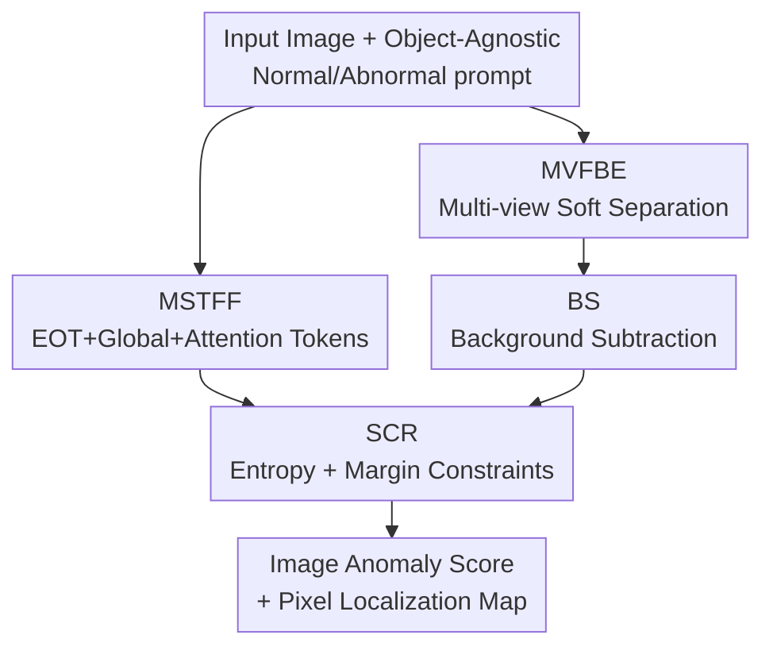

# FB-CLIP: Fine-Grained Zero-Shot Anomaly Detection with Foreground-Background Disentanglement

**Conference**: CVPR 2026  
**Paper**: [CVF Open Access](https://openaccess.thecvf.com/content/CVPR2026/html/Hu_FB-CLIP_Fine-Grained_Zero-Shot_Anomaly_Detection_with_Foreground-Background_Disentanglement_CVPR_2026_paper.html)  
**Code**: https://github.com/Xi-Mu-Yu/FB-CLIP  
**Area**: Zero-Shot Anomaly Detection / Multimodal VLM  
**Keywords**: Zero-Shot Anomaly Detection, CLIP, Foreground-Background Disentanglement, Text Feature Fusion, Cross-Modal Alignment  

## TL;DR
FB-CLIP addresses the "foreground-background feature entanglement" problem in CLIP-based fine-grained zero-shot anomaly detection by treating text and vision paths simultaneously: the text side fuses EOT, global pooling, and attention tokens for richer semantic prompts, while the vision side softly separates foreground from background via identity, semantic, and spatial perspectives, applying background subtraction to suppress residual interference. Combined with semantic consistency regularization, it achieves SOTA AUPRO across 16 industrial and medical datasets.

## Background & Motivation
**Background**: Anomaly detection aims to identify regions deviating from normal patterns (e.g., scratches in industrial inspection, lesions in medical imaging) without anomaly annotations. Due to the scarcity of anomalous samples, Zero-Shot Anomaly Detection (ZSAD) has become a mainstream direction. Vision-Language Pre-trained models like CLIP enable ZSAD through image-text alignment without training samples. Representative works like AnomalyCLIP learn "object-agnostic" prompts to encode general normal/abnormal semantics.

**Limitations of Prior Work**: The authors observed a key phenomenon in AnomalyCLIP visualizations—original CLIP produces **strong responses in both foreground and background regions**. The model fails to distinguish "anomaly-related foreground semantics" from "irrelevant background context," leading to severe entanglement in visual representations. Massive background responses drown out subtle anomaly signals, hindering precise localization. Existing methods attempt mitigation in two ways but remain incomplete: text-side methods rely only on learnable prompts with limited diversity, providing insufficient guidance for distinguishing foreground clues from complex backgrounds; vision-side methods enhance patch tokens but **default to token homogeneity**, ignoring large variances in semantic uncertainty across different regions (some tokens contain key clues, while others are background noise).

**Key Challenge**: CLIP's alignment is established on "image-level" semantics, whereas fine-grained anomalies are local, sparse, and weak. Coarse single text features combined with homogeneous visual tokens cannot cleanly isolate anomalous foregrounds from backgrounds at the pixel level.

**Goal**: In a zero-shot setting, enable the model to use richer text semantics for alignment guidance while explicitly separating and enhancing foreground anomalies and suppressing backgrounds to obtain cleaner, discriminative representations.

**Key Insight**: **Foreground-Background Disentanglement**—using "multi-strategy fusion" on the text side for discriminative prompts, "multi-perspective soft separation + background subtraction" on the vision side to decouple foreground anomalies from background, and consistency regularization to tighten image-text matching.

## Method

### Overall Architecture
FB-CLIP is based on a frozen CLIP (ViT-L/14@336px) backbone. It inputs a test image and outputs an image-level anomaly score and a pixel-level anomaly map without seeing any anomaly annotations. It consists of four modules: the **text-side** MSTFF fuses token sequences from object-agnostic prompts into richer prototypes; the **vision-side** MVFBE generates soft foreground masks from multiple clues to enhance foreground/background features via identity, semantic, and spatial perspectives; the BS module then uses a background prototype for subtraction to eliminate residual noise; finally, SCR aligns visual features with text prototypes using entropy and margin constraints. The anomaly map is generated via cosine similarity between the background-suppressed visual features and text prototypes.

### Key Designs

**1. MSTFF (Multi-Strategy Text Feature Fusion): Enhancing coarse EOT vectors with three-way pooling**

Following AnomalyCLIP's object-agnostic prompts—normal $g_n=[V_1]\dots[V_E][\text{object}]$ and abnormal $g_a=[W_1]\dots[W_E][\text{damaged}][\text{object}]$—the model focuses on anomaly clues for cross-domain generalization. Since the CLIP text encoder only uses the End-of-Text (EOT) token, it misses context-specific semantics. MSTFF extracts three complementary features from the encoded sequence $X\in\mathbb{R}^{B\times L\times D}$: $F_{eot}$ for alignment compatibility, $F_{global}=\frac{1}{L}\sum_i X[:,i,:]W_{proj}$ for context stability, and an attention feature $F_{attn}=\sum_i \text{softmax}(S(X[:,i,:]))\,X[:,i,:]$ guided by a two-layer MLP selector $S(\cdot)$. The weighted fusion is:

$$F_{text}=\lambda_1 F_{global}+\lambda_2 F_{attn}^{proj}+\lambda_3 F_{eot},\quad \lambda_1=1.0,\ \lambda_2=\lambda_3=0.5.$$

This provides text prototypes with alignment compatibility, context stability, and task sensitivity for stronger cross-modal matching.

**2. MVFBE (Multi-View Foreground-Background Enrichment): Decoupling heterogeneous tokens via three perspectives**

To address visual entanglement, the model first computes anomaly scores based on four clues—local saliency $\tilde S_{local}$, center distance $\tilde D_{center}$, CLS inconsistency $\tilde I_{cls}$, and temporal change $\tilde T_{temp}$:

$$A=\alpha_1\tilde S_{local}+\alpha_2\tilde D_{center}+\alpha_3\tilde I_{cls}+\alpha_4\tilde T_{temp},\quad \alpha_{1,2,3}=0.3,\ \alpha_4=0.1,$$

which is binarized into a **soft foreground mask** $P_{fg}[i]=1.0\ (A[i]>0.5)$ else $0.5$. Using $\{0.5,1.0\}$ instead of $\{0,1\}$ maintains gradient stability while distinguishing high-confidence foregrounds from uncertain tokens. Three perspectives are then processed: **Identity (ID)** $X_{ID}=X$; **Semantic (SEM)** using outer products for foreground/background interaction weights $W_{fg}=p_{fg}\otimes p_{fg}^T$ and $W_{bg}=(1-p_{fg})\otimes(1-p_{fg})^T$, weighting foreground by "information richness" $r_{info}=1-\cos(X_{tokens},X_{cls})$ and background by "stability" $s_{stable}=\cos(X_{tokens},X_{cls})$; **Spatial (SPA)** reshapes tokens into a 2D grid of $5\times5$ overlapping patches to capture local structures. These are integrated across $N$ transformer layers and passed through FB-Attention using a learnable gating function $G(\cdot)$ to split features into foreground $x_{fg}=G(x)x$ and background $x_{bg}=(1-G(x))x$ branches.

**3. BS (Background Subtraction): Eliminating residual noise via background prototypes**

Residual background noise may remain after enrichment. BS collects the bottom-half candidate background tokens from $3N$ features to build a background bank $X_{bg,bank}$, constructing a **prototype background vector** $b_{proto}=\frac12\text{Mean}(X_{bg,bank})+\frac12\text{Max}(X_{bg,bank})$. For each feature, the anomaly signal is derived via subtraction $a^{(i)}=F_{enhanced}^{(i)}-b_{proto}$ and refined by similarity weighting:

$$a_{enh}^{(i)}=a^{(i)}\odot(1-s_{bg}^{(i)}),\qquad F_{final}^{(i)}=\alpha F_{enhanced}^{(i)}+(1-\alpha)a_{enh}^{(i)},\ \alpha=0.5.$$

Tokens resembling the background are suppressed, highlighting anomalies. Ablations show BS **causes a performance drop when used alone**; it acts as a subtractive filter that requires clean representations from MSTFF/MVFBE to be effective.

**4. SCR (Semantic Consistency Regularization): Stabilizing zero-shot alignment via entropy and margin**

To prevent alignment drift, SCR imposes "confidence" and "discriminability" constraints. Visual tokens $V$ and text prototypes $T$ are used to calculate similarity $s=\frac{1}{\tau} VT^\top\ (\tau=0.07)$. **Entropy regularization** $L_{entropy}=\mathbb{E}_b[-\sum_c p_b(c)\log p_b(c)]$ encourages confident predictions, while **Margin regularization** $L_{margin}=\mathbb{E}_b[\max(0,\gamma-|s_b[1]-s_b[0]|)]\ (\gamma=1)$ forces a gap between normal and abnormal similarities. The total loss is $L_{consistency}=\lambda(w_e L_{entropy}+w_m L_{margin})$ with $\lambda=0.15,\ w_e=1.0,\ w_m=0.5$.

### Loss & Training
The CLIP backbone (ViT-L/14@336px) is frozen; only learnable prompts and a few parameters are finetuned. Training follows the cross-dataset protocol: when evaluating on MVTec AD, VisA test data is used for finetuning, and vice-versa. The objective combines segmentation, classification, and SCR losses. Optimized via Adam on an RTX 3090 with a learning rate of 5e-5.

## Key Experimental Results

### Main Results
Evaluation across 16 datasets (7 Industrial + 9 Medical) using AUROC, AP, and AUPRO. Comparison with AF-CLIP (MM'25) and FAPrompt (ICCV'25):

| Dataset | Metric | FB-CLIP | AF-CLIP | FAPrompt |
|--------|------|---------|---------|----------|
| VisA (Industrial, Pixel-level) | AUROC / AUPRO | **96.3 / 91.4** | 96.2 / 88.7 | 95.9 / 87.7 |
| VisA (Industrial, Image-level) | AUROC / AP | **89.5 / 90.7** | 88.5 / 90.0 | 84.6 / 86.8 |
| Real-IAD (Large-scale, Pixel-level) | AUROC / AUPRO | **95.9 / 88.2** | 95.5 / 81.6 | 95.0 / 82.1 |
| Real-IAD (Image-level) | AUROC / AP | **80.6 / 78.4** | 79.2 / 77.0 | 77.3 / 74.8 |
| ClinicDB (Medical, Pixel-level) | AUROC / AUPRO | **87.2 / 73.5** | 87.1 / 70.0 | 84.7 / 70.1 |

FB-CLIP significantly improves AUPRO on Real-IAD by **6%+** and VisA by ~2.7%. It ranks top two in 14 out of 18 metrics.

### Ablation Study
Incremental setup on MVTec:

| Configuration | Image-level (AUROC, AP) | Pixel-level (AUROC, AUPRO) | Description |
|------|--------------------|------------------------|------|
| Base | (67.1, 84.0) | (65.2, 32.9) | Vanilla CLIP |
| +MSTFF | (82.0, 91.4) | (84.0, 68.0) | Largest text-side gain |
| +MVFBE | (92.2, 96.5) | (91.7, 84.5) | Drives localization |
| +BS (Alone) | (44.8, 72.7) | (70.7, 38.3) | Performance drop |
| Full | (92.4, 96.6) | (91.9, 85.7) | Best overall |

### Key Findings
- **MSTFF provides the largest single-module gain**: Image-level AUROC on MVTec jumps from 67.1% to 82.0%, suggesting coarse text is the primary bottleneck for CLIP in fine-grained tasks.
- **MVFBE dominates localization**: AUPRO increases significantly due to explicit foreground-background separation.
- **BS requires preparation**: BS alone drops AUROC to 44.8%, confirming it is a subtractive filter that only works on already-refined representations.
- **Complexity benefits**: Visualization shows FB-Attention is particularly effective at noise suppression in complex textures, making small scratches more visible.

## Highlights & Insights
- **Dual-modality disentanglement**: The breakdown of entanglement into text coarseness, visual homogeneity, residual noise, and alignment drift is logical and well-validated.
- **Soft mask {0.5, 1.0}**: This design maintains gradient stability and allows uncertain tokens to be refined later, a transferable trick for segmentation-guided tasks.
- **Prototype via Mean+Max**: Combining global background (Mean) with salient background (Max) provides a comprehensive representation of "background-ness."
- **SCR as an unsupervised SVM**: Using entropy and margin constraints to stabilize cross-modal alignment without labels is a lightweight solution for zero-shot tasks.

## Limitations & Future Work
- **Dependency of BS**: Since BS cannot work independently, the components are tightly coupled, making it less modular for other backbones.
- **Inconsistent Medical Performance**: Results on TN3K or Kvasir did not always surpass SOTA, suggesting disentanglement is less effective for blurry boundaries or specific medical textures.
- **Dataset Leakage Convention**: Following the ZSAD convention of using one dataset's test set to tune another limits the "purity" of the zero-shot claim.
- **Appendix Requirements**: Implementation of the four critical anomaly clues is reserved for the appendix, requiring external reference for full reproduction.

## Related Work & Insights
- **vs AnomalyCLIP**: Both use object-agnostic prompts, but AnomalyCLIP lacks vision-side disentanglement and relies on single EOT tokens; FB-CLIP outperforms it significantly (VisA AUPRO 87.0% $\rightarrow$ 91.4%).
- **vs AF-CLIP (MM'25)**: AF-CLIP uses neighborhood aggregation for homogeneous tokens, whereas FB-CLIP's SPA uses masks to distinguish foreground/background patches, yielding 6%+ gains on Real-IAD.
- **vs WinCLIP / CLIP-AD**: These rely on sliding windows or local patch-text similarity; FB-CLIP goes further by explicitly modeling token structural differences and background subtraction.

## Rating
- Novelty: ⭐⭐⭐⭐ Clear perspective on disentanglement; well-decomposed modules.
- Experimental Thoroughness: ⭐⭐⭐⭐⭐ 16 datasets across industries and medical fields with full ablations.
- Writing Quality: ⭐⭐⭐⭐ Complete formulas, though critical clue details are in the appendix.
- Value: ⭐⭐⭐⭐ SOTA localization; open-source and practical for industrial/medical inspection.

<!-- RELATED:START -->

## Related Papers

- [\[CVPR 2026\] DLVP-CLIP: Enhancing Fine-Grained Zero-Shot Anomaly Detection via Dynamic Local Visual Prompting](dlvp-clip_enhancing_fine-grained_zero-shot_anomaly_detection_via_dynamic_local_v.md)
- [\[CVPR 2026\] MoECLIP: Patch-Specialized Experts for Zero-shot Anomaly Detection](moeclip_patch-specialized_experts_for_zero-shot_anomaly_detection.md)
- [\[CVPR 2026\] GS-CLIP: Zero-shot 3D Anomaly Detection by Geometry-Aware Prompt and Synergistic View Representation Learning](gs-clip_zero-shot_3d_anomaly_detection_by_geometry-aware_prompt_and_synergistic_.md)
- [\[CVPR 2026\] VisualAD: Language-Free Zero-Shot Anomaly Detection via Vision Transformer](visualad_language-free_zero-shot_anomaly_detection_via_vision_transformer.md)
- [\[CVPR 2026\] AnomalyVFM -- Transforming Vision Foundation Models into Zero-Shot Anomaly Detectors](anomalyvfm_--_transforming_vision_foundation_models_into_zero-shot_anomaly_detec.md)

<!-- RELATED:END -->
