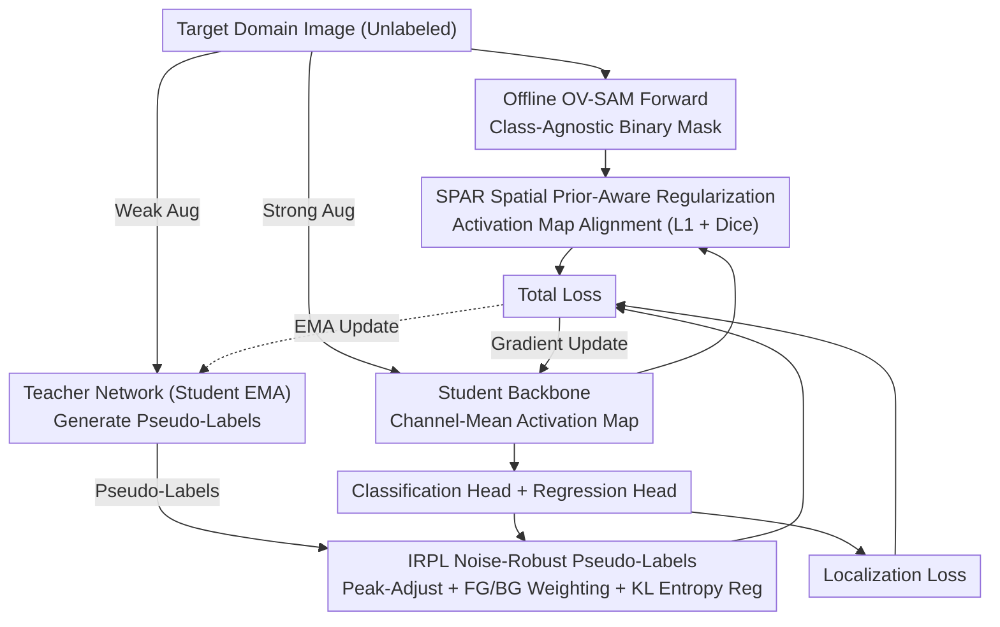

# Foundation Model Priors Enhance Object Focus in Feature Space for Source-Free Object Detection

**Conference**: CVPR 2026  
**arXiv**: [2512.17514](https://arxiv.org/abs/2512.17514)  
**Code**: To be confirmed  
**Area**: Object Detection  
**Keywords**: Source-Free Domain Adaptive Object Detection, Foundation Model Priors, Feature Space Regularization, Noise-Robust Pseudo-Labels, Mean-Teacher

## TL;DR

The FALCON-SFOD framework is proposed to enhance object-focused representations in source-free object detection. It regularizes the detector's feature space using class-agnostic binary masks generated by a foundation model (OV-SAM) via Spatial Prior-Aware Regularization (SPAR) and incorporates an Imbalance-Aware Noise-Robust Pseudo-Label loss (IRPL). The method achieves SOTA results across multiple benchmarks.

## Background & Motivation

1.  **Source-Free Object Detection (SFOD)** requires adapting a source-trained detector to an unlabeled target domain without access to source data, which is highly practical for autonomous driving and surveillance.
2.  **Limitations of Prior Work**: Current SOTA methods (IRG, PETS, Simple-SFOD, DRU) utilize the Mean-Teacher self-labeling framework but primarily focus on **pseudo-label filtering/refinement**, neglecting fundamental issues at the feature level.
3.  **Domain Shift Weakens Object Focus**: The authors observe that domain shift causes detector feature activations to diffuse from foreground objects into background clutter, leading to spatially dispersed channel-mean activation maps and blurred object boundaries—the **root cause** of poor pseudo-label quality.
4.  **Neglect of Feature-Level Representation**: Existing works rarely address how to enhance structured, object-centric representations from the feature space perspective.
5.  **Potential of Foundation Models**: Large-scale vision foundation models (e.g., DINOv2, SAM) possess strong cross-domain generalization, but their online usage is computationally expensive (e.g., DINO Teacher requires online alignment).
6.  **Severe Foreground-Background Imbalance**: Rare positive samples and abundant background regions in detection, combined with class label noise from the teacher network, lead to highly unstable training.

## Method

### Overall Architecture

FALCON-SFOD addresses a neglected root cause in SFOD: domain shift causes feature activations to spread into the background, degrading target boundaries and pseudo-labels. Built upon the standard Mean-Teacher framework, it introduces two complementary modules: **SPAR** (Spatial Prior-Aware Regularization) to "re-focus" activations onto objects at the feature level, and **IRPL** (Imbalance-Aware Noise-Robust Pseudo-Labeling) to combat class imbalance and teacher label noise at the loss level, alongside standard localization losses for end-to-end training. These modules target feature quality and label reliability, respectively, corresponding to different sources of detection risk.

### Key Designs

**1. SPAR: Re-focusing Feature Activations via Offline Foundation Model Masks**

The diffusion of student network activations into the background under domain shift is identified as the root cause of poor pseudo-labels. Since online alignment with DINO/SAM is costly, SPAR shifts the computational burden of foundation models to an offline stage. First, a frozen OV-SAM performs a single forward pass on each target image to obtain a class-agnostic binary foreground mask $A_G$ (where any segmented region is 1, and the rest is 0). During training, the channel-mean $A_S$ of the student backbone's final feature layer is resized and forced to align with $A_G$ using a combination of **L1 and Dice** losses:

$$\mathcal{L}_{\text{SPAR}} = \frac{\lambda_1}{H'W'}\sum_{j,k}|A_S[j,k] - A_G[j,k]| + \lambda_2 \cdot \text{DiceLoss}(A_S, A_G)$$

The foundation model is only run once during preprocessing, resulting in zero additional overhead during training and inference (hyperparameters $\lambda_1=1, \lambda_2=2$). Theoretically, SPAR purifies feature activations and directly lowers the localization bias $\eta_{\text{reg}}$ and miss rate $\zeta$ in the detection risk upper bound.

**2. IRPL: Counteracting Teacher Label Errors and FG-BG Imbalance via Noise-Robust Loss**

Training is unstable due to sparse positive samples, background dominance, and teacher label noise. IRPL employs three strategies: **Peak-Adjust Transformation** adds a margin $m$ to the peak of the student's predicted probability $\mathbf{p}$ before normalization. When teacher-student predictions are consistent ($\hat{c}=t$), the gradient is compressed by $p_{\hat{c}}/(p_{\hat{c}}+m) \ll 1$, acting as an implicit soft early-stopping mechanism to prevent overfitting to already "correct" labels. When inconsistent ($\hat{c} \neq t$), the gradient follows standard CE to allow correction of erroneous teacher labels. Additionally, **Foreground-Background Weighting** $w_{\hat{c}}$ mitigates class imbalance, and **KL Divergence Entropy Regularization** pulls the average class distribution of all proposals toward a uniform distribution to prevent dominance by head classes:

$$\mathcal{L}_{\text{IRPL}} = \sum_{(\hat{b},\hat{c})} w_{\hat{c}}[\alpha(-\log p'_{\hat{c}}) + \beta(1-p_{\hat{c}})] + \gamma D_{\text{KL}}(\bar{\mathbf{p}} \| \mathcal{U}_K)$$

Theoretically, while the standard Mean-Teacher risk upper bound includes a multiplicative expansion factor $1/\lambda$ for the classification term (Theorem 1), IRPL replaces it with an additive term $2\delta + 2w\delta/a$ (Theorem 2). This term can be arbitrarily tight as $\delta \to 0$, explaining the significant gains in long-tail low-frequency classes.

## Key Experimental Results

### Main Results (4 Domain Shift Scenarios)

| Scenario | Method | mAP/AP |
|------|------|--------|
| Cityscapes→Foggy (C→F) | Simple-SFOD | 45.0 |
| C→F | DRU | 43.7 |
| **C→F** | **Ours** | **46.9 (+1.9)** |
| Sim10k→Cityscapes (S→C) | Simple-SFOD | 55.4 |
| **S→C** | **Ours** | **58.8 (+3.4)** |
| KITTI→Cityscapes (K→C) | DRU | 45.1 |
| **K→C** | **Ours** | **50.1 (+5.0)** |
| Cityscapes→BDD100k | Simple-SFOD | 34.3 |
| **C→BDD100k** | **Ours** | **36.9 (+2.6)** |

### Extreme Domain Shift Experiments

| Scenario | Baseline | Ours | Gain |
|------|----------|-------------|---|
| PascalVOC→Clipart (Artistic) | 33.6 | 35.5 | +1.9 |
| FLIR Visible→Infrared (Thermal) | 56.7 | 58.5 | +1.8 |
| FLIR Infrared→COCO (Infrared to RGB) | 19.4 | 20.9 | +1.5 |

### Ablation Study

| Component | C→F mAP | S→C AP |
|------|---------|--------|
| Baseline | 45.0 | 55.4 |
| + SPAR | 46.1 | 57.5 |
| + IRPL | 45.8 | 56.8 |
| + SPAR + IRPL (Full) | **46.9** | **58.8** |

**Key Findings**: Improvements are concentrated in low-frequency classes (train +4.1, truck +4.0, bus +2.9), with a Pearson correlation of $r_\Delta = -0.90$, while head classes show no degradation.

**Mask Source Ablation**: OV-SAM > ESC-Net > GSAM > Source maps, confirming that stronger foundation models provide superior spatial priors.

## Highlights & Insights

- **Unique Problem Insight**: First to identify and demonstrate the degradation of object focus in the feature space for SFOD, addressing the problem at the feature level rather than just pseudo-label filtering.
- **Lightweight Design**: Foundation models are used only once offline, incurring zero additional overhead during training or inference.
- **Solid Theoretical Support**: Provides a comprehensive decomposition of detection risk and upper bound analysis, where SPAR and IRPL correspond to specific terms in the theory.
- **Long-tail Friendly**: IRPL significantly improves the performance of low-frequency classes (train/truck/bus) without harming head classes.

## Limitations & Future Work

- **Dependence on Mask Quality**: Performance may degrade if the foundation model fails to segment accurately in extreme domains (e.g., thermal imagery).
- **Limited Gains in Classification Accuracy**: Gains for common classes (person/car) are minimal; most benefits come from rare classes.
- **Architecture Constraints**: Validated primarily on Faster R-CNN series; not yet extended to Transformer-based detectors like DETR.
- **Theoretical Assumptions**: The assumption of a lower bound $\lambda>0$ for the transition matrix $T$ in the theoretical analysis may not hold under extreme domain shifts.
- **Hyperparameter Sensitivity**: End-to-end adaptation still requires tuning multiple hyperparameters ($\lambda_1, \lambda_2, \alpha, \beta, \gamma, m$).
- **Room for Improvement on BDD100k**: The mAP of 36.9% still lags slightly behind UDAOD methods like MTM (37.3%), indicating a remaining gap for the source-free setting.

## Related Work & Insights

| Method | Core Strategy | Feature Space Focus | Foundation Model Usage | C→F mAP |
|------|---------|:---:|:---:|:---:|
| IRG (CVPR'23) | Instance relationship graph refinement | ✗ | ✗ | 37.1 |
| PETS (ICCV'23) | Periodic Teacher-Student exchange | ✗ | ✗ | 35.9 |
| Simple-SFOD (ECCV'24) | Elaborate self-training | ✗ | ✗ | 45.0 |
| DRU (ECCV'24) | Dynamic retraining with updated teacher | ✗ | ✗ | 43.7 |
| DINO Teacher (UDAOD) | Online DINO feature alignment | ✓ | ✓ (Online) | — |
| **FALCON-SFOD** | Offline mask regularization + robust loss | **✓** | **✓ (Offline)** | **46.9** |

## Rating

- **Novelty**: ⭐⭐⭐⭐ — Introduces feature space object focus and foundation model priors to SFOD with a fresh perspective.
- **Experimental Thoroughness**: ⭐⭐⭐⭐ — Extensive testing across 4+ scenarios, extreme domains, and detailed long-tail analysis.
- **Writing Quality**: ⭐⭐⭐⭐ — Clear structure connecting theory to experiments; compelling motivational visualizations.
- **Value**: ⭐⭐⭐⭐ — Provides a practical and effective strategy for the SFOD community by utilizing offline priors.

<!-- RELATED:START -->

## Related Papers

- [\[AAAI 2026\] Beyond Boundaries: Leveraging Vision Foundation Models for Source-Free Object Detection](../../AAAI2026/object_detection/beyond_boundaries_leveraging_vision_foundation_models_for_so.md)
- [\[CVPR 2026\] DA-Mamba: Learning Domain-Aware State Space Model for Global-Local Alignment in Domain Adaptive Object Detection](da-mamba_learning_domain-aware_state_space_model_for_global-local_alignment_in_d.md)
- [\[NeurIPS 2025\] Test-Time Adaptive Object Detection with Foundation Model](../../NeurIPS2025/object_detection/test-time_adaptive_object_detection_with_foundation_model.md)
- [\[ICCV 2025\] SFUOD: Source-Free Unknown Object Detection](../../ICCV2025/object_detection/sfuod_source-free_unknown_object_detection.md)
- [\[ICLR 2026\] CGSA: Class-Guided Slot-Aware Adaptation for Source-Free Object Detection](../../ICLR2026/object_detection/cgsa_class-guided_slot-aware_adaptation_for_source-free_object_detection.md)

<!-- RELATED:END -->
