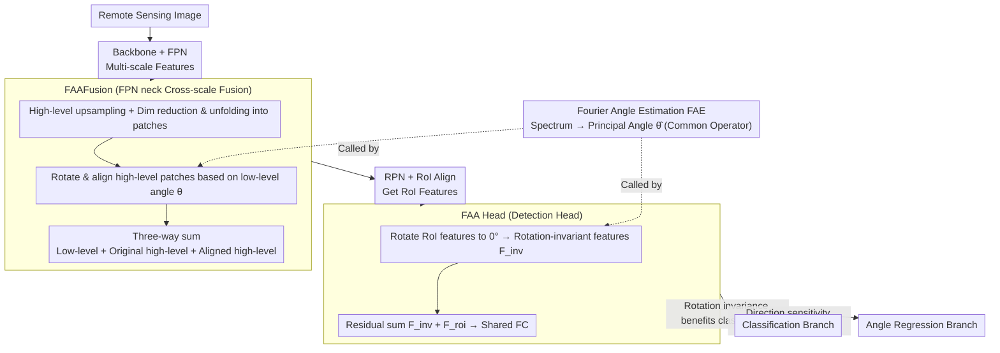

# Fourier Angle Alignment for Oriented Object Detection in Remote Sensing

**Conference**: CVPR 2026  
**arXiv**: [2602.23790](https://arxiv.org/abs/2602.23790)  
**Code**: [https://github.com/gcy0423/Fourier-Angle-Alignment](https://github.com/gcy0423/Fourier-Angle-Alignment)  
**Area**: Object Detection  
**Keywords**: Oriented Object Detection, Fourier Rotation Equivariance, Frequency Domain Orientation Estimation, Feature Fusion, Remote Sensing

## TL;DR

Leveraging Fourier rotation equivariance to estimate principal orientations in the frequency domain for feature alignment, this paper proposes two plug-and-play modules, FAAFusion and FAA Head. These modules address cross-scale directional incoherence in FPN and task conflict between classification and regression in detection heads, respectively, achieving new SOTA results on DOTA-v1.0/v1.5 and HRSC2016.

## Background & Motivation

**Key Challenge of Oriented Object Detection**: Objects in remote sensing images, such as ships, planes, and vehicles, appear in arbitrary orientations. Detectors must predict an additional rotation angle $\theta$ beyond the standard HBB $(x,y,w,h,c)$. Existing methods focus on rotation-sensitive convolutions (ARC, GRA), new backbones (ReDet, LSKNet, PKINet, Strip R-CNN), or optimization of angle regression losses (GWD, KLD), while overlooking two structural bottlenecks.

**Bottleneck 1: Directional Incoherence in the Neck**. In FPN, high-level features possess strong semantics but blurred orientation signals (low frequency) due to multiple downsampling steps, allowing only a coarse perception of horizontal/vertical directions. Low-level features retain rich edges and textures, providing precise orientation cues (high frequency). Traditional FPN directly fuses these directionally inconsistent features via element-wise addition, introducing directional noise and harming angle prediction accuracy.

**Bottleneck 2: Task Conflict in the Detection Head**. The same RoI features must serve both classification and angle regression tasks—classification requires rotation-invariant features (an airplane is an airplane regardless of heading), while regression requires rotation-sensitive features (predictions should vary for different angles). A single feature is forced into a compromise, being neither fully invariant nor fully sensitive, which limits performance in both tasks.

**Key Insight: Fourier Rotation Equivariance**. If a spatial domain signal rotates by angle $\phi$, its frequency spectrum also rotates by exactly $\phi$ (i.e., $\mathbf{F}_\phi(\boldsymbol{\omega}) = \mathcal{F}\{\mathbf{I}(\mathbf{R}_{-\phi}\mathbf{x})\}$). Furthermore, the principal direction of the power spectrum of a rectangular object is perpendicular to its major axis (because when $a > b$, the main lobe of $\operatorname{sinc}(2au)$ is narrower, concentrating high-frequency energy along the $v$-axis). This implies that the principal orientation of an object can be reliably estimated from the frequency domain to perform explicit alignment, serving as an essential complement to pure spatial domain schemes.

## Method

### Overall Architecture

Fourier Angle Alignment (FAA) aims to explicitly extract, align, and utilize "object orientation" signals from the frequency domain without altering the backbone or adding new losses. It integrates two plug-and-play modules into Oriented R-CNN: **FAAFusion** is placed in the FPN neck, replacing element-wise addition during cross-scale fusion to address directional incoherence; **FAA Head** replaces the original detection head, pre-aligning RoI features to decouple classification and regression contradictions. Both modules share the same Fourier Angle Estimation (FAE) process—once the ability to "read the principal orientation angle from a feature" is established, FAAFusion and FAA Head utilize it for their respective alignment tasks.

### Key Designs

**1. Fourier Angle Estimation (FAE): Extracting Principal Orientation from the Spectrum**

Both subsequent modules require the orientation of a feature map. FAE serves as the common operator. It leverages the mathematical fact that the principal energy direction of the power spectrum for a rectangular object is perpendicular to its spatial major axis—when the long side $a$ is greater than the short side $b$, the main lobe of $\operatorname{sinc}(2au)$ is narrower, concentrating high-frequency energy in the perpendicular direction. Thus, the spectrum shape directly encodes the object heading. Specifically, for a square feature map $\mathbf{X} \in \mathbb{R}^{H \times H}$, applying a 2D DFT yields $\mathbf{F} = \mathcal{F}(\mathbf{X})$. After shifting the zero frequency to the center via $(-1)^{u+v}$, the energy spectrum is converted from Cartesian coordinates $(u,v)$ to polar coordinates $(\rho,\theta)$ and weighted radially to produce a 1D angular energy distribution:

$$E_\theta(\theta) = \sum_\rho \rho \cdot \big|\mathbf{F}_c\big(u(\rho,\theta), v(\rho,\theta)\big)\big|^2$$

The peak direction $\hat{\theta} = \arg\max_\theta E_\theta(\theta)$ (constrained to $[0,\pi)$) is the estimated principal orientation. The radial weight $\rho$ is crucial, as it grants more "voice" to high-frequency components far from the center, where orientation information is stored in the edges. This weighting makes the estimation more sensitive and stable regarding heading.

**2. FAAFusion: Orientation Alignment Before FPN Addition**

Traditional FPN directly adds high-level features (strong semantics but blurred orientation) to low-level features (precise orientation from high-frequency edges), mixing inconsistent directional signals and polluting angle predictions. FAAFusion uses the low-level orientation as a baseline to align high-level features before fusion: high-level features $\mathbf{Y}^{l+1}$ are upsampled, and both levels are reduced to $C_{mid}$ via $1\times1$ convolutions and unfolded into local patches $\{\mathbf{p}_i^h\},\{\mathbf{p}_i^l\}$. At each position $i$, FAE extracts a reliable orientation $\theta_i^l$ from the low-level patch, and the corresponding high-level patch is rotated for alignment: $\mathbf{p}_i^{rh} = \text{FAA}(\mathbf{p}_i^h; \theta_i^l)$. The aligned high-level features $\mathbf{Y}_{recon}^{l+1}$ are reconstructed via "fold" and restored to their original channel count. The final fusion is a three-way sum $\mathbf{Y}^l = \mathbf{X}^l + \mathbf{Y}_u^{l+1} + \mathbf{Y}_{recon}^{l+1}$. The original upsampled high-level feature $\mathbf{Y}_u^{l+1}$ is retained to ensure semantic information is not lost during alignment. Using the low-level as a baseline is intentional; its high-frequency edges provide more trustworthy orientation estimates.

**3. FAA Head: Decoupling Classification and Regression Tasks**

The same RoI features are fed into two tasks with opposing requirements—classification desires rotation invariance (an airplane is an airplane regardless of heading), while regression desires rotation sensitivity. FAA Head provides both via a single alignment step plus a residual: the RoI aligned feature $\mathbf{F}_{roi}$ is rotated to a uniform $0°$ using FAA to obtain a rotation-invariant feature $\mathbf{F}_{inv} = \text{FAA}(\mathbf{F}_{roi}; 0°)$. These are combined via a residual sum $\mathbf{F}_{final} = \mathbf{F}_{inv} + \mathbf{F}_{roi}$, flattened, and passed through two shared FC layers before branching. Since $\mathbf{F}_{inv}$ removes orientation and remains consistent for the same category, it naturally benefits classification. $\mathbf{F}_{roi}$ retains directional sensitivity, benefiting angle regression. This residual design achieves implicit decoupling more concisely than multi-branch architectures.

### Loss & Training

The standard Oriented R-CNN loss is employed (RPN classification + regression and Head classification + regression) without additional loss terms. The AdamW optimizer is used (weight decay 0.05). For DOTA, the initial learning rate is 0.0001 for 16 epochs. For HRSC2016, the initial learning rate is 0.0004 for 36 epochs. Batch size is 2 on a single RTX 3090. FAAFusion is deployed at the fusion point between FPN levels P3 and P2.

## Key Experimental Results

### Main Results — DOTA-v1.0 (Single-scale Training and Testing)

| Method | Backbone | mAP |
|------|----------|-----|
| O-RCNN | ResNet50 | 75.87% |
| **O-RCNN + ours** | ResNet50 | **76.55%** (+0.68) |
| LSKNet | LSKNet-S | 77.49% |
| **LSKNet + ours** | LSKNet-S | **78.49%** (+1.00) |
| PKINet | PKINet-S | 78.39% |
| S-RCNN | StripNet-S | 78.09% |
| **S-RCNN + ours** | StripNet-S | **78.72%** (+0.63, New SOTA) |

### Main Results — DOTA-v1.5 (Single-scale Training and Testing)

| Method | Backbone | mAP |
|------|----------|-----|
| O-RCNN | ResNet50 | 66.77% |
| **O-RCNN + ours** | ResNet50 | **67.14%** (+0.37) |
| S-RCNN | StripNet-S | 69.84% |
| **S-RCNN + ours** | StripNet-S | **71.57%** (+1.73) |
| PKINet | PKINet-S | 71.47% |
| LSKNet | LSKNet-S | 70.26% |
| **LSKNet + ours** | LSKNet-S | **72.28%** (+2.02, New SOTA) |

### Main Results — HRSC2016

| Method | Params | FLOPs | AP50 (VOC07) | AP75 | mAP |
|------|--------|-------|--------------|------|-----|
| O-RCNN | 41.13M | 134.46G | 89.7 | 79.5 | 64.77 |
| **O-RCNN + ours** | 63.27M | 140.70G | **89.8** | **80.0** | **66.94** (+2.17) |
| LSKNet | 30.96M | 111.42G | 90.2 | 87.9 | 68.78 |
| **LSKNet + ours** | 48.34M | 114.89G | **90.6** | **89.8** | **70.74** (+1.96) |
| S-RCNN | 45.12M | 157.19G | 89.5 | 78.8 | 69.18 |
| **S-RCNN + ours** | 49.05M | 115.91G | **90.0** | 78.6 | **70.41** (+1.23) |

### Ablation Study (DOTA-v1.0, LSKNet-S backbone)

| FAAFusion | FAA Head | Params | GFLOPs | mAP |
|-----------|----------|--------|--------|-----|
| ✘ | ✘ | 30.98M | 173.68G | 77.49% |
| ✘ | ✔ | 48.35M | 177.15G | 78.27% (+0.78) |
| ✔ | ✘ | 32.18M | 175.59G | 77.91% (+0.42) |
| ✔ | ✔ | 49.56M | 179.06G | **78.49%** (+1.00) |

### Key Findings

- **FAAFusion and FAA Head are complementary**: Used separately, they provide Gains of +0.42% and +0.78%, while their combination yields +1.00%.
- **Consistent effectiveness across three different backbones** demonstrates the universal plug-and-play nature of the modules.
- **Significant gains on DOTA-v1.5** (LSKNet +2.02%): This dataset contains numerous tiny objects (<10 pixels), for which orientation alignment is critical.
- **Substantial improvement in HRSC2016 ship detection** (O-RCNN +2.17%): The advantage of frequency-domain orientation estimation is evident for objects with high aspect ratios.
- **Efficiency of FAA Head**: Compared to Strip Head, it maintains similar parameters but reduces FLOPs by over 40G with higher accuracy, showing frequency domain alignment is more efficient than spatial geometric convolutions.
- **High IoU Threshold Analysis**: The advantage expands as the IoU threshold increases (0.70-0.90), indicating that orientation alignment enhances precise localization capabilities.

## Highlights & Insights

- **Novel Frequency-Domain Perspective**: This is the first systematic application of Fourier rotation equivariance to oriented object detection. Estimating orientation from the frequency domain is supported by rigorous mathematical derivation (sinc main lobe analysis), offering high physical interpretability.
- **Precise Problem Diagnosis**: The work clearly identifies two independent issues (Directional Incoherence in Neck + Task Conflict in Head) and addresses them with targeted modules.
- **Low-level Baseline Strategy in FAAFusion**: This is intuitively correct, as low-level features provide clearer edges and more reliable orientation to calibrate high-level features.
- **Concise FAA Head Design**: The $\mathbf{F}_{inv} + \mathbf{F}_{roi}$ residual sum achieves implicit decoupling of classification and regression in a single step, avoiding complex multi-branch architectures.
- **Precision in Localization**: Sustained advantages under high IoU thresholds prove that orientation alignment truly improves fine-grained localization.

## Limitations & Future Work

- **Increased Parameter Count**: O-RCNN parameters grow from 41M to 63M (+54%). The unfold/fold operations in FAAFusion introduce additional overhead; lighter frequency domain processing could be explored.
- **Rectangular Assumption**: Orientation estimation is based on a rectangular prior; accuracy may decrease for irregularly shaped objects (e.g., circular oil tanks).
- **Framework Binding**: Validation was limited to the two-stage Oriented R-CNN framework. Single-stage detectors (e.g., S2A-Net) or anchor-free methods have not been tested.
- **FAAFusion Layer Deployment**: Currently only deployed at the P3-P2 fusion point. Balancing gains and overhead for all-layer deployment warrants investigation.
- **Dataset Scale**: Validation has not yet been performed on larger scales (e.g., DIOR-R) or under multi-scale training/testing conditions.

## Related Work & Insights

- **FreqFusion** decomposes features into high/low frequency components for separate processing, whereas FAA builds directly on rotation equivariance for orientation estimation. Both operate in the frequency domain but with different goals.
- **ReDet** uses a rotation-equivariant backbone (ReResNet) to model orientation. FAA introduces orientation awareness at the neck and head levels through a lighter, plug-and-play approach.
- **Strip R-CNN** models geometry using strip convolutions for high aspect ratio objects. FAA Head achieves higher accuracy with lower FLOPs, suggesting frequency domain alignment is more efficient than explicit geometric convolutions.
- Frequency domain orientation estimation has potential for extension to instance segmentation, change detection, and pose estimation.

## Rating

- **Novelty**: ⭐⭐⭐⭐⭐ Innovative use of Fourier rotation equivariance in oriented detection with clear theoretical grounding and motivated designs.
- **Experimental Thoroughness**: ⭐⭐⭐⭐ Solid results across three datasets and backbones with comprehensive ablations, though multi-scale and broader framework testing are missing.
- **Writing Quality**: ⭐⭐⭐⭐ Detailed theoretical derivations and clear explanations of formulation and motivation, supported by good visualizations.
- **Value**: ⭐⭐⭐⭐⭐ High practicality due to its plug-and-play nature, consistent Gains, physical interpretability, and open-source code.

<!-- RELATED:START -->

## Related Papers

- [\[CVPR 2026\] Balanced Hierarchical Contrastive Learning with Decoupled Queries for Fine-grained Object Detection in Remote Sensing Images](balanced_hierarchical_contrastive_learning_with_decoupled_queries_for_fine-grain.md)
- [\[CVPR 2026\] Rotation Invariant and Symmetry Aware Pixel Difference Network for Remote Sensing Object Detection](rotation_invariant_and_symmetry_aware_pixel_difference_network_for_remote_sensin.md)
- [\[CVPR 2026\] Partial Weakly-Supervised Oriented Object Detection](partial_weakly-supervised_oriented_object_detection.md)
- [\[ECCV 2024\] MutDet: Mutually Optimizing Pre-training for Remote Sensing Object Detection](../../ECCV2024/object_detection/mutdet_mutually_optimizing_pre-training_for_remote_sensing_object_detection.md)
- [\[AAAI 2026\] SM3Det: A Unified Model for Multi-Modal Remote Sensing Object Detection](../../AAAI2026/object_detection/sm3det_a_unified_model_for_multi-modal_remote_sensing_object_detection.md)

<!-- RELATED:END -->
