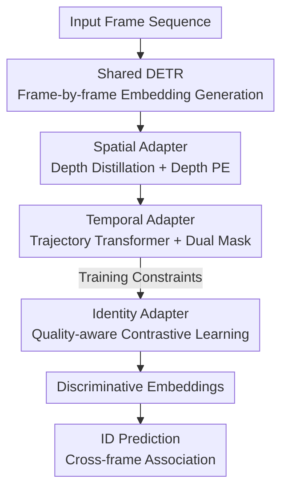

# From Detection to Association: Learning Discriminative Object Embeddings for Multi-Object Tracking

**Conference**: CVPR 2026  
**Paper**: [CVF Open Access](https://openaccess.thecvf.com/content/CVPR2026/html/Shao_From_Detection_to_Association_Learning_Discriminative_Object_Embeddings_for_Multi-Object_CVPR_2026_paper.html)  
**Code**: https://github.com/Spongebobbbbbbbb/FDTA  
**Area**: Object Detection / Multi-Object Tracking  
**Keywords**: End-to-End Multi-Object Tracking, DETR Object Embeddings, Depth Distillation, Temporal Trajectory Modeling, Quality-Aware Contrastive Learning

## TL;DR
FDTA identifies that "excessively high inter-class similarity" in object embeddings produced by DETR is the root cause of poor association accuracy in end-to-end MOT. Consequently, three lightweight adapters—Spatial (Depth), Temporal (Trajectory), and Identity (Contrastive Learning)—are attached to a shared DETR to explicitly refine embeddings from the perspectives of spatial continuity, temporal dependence, and instance discriminativeness. This achieves SOTA performance across HOTA, IDF1, and AssA on DanceTrack, SportsMOT, and BFT.

## Background & Motivation
**Background**: Multi-Object Tracking (MOT) requires simultaneously detecting multiple objects and maintaining consistent identities across frames. Recent end-to-end methods (MOTR, MeMOTR, MOTRv2, MOTIP, etc.) utilize the DETR architecture for simultaneous detection and association, generating unified object embeddings. This eliminates the error propagation found in two-stage "tracking-by-detection" pipelines and demonstrates impressive performance on multiple benchmarks.

**Limitations of Prior Work**: While these end-to-end methods perform well in detection (DetA > 80%), their association accuracy is unusually low (AssA ~60%). Investigation into the object embeddings produced by DETR reveals a sharp phenomenon: the similarity between embeddings of different objects in the same frame is extremely high—over 80% of inter-class similarity scores on DanceTrack exceed 0.9 (Fig. 1 in the paper). Such high similarity causes different objects to overlap in the embedding space, making it difficult to distinguish them during association. Furthermore, the similarity distribution of end-to-end embeddings is almost identical to that of the original DETR pre-trained solely for detection.

**Key Challenge**: Detection and association have fundamentally different requirements for embeddings. Detection only requires **category-level** distinction (identifying all people as "person"), instantaneous single-frame localization, and inter-frame independence. Conversely, association requires **instance-level** distinction (person #1 vs. person #2), continuous spatial understanding across frames, and global temporal context. End-to-end methods rely on joint detection and tracking losses to **implicitly** optimize embeddings, lacking explicit constraints for discriminativeness. Consequently, embeddings inherit the category-level characteristics of detection, providing insufficient discriminative power for association.

**Core Idea**: Instead of changing the architecture or adding complex losses, it is better to **explicitly refine the discriminativeness of object embeddings**. The authors decompose the differing requirements of detection and association into three complementary dimensions—spatial, temporal, and identity—and attach an adapter for each to compensate for these deficiencies, resulting in FDTA (From Detection to Association).

## Method

### Overall Architecture
FDTA is built upon standard end-to-end MOT architectures: given an input frame sequence $\{I_t\}_{t=1}^{T}$, a shared DETR generates object embeddings $e_i^t$ for each object $i$ frame-by-frame. Finally, an ID Prediction module predicts identities to complete cross-frame association. FDTA keeps the backbone intact and serially connects three **explicit refinement adapters** to the DETR embeddings: the Spatial Adapter (SA) injects depth-aware 3D geometric cues for spatial continuity; the Temporal Adapter (TA) aggregates context along historical trajectories for temporal dependence; and the Identity Adapter (IA) uses quality-aware contrastive learning to pull same identities closer and push different ones apart. These three components transform "detection-oriented" embeddings into "discriminative, tracking-suitable" embeddings. Notably, IA is only used during training (zero inference cost), and SA discards the large model via distillation during inference; thus, only about 4% is added to the total inference time over DETR.

### Key Designs

**1. Spatial Adapter: Injecting Spatial Continuity via Depth Distillation**

To address the issue where detection only requires instantaneous localization while association needs continuous spatial understanding (which is difficult during occlusion), SA utilizes depth as a 3D geometric cue. Specifically, a convolution branch is added alongside the DETR backbone—a two-layer depth extractor extracts dense features $F^{dense}$ from backbone features $F^V$, and a single-layer depth head predicts per-pixel depth probabilities $d$ over discrete bins using Linear-Increasing Discretization (LID). Supervision comes from **pseudo-depth labels** generated offline by Video Depth Anything (distillation). Since tracking prioritizes the foreground, a weighted depth loss penalizes foreground pixels more heavily (foreground weight set to 7):

$$\mathcal{L}_{depth}=\frac{1}{N_{total}}\sum_{i,j} w_{i,j}\cdot \mathrm{FL}(d_{i,j},\bar{d}_{i,j})$$

Where $\mathrm{FL}(\cdot)$ is Focal Loss and $w_{i,j}$ distinguishes foreground/background weights. Depth features $F^D$ are refined using a depth encoder, and depth map $\hat{d}$ is transformed into learnable depth positional encodings $PE_d=(1-\delta)\cdot PE[\lfloor\hat{d}\rfloor]+\delta\cdot PE[\lceil\hat{d}\rceil], \delta=\hat{d}-\lfloor\hat{d}\rfloor$. Finally, a **depth cross-attention** layer is added after the visual attention layers of the DETR decoder, allowing object queries to attend directly to $F^D$. The key is "distillation"—Video Depth Anything is discarded during inference, leaving only the lightweight branch (only 1.4% inference time).

**2. Temporal Adapter: Modeling Temporal Dependence via Trajectory-level Transformer + Dual Mask**

SA enhances intra-frame embeddings but lacks temporal context across sequences. TA models this at the **trajectory level**: during online tracking at frame $t$, the history of each identity $i$ over the past $T$ frames is aggregated into trajectory features $F_i^{traj}=\{e_i^{t-T},\dots,e_i^{t-1}\}$, processed by a 6-layer Transformer encoder. To prevent future information leakage and unreliable interactions with `[empty]` tokens of missing objects, a **dual attention mask** $M\in\mathbb{B}^{T\times T}$ is designed:

$$M[j,k]=\begin{cases}1 & \text{if } k>j \text{ or not detected}\\ 0 & \text{otherwise}\end{cases}$$

This masks future frames ($k>j$) and undetected objects while keeping the diagonal for stability. Trajectory features $\hat{F}_i^{traj}=\mathrm{TA}(F_i^{traj},M)$ then encode reliable temporal dependencies. Ablations show that handling missing objects is critical: zero-padding is worse than no TA (-1.3% HOTA), whereas the missing mask gains 1.0% HOTA.

**3. Identity Adapter: Aligning Association Objectives via Quality-Aware Contrastive Learning**

While the first two adapters enhance embeddings within the "tracking goal" scope, IA introduces explicit optimization objectives **directly aligned** with the association task—instance-level contrastive learning. Embeddings are pulled together for the same object and pushed apart otherwise. An **IoU-Filter** ensures quality by retaining only high-quality embeddings ($IoU_i^t\ge 0.5$) and weighting positive pairs by the harmonic mean of their IoUs: $w(e_i^s,e_j^k)=\frac{2\cdot IoU_i^s\cdot IoU_j^k}{IoU_i^s+IoU_j^k}$. A **Consistent Feature Extractor (CFE)** (a 3-layer MLP $\phi$) extracts identity-consistent features to remove motion/pose noise before calculating the loss:

$$\mathcal{L}_{IA}=\frac{1}{|P|}\sum_{(e_i^s,e_j^k)\in P} w(e_i^s,e_j^k)\cdot \mathcal{L}_{InfoNCE}(e_i^s,e_j^k)$$

Where $\mathcal{L}_{InfoNCE}=-\log\frac{\exp(\phi(e_i^s)\cdot\phi(e_j^k)/\tau)}{\sum_{e\in E}\exp(\phi(e_i^s)\cdot\phi(e)/\tau)}$ with temperature $\tau=0.1$. IA only works during training.

### Loss & Training
The framework is trained end-to-end with a total loss $\mathcal{L}=\mathcal{L}_{det}+\lambda_{ID}\mathcal{L}_{ID}+\lambda_{depth}\mathcal{L}_{depth}+\lambda_{IA}\mathcal{L}_{IA}$. Weights for $\lambda$ are all set to 1.0. Based on Deformable DETR + ResNet-50, the model is trained for 11 epochs on 4×H200 GPUs with a batch size of 4 and sequence length $T=30$, using AdamW ($lr=1\times10^{-4}$).

## Key Experimental Results

### Main Results
SOTA performance is achieved across three benchmarks with similar appearances and complex motions, particularly in association-related metrics (HOTA/IDF1/AssA).

| Dataset | Metric (HOTA/IDF1/AssA) | FDTA | Prev. SOTA (E2E) | Gain |
|--------|----------------------|------|------------------|------|
| DanceTrack | HOTA / IDF1 / AssA | 71.7 / 77.2 / 63.5 | 69.9 / 71.7 / 59.0 (MOTRv2) | +1.8 / +5.5 / +4.5 |
| DanceTrack (Extra Data) | HOTA / IDF1 | 74.4 / 80.0 | 71.4 / 76.3 (MOTIP*) | +3.0 / +3.7 |
| SportsMOT | HOTA / IDF1 / AssA | 74.2 / 78.5 / 65.5 | 71.9 / 75.0 / 62.0 (MOTIP) | +2.3 / +3.5 / +3.5 |
| BFT (Bird Flock) | HOTA / IDF1 / AssA | 72.2 / 84.2 / 74.5 | 70.5 / 82.1 / 71.8 (MOTIP) | +1.7 / +2.1 / +2.7 |

The gains on DanceTrack (uniform clothing + synchronized moves causing extreme inter-class similarity) are most convincing. BFT validates generalization in non-human, high-density scenarios.

### Ablation Study
Gradual addition of the three adapters (DanceTrack test):

| Configuration | HOTA | IDF1 | AssA | Description |
|------|------|------|------|------|
| Baseline | 69.4 | 74.5 | 60.2 | DETR backbone only |
| +SA | 70.2 | 74.8 | 61.2 | Spatial only |
| +TA | 70.4 | 75.7 | 61.3 | Temporal only |
| +IA | 70.1 | 74.8 | 60.7 | Identity only |
| +SA+TA | 70.8 | 76.8 | 61.9 | Combinations |
| +TA+IA | 71.0 | 76.5 | 62.2 | Combinations |
| Full (SA+TA+IA) | 71.7 | 77.2 | 63.5 | Full model |

### Key Findings
- **Inter-class similarity is the real cause**: Qualitative analysis (Fig. 6/7) shows baseline ID errors correspond to high-similarity regions in the embedding matrix. FDTA's t-SNE shows tighter clusters, verifying the hypothesis.
- **Adapters are complementary**: Each adapter alone provides gains, and their combination performs best, confirming spatial, temporal, and identity are independent, effective dimensions.
- **Negligible cost**: At 1920×1080 resolution, SA and TA occupy 1.4% and 2.7% of inference time respectively, while IA is training-only. 13.4 FPS total.

## Highlights & Insights
- **Diagnosis Before Method**: Quantifying the association failure as "inter-class similarity > 0.9 for 80% of objects" makes the problem-driven approach very solid.
- **Three-Dimensional Adapter Decomposition**: Explicitly splitting detection vs. association needs into spatial/temporal/identity dimensions is more interpretable than a complex unified loss.
- **"Free" Depth via Distillation**: Training with pseudo-labels from foundation models and discarding them for a lightweight branch during inference is a reusable trick for real-time tracking.
- **Quality-Aware Contrastive Learning**: Using IoU harmonic means and filtering handles the inherent unreliability of predicted samples in tracking scenarios.

## Limitations & Future Work
- **Dependency on Pseudo-label Quality**: Depth distillation relies on Video Depth Anything. Performance might degrade if the foundation model fails in niche scenarios (e.g., extreme lighting). ⚠️
- **DETR Backbone Bottleneck**: 83.9% of inference time is spent on the DETR backbone; the method refines embeddings but doesn't solve detection-specific bottlenecks.
- **Future Work**: Exploring video generation and world models to synthesize extreme corner cases for enhanced robustness.

## Related Work & Insights
- **vs. MOTRv2 / MOTIP (End-to-End)**: These lack explicit discriminative constraints, leading to high inter-class similarity. FDTA leads by a wide margin in IDF1/AssA (+5.5/+4.5).
- **vs. Tracking-by-Detection (OC-SORT, DiffMOT, etc.)**: FDTA retains the unified advantages of end-to-end frameworks while adding the discriminative power typically found in manual Re-ID or motion models.

## Rating
- Novelty: ⭐⭐⭐⭐ Pinpointing embedding similarity as the bottleneck is insightful; the three-dimensional solution is clear, though each adapter uses existing techniques.
- Experimental Thoroughness: ⭐⭐⭐⭐⭐ Comprehensive benchmarks, layer-wise ablations, and similarity/t-SNE/FLOPs analysis.
- Writing Quality: ⭐⭐⭐⭐⭐ Logical flow from observation to requirement decomposition and methodology.
- Value: ⭐⭐⭐⭐ SOTA association metrics with almost zero inference overhead.

<!-- RELATED:START -->

## Related Papers

- [\[CVPR 2026\] GMT: Effective Global Framework for Multi-Camera Multi-Target Tracking](gmt_effective_global_framework_for_multi-camera_multi-target_tracking.md)
- [\[AAAI 2026\] AerialMind: Towards Referring Multi-Object Tracking in UAV Scenarios](../../AAAI2026/object_detection/aerialmind_towards_referring_multi-object_tracking_in_uav_sc.md)
- [\[CVPR 2026\] Learning Multi-Modal Prototypes for Cross-Domain Few-Shot Object Detection](learning_multi-modal_prototypes_for_cross-domain_few-shot_object_detection.md)
- [\[CVPR 2026\] Multi-view Crowd Tracking Transformer with View-Ground Interactions Under Large Real-World Scenes](multi-view_crowd_tracking_transformer_with_view-ground_interactions_under_large_.md)
- [\[CVPR 2026\] Towards Persistence: Learning Topological Constraints for Event-based Small Object Detection](towards_persistence_learning_topological_constraints_for_event-based_small_objec.md)

<!-- RELATED:END -->
