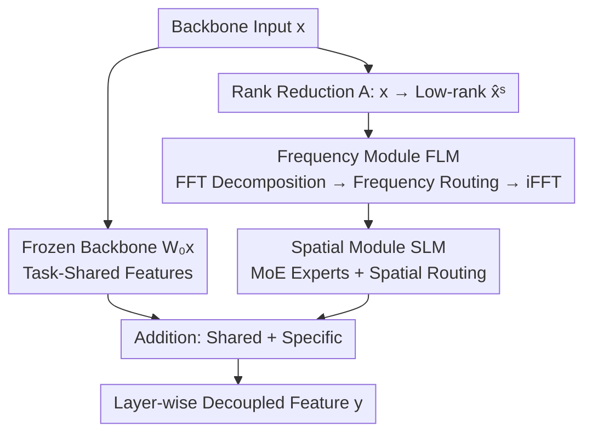

# FSLoRA: Harmonizing Detection and Re-Identification via Freq-Spatial Low-Rank Adapter for One-Stage Person Search

**Conference**: CVPR 2026  
**Paper**: [CVF Open Access](https://openaccess.thecvf.com/content/CVPR2026/html/Tian_FSLoRA_Harmonizing_Detection_and_Re-Identification_via_Freq-Spatial_Low-Rank_Adapter_for_CVPR_2026_paper.html)  
**Code**: https://github.com/personsearch/FSLoRA.git  
**Area**: Object Detection / Person Search  
**Keywords**: Person Search, Detection-ReID Conflict, LoRA Adapter, Mixture of Experts, Frequency Domain Decoupling

## TL;DR
FSLoRA utilizes LoRA as a "layer-wise feature decoupler" integrated into the entire backbone. By employing Spatial MoE Routing (SLM) and Frequency-domain decomposition (FLM), the model separates shared detection features and ReID identity features at the bottom layers. This plug-and-play approach achieves new SOTA performance across multiple one-stage person search frameworks with <2% additional parameters.

## Background & Motivation
**Background**: Person search requires simultaneous "person detection + cross-image re-identification (re-ID)" within uncropped panoramic images. One-stage methods integrate these tasks into an end-to-end model with a shared backbone, representing the mainstream direction due to their efficiency.

**Limitations of Prior Work**: Detection and re-ID are inherently contradictory. Detection requires "similarities between humans and backgrounds" (all humans should look like "a person" for easier localization), while re-ID requires "differences between individuals" (fine-grained textures are needed for identity differentiation). Optimizing these targets on a single backbone leads to feature interference.

**Key Challenge**: Existing solutions are insufficient. Loss re-weighting only adjusts gradient priorities during training without altering feature representations. Feature decoupling methods typically only split the final embedding, leaving **bottom-layer features still entangled**. Since task conflicts accumulate from early-stage entanglement, processing only at the output or loss level limits performance.

**Goal**: To shift feature decoupling from "terminal embeddings" forward to "every layer of the backbone," progressively separating detection-specific and ReID-specific features while sharing a single representation.

**Key Insight**: Instead of heavy multi-branch structures that double parameters, the authors note that the "low-rank compression → task-specific transform → rank restoration" structure of LoRA is naturally suited for lightweight feature branching. Furthermore, detection relies on **global structure (low frequency)** while re-ID relies on **fine-grained texture (high frequency)**, a distinction that is clear in the frequency domain.

**Core Idea**: Insert a "Freq-Spatial bi-level low-rank adapter" into each layer of the backbone. Spatially, task-relevant features are dynamically routed via MoE; in the frequency domain, low-frequency structures and high-frequency details are re-weighted according to task requirements using FFT, achieving feature decoupling at the foundational layers.

## Method

### Overall Architecture
FSLoRA inserts a modified LoRA bypass into every linear layer of the backbone (e.g., VMamba). The original backbone weights $W_0$ are frozen to extract **task-shared features**, while the bypass extracts **task-specific features**. The adapter evolves from LoRA → SLoRA → FSLoRA: first, input is compressed via rank-reduction matrix $A$, then frequency components are reorganized through the FLM, and finally, the SLM restores rank using MoE routing. Detection and re-ID each have a dedicated adapter with identical structure but independent parameters, facilitating dual-path feature separation throughout the backbone.

The forward pass is defined as:

$$y = W_0 x + \mathbf{F}_{\text{SLM}} = W_0 x + \sum_{i=1}^{N} \omega_i^s E_i \mathbf{F}_{\text{FLM}}$$

$W_0 x$ represents shared features from the frozen backbone, while the second term represents task-specific features from SLM, which processes frequency-enhanced features from FLM. For engineering efficiency, FLM is placed **between** $A$ and $B$ (the experts of SLM). Since $A$ reduces dimensions from $d$ to $r$, performing FFT in the low-rank space reduces parameter and memory overhead by $d/r$ times.

### Key Designs

**1. Re-purposing LoRA for "Layer-wise Feature Decoupling"**
While LoRA ($y = W_0 x + BAx$) is typically used for parameter-efficient fine-tuning (PEFT), FSLoRA utilizes its "rank reduction $A\in\mathbb{R}^{r\times d}$ → rank restoration $B\in\mathbb{R}^{d\times r}$" structure as a lightweight task-specific shunt. By paralleling this bypass with the frozen backbone at every layer, it achieves full-backbone decoupling at minimal cost—less than 2% extra parameters—avoiding the overhead of multi-branch structures.

**2. SLM: Spatial MoE Routing for Task-Specific Structures**
SLM addresses spatial feature separation by replacing the single restoration matrix $B$ with a set of LoRA paths $\{AB_1, \dots, AB_n\}$. Each $B_i$ acts as an expert $E_i$, with a spatial-level router determining contributions:

$$\mathbf{F}_{\text{SLM}} = \sum_{i=1}^{N} \omega_i^s E_i A x, \qquad \omega^s = \xi(W_g^\top x)$$

Where $\xi(\cdot)$ is softmax and $W_g\in\mathbb{R}^{d\times n}$ is the routing matrix. The routing weights $\omega^s = \{M_1,\dots,M_n\}$ act as spatial feature masks $M\in\mathbb{R}^{H\times W}$, directing experts to focus on different regions. Visualizations show detection experts covering the whole body (for localization) while re-ID experts focus on discriminative areas like heads or clothing.

**3. FLM: Frequency Decomposition and Routing**
Utilizing the insight that detection favors low-frequency structures and re-ID favors high-frequency textures, FLM applies 2D FFT to the low-rank features $\hat{x}^s = Ax$. It splits the signal into high and low frequencies via filters:

$$\hat{x}^f_{low} = \mathcal{F}_{low}(\hat{x}^f), \quad \hat{x}^f_{high} = \mathcal{F}_{high}(\hat{x}^f)$$

Instead of hard isolation, a frequency-level router outputs learnable weights $w_{low}, w_{high}$ for soft reconciliation:

$$\hat{\mathbf{F}}^f = w_{low}\cdot \hat{x}^f_{low} + w_{high}\cdot \hat{x}^f_{high}$$

The signal is returned to the spatial domain via iFFT. Learned weights confirm the hypothesis: detection branches favor low frequencies, while re-ID branches favor high frequencies.

### Loss & Training
The method maintains the original loss functions of the baselines (NAE / AlignPS / ROI-AlignPS), including detection and re-ID losses. FSLoRA acts as a plug-and-play adapter. The backbone used is VMamba pre-trained on ImageNet. The adapter is applied to linear layers in the feed-forward networks and SS2D blocks, with $r=32$ and $n=2$ experts.

## Key Experimental Results

### Main Results
SOTA comparisons on CUHK-SYSU, PRW, and PoseTrack21 (M=VMamba, T=Transformer):

| Dataset | Metric | FSLoRA(M) | Prev. SOTA | Note |
|--------|------|-----------|----------|------|
| PRW | mAP | **61.3** | 59.8 (SOLIDER) | New SOTA |
| PRW | Top-1 | **89.5** | 89.0 (SPNet-L) | New SOTA |
| CUHK-SYSU | mAP | **96.6** | 95.8 (ROI-AlignPS†) | New SOTA |
| CUHK-SYSU | Top-1 | **97.0** | 96.3 | New SOTA |
| PoseTrack21 | mAP | **70.25** | 65.12 (SeqNet) | **+5.13 Gain** |
| PoseTrack21 | Top-1 | **90.10** | 87.13 (PretrainPS) | Dense scenes |

Plug-and-play generalization (on PRW):

| Baseline | mAP | +FSLoRA | Top-1 | +FSLoRA |
|----------|-----|---------|-------|---------|
| NAE | 56.03 | **59.11** (+3.08) | 87.36 | 88.99 (+1.63) |
| AlignPS | 53.13 | **55.33** (+2.20) | 85.53 | 87.11 (+1.58) |
| ROI-AlignPS | 59.30 | **61.32** (+2.02) | 87.65 | 89.53 (+2.08) |

### Ablation Study
Effectiveness of SLM / FLM (NAE baseline on PRW):

| SLM | FLM | mAP | Top-1 | AP | Recall | Note |
|-----|-----|-----|-------|-----|--------|------|
| | | 56.03 | 87.36 | 91.31 | 96.67 | Baseline |
| ✓ | | 58.28 | 88.54 | 92.11 | 96.60 | SLM only |
| | ✓ | 58.40 | 88.30 | 92.21 | 96.94 | FLM only |
| ✓ | ✓ | **59.11** | **88.99** | **92.55** | **97.07** | Full model |

FLM Positioning (PRW):

| Module Order | mAP | Top-1 | $\Delta$Params |
|----------|-----|-------|-------|
| A→FLM→SLM (Ours) | **59.11** | **88.99** | — |
| FLM→A→SLM | 57.71 | 87.95 | +96.29K |
| A→SLM→FLM | 58.06 | 88.05 | +96.29K |

### Key Findings
- SLM and FLM are complementary; SLM manages spatial task structure while FLM manages frequency components. 
- Performance gains stem from architectural design rather than parameter scaling (<2% overhead).
- Expert count has a "sweet spot": $n=2$ with $r=32$ is optimal; too many experts hinder shared knowledge integration.
- Visualization of frequency weights confirms the hypothesis: detection relies on low frequencies and re-ID on high frequencies.

## Highlights & Insights
- **Reinterpreting PEFT as a Decoupler**: Using LoRA's bypass structure as a "layer-wise task shunt" is an ingenious use of existing structures for a new objective.
- **Frequency Domain as a Task Coordinate System**: Proving that detection and re-ID can be separated by frequency provides a transferable paradigm for multi-task learning involving different granularities.
- **Efficiency in Low-Rank Space**: Performing FFT after rank reduction ($A$) saves $d/r$ parameters and memory while improving accuracy.

## Limitations & Future Work
- Currently limited to the person search task; generalization to broader multi-task scenarios (e.g., detection + segmentation) remains a hypothesis.
- FLM uses fixed cutoff frequencies (30/40), which may require manual tuning for different datasets or resolutions.
- While parameter overhead is low, the per-layer FFT/iFFT operations introduce additional operator overhead that may affect inference latency.

## Related Work & Insights
- **vs. Loss Re-weighting**: Methods like GALW only adjust gradients without touching feature representations. FSLoRA improves PRW mAP from 52.9 to 61.3.
- **vs. Late-stage Decoupling**: NAE decouples at the final embedding; FSLoRA decouples across the entire backbone. Adding FSLoRA to NAE yields a +3.08pp mAP gain, proving they address different stages of interference.

## Rating
- **Novelty**: ⭐⭐⭐⭐⭐ (Re-defining LoRA as a layer-wise decoupler via freq-spatial routing).
- **Experimental Thoroughness**: ⭐⭐⭐⭐⭐ (Tested on three datasets, three base models, and extensive ablations).
- **Writing Quality**: ⭐⭐⭐⭐ (Clear logic and good visualization support).
- **Value**: ⭐⭐⭐⭐ (Practical plug-and-play module for one-stage person search).

<!-- RELATED:START -->

## Related Papers

- [\[CVPR 2026\] Object-Generalized Re-Identification: A Step Towards Universal Instance Perception](object-generalized_re-identification_a_step_towards_universal_instance_perceptio.md)
- [\[CVPR 2026\] AR²-4FV: Anchored Referring and Re-identification for Long-Term Grounding in Fixed-View Videos](ar2-4fv_anchored_referring_and_re-identification_for_long-term_grounding_in_fixe.md)
- [\[CVPR 2026\] EW-DETR: Evolving World Object Detection via Incremental Low-Rank DEtection TRansformer](ew-detr_evolving_world_object_detection_via_incremental_low-rank_detection_trans.md)
- [\[CVPR 2026\] RARE: Learn to RAnk and REtrieve for Monocular 3D Object Detection](rare_learn_to_rank_and_retrieve_for_monocular_3d_object_detection.md)
- [\[CVPR 2026\] Beyond Semantic Search: Towards Referential Anchoring in Composed Image Retrieval](beyond_semantic_search_towards_referential_anchoring_in_composed_image_retrieval.md)

<!-- RELATED:END -->
