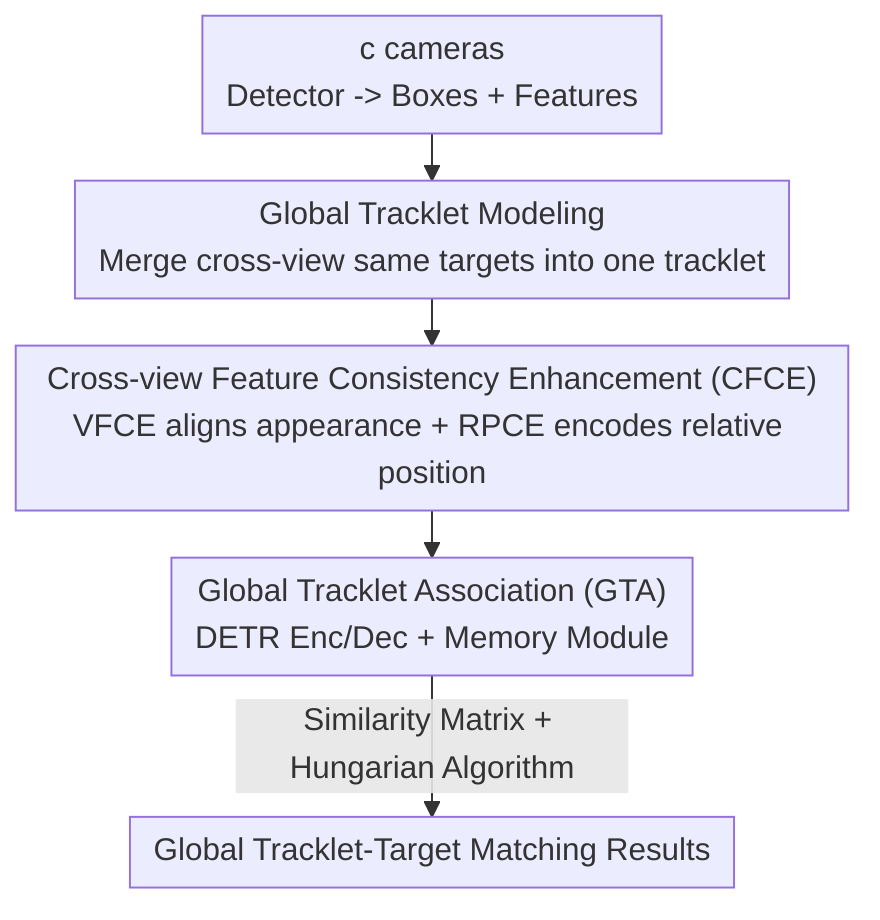

# GMT: Effective Global Framework for Multi-Camera Multi-Target Tracking

**Conference**: CVPR 2026  
**Paper**: [CVF Open Access](https://openaccess.thecvf.com/content/CVPR2026/html/Zhen_GMT_Effective_Global_Framework_for_Multi_Camera_Multi_Target_Tracking_CVPR_2026_paper.html)  
**Code**: https://github.com/FoxCanned/GMT  
**Area**: Object Detection and Tracking  
**Keywords**: Multi-Camera Multi-Target Tracking (MCMT), Global Tracklet Association, Cross-view Feature Consistency, DETR Tracking, MCMT Datasets  

## TL;DR
GMT reformulates the traditional two-stage pipeline of "Single-Camera Tracking (SCT) + Inter-Camera Association (ICT)" into a unified "Global Tracklet-to-Target" association. It first uses the CFCE module to align appearance and spatial features across different views into a consistent space, then employs a DETR-style GTA module to directly match new detections with global tracklets that encode multi-view historical information. The method achieves state-of-the-art results in metrics such as IDF1 and CVIDF1 across six datasets, including the large-scale self-collected VisionTrack.

## Background & Motivation
**Background**: Multi-Camera Multi-Target Tracking (MCMT) aims to locate and associate the same set of targets across multiple cameras with **overlapping fields of view**. The current mainstream approach follows a two-stage paradigm: first, independent local tracks are produced within each view using off-the-shelf SCTs (e.g., SORT-based), followed by an ICT module to stitch results from different views.

**Limitations of Prior Work**: In this paradigm, final tracking results are **primarily determined by the SCT stage**, where SCT only utilizes intra-view frame-level information. Multi-view information is only passively used in the second stage to "remedy" matches missed by the SCT, contributing limited value to the overall tracking—this wastes the primary advantage of MCMT over single-view tracking: providing rich and discriminative observations for targets under occlusion or drastic appearance changes. Furthermore, treating cross-view association as an independent stage amplifies errors when view differences are large or the number of cameras increases.

**Key Challenge**: Multi-view information is the core benefit of MCMT, yet it is marginalized as a "post-processing error correction" by the two-stage structure; meanwhile, the independent cross-view matching stage itself is an additional and error-prone link.

**Goal**: Enable multi-view information to be directly utilized within the **main tracking process** and eliminate the independent "cross-view matching" stage.

**Key Insight**: Instead of maintaining separate tracks for each view, observations of the "same historical target across all views" are unified into a single **Global Tracklet**. Thus, the tracking problem becomes a global-level association of "which global tracklet a new detection belongs to."

**Core Idea**: Replace "SCT + ICT" with "Global Tracklet-to-Target Association," allowing global tracklets to naturally carry cross-view and cross-frame information for direct consumption during tracking.

## Method

### Overall Architecture
At time $t$, GMT receives images from $c$ cameras and detects targets using a detector (CenterNet + DLA-34 backbone) to obtain bounding boxes $B_t=\{b_i\}_{i=1}^N$ and corresponding features $F_t=\{f_i\}_{i=1}^N$. The pipeline consists of three steps:

1. **CFCE Alignment**: Project $F_t$ from a "view-centric" space to a "tracklet-centric" consistent space (VFCE) and encode relative spatial relationships between targets (RPCE), concatenated to form association features $F^{asso}_t$;
2. **GTA Association**: Concatenate target features from all views over the recent $T$ frames to form global tracklet representations $\Gamma=\{\tau_k\}_{k=1}^K$, using a DETR-style encoder-decoder to allow $F^{asso}_t$ to interact with $\Gamma$, producing enhanced $\overline{F}^{asso}_t$;
3. **Hungarian Matching**: Calculate the similarity matrix between $\overline{F}^{asso}_t$ and $\Gamma$, obtain target-to-tracklet assignments via the Hungarian algorithm, and use a memory module to recover tracklets under long-term occlusion.

The key is that the global tracklet $\Gamma$ encodes information from "the same target across all views and all historical frames," allowing multi-view clues to participate in discrimination at the moment of association rather than as a post-SCT fix.

### Key Designs

**1. Global Tracklet Modeling: Reformulating Two-Stage into Unified Global Association**

To address the fundamental pain point where multi-view information is marginalized, GMT no longer assigns tracks independently for each view. Instead, before tracking begins, local tracks of the same target across different views are **merged into a single global tracklet** with a unified cross-view target ID. This step reframes MCMT from a two-stage "SCT + ICT" process into a global-level "tracklet-to-target matching" task. This offers two advantages: first, global tracklets contain both temporal context across frames and diverse visual representations from all views, allowing multi-view clues to be consumed **directly** during association; second, since target IDs are already unified across views, the subsequent error-prone cross-view matching stage is eliminated.

**2. CFCE: Cross-view Feature Consistency Enhancement**

Incorporating multi-view features into a unified tracklet faces a major hurdle: different camera views can be seen as different domains, where features of the same target often show significant discrepancies. CFCE addresses this via two sub-modules. **VFCE (Visual Feature Consistency Enhancement)** uses a two-layer MLP projection head to map $F_t$ from the view-centric space to the tracklet-centric space $F^\tau_t$, supervised by metric learning:

$$L_{\text{VFCE}} = L_{\text{CE}} + L_{\text{Triplet}} + L_{\text{Center}}$$

**RPCE (Relative Position Consistency Enhancement)** leverages the geometric prior of "cross-view projection consistency"—the target position maps of different views in the same scene can be aligned via affine transformation. For the $i$-th target, a spatial relationship vector is constructed using its position relative to neighbors:

$$G_i = [x_i, y_i, \Delta x_1, \Delta y_1, \dots, \Delta x_M, \Delta y_M]$$

Where $x_i, y_i$ are normalized center coordinates and $\Delta x_j, \Delta y_j$ are coordinate offsets of the $j$-th neighbor. To avoid noise from neighbors not in overlapping fields of view, a distance-based filtering strategy is proposed:

$$r = \Big(2 + 2\cdot\mathrm{clip}\big(\tfrac{r_{\max}-\sqrt{s_i}}{r_{\max}-r_{\min}}, 0, 1\big)\Big)\sqrt{s_i}$$

$s_i$ is the normalized box size. The intuition is that targets closer to the camera (larger $s_i$) have smaller physical overlapping zones, so the threshold $r$ is tightened to include only relevant neighbors. $G_i$ is encoded into $F^p_t$ via a two-layer MLP, supervised by $L_{\text{RPCE}} = L_{\text{Triplet}} + L_{\text{Center}}$. Finally, $F^\tau_t$ and $F^p_t$ are concatenated into $F^{asso}_t$.

**3. GTA: Global Tracklet Association via DETR-style Interaction**

Since standard SORT-based trackers rely heavily on spatial consistency and cannot handle multi-view inputs, GTA adopts a **DETR-style structure**. It concatenates detected target features from all views over the last $T$ frames into a global tracklet representation $\Gamma\in\mathbb{R}^{L\times d}$. Targets within the same tracklet are assigned a **shared ID embedding**, and a single encoder layer extracts temporal context. In the decoder stage, current candidate targets $F^{asso}_t$ interact with each other to encode context and then act as queries to interact with $\Gamma$ to learn discriminative clues between tracklets, yielding $\overline{F}^{asso}_t$. During inference, the target-to-tracklet similarity matrix $M\in\mathbb{R}^{N\times K}$ is calculated by **averaging similarities of all associated targets within a tracklet**. A **memory module** handles long-term occlusion recovery. The association loss $L_{\text{asso}}$ aligns the target-level similarity matrix with ground truth:

$$H_{ij} = \frac{e^{M_{ij}}}{e^{M_{i0}} + \sum_{q=1}^{N} \mathbb{1}(t_q=t_j \wedge c_q=c_j)\, e^{M_{iq}}}$$

$$L_{\text{asso}} = -\frac{1}{N+1}\sum_{i=1}^{N+1}\big(\sum_{j=1}^{L} X_{ij}\log H_{ij}\big)$$

### Loss & Training
Training is divided into two stages. Stage 1 trains the detector and VFCE: $L_{\text{stage1}} = L_{\text{det}} + L_{\text{VFCE}}$. Stage 2 trains the full model while removing the metric learning loss in VFCE: $L_{\text{stage2}} = L_{\text{det}} + \lambda_1 L_{\text{asso}} + \lambda_2 L_{\text{RPCE}}$, with $\lambda_1=3, \lambda_2=0.5$. The model can also be trained in a single stage with slight performance degradation. The **VisionTrack** dataset is introduced, featuring mobile UAVs, 15 real-world scenes, 116k frames, and 1.17M boxes, providing greater scale and diversity compared to existing datasets like EPFL or WildTrack.

## Key Experimental Results

### Main Results
Comparison with SOTA MCMT trackers across 6 datasets. Metrics include single-view MOTA/HOTA/IDF1/ASSA and cross-view CVMA/CVIDF1. Results on VisionTrack and DIVOTrack:

| Dataset | Method | CVMA | CVIDF1 | MOTA | HOTA | IDF1 | ASSA |
|--------|------|------|--------|------|------|------|------|
| VisionTrack | MvMHAT++ | 68.8 | 70.0 | 77.6 | 59.6 | 72.3 | 57.2 |
| VisionTrack | CrossMOT | 64.5 | 64.4 | 75.6 | 54.5 | 65.5 | 49.3 |
| VisionTrack | **Ours** | **75.2** | **81.3** | **78.0** | **66.2** | **82.1** | **69.4** |
| DIVOTrack | MvMHAT++ | 69.4 | 68.6 | 78.9 | 64.8 | 74.1 | 56.3 |
| DIVOTrack | **Ours** | **74.5** | **73.2** | **80.5** | 64.5 | **76.7** | **62.1** |

On VisionTrack, Ours improves IDF1 by 5.1%, ASSA by 12.2%, CVMA by 5.1%, and CVIDF1 by 11.3% over the second-best method. Gains are concentrated in **identity consistency and cross-view matching**, which are the primary values of MCMT.

### Ablation Study
Ablation of CFCE components (VisionTrack). Note that "w/o VFCE" refers to removing $L_{\text{VFCE}}$:

| Configuration | CVMA | CVIDF1 | MOTA | HOTA | IDF1 |
|------|------|--------|------|------|------|
| w/o VFCE | 72.4 | 78.1 | 76.9 | 62.0 | 77.2 |
| w/o RPCE | 74.0 | 79.8 | 77.2 | 64.7 | 68.9 |
| − w/o $L_{RPCE}$ | 74.3 | 80.8 | 77.5 | 64.9 | 81.9 |
| − w/o thres | 72.3 | 78.2 | 76.4 | 61.5 | 76.3 |
| **Ours (Full)** | **75.2** | **81.3** | **78.0** | **66.2** | **82.1** |

Ablation of Global Tracklets: Comparing Ours evaluated per view (Local) against DETR-style SCTs:

| Method | MOTA | HOTA | IDF1 | ASSA |
|------|------|------|------|------|
| MOTR | 74.9 | 58.4 | 69.3 | 58.3 |
| MOTRv2 | 75.1 | 59.8 | 72.1 | 61.7 |
| Local (Ours Single-view) | 76.8 | 62.6 | 78.1 | 64.9 |
| **Ours (Global)** | **78.0** | **66.2** | **82.1** | **69.4** |

### Key Findings
- **Global tracklets are the primary performance source**: Switching from Local to Global improves IDF1 by 4.0% and ASSA by 4.5%. Even with potentially weaker detection precision (MOTP), Ours outperforms MOTR variants significantly, proving gains stem from "direct association via multi-view info."
- **VFCE handles overall consistency while RPCE focuses on cross-view**: Removing VFCE loss results in overall drops, while RPCE primarily affects CVMA/CVIDF1, confirming visual features support intra-view tracking while relative position provides complementary cross-view geometric cues.
- **Distance filtering is non-negligible**: Removing the distance threshold (w/o thres) lead to performance lower than removing RPCE entirely, as neighbors outside overlapping fields act as noise.

## Highlights & Insights
- **Problem reformulation exceeds module stacking**: Changing the two-stage process to a unified global association allows multi-view info to move from "post-remedy" to "core process," which is the root cause of performance gains.
- **Geometric priors embedded in features**: RPCE converts projection consistency (affine alignment of position maps) into learnable relative position encodings with a physically intuitive distance filtering mechanism.
- **Shared ID embedding + average similarity**: Sharing ID embeddings within a tracklet and averaging similarities is a clean way to encode the fact that "a tracklet is a collection of multiple observations" into the DETR association framework.
- **New dataset positioning**: VisionTrack fills the gap of mobile UAV-based MCMT with diverse scenes, providing practical value for the field.

## Limitations & Future Work
- VisionTrack uses only 2 views (UAVs), while urban surveillance often involves many fixed cameras. Although Ours performs well on WildTrack (many views), there is room for improvement as the number of views scales drastically.
- Global tracklet concatenation increases the sequence length $\Gamma$ with more views and targets, potentially making the DETR interaction a bottleneck for memory/computation.
- The method depends on detector accuracy (RPCE/GTA are box-based); hence the two-stage training compromise. Performance may be capped by detection quality in dense, small-object scenes.

## Related Work & Insights
- **vs. Two-stage MCMT (ReST / CrossMOT)**: These split SCT and ICT, using multi-view info only for correction; Ours unifies them into the main association process.
- **vs. Early Global Graph Methods**: While early methods also sought global association, they were limited by representation power; Ours leverages DETR-style interaction and CFCE to make the "global" paradigm outperform two-stage again.
- **vs. DETR-style SCTs (MOTR / GTR)**: They only associate temporally within a single view; Ours extends the input to cross-view global tracklets, achieving +4.8% HOTA over MOTRv2 even with similar detection backbones.

## Rating
- Novelty: ⭐⭐⭐⭐⭐ Paradigm-level shift from two-stage to unified global association.
- Experimental Thoroughness: ⭐⭐⭐⭐⭐ Extensive results across 6 datasets plus a large-scale new dataset.
- Writing Quality: ⭐⭐⭐⭐ Clear motivation and method, though some ablation values (IDF1 for w/o RPCE) are slightly ambiguous.
- Value: ⭐⭐⭐⭐⭐ Simple, transferable ideas with open-source code and a valuable new dataset.

<!-- RELATED:START -->

## Related Papers

- [\[CVPR 2026\] From Detection to Association: Learning Discriminative Object Embeddings for Multi-Object Tracking](from_detection_to_association_learning_discriminative_object_embeddings_for_mult.md)
- [\[CVPR 2026\] Multi-view Crowd Tracking Transformer with View-Ground Interactions Under Large Real-World Scenes](multi-view_crowd_tracking_transformer_with_view-ground_interactions_under_large_.md)
- [\[AAAI 2026\] AerialMind: Towards Referring Multi-Object Tracking in UAV Scenarios](../../AAAI2026/object_detection/aerialmind_towards_referring_multi-object_tracking_in_uav_sc.md)
- [\[CVPR 2026\] Target-Aware Invertible Encoder with Reconstruction Guidance for Infrared Small Target Detection](target-aware_invertible_encoder_with_reconstruction_guidance_for_infrared_small_.md)
- [\[CVPR 2026\] UniMMAD: Unified Multi-Modal and Multi-Class Anomaly Detection via MoE-Driven Feature Decompression](unimmad_unified_multi-modal_and_multi-class_anomaly_detection_via_moe-driven_fea.md)

<!-- RELATED:END -->
