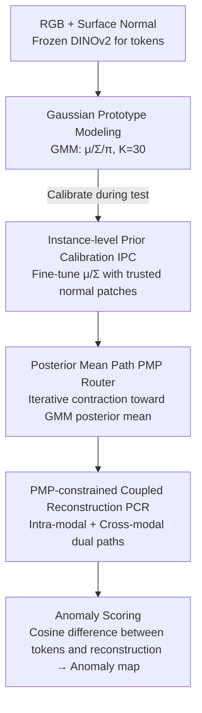

# GPFlow: Gaussian Prototype Probability Flow for Unsupervised Multi-Modal Anomaly Detection

**Conference**: CVPR 2026  
**Paper**: [CVF Open Access](https://openaccess.thecvf.com/content/CVPR2026/html/Li_GPFlow_Gaussian_Prototype_Probability_Flow_for_Unsupervised_Multi_Modal_Anomaly_Detection_CVPR_2026_paper.html)  
**Code**: TBD  
**Area**: Multi-Modal Anomaly Detection (Industrial Inspection)  
**Keywords**: Multi-modal anomaly detection, Gaussian prototypes, posterior mean flow, anisotropic contraction, few-shot  

## TL;DR
GPFlow models the continuous distribution of "normal" samples using a set of learnable Gaussian prototypes (mean + diagonal covariance + mixture weights), then iteratively contracts input features towards the posterior mean of the Gaussian mixture via an analytically solvable "Posterior Mean Path (PMP) router." This naturally realizes a "covariance-aware information bottleneck," significantly outperforming Prev. SOTA such as FIND in few-shot industrial multi-modal (RGB+3D) anomaly detection with only 5/10/50 normal samples.

## Background & Motivation
**Background**: Multi-modal Anomaly Detection (MAD) combines RGB images with 3D point clouds/surface normals to detect industrial defects. The mainstream approach is "reconstructive"—training a reconstruction network on normal samples and identifying regions with high reconstruction error during testing. 3D-ADNAS and FIND belong to this category.

**Limitations of Prior Work**: Reconstructive methods suffer from the **identity shortcut**—when the network's capacity is too high, it reconstructs the input (including anomalous patterns) perfectly, leading to near-zero error and failed detection. To block this shortcut, recent works (HVQ-Trans, INP-Former, PIRN) introduce **discrete prototypes** (codebook/vector quantization) as an information bottleneck, quantizing features to the nearest discrete codeword.

**Key Challenge**: Discrete prototypes rely on **hard quantization + isotropic (Euclidean) distance** for assignment, failing to capture the **continuous and anisotropic** nature of normal distributions. This results in errors on both ends: normal features varying along "high-variance directions" are misclassified due to high reconstruction error (false positives), while anomalous features deviating slightly in "low-variance directions" are under-penalized due to small Euclidean shifts (false negatives). This is visualized in Fig. 2 with a 2D three-Gaussian toy example.

**Goal**: How to compactly model the continuous distribution of normal appearance/geometry while imposing a **covariance-aware information bottleneck** to robustly suppress anomalies?

**Key Insight**: Model "normality" as a Gaussian Mixture Model (GMM), where each Gaussian prototype has a learnable mean $\mu_k$, diagonal covariance $\Sigma_k$, and mixture weight $\pi_k$. From a **probability flow / score matching** perspective, "reconstruction" is viewed as moving noisy observations towards the **posterior mean** of the GMM—a step that has a closed-form solution for GMM priors, avoiding ODE solvers.

**Core Idea**: Replace the "hard quantization of discrete prototypes" with the "anisotropic contraction of the GMM posterior mean," allowing the information bottleneck to automatically adjust strength along the covariance structure—retaining normal variations aligned with the covariance and suppressing inconsistent deviations.

## Method

### Overall Architecture
GPFlow takes two inputs: RGB (appearance modality $I_{rgb}$) and surface normal maps (shape modality $I_{shape}$). Given the extreme scarcity of normal samples, **frozen DINOv2 ViT-B/14** is used to extract multi-scale features, aggregated into patch tokens $T_{rgb}, T_{shape} \in \mathbb{R}^{B\times N\times D}$. The feature distribution for each modality is modeled as a GMM with $K=30$ Gaussian prototypes, following the prior $p(x)=\sum_{k=1}^K \pi_k \mathcal{N}(x;\mu_k,\Sigma_k)$.

The pipeline consists of three stages: (1) Feature extraction; (2) **PMP-constrained Coupled Reconstruction (PCR)**—the core, using a PMP router to iteratively contract tokens towards the Gaussian prototype manifold through intra-modal and cross-modal paths; during testing, **Instance-level Prior Calibration (IPC)** is applied first to fine-tune prototypes; (3) Anomaly scoring—calculating cosine similarity between raw tokens and prototype-constrained reconstructions to generate anomaly maps. The PMP router acts as a "covariance-aware information bottleneck," ensuring anomalies are difficult to reconstruct.

### Key Designs

**1. Posterior Mean Path (PMP) Router: Anisotropic Bottleneck via GMM Posterior Mean**

This is the heart of GPFlow, specifically designed to address the "identity shortcut." Consider a feature as a noisy observation $y=x+\epsilon$, where $x$ follows the normal distribution $p(x)$ and $\epsilon\sim\mathcal{N}(0,\tau^2 I)$. The optimal MMSE estimate is the posterior mean $E[x|y]$. By Tweedie’s formula, the posterior mean and score are precisely linked:

$$E[x|y] = y + \tau^2 \nabla_y \log p_\tau(y)$$

Since the score $\nabla_y\log p_\tau(y)$ points towards higher probability density, "moving $y$ towards the posterior mean" is equivalent to one step of **score ascent** on the smoothed log-density—pushing anomalous features along the probability gradient back to the normal manifold. Crucially, a **closed-form solution** exists for GMM priors: the smoothed density remains a GMM, $p_\tau(y)=\sum_k\pi_k\mathcal{N}(y;\mu_k,\Sigma_k+\tau^2 I)$, and the posterior mean is the weighted average of the posterior means of individual components:

$$D_\tau(y)=E[x|y]=\sum_{k=1}^K \gamma_k(y)\,m_k(y)$$

This involves two operations: **soft assignment across prototypes** (responsibility $\gamma_k(y)=\frac{\pi_k\mathcal{N}(y;\mu_k,\Sigma_k+\tau^2I)}{\sum_j\pi_j\mathcal{N}(y;\mu_j,\Sigma_j+\tau^2I)}$), and **intra-prototype contraction**. The latter is the source of "anisotropy": the component posterior mean is $m_k(y)=A_k y+(I-A_k)\mu_k$, where the gain matrix $A_k=\Sigma_k(\Sigma_k+\tau^2 I)^{-1}$. With diagonal covariances, the gain for each dimension is $a_{k,c}=\frac{\sigma_{k,c}^2}{\sigma_{k,c}^2+\tau^2}\in(0,1)$: **high-variance dimensions $a\to1$ (retaining normal variation), low-variance dimensions $a\to0$ (suppressing suspicious deviations)**. Writing the displacement as $y-m_k(y)=(I-A_k)(y-\mu_k)$ makes it intuitive—the contraction is proportional to the deviation from the mean, modulated per dimension by covariance. This "covariance-aware bottleneck" leaves aligned changes untouched while suppressing unaligned ones.

Routing is iterative: $x^{(t+1)}=(1-\beta_t)x^{(t)}+\beta_t E[x|y=x^{(t)}]$. Substituting Tweedie's formula, this is equivalent to score ascent steps under fixed noise $x^{(t+1)}=x^{(t)}+\eta_t\nabla_x\log p_\tau(x^{(t)})$, where $\eta_t=\beta_t\tau^2$. Compared to discrete prototype routing (Euclidean-based assignment), PMP preserves normal high-variance changes and amplifies the displacement of low-variance anomalies—increasing detection AUC from 0.835 to 0.996 in the toy example.

**2. PMP-constrained Coupled Reconstruction (PCR): Synchronized Bottleneck to Amplify Displacement**

Self-reconstruction of a single modality fails to leverage the complementary information of RGB and 3D shape. PCR denotes PMP routing as $R(T;P)$, running two paths per modality. For the RGB branch: intra-modal reconstruction $\hat T_{rgb}^{intra}=R(T_{rgb};P_{rgb})$ (RGB tokens with RGB prototypes) and cross-modal reconstruction $\hat T_{shape\to rgb}^{cross}=R(T_{shape};P_{rgb})$ (shape tokens aligned with RGB prototypes). These are aggregated via a lightweight FFN: $T'_{rgb}=\mathrm{FFN}_{rgb}(\hat T^{intra}_{rgb})+\mathrm{FFN}_{rgb}(\hat T^{cross}_{shape\to rgb})$.

Unlike standard coupled reconstruction in FIND, GPFlow **explicitly amplifies the normal/anomalous displacement difference** using anisotropic contraction **before decoding**. High-variance normal tokens experience minimal displacement scaled by $(I-A_k)$, while anomalies incur larger routing displacements in both paths. Thus, "anomalies being harder to reconstruct" is structurally guaranteed rather than relying on network learning.

**3. Instance-level Prior Calibration (IPC): Test-time Adaptation to Unseen Normal Variations**

Few-shot training cannot cover all normal diversity in test samples; fixed priors might misclassify unseen normal patterns as anomalies. IPC performs a lightweight, per-sample calibration before PMP routing (not accumulated across samples to avoid contamination). A Mutual Scoring Mechanism (MSM) first identifies **confident normal patches** by selecting the lowest $\rho$ fraction ($\rho=0.6$) of scores to form a binary mask $M$. Only reliable tokens participate in updating responsibility $\gamma^M=\gamma\odot M$. The responsibility-weighted evidence for each prototype is $U_k=\frac{\sum_n\gamma^M_{nk}t_n}{\sum_n\gamma^M_{nk}}$, and the mean is updated via EMA: $\mu'_k=(1-\eta_\mu)\mu_k+\eta_\mu U_k$. Covariance is updated in the log-variance domain $\log\Sigma'_k=(1-\eta_\Sigma)\log\Sigma_k+\eta_\Sigma\log(\hat v_k+\epsilon)$, where $\hat v_k$ is the weighted sample variance. These calibrated $(\mu'_k,\Sigma'_k)$ are used only for the current sample. This "expands" the prior to unseen normal variations while remaining robust to anomalous contamination.

### Loss & Training
Training uses a **soft mining loss based on cosine similarity** (following INP-Former) between the encoder's raw features and coupled reconstructions. At inference, anomaly maps per modality are computed via cosine difference and fused for final prediction. Implementation: $K=30$ prototypes per modality; $\mu$ initialized via $\mathcal{N}(0,1)$, $\log\Sigma$ at $-2.0$. PMP runs for 8 steps with fixed noise $\tau^2=10^{-2}$ and linear schedule $\beta\in[0.2,0.8]$. IPC uses EMA momentum 0.1, retaining 60% of patches. Optimizer: Adam, learning rate $1\times10^{-4}$, category-specific training. Anomaly maps are smoothed with a $5\times5$ Gaussian kernel; image-level scores are the max values of anomaly maps.

## Key Experimental Results

### Main Results
On MVTec-3D-AD and Eyecandies, 5/10/50 normal images per category were randomly sampled (averaged over 10 runs). The table shows Image-level AUROC (I-AUROC).

| Dataset | shot | M3DM | CFM | FIND | GPFlow |
|--------|------|------|------|------|--------|
| MVTec-3D-AD | 5 | 0.822 | 0.811 | 0.899 | **0.912** |
| MVTec-3D-AD | 10 | 0.845 | 0.845 | 0.921 | **0.935** |
| MVTec-3D-AD | 50 | 0.907 | 0.906 | 0.952 | **0.955** |
| MVTec-3D-AD | All | 0.945 | 0.954 | **0.978** | 0.970 |
| Eyecandies | 5 | 0.764 | 0.795 | 0.840 | **0.913** |
| Eyecandies | 10 | 0.824 | 0.838 | 0.868 | **0.923** |
| Eyecandies | 50 | 0.836 | 0.852 | 0.897 | **0.925** |

GPFlow's advantage is most pronounced in extreme few-shot settings: on 5-shot Eyecandies, GPFlow (0.913) significantly outperforms FIND (0.840). The only regression is on the MVTec-3D-AD "All" setting, where FIND (0.978) slightly leads GPFlow (0.970). This is a trade-off: GPFlow's strong inductive bias (Gaussian prototypes + PMP) ensures few-shot robustness, whereas FIND's multi-stage architecture captures finer details when data is abundant.

### Ablation Study
10-shot MVTec-3D-AD, I-AUROC as the primary metric.

| Config | AUROC_I | Description |
|------|---------|------|
| GPFlow (Full) | **0.935** | Complete model |
| w/o PMP | 0.883 | Replaced with Attention router (no covariance), -5.2 |
| w/o PCR (Intra only) | 0.915 | Removed cross-modal path, -2.0 |
| w/o IPC | 0.925 | Frozen prototypes during test, -1.0 |

Comparison of Prototype and Routing Mechanisms:

| Method | AUROC_I | Description |
|------|---------|------|
| VQ-Codebook + OT | 0.751 | Discrete codebook + Optimal Transport |
| VQ-Codebook + SA | 0.885 | Discrete codebook + Soft Assignment |
| DPDL: Gaussian + SB | 0.908 | Gaussian prototypes + Schrödinger Bridge diffusion |
| **Ours: Gaussian + PMP** | **0.935** | Gaussian prototypes + Analytical posterior mean routing |

### Key Findings
- **PMP is the critical component**: Removing it (replacing with attention-based routing without covariance) drops performance from 0.935 to 0.883, proving "covariance awareness" is key to suppressing anomaly reconstruction.
- **Gaussian > Discrete**: Continuous Gaussian prototypes consistently outperform discrete codebooks, validating the necessity of modeling continuous variations; the analytical PMP also outperforms Schrödinger Bridge diffusion (0.908).
- **Coupling is essential**: Using only cross-modal reconstruction yields only 0.775 I-AUROC. Without intra-modal baseline patterns, cross-modal consistency alone is insufficient.
- **IPC is contamination-robust**: $\rho=0.6$ is optimal. Oracle tests show that even with 50% anomaly patch injection, IPC still outperforms the no-IPC baseline.

## Highlights & Insights
- **Reconstruction as "Score Ascent / Probability Flow"**: Using Tweedie’s formula to link MMSE posterior mean and scores allows GPs to derive a closed-form posterior mean, bypassing ODE solvers or diffusion sampling. This is a clean translation of generative probability flow into discriminative anomaly detection.
- **Covariance-driven Bottleneck**: The gain $a_{k,c}=\sigma^2/(\sigma^2+\tau^2)$ adaptively weights dimensions—allowing high-variance dimensions and tightening low-variance ones—solving the dual errors of isotropic distance in discrete prototypes.
- **Disposable Test-time Calibration**: IPC is independent per sample and does not accumulate, expanding normal coverage while preventing long-term anomaly contamination.

## Limitations & Future Work
- **Performance in full-data settings**: GPFlow lags behind FIND (0.970 vs 0.978), as strong inductive bias limits fine-grained modeling when data is sufficient.
- **Diagonal Covariance Constraint**: Restricting covariance to be diagonal for efficiency might lose information about correlations between feature dimensions.
- **Hyperparameter Sensitivity**: PMP steps, $\tau$, and $\beta$ schedules are fixed. While their impact is discussed in the appendix, sensitivity curves are not in the main text.
- **IPC Dependency**: IPC relies on MSM for patch selection; if an anomaly is extremely widespread, it may be wrongly included in the calibration.

## Related Work & Insights
- **vs. Discrete Prototypes (HVQ-Trans / INP-Former / PIRN)**: These use VQ codebooks with hard quantization and Euclidean assignment. GPFlow uses continuous Gaussian prototypes with covariance-aware soft contraction, avoiding errors in high-variance normal/low-variance anomalous regions.
- **vs. DPDL (Supervised Open-set)**: DPDL uses Gaussian prototypes but requires diffusion training and **a few real anomaly samples**. GPFlow is fully unsupervised and uses analytical solutions.
- **vs. FIND (Reconstructive SOTA)**: FIND uses a multi-stage architecture with reverse distillation and cross-modal transforms. GPFlow's explicit information bottleneck is more robust in few-shot scenarios, representing a choice between "strong inductive bias" and "high-capacity fitting."

## Rating
- Novelty: ⭐⭐⭐⭐⭐扎实 Solid theoretical grounding in linking Tweedie/Probability flow to an analytical bottleneck.
- Experimental Thoroughness: ⭐⭐⭐⭐ Extensive few-shot testing and multi-angle ablations.
- Writing Quality: ⭐⭐⭐⭐⭐ Clear derivations, intuitive toy examples, and cohesive logic.
- Value: ⭐⭐⭐⭐ Practical SOTA for few-shot multi-modal industrial inspection with transferable bottleneck concepts.

<!-- RELATED:START -->

## Related Papers

- [\[CVPR 2026\] FastRef: Fast Prototype Refinement for Few-shot Industrial Anomaly Detection](fastref_fast_prototype_refinement_for_few-shot_industrial_anomaly_detection.md)
- [\[ICML 2026\] Mixture Prototype Flow Matching for Open-Set Supervised Anomaly Detection](../../ICML2026/object_detection/mixture_prototype_flow_matching_for_open-set_supervised_anomaly_detection.md)
- [\[CVPR 2026\] UniMMAD: Unified Multi-Modal and Multi-Class Anomaly Detection via MoE-Driven Feature Decompression](unimmad_unified_multi-modal_and_multi-class_anomaly_detection_via_moe-driven_fea.md)
- [\[CVPR 2026\] Complementary Prototype Mapping for Efficient Multimodal Anomaly Detection](complementary_prototype_mapping_for_efficient_multimodal_anomaly_detection.md)
- [\[CVPR 2026\] A Semantically Disentangled Unified Model for Multi-category 3D Anomaly Detection](a_semantically_disentangled_unified_model_for_multi-category_3d_anomaly_detectio.md)

<!-- RELATED:END -->
