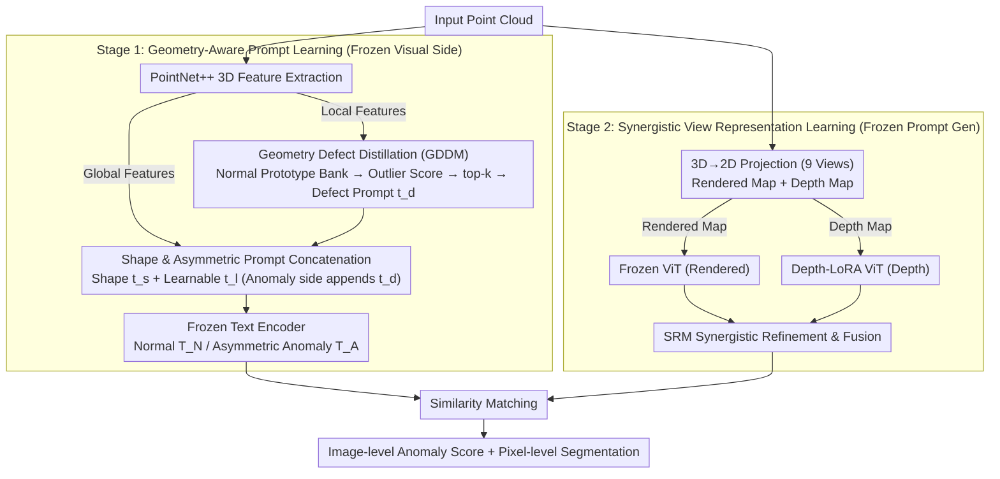

# GS-CLIP: Zero-shot 3D Anomaly Detection by Geometry-Aware Prompt and Synergistic View Representation Learning

**Conference**: CVPR 2026  
**arXiv**: [2602.19206](https://arxiv.org/abs/2602.19206)  
**Code**: [GitHub](https://github.com/zhushengxinyue/GS-CLIP)  
**Area**: Object Detection  
**Keywords**: Zero-shot 3D Anomaly Detection, CLIP, Geometry-Aware Prompt, Multi-view Fusion, Point Cloud

## TL;DR

Ours proposes GS-CLIP, a two-stage framework that injects global shape and local defect information of 3D point clouds into text prompts via a Geometry Defect Distillation Module (GDDM). It synergistically fuses rendered images and depth maps using a LoRA-based dual-stream architecture, achieving SOTA performance in zero-shot 3D anomaly detection across four large-scale datasets.

## Background & Motivation

**Background**: 3D anomaly detection is critical in industrial manufacturing. Traditional unsupervised methods (e.g., 3D-ST, Reg3D-AD) require extensive training on normal samples of target categories. Zero-shot 3D anomaly detection (ZS3DAD) aims to train a generalizable model on auxiliary data that can be directly applied to unseen categories, addressing issues of data privacy and sample scarcity.

**Limitations of Prior Work**:
   - **Loss of 3D Geometric Information**: Current methods (e.g., PointAD, MVP-PCLIP) project 3D point clouds into 2D images for CLIP processing. This projection compresses 3D structures into planar pixels, causing models to learn "2D visual proxies" of geometric anomalies rather than true physical forms. Detection fails when geometric anomalies lack prominent visual features in specific views.
   - **Insufficient Utilization of Visual Information**: Existing methods rely on a single 2D representation. Rendered images are rich in texture but susceptible to lighting/rendering artifacts; depth maps reflect overall geometry but fail to capture fine details like slight protrusions. Single-modality approaches limit detection comprehensiveness and generalization.

**Key Challenge**: While CLIP's zero-shot generalization is proven in 2D AD, extending it to the 3D domain faces two major gaps: "projection information loss" and "insufficient single-modality visual cues."

**Key Insight**: Instead of simple 2D adaptation, this work operates on both textual and visual ends—injecting 3D geometric priors into the text side as anomaly cues and fusing complementary information from rendered and depth maps on the visual side.

## Method

### Overall Architecture

The core problem GS-CLIP addresses is how to make CLIP truly "understand" 3D geometric anomalies without seeing target categories. It decouples the workflow into two stages to prevent interference between textual and visual joint training. Stage 1 focuses on the text side: all visual components are frozen, and a geometry-aware prompt generator is trained to extract global shape context and local defect information from input point clouds to dynamically generate text prompts embedded with geometric priors. Stage 2 freezes the trained prompt generator and trains the visual dual-stream architecture—rendered images pass through a fully frozen ViT, while depth maps pass through a LoRA-fine-tuned ViT. The two features are deeply fused via a Synergistic Refinement Module (SRM) before calculating similarity with text prompts to output image-level anomaly scores and pixel-level segmentation maps.

### Key Designs

**1. Geometry Defect Distillation Module (GDDM): Teaching text prompts "what anomaly to look for" directly from 3D geometry.**

Prior methods only describe "2D visual proxies." GDDM captures the essence of anomalies—deviation from normal patterns. It maintains a learnable normal prototype memory bank $\mathcal{P} = \{p_1, ..., p_l\} \in \mathbb{R}^{l \times d_{pn}}$ to implicitly fit the distribution of normal local geometric features. For each local feature $f_i$, a geometric outlier score is calculated based on its cosine similarity to the most similar prototype in the bank:

$$s_i = 1 - \max_{p_j \in \mathcal{P}} \frac{f_i \cdot p_j}{\|f_i\| \|p_j\|}$$

Higher scores indicate structures further from "normal." The top-$k$ feature points are aggregated and projected into defect prompts $t_d \in \mathbb{R}^{k \times d}$. This provides the text encoder with specific defect descriptions distilled from 3D geometry, rather than generic terms.

**2. Shape Prompt & Asymmetric Prompt Concatenation: Creating a semantic gap via prompt structure.**

The model needs global context to judge what is "normal." Shape prompts $t_s = \text{Proj}(F_e)$ are generated from global point cloud features $F_e$. A key innovation is the **asymmetric concatenation** of normal and anomaly prompts:

$$t_N = \text{Concat}(t_s, t_l), \quad t_A = \text{Concat}(t_s, t_l, t_d)$$

Both share shape prompts $t_s$ and learnable prompts $t_l$, but the anomaly prompt appends the defect description $t_d$. This structural asymmetry naturally separates the semantic distance, as the anomaly prompt contains specific "what is broken" information.

**3. Synergistic View Representation Learning (Depth-LoRA + SRM): Complementing views rather than selecting one.**

To address the limitations of single modalities, a dual-stream fusion is employed. Rendered images use a fully frozen ViT as CLIP is already adapted to natural images. Depth maps, which have a domain gap with natural images, use LoRA fine-tuning on ViT's MLP layers to bridge the domain gap while preserving spatial modeling:

$$x' = \text{GELU}(W_1 x + \gamma B_1 A_1 x)$$

The SRM module receives global/local features from both streams. It uses bidirectional multiplicative attention to calculate a shared matrix $S = f_1(K_i^R) \times f_2(K_i^D)^T$ to establish cross-modal correspondences, then aggregates value vectors for fusion:

$$G_i = \text{MLP}(\text{Concat}(E_i^R, E_i^D))$$

This explicitly complements appearance anomalies (textures, scratches) caught by rendered maps and geometric anomalies (pits, bumps) caught by depth maps.

### Loss & Training

- **Stage 1**: $L_{stage1} = L_{cla} + L_{seg}$ (Binary Cross-Entropy + Dice/Focal loss)
- **Stage 2**: $L_{stage2} = L_{cla} + L_{seg} + \alpha L_{con}$, adding **Cross-View Consistency Loss**:
  $$L_{con} = 1 - \frac{1}{v}\sum_{i=1}^v \langle G_i, \bar{G} \rangle$$
  This encourages view-invariant global representations.
- Stage 1: 15 epochs, lr=0.002; Stage 2: 10 epochs, lr=0.0005.
- 3D→2D projection uses 9 views; CLIP uses ViT-L/14@336px.

## Key Experimental Results

### Main Results

| Dataset | Metric | GS-CLIP (Ours) | PointAD (Prev. SOTA) | Gain |
|--------|------|------|----------|------|
| MVTec3D-AD | O-AUROC / P-PRO | 83.6 / 86.4 | 82.0 / 84.4 | +1.6 / +2.0 |
| Eyecandies | O-AUROC / P-PRO | 71.5 / 73.8 | 69.1 / 71.3 | +2.4 / +2.5 |
| Real3D-AD | O-AUROC | 76.4 | 74.8 | +1.6 |
| Anomaly-ShapeNet | O-AUROC / P-AUROC | 84.1 / 75.2 | 82.6 / 74.1 | +1.5 / +1.1 |
| Cross-Dataset (Eyecandies) | O-AUROC / P-AUROC | 70.3 / 92.9 | 69.5 / 91.8 | +0.8 / +1.1 |

### Ablation Study

| Configuration | O-AUROC, O-AP | P-AUROC, P-PRO | Description |
|------|---------|------|------|
| Render only + Learnable prompt | 80.9, 91.7 | 93.5, 83.1 | Baseline |
| + SRM Dual-stream fusion | 82.3, 93.9 | 94.6, 84.8 | Dual-stream fusion significantly improves results |
| + Shape Prompt | 82.5, 94.8 | 95.2, 85.1 | Macro-geometry context aids classification |
| + Defect Prompt | 82.9, 94.4 | 95.6, 85.6 | Defect prompt boosts localization accuracy |
| + Both combined | 83.1, 96.2 | 96.0, 86.2 | Strong complementary effect |
| + $L_{con}$ | **83.6, 96.5** | **96.3, 86.4** | Consistency further refines performance |

### Key Findings

- In GDDM, $k=12$ (outlier points) is optimal; values too high introduce noise. Prototype count $l=32$ reaches saturation.
- Performance saturates at 9 views; additional views yield diminishing returns.
- Adding RGB images as an extra modality reaches 88.2% O-AUROC on MVTec3D-AD, validating framework extensibility.
- Inference overhead: 0.51s/image, 1.96 FPS, Memory 5872MB—slightly higher than baseline but with significantly better accuracy.
- Performance drop in cross-dataset settings is minimal, proving robust generalization.

## Highlights & Insights

- **3D-to-Text Information Bridge**: Instead of just projecting 3D to 2D for CLIP to "see," ours injects 3D geometric information into the text side as a prior, telling the prompt "what to look for."
- **Asymmetric Prompt Design**: Normal and anomaly prompts share shape context, but the anomaly prompt carries an explicit defect description, clarifying semantic boundaries.
- **Decoupled Two-Stage Optimization**: Optimizing prompts first to describe geometric anomalies, followed by visual alignment, avoids the instability of joint training.
- **Plug-and-play Multi-modal Extension**: The framework naturally supports additional modalities like RGB.

## Limitations & Future Work

- PointNet++ as a 3D extractor may limit complex geometry representation; stronger backbones like Point Transformer v3 could be explored.
- The 9-view projection strategy is fixed; adaptive view selection could be investigated.
- Inference speed (approx. 2 FPS) may be insufficient for real-time industrial detection; feature caching or compression could help.
- Native 3D representations (detecting directly on point clouds) were not explored.

## Related Work & Insights

- **PointAD (NeurIPS'24)**: Constructs 3D representations via rendered maps; the most direct predecessor.
- **MVP-PCLIP**: Uses depth maps and fine-tunes CLIP with visual/text prompts, but relies on a single modality.
- **AnomalyCLIP / AA-CLIP**: 2D zero-shot AD methods using prompt learning; this work extends these ideas to the 3D domain with geometric priors.
- **Insight**: Injecting domain-specific priors into the textual side of foundation models (rather than just adapting the visual side) is an effective paradigm.

## Rating

- Novelty: ⭐⭐⭐⭐ Combination of GDDM, asymmetric prompts, and dual-stream fusion is novel; injecting 3D priors via text is a unique perspective.
- Experimental Thoroughness: ⭐⭐⭐⭐ Extensive evaluation across four datasets, two settings, detailed ablations, and multimodal extensions.
- Writing Quality: ⭐⭐⭐⭐ Clear motivation and intuitive explanations for the complementarity of rendered vs. depth maps.
- Value: ⭐⭐⭐⭐ Significant improvements in the practical and emerging field of ZS3DAD with strong cross-dataset generalization.

<!-- RELATED:START -->

## Related Papers

- [\[CVPR 2026\] Geometry-Aligned and Anomaly-Aware Reconstruction for 3D Anomaly Detection](geometry-aligned_and_anomaly-aware_reconstruction_for_3d_anomaly_detection.md)
- [\[CVPR 2026\] Bidirectional Multimodal Prompt Learning with Scale-Aware Training for Few-Shot Multi-Class Anomaly Detection](bidirectional_multimodal_prompt_learning_with_scale-aware_training_for_few-shot_.md)
- [\[CVPR 2026\] FB-CLIP: Fine-Grained Zero-Shot Anomaly Detection with Foreground-Background Disentanglement](fb-clip_fine-grained_zero-shot_anomaly_detection_with_foreground-background_dise.md)
- [\[CVPR 2026\] CoPS: Conditional Prompt Synthesis for Zero-Shot Anomaly Detection](cops_conditional_prompt_synthesis_for_zero-shot_anomaly_detection.md)
- [\[CVPR 2026\] MoECLIP: Patch-Specialized Experts for Zero-shot Anomaly Detection](moeclip_patch-specialized_experts_for_zero-shot_anomaly_detection.md)

<!-- RELATED:END -->
