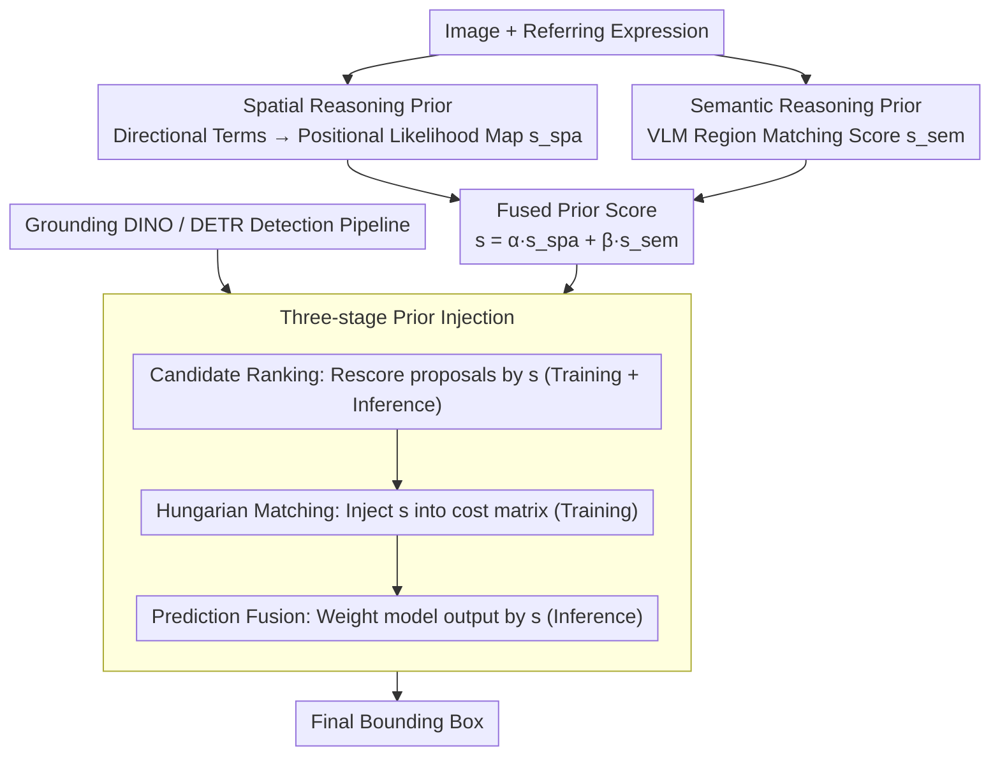

# HeROD: Heuristic-inspired Reasoning Priors Facilitate Data-Efficient Referring Object Detection

**Conference**: CVPR 2026  
**arXiv**: [2603.24166](https://arxiv.org/abs/2603.24166)  
**Code**: [https://github.com/xuzhang1199/HeROD](https://github.com/xuzhang1199/HeROD)  
**Area**: Object Detection  
**Keywords**: Referring Object Detection, Data-Efficient Learning, Reasoning Priors, DETR, Few-shot Detection

## TL;DR

HeROD proposes a lightweight, model-agnostic framework that significantly improves the data efficiency and convergence performance of referring object detection (ROD) under label-scarce conditions by injecting heuristic spatial and semantic reasoning priors into three stages of the DETR-style detection pipeline (candidate ranking, prediction fusion, and Hungarian matching).

## Background & Motivation

1. **Background**: Referring object detection (ROD) aims to localize specific objects through natural language descriptions. Modern foundation detectors (such as GLIP and Grounding DINO) exhibit excellent performance in data-rich scenarios but rely heavily on large-scale annotations.
2. **Limitations of Prior Work**: Many practical deployment scenarios (robotics, AR, medical imaging) face severe annotation scarcity. End-to-end foundation detectors need to learn spatial relationships and visual-semantic associations from scratch, leading to low sample efficiency and a tendency to overfit when data is scarce.
3. **Key Challenge**: Large-scale pre-training provides broad vision-language alignment, but fine-grained spatial cues and complex attribute combinations are under-represented during pre-training. Consequently, models need to "re-discover" these basic concepts with limited annotations.
4. **Goal**: To enable models to focus on "refining" rather than "re-discovering" basic spatial and semantic relationships when data is scarce.
5. **Key Insight**: Drawing an analogy to A* heuristic search—using heuristic costs to guide the search toward promising candidate sets to avoid blind exploration.
6. **Core Idea**: Injecting explicit, interpretable spatial and semantic reasoning priors into the candidate ranking, matching, and prediction stages of the detection pipeline to bias training and inference toward reasonable candidates.

## Method

### Overall Architecture

The core problem HeROD addresses is that DETR-style referring detectors (like Grounding DINO) must "re-discover" spatial relationships and visual-semantic associations from scratch when annotations are scarce, resulting in slow convergence and overfitting. HeROD's approach is to convert human-intuitive common sense—such as "left" indicating a search on the left side or "red hat" matching a red region—into explicit, interpretable, zero-learning prior scores. These scores are then injected into key decision points of the detection pipeline: candidate ranking, Hungarian matching, and prediction fusion. This shifts the model's task from "re-discovery" to "refinement."

The pipeline operates as follows: Given an image and a referring expression (e.g., "the person in the red hat on the left"), the spatial reasoning prior extracts directional terms from the expression to generate a positional likelihood map $s_{\text{spa}}$ on the image plane (high scores for left pixels, low for right). The semantic reasoning prior feeds the entire expression into a pre-trained VLM to calculate text-visual matching scores $s_{\text{sem}}$ for various regions (high scores for red hat regions). These two prior maps are fused into a unified score $s=\alpha\,s_{\text{spa}}+\beta\,s_{\text{sem}}$, which is then integrated into the three decision points of the DETR-style detection pipeline. This biases the backbone's originally uniform attention toward candidates that are "both on the left and look like a red hat." The priors themselves have no trainable parameters and serve as lightweight, plug-and-play modules that can be added to foundation detectors like Grounding DINO.

### Key Designs

**1. Spatial Reasoning Prior: Transforming directional terms into positional likelihood maps**

Directional terms like "left/top/middle" in referring expressions are crucial for disambiguating multiple objects of the same category. However, end-to-end detectors struggle to learn this basic spatial common sense when data is scarce. HeROD avoids training the model on this by using fixed rules to map directional keywords to cardinal directions (left/right/up/down) and their combinations. It directly assigns a prior likelihood score $s_{\text{spa}}(p)$ to each spatial position $p$ in the image. This zero-learning, fully interpretable process hard-codes the "where to look" common sense, reducing the overhead of re-fitting spatial distributions using limited annotations.

**2. Semantic Reasoning Prior: Leveraging zero-shot VLM alignment for regional semantic scoring**

While the spatial prior handles "where," the semantic prior focuses on "what" (fine-grained attribute combinations like "red hat" or "wearing a suit"). HeROD utilizes pre-trained vision-language models (e.g., CLIP) to compute the matching score $s_{\text{sem}}(r)$ between the referring expression and image regions, reflecting semantic alignment. Since large-scale pre-trained VLMs already possess broad vision-language alignment knowledge, this provides coarse-grained semantic guidance almost "for free" in low-data scenarios, further reducing the need to re-discover these concepts.

**3. Three-stage Prior Injection: Biasing training and inference at critical nodes**

With $s_{\text{spa}}$ and $s_{\text{sem}}$ available, the key is where to inject them to maximize convergence speed and final accuracy. HeROD identifies three decision points for the fused score $s = \alpha\, s_{\text{spa}} + \beta\, s_{\text{sem}}$: the candidate ranking stage uses $s$ to re-rank detection proposals to narrow the search space; the Hungarian matching stage integrates $s$ into the cost matrix to bias training towards "prior-consistent" assignments; and the prediction fusion stage merges $s$ with the model output during inference for final correction. The first two points facilitate training (convergence and gradient stability), while the third aids inference (output refinement). This synergy allows the priors to provide significant gains under 10% data while remaining complementary in full-data settings.

This design mirrors the A* search analogy: A* uses heuristic costs to guide a search toward promising directions; HeROD uses reasoning priors to shift learning from "re-discovering basic concepts" to "refining within reasonable regions." Both leverage inexpensive, interpretable guidance to gain efficiency.

### Loss & Training

The training follows the standard DETR losses (Classification + L1 + GIoU), with the only modification being the addition of the prior term $s$ to the Hungarian matching cost to bias GT assignment toward prior-consistent predictions. To evaluate data efficiency, the authors introduce the De-ROD (Data-efficient ROD) benchmark protocol, which covers low-data and few-shot settings while maintaining the plug-and-play nature of HeROD for various foundation detectors.

## Key Experimental Results

### Main Results

| Dataset | Setting | HeROD | Baseline (Grounding DINO) | Gain |
|--------|------|-------|---------------------|------|
| RefCOCO | Low-data (10%) | Significant Increase | Sharp Decline | Substantial Improvement |
| RefCOCO+ | Low-data (10%) | Significant Increase | Sharp Decline | Substantial Improvement |
| RefCOCOg | Low-data (10%) | Significant Increase | Sharp Decline | Substantial Improvement |
| RefCOCO | Few-shot | Continuous Improvement | Baseline | Consistent Gains |
| RefCOCO | Full-data (100%) | Competitive | Baseline | Slight Improvement |

### Ablation Study

| Configuration | Key Metric | Description |
|------|---------|------|
| No Prior | Baseline | Standard Grounding DINO |
| + Spatial Prior Only | Gain | Effective guidance by directional info |
| + Semantic Prior Only | Gain | Semantic matching reduces search space |
| + Candidate Ranking Injection | Improvement | Prioritizes high-quality candidates |
| + Hungarian Matching Injection | Further Improvement | More effective training guidance |
| + Prediction Fusion Injection | Optimal | Inference-time guidance supplement |
| Full HeROD | Best Performance | Synergy of three stages and dual priors |

### Key Findings

- Under 10% training data, HeROD's convergence speed and final performance significantly outperform the baseline without priors.
- Spatial priors provide the most significant improvements for samples containing directional descriptions (e.g., "on the left," "above").
- HeROD remains competitive in full-data settings, indicating that the priors offer complementary value rather than being useful only when data is scarce.
- The De-ROD benchmark highlights the vulnerability of existing foundation detectors in low-data scenarios.

## Highlights & Insights

- **De-ROD task definition** addresses the gap in low-data evaluation for ROD, reflecting real-world deployment challenges where labels are scarce.
- **A* search analogy** provides an intuitive explanation for the role of reasoning priors: heuristic cost $\rightarrow$ search efficiency; reasoning prior $\rightarrow$ learning efficiency.
- **Model-agnostic + lightweight** design Allows for direct enhancement of existing foundation detectors with minimal deployment overhead.
- The priors are **interpretable** (spatial mapping + VLM scores), avoiding the "black box" nature of many end-to-end systems.

## Limitations & Future Work

- Spatial priors rely on simple keyword mapping and cannot handle complex relational descriptions (e.g., "the second shelf on the bookcase").
- Semantic priors are dependent on the quality of the pre-trained VLM, and VLM biases may propagate to the detector.
- Validation is limited to the RefCOCO dataset series.
- Balancing prior weights currently requires manual tuning on a validation set.

## Related Work & Insights

- **vs Grounding DINO**: A powerful foundation detector that suffers significant performance drops in low-data regimes; HeROD improves data efficiency via prior injection.
- **vs MDETR**: End-to-end multimodal detection requires extensive fine-tuning data; HeROD reduces this dependency.
- **vs Few-shot Detection (FSCE, etc.)**: While these focus on category transfer in general detection, HeROD addresses the unique visual-semantic alignment and spatial reasoning challenges of ROD.

## Rating

- Novelty: ⭐⭐⭐⭐ De-ROD task definition + three-stage prior injection design is innovative.
- Experimental Thoroughness: ⭐⭐⭐⭐ Validated across multiple datasets and settings (low-data, few-shot, full-data).
- Writing Quality: ⭐⭐⭐⭐ Effective use of the A* analogy and clear motivational logic.
- Value: ⭐⭐⭐⭐ Addresses a significant practical gap in data-efficient ROD research.

<!-- RELATED:START -->

 
<!-- RELATED:END -->

## Related Papers

- [\[CVPR 2026\] Heuristic-inspired Reasoning Priors Facilitate Data-Efficient Referring Object Detection](heuristic-inspired_reasoning_priors_facilitate_data-efficient_referring_object_d.md)
- [\[CVPR 2026\] PaQ-DETR: Learning Pattern and Quality-Aware Dynamic Queries for Object Detection](paq-detr_learning_pattern_and_quality-aware_dynamic_queries_for_object_detection.md)
- [\[CVPR 2026\] Beyond Duality: A Hybrid Framework of Leveraging Shared and Private Features for RGB-Event Object Detection](beyond_duality_a_hybrid_framework_of_leveraging_shared_and_private_features_for_.md)
- [\[CVPR 2026\] Balanced Hierarchical Contrastive Learning with Decoupled Queries for Fine-grained Object Detection in Remote Sensing Images](balanced_hierarchical_contrastive_learning_with_decoupled_queries_for_fine-grain.md)
- [\[CVPR 2026\] BDNet: Bio-Inspired Dual-Backbone Small Object Detection Network](bdnetbio-inspired_dual-backbone_small_object_detection_network.md)

<!-- RELATED:END -->
