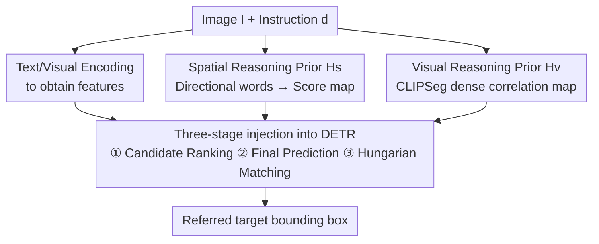

# Heuristic-inspired Reasoning Priors Facilitate Data-Efficient Referring Object Detection

**Conference**: CVPR 2026  
**Paper**: [CVF Open Access](https://openaccess.thecvf.com/content/CVPR2026/html/Zhang_Heuristic-inspired_Reasoning_Priors_Facilitate_Data-Efficient_Referring_Object_Detection_CVPR_2026_paper.html)  
**Code**: https://github.com/xuzhang1199/HeROD  
**Area**: Object Detection / Multi-modal VLM  
**Keywords**: Referring Object Detection, Data-Efficient, Reasoning Priors, Grounding Detection, DETR  

## TL;DR
To address the sharp performance drop of Referring Object Detection (ROD) models when "annotations are scarce," this paper first defines a low-data/few-shot De-ROD evaluation protocol and subsequently proposes HeROD. Interpretable **spatial orientation priors** and **visual semantic priors**, derived directly from referring phrases, are injected into three stages of the DETR detection pipeline (candidate ranking, final prediction, and Hungarian matching) as heuristic costs similar to A\*. In extremely low-data (0.1%–5%) and few-shot settings on RefCOCO/+/g, HeROD consistently achieves gains of 3–16 points compared to Grounding DINO and UNINEXT.

## Background & Motivation

**Background**: Referring Object Detection (ROD) aims to localize a target described by natural language in an image (e.g., "the bird on the left"). Modern mainstream approaches utilize end-to-end grounding detectors—such as GLIP, Grounding DINO, and UNINEXT—which unify phrase grounding and object detection through massive image-text pair pre-training, achieving SOTA performance when data is abundant.

**Limitations of Prior Work**: These models are designed for "data-rich" scenarios. However, real-world deployment scenarios like robotics, AR, and medicine often face a **severe lack of annotations**. When annotations are scarce, end-to-end detectors must **rediscover from scratch** basic common-sense concepts—such as relative orientation ("on the left"), object attributes ("man in blue shirt"), and inter-object relationships—from very few samples. The original text notes that even strong foundation detectors like Grounding DINO experience **rapid degradation** on ROD tasks without large-scale in-task fine-tuning.

**Key Challenge**: Existing methods leave "spatial/semantic reasoning capabilities" entirely to implicit end-to-end learning, while large-scale pre-training lacks sufficient coverage of fine-grained spatial cues and complex attribute combinations. Consequently, under low-data conditions, models suffer from slow convergence and are prone to overfitting—they essentially attempt to "relearn" things that should be apparent through priors using precious samples.

**Goal**: (1) Establish a standard evaluation protocol for "data-efficient ROD"; (2) Design a lightweight, model-agnostic framework that allows detectors to focus on **refining** these basic relationships rather than discovering them from scratch under scarce supervision.

**Key Insight**: Drawing an analogy to heuristic searches like A\*—where a heuristic cost function guides exploration toward promising candidates to significantly improve search efficiency—the authors apply this thinking to detection. Interpretable **spatial/semantic cues** are extracted directly from referring phrases and images as "reasoning priors," biasing candidate selection toward "reasonable-looking" regions during both training and inference.

**Core Idea**: "Reasoning before learning"—providing detectors with inductive biases through explicit, interpretable heuristic priors injected into multiple stages of the DETR pipeline, replacing pure implicit learning to rediscover spatial/semantic relationships.

## Method

### Overall Architecture

HeROD is a **model-agnostic plugin framework** applied to existing DETR-style grounding detectors (such as Grounding DINO or UNINEXT). The input is a pair $(I_i, d_i)$ consisting of an image and a natural language description, and the output is the bounding box of the referred target.

Mechanism: Modern detectors calculate a learned matching probability $P(o_j|I_i, d_i)$ for each candidate $o_j$, a score derived entirely from network parameters without explicit inductive biases. HeROD introduces an additional heuristic signal $H(o_j, I_i, d_i)$ to guide candidate selection, reformulating the selection process into a form similar to A\*:

$$\overline{o}_i = \arg\max_{o_j \in O_i} \; H(o_j, I_i, d_i) \oplus P(o_j|I_i, d_i)$$

Here, $H$ is aggregated from two complementary components: the spatial heuristic $H_s$ and the visual heuristic $H_v$, i.e., $H(o_j, I_i, d_i) = H_s(o_j, d_i) \oplus H_v(o_j, d_i, I_i)$. The operator $\oplus$ **takes different forms at different pipeline stages**: simple addition for candidate generation (for efficiency), a learnable weighting module for final prediction, and a modified Hungarian matching cost for the matching loss stage. The overall pipeline is shown below:

Note: The spatial prior $H_s$ and visual prior $H_v$ are derived from the phrase and image in a **purely feed-forward manner without additional annotations**, and are then fed into the same "three-stage injection" module—this is how HeROD transforms interpretable priors into actionable biases.

### Key Designs

**1. Spatial Reasoning Prior $H_s$: Converting Directional Words into Score Maps on the Image Plane**

Design Motivation: Directional phrases ("on the left," "at the top") are the most common and interpretable cues in referring expressions, yet grounding detectors usually must "rediscover" these concepts from large amounts of labeled data, which is difficult in low-data regimes.

Mechanism: The authors pre-define a vocabulary of spatial descriptors $\mathcal{T}$ (left/right/top/bottom and compounds like top-left). Given a description $d_i$, a split operation extracts spatial words $t_i = \text{Split}(d_i) \cap \mathcal{T}$ (e.g., $d_i$="person on the left" → $t_i$="left"). Each $t_i$ is associated with a **pre-computed** score map $M_s(t_i)$ aligned with the image plane: higher values indicate a higher likelihood of containing the target. For example, a "left" map assigns higher scores to pixels near the left boundary (using linear or Gaussian decay along the x-axis), and compound words are obtained via averaging/weighted fusion of basic maps. For a candidate region $o_j$, its center position is used to index this map:

$$H_s(o_j, d_i) = M_s(t_i)[\text{loc}(o_j)]$$

where $\text{loc}(o_j)$ is the center of the candidate box. Its effectiveness lies in providing an **explicit inductive bias with zero annotation cost**—basic relative position reasoning does not need to be learned from scratch, directly biasing candidates toward spatially reasonable regions.

**2. Visual Semantic Reasoning Prior $H_v$: Generating Dense Correlation Maps via CLIPSeg**

Design Motivation: Referring expressions often include visual attributes or object semantics ("person wearing a hat," "dog next to the bike"), which are critical for distinguishing multiple adjacent candidates but are implicitly learned by detectors, leading to inefficiency in low-data settings.

Mechanism: $H_v$ explicitly encodes the visual-semantic alignment between each candidate $o_j$ and the phrase $d_i$: $H_v(o_j, d_i, I_i) = \text{Align}(I_i, d_i; o_j)$. A direct approach would involve using CLIP to crop each candidate region and calculate similarity with $d_i$, but this does not scale due to the high number of candidates and repeated forward passes. Instead, the authors use **CLIPSeg**: the entire image and text are processed once to produce a **text-conditioned dense correlation map**, and the mean CLIPSeg score within each candidate box is taken as $H_v$. This is both interpretable and scales efficiently with the number of candidates. A detail: Since CLIPSeg is insensitive to spatial words, the **original phrase** (without removing spatial words) is used to prompt it, complementing $H_s$.

The authors emphasize ⚠️: HeROD is **not** simply adding CLIPSeg as an ensemble—the raw CLIPSeg map is coarse and provides only marginal gains if fused in isolation; the real effect comes from injecting $H_v$ into candidate ranking, matching, and prediction fusion, allowing the signal to **shape both training and inference**.

**3. Three-stage Injection into DETR Pipeline: Addition for Ranking, Adaptive MLP for Prediction, and Modified Hungarian Matching Cost**

Design Motivation: Given the differing natures of the three DETR pipeline stages (top-N sampling vs. top-1 argmax vs. set matching), a single static fusion rule cannot be applied, thus $\oplus$ must be **customized per stage**.

① **Candidate Generation (Object Reference Generation)**: This step selects the top-N (rather than top-1) initial candidates to pass to subsequent decoding layers, which is critical for convergence. The authors found it difficult to design explicit supervision for this stage, so $\oplus$ is implemented as simple addition—the spatial and visual prior scores are added directly to the detector's confidence before selecting the top-N:

$$\overline{O}_i' = \text{TopN}_{o_j \in O_i'}\big[\,P(o_j|I_i, d_i) + H_s(o_j, d_i) + H_v(o_j, d_i, I_i)\,\big]$$

This incurs zero extra computational overhead while biasing candidates toward reasonable regions at the earliest possible stage.

② **Final Prediction**: This step involves a single top-1 decision supervised by Ground Truth, warranting a more expressive fusion. $\oplus$ is implemented as a lightweight learnable module: $H_s$, $H_v$, and the detector confidence $P$ are concatenated and fed into a small MLP, allowing the model to **adaptively learn** the relative weight of the prior versus the network prediction before selecting the box via argmax:

$$z_j = \text{MLP}\!\left(\text{Cat}\big[H_s(o_j, d_i),\, H_v(o_j, d_i, I_i),\, P(o_j|I_i, d_i)\big]\right), \quad \overline{o}_i = \arg\max_{o_j \in \overline{O}_i'} z_j$$

③ **Hungarian Matching (Training Objective)**: Standard DETR matching cost = classification + box regression + GIoU. However, early in training (especially with low data), classification logits are noisy and boxes are inaccurate, leading to unstable matching and slow convergence. HeROD **subtracts** the prior from the cost, biasing matching toward candidates consistent with spatial/semantic priors:

$$\text{Cost}_h = \text{Cost}_{cls} + \text{Cost}_{bbox} + \text{Cost}_{giou} - H(o_j, d_i, I_i)$$

Matching is settled if alignment with the prior is better (lower cost). After matching, an additional loss $L_{conf}$ is added—an MSE between the predicted confidence and the prior score (treating the prior as a soft label): $L_h = L_{cls} + L_{bbox} + L_{conf}$, encouraging the model to align its confidence with "prior-defined reasonableness" in addition to predicting the correct box.

> The three injection points are complementary: early-stage (candidate ranking) provides coarse filtering bias, late-stage (final prediction) perform adaptive balancing, and the loss side provides stable supervisory guidance. All are indispensable (see Ablation Tab. 3/4).

## Key Experimental Results

Evaluations were conducted on RefCOCO / RefCOCO+ / RefCOCOg, using top-1 accuracy (whether the highest-scored prediction hits the target). Two baselines were used: HeROD-G (based on Grounding DINO, Swin-T + BERT + DINO) and HeROD-U (based on UNINEXT, ResNet-50 + Deformable DETR), with image encoders frozen.

### Main Results: Low-data ROD (RefCOCO excerpts, unit top-1 acc %)

| Setting | Baseline | val | testA | testB |
|------|----------|-----|-------|-------|
| 0.1% data | Grounding DINO | 57.93 | 65.64 | 50.26 |
| 0.1% data | **HeROD-G** | **70.82** (+12.89) | **76.95** (+11.31) | **64.67** (+14.41) |
| 1% data | Grounding DINO | 63.66 | 72.41 | 56.70 |
| 1% data | **HeROD-G** | **77.91** (+14.25) | **82.91** (+10.50) | **72.33** (+15.63) |
| 0.1% data | UNINEXT | 17.75 | 22.03 | 14.27 |
| 0.1% data | **HeROD-U** | **25.60** (+7.85) | **33.20** (+11.17) | **18.47** (+4.20) |
| 1% data | UNINEXT | 31.04 | 34.35 | 27.77 |
| 1% data | **HeROD-U** | **47.89** (+16.85) | **53.51** (+19.16) | **40.12** (+12.35) |

Gains are stable across RefCOCO/+/g and 6 different data ratios (0.1%–5%). Notably, **HeROD-G's improvements on RefCOCO+ are significantly smaller** (mostly +0.2–2 points)—as RefCOCO+ was designed to **exclude absolute spatial cues**, rendering $H_s$ ineffective. The remaining visual descriptions are general enough that the strong Grounding DINO pre-training already captures them, leaving little room for priors. This conversely confirms that "the spatial prior indeed functions via directional words."

### Few-shot ROD (RefCOCO, support=human, novel=non-human)

| Support | Baseline | 2k fine-tune val | testA | testB |
|---------|----------|------------------|-------|-------|
| 2k | Grounding DINO | 61.18 | 70.66 | 52.23 |
| 2k | **HeROD-G** | **78.17** (+10.94) | **80.50** (+8.20) | **75.62** (+11.77) |
| 1k | Grounding DINO | 59.28 | 68.62 | 50.52 |
| 1k | **HeROD-G** | **76.81** (+12.07) | **79.51** (+9.60) | **75.39** (+14.37) |

Key phenomenon: While common baselines **sacrifice performance on support classes (testA)** when fine-tuning on novel classes (testB)—a sign of catastrophic forgetting—HeROD sees gains in both, using interpretable priors to "regularize" the adaptation process.

### Ablation Study

**Tab. 3 (RefCOCO 1% data, stage-by-stage injection)**

| Reference Gen | Final Prediction | Learning Proc | top-1 acc |
|---------------|------------------|---------------|-----------|
| w/o H | Original | w/o H | 63.66 |
| w/o H | Heuristic (static addition) | w/ H | 64.78 |
| w/o H | Heuristic (adaptive MLP) | w/ H | 71.33 |
| **w/ H** | **Heuristic (adaptive)** | **w/ H** | **77.91** |

**Tab. 4 (Prior types × Injection stages)**

| Reference Gen $H_s$ | Reference Gen $H_v$ | Final $H_s$ | Final $H_v$ | top-1 acc |
|:---:|:---:|:---:|:---:|---|
| ✓ | ✓ | ✓ | | 76.36 |
| ✓ | ✓ | | ✓ | 74.93 |
| ✓ | | ✓ | ✓ | 76.02 |
| | ✓ | ✓ | ✓ | 72.43 |
| ✓ | ✓ | ✓ | ✓ | **77.91** |

### Key Findings
- **Adaptive MLP fusion for final prediction is the primary driver**: Switching from static addition (64.78) to an adaptive MLP (71.33) yielded a 6.5-point jump, showing that "learnably balancing priors vs. network predictions" is far superior to simple addition.
- **Candidate generation stage injection is also critical**: Adding priors to reference generation on top of the adaptive mechanism (71.33 → 77.91) added another 6.6 points—showing early bias in candidate quality is complementary to later adaptive balancing.
- **Both spatial and visual priors are essential**: Tab. 4 shows removing either prior at any stage leads to a drop, with removing $H_s$ from reference generation causing the largest drop (to 72.43).
- **Scene Dependency**: Gains are largest when explicit directional words are present (RefCOCO/g); for RefCOCO+, gains are smaller but remaining positive due to the lack of absolute spatial annotations.

## Highlights & Insights
- **The "reasoning before learning" paradigm is clever**: It applies the logic of A\* heuristic costs to detection—priors do not replace learning but bias the search space toward reasonable candidates, allowing the model to focus on refinement rather than relearning basics.
- **Using CLIPSeg instead of CLIP for visual priors is a key engineering tradeoff**: It generates dense correlation maps in one forward pass and averages them by box, avoiding the scalability disaster of per-proposal cropping and repeated CLIP passes. This trick is transferable to any detection/segmentation task needing dense text-region alignment.
- **Stage-specific customization of $\oplus$ (addition / MLP / matching cost subtraction)** is the crucial detail for practical implementation. The authors recognized that the three stages differ fundamentally (soft top-N filtering, hard top-1 selection, set matching) and used specific fusion rules rather than a one-size-fits-all approach, which ablations prove is the main reason for the gain.
- **Anti-forgetting property in few-shot settings** is an unexpected advantage: Interpretable priors anchor adaptation to a stable signal, preventing support class performance from collapsing when fine-tuning on novel classes, which is highly valuable for continuous deployment.

## Limitations & Future Work
- Authors admit that on data like RefCOCO+ **without absolute spatial cues**, spatial priors are largely ineffective and gains are minimal; they intend to extend this to richer **relational priors** (inter-object relationships like "Y next to X") in the future.
- The spatial prior vocabulary $\mathcal{T}$ is **pre-defined and human-authored**, and score maps rely on manual design (linear/Gaussian decay)—⚠️ its coverage of complex, implicit, or compositional spatial expressions ("sandwiched between two people") is questionable and might require a more learnable spatial prior generator.
- Visual priors depend entirely on CLIPSeg quality; the original text notes CLIPSeg maps can be "coarse." Whether these priors remain reliable in domains where CLIPSeg is weak (medical, remote sensing, etc.) was not verified outside the RefCOCO domain.
- Gains shrink to +0.7~1.0 points under full-data settings—priors are primarily valuable when supervision is scarce, and marginal returns are limited when data is abundant (consistent with the method's positioning, but defining its scope of application).

## Related Work & Insights
- **vs Grounding DINO / UNINEXT (End-to-end grounding detectors)**: These rely on implicit learning for spatial/semantic relations, being strong with sufficient data but dropping sharply with low data. HeROD does not change their architecture but injects explicit priors as plugins, improving them by over 10 points across 0.1%–5% data levels.
- **vs FSOD systems (FSRW / Meta-RCNN / DETReg etc.)**: Few-shot detection focuses on "base-to-novel class knowledge transfer / unsupervised regional priors" in generic detection tasks without handling cross-modal text. HeROD is explicitly designed for ROD visual-semantic alignment and spatial reasoning, establishing the first De-ROD benchmark.
- **vs Explicit Reasoning REC methods (MattNet location/relation branches, TAS, IterPrimE)**: Earlier methods either treat reasoning as a learning module, use it only in zero-shot settings, or treat it as **post-processing**. HeROD differs by directly injecting spatial and visual priors into the training and inference stages of the detector, allowing priors to shape learning dynamics rather than being an afterthought.

## Rating
- Novelty: ⭐⭐⭐⭐ Systematically defines a data-efficient ROD (De-ROD) benchmark and clear injection of A\*-style interpretable priors into the three stages of DETR.
- Experimental Thoroughness: ⭐⭐⭐⭐ Covers 6 data ratios across RefCOCO/+/g, few-shot settings, and two baselines with detailed ablations, though limited to the RefCOCO domain.
- Writing Quality: ⭐⭐⭐⭐ Motivations (A\* analogy) and multi-stage approach are clearly explained with complete formulas.
- Value: ⭐⭐⭐⭐ Model-agnostic, plug-and-play, and offers large gains in low-data regimes, providing practical value for robotics/AR deployment with scarce labels.

<!-- RELATED:START -->

## Related Papers

- [\[CVPR 2026\] BDNet: Bio-Inspired Dual-Backbone Small Object Detection Network](bdnetbio-inspired_dual-backbone_small_object_detection_network.md)
- [\[CVPR 2026\] Foundation Model Priors Enhance Object Focus in Feature Space for Source-Free Object Detection](foundation_model_priors_enhance_object_focus_in_feature_space_for_source-free_ob.md)
- [\[CVPR 2026\] Parameter-Efficient Semantic Augmentation for Enhancing Open-Vocabulary Object Detection](parameter-efficient_semantic_augmentation_for_enhancing_open-vocabulary_object_d.md)
- [\[CVPR 2026\] Complementary Prototype Mapping for Efficient Multimodal Anomaly Detection](complementary_prototype_mapping_for_efficient_multimodal_anomaly_detection.md)
- [\[CVPR 2026\] Online Data Curation for Object Detection via Marginal Contributions to Dataset-level Average Precision](online_data_curation_for_object_detection_via_marginal_contributions_to_dataset-.md)

<!-- RELATED:END -->
