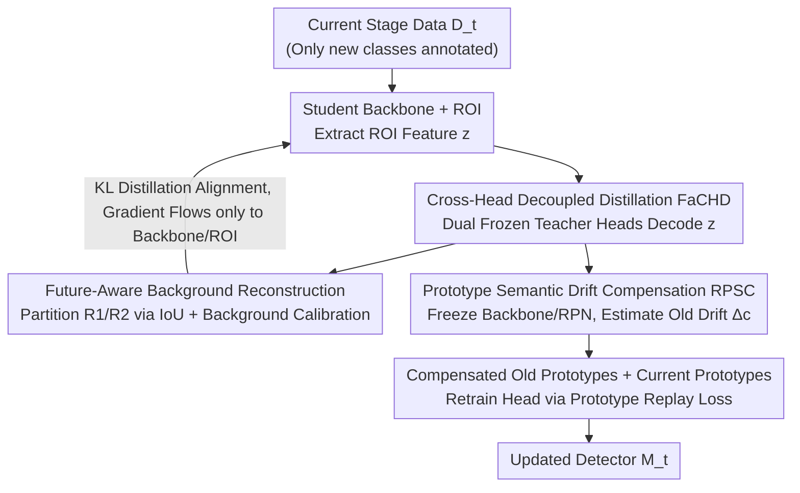

# Incremental Object Detection via Future-Aware Decoupled Cross-Head Distillation

**Conference**: CVPR 2026  
**Paper**: [CVF Open Access](https://openaccess.thecvf.com/content/CVPR2026/html/Yin_Incremental_Object_Detection_via_Future_Aware_Decoupled_Cross_Head_Distillation_CVPR_2026_paper.html)  
**Code**: Not yet released  
**Area**: Object Detection / Incremental Learning  
**Keywords**: Incremental Object Detection, Knowledge Distillation, Cross-Head Decoupling, Semantic Drift Compensation, Catastrophic Forgetting

## TL;DR
To address the issue where "detection head bias contaminates backbone features leading to distillation failure" in incremental object detection, this paper proposes FaCHD. It utilizes two frozen teachers—a historical teacher and an intermediate teacher—to perform cross-head decoding of student ROI features for feature distillation. This decouples the classification head from the backbone. Combined with RPSC multi-granularity prototype semantic drift compensation for retraining the classification head, it achieves a new SOTA for non-exemplar-based methods on VOC and COCO incremental benchmarks.

## Background & Motivation

**Background**: Incremental Object Detection (IOD) requires detectors to maintain performance on old categories while continuously introducing new ones. Current mainstream approaches follow the Class-Incremental Learning (CIL) paradigm, divided into regularization/distillation-based and replay-based methods, with Knowledge Distillation (KD) being the primary force for mitigating catastrophic forgetting.

**Limitations of Prior Work**: IOD is more challenging than pure incremental classification because tasks coexist within the same training images—foreground objects from old tasks lack annotations in the current stage and are easily treated as background, while objects from future tasks hidden in the current background might be mistakenly treated as foreground. This foreground-background confusion amplifies cross-task interference. Crucially, existing KD methods perform distillation directly on output logits, which conflicts with ground truth targets assigned by the student model's assigner. Simultaneously, they train the detection head and backbone in a **tightly coupled** manner, allowing the bias of the detection head toward new classes to be "imprinted" into the backbone features, which accelerates forgetting.

**Key Challenge**: The gradient of the detection head (driven by new class supervision) and the distillation gradient (to preserve old classes) compete on shared classifiers, biasing the optimization direction toward new classes. Since this contaminated backbone serves as the carrier for distillation, a vicious cycle is formed: "the stronger the distillation, the more biased the backbone, and the less effective the distillation."

**Goal**: To decouple the geometric representation shaping of the backbone from the decision boundary resetting of the detection head, handling each separately to mechanically cut off the return path of detection head bias to the backbone.

**Key Insight**: The authors observed that if distillation gradients do not pass through the student's own detection head, but instead use **frozen** detection heads from two teachers to "decode" the ROI features output by the student backbone, the gradients will only flow through the backbone and ROI extractor. Thus, the geometric consistency of backbone features remains undisturbed by head bias.

**Core Idea**: Use "dual frozen teacher cross-head decoding + future-aware background reconstruction" for feature distillation to stabilize the backbone, followed by "multi-granularity prototype semantic drift compensation" to retrain the classification head independently. This separates stability (preserving the old) and plasticity (learning the new) into two stages that do not contaminate each other.

## Method

### Overall Architecture
The method is based on the two-stage Faster R-CNN (ResNet-50 backbone, RPN, ROI head). The first stage, **FaCHD**, performs feature distillation to regularize the backbone: ROI features produced by the student backbone are decoded by the classification heads of two frozen teachers (an old-class expert teacher $M_{t-1}$ and an intermediate teacher $M_t^{im}$ trained only on current data $D_t$). This generates cross-head predictions aligned with "future-aware targets" reconstructed on the teacher side, decoupling the student head and ensuring gradients only flow through the backbone and ROI. The second stage, **RPSC**, freezes the backbone and RPN to work solely on the classification head: it maintains a multi-granularity ROI prototype library, estimates the semantic drift of old class prototypes relative to the current feature space, and retrains the classification head using compensated old prototypes and current prototypes to reset decision boundaries.

### Key Designs

**1. Cross-Head Decoupled Distillation FaCHD: Routing Distillation Gradients Away from the Student Head**

This design directly addresses the root cause: "head bias imprinting into the backbone." Conventional KD applies distillation to the student head's output logits, forcing gradients through the student head and bringing new class supervision bias into the backbone. FaCHD does the opposite: it passes the student backbone's ROI features $z$ into **two frozen teacher classification heads** for decoding, obtaining cross-head predictions $p^{ch,t-1}=\text{softmax}(H_{t-1}(z))$ and $p^{ch,im}=\text{softmax}(H_t^{im}(z))$. Since the teacher heads are frozen, the KL loss $L_{FaCHD}=\frac{1}{|R|}\sum_{r\in R}\text{KL}(\bar p_r \| \bar p_r^{ch})$ backpropagates gradients only through the backbone and ROI extractor. This achieves "head-backbone decoupling," ensuring the backbone learns head-agnostic, geometrically consistent, and stable representations. The distillation region $R$ uses candidate regions from the old teacher $M_{t-1}$ to concentrate knowledge transfer on reliable old-class regions. The dual teachers are complementary: $M_{t-1}$ preserves old knowledge, while $M_t^{im}$ provides adaptive supervision suited for new class learning.

**2. Future-Aware Background Probability Reconstruction: Resolving "Old Foreground as Background, Future Foreground as Foreground"**

Decoupling alone is insufficient; in IOD, the semantics of foreground and background drift over stages. Simply concatenating teacher probabilities would misalign old/future foregrounds. This design adopts region partitioning and background label reconstruction strategies. Based on the IoU between candidates and new class boxes, distillation regions $R$ are divided into $R_1=\{d_j \mid \forall y_i\in Y_t, \text{IoU}(d_j,y_i)\le\lambda_2\}$ (likely old classes) and $R_2$ (likely new classes). Then, **background probability calibration** is performed: for $R_1$, the intermediate teacher's background probability is refined using the old teacher $\hat p^{c,im}_r=p^{c,im}_r\cdot p^{b,t-1}_r$. For $R_2$, the old teacher's background estimation is corrected using the intermediate teacher $\hat p^{c,t-1}_r=p^{c,t-1}_r\cdot p^{b,im}_r$. These are then concatenated ($\text{concat}$) with the original foreground class probabilities to form the teacher-side target $\bar p_r$. Student-side cross-head predictions undergo the same background reconstruction to obtain $\bar p_r^{ch}$. This target "looks at both history and future," implicitly mitigating prediction conflicts caused by head bias.

**3. Region Prototype Semantic Drift Compensation RPSC: Resetting Head Decision Boundaries on a Frozen Backbone**

While FaCHD stabilizes backbone geometry, the old class decision boundaries of the classification head still drift during incremental training. After the distillation stage, RPSC **freezes the backbone and RPN** to retrain the classification head separately. It maintains multi-granularity prototypes for each class: global prototypes $\mu^g_c=\frac{1}{n_c}\sum_i z^c_i$ (mean of all ROI features) and local prototypes $\mu^\ell_c$ (means within top-K hyperspheres selected via cosine similarity) to capture intra-class structures ignored by global prototypes. Drift is estimated using the difference in ROI features between new and old models $\delta=z^t-z^{t-1}$, aggregated via Gaussian affinity weighting relative to old prototypes: $\hat\Delta_c=\frac{\sum\alpha_{i,c}\delta}{\sum\alpha_{i,c}}$, where $\alpha_{i,c}=\exp(-\|z^{t-1}-\mu^{t-1}_c\|^2/2\sigma_c^2)$. Old prototypes are updated with drift compensation $\hat\mu_c=\mu^{(t-1)}_c+\hat\Delta_c$, while new class prototypes are used without compensation. Finally, the combined prototypes are fed into the classification head using a prototype replay loss $L_{re}=-\sum_{c\in C_{1:t-1}}y_c\log \hat p^{t-1}_c - \lambda\sum_{c\in C_t}y_c\log \hat p^t_c$ to update head parameters, automatically correcting drift and resetting boundaries without old class labels.

### Loss & Training
The total loss in the first stage consists of standard detection loss plus the FaCHD distillation term: $L_{total}=L_{cls}+L_{box}+\alpha L_{FaCHD}$. In the second stage, the backbone and RPN are frozen, and only the classification head is updated using the prototype replay loss $L_{re}$. Under VOC (10-10) settings, $\alpha=20$ and $\lambda=0.4$. The model uses ResNet-50 pre-trained on ImageNet, with a single RTX 3090, batch size 16, and SGD optimizer. No **exemplar replay** is used throughout, ensuring fair comparison with recent methods.

## Key Experimental Results

### Main Results
In the PASCAL VOC 2007 (mAP@0.5) single-step incremental setting, Ours leads across various splits:

| Setting | Metric | Ours | Prev. SOTA | Note |
|------|------|------|-----------|------|
| 10-10 | All | **75.9** | GDA-IOD 74.9 | Old 76.0 / New 75.9; stability without sacrificing plasticity |
| 15-5 | All | **75.1** | GDA-IOD 73.6 | |
| 19-1 | All | **75.9** | GMDP-ILOD 73.9 | ~2% higher than GMDP-ILOD |
| 5-15 | All | **76.0** | GDA-IOD 74.1 | |

Ours also leads in multi-step incremental sequences (VOC, mAP@0.5) and MS COCO:

| Benchmark | Setting | Metric | Ours | Comparison |
|------|------|------|------|------|
| VOC 5-5 | 1-20 | mAP@0.5 | **66.9** | +4.4 over BPF, +5.8 over GMDP-ABR |
| VOC 10-5 | 1-20 | mAP@0.5 | **71.5** | Leading GDA-IOD (69.3) |
| COCO 40+40 | — | AP / AP50 / AP75 | **35.5** / 55.7 / 38.9 | Highest AP among non-replay methods |
| COCO 70+10 | — | AP / AP50 / AP75 | **36.9** / 57.1 / 40.1 | Same as above |

> ⚠️ Some values in VOC multi-step tables (e.g., GMDP-ILOD 19-1) might have slight misalignments due to OCR; please refer to the original text for precise figures.

### Ablation Study
Components were added individually on VOC 10-10 / 10-5 / 5-5 (mAP@0.5, all classes 1-20):

| Config | FaCHD | RPSC | 10-10 (1-20) | 10-5 (1-20) | 5-5 (1-20) |
|------|:----:|:----:|:----:|:----:|:----:|
| (a) baseline | – | – | 74.6 | 68.9 | 61.0 |
| (b) | ✓ | – | 75.4 | 70.7 | 65.5 |
| (c) | – | ✓ | 74.9 | 70.0 | 61.4 |
| (d) Full | ✓ | ✓ | **75.9** | **71.5** | **66.9** |

### Key Findings
- **FaCHD is the primary driver**: Adding FaCHD alone (b vs a) yields Gains of +0.8 / +1.8 / +4.5 on 10-10/10-5/5-5. The longer and harder the sequence, the greater the Gain from cross-head decoupling, indicating backbone geometric consistency is the bottleneck for long-term increments.
- **RPSC is complementary to FaCHD**: Adding RPSC alone (c vs a) shows limited improvement (e.g., only +0.4 on 5-5), but stacking it on FaCHD (d vs b) yields a significant boost (+1.4 on 5-5). This confirms that prototype compensation only works effectively after the backbone is stabilized—validating the "shape backbone geometry first, then reset head boundaries" decoupling sequence.
- **Balanced performance**: Compared to GDA-IOD under 10-10, old classes improved by +0.9 and new classes by +1.3, showing simultaneous improvement in stability and plasticity rather than a trade-off.

## Highlights & Insights
- **"Frozen teacher heads as decoders" is a clever gradient routing trick**: By assigning decoding rights to frozen teacher heads, the method imposes constraints on the backbone without modifying the student head, naturally cutting off the path for head bias to return to the backbone. This is more effective than "direct feature map/logits alignment."
- **Future-aware background reconstruction directly addresses IOD-specific unannotated foreground issues**: Using dual-teacher background calibration instead of crudely treating unannotated regions as background is a transferable insight for any continual learning task where foreground-background semantics drift.
- **Multi-granularity prototypes + Gaussian affinity drift estimation**: Global prototypes preserve inter-class structure, while local hypersphere prototypes preserve intra-class structure. Drift is aggregated via feature differences, providing an unsupervised self-correction mechanism reproducible for other prototype-replay incremental methods.

## Limitations & Future Work
- The method is tied to the two-stage Faster R-CNN; its transferability to one-stage or query-based detectors like DETR (which lack an explicit ROI head) is unclear.
- It requires maintaining two frozen models (old teacher and intermediate teacher) plus a multi-granularity prototype library, resulting in higher VRAM and compute overhead during training compared to single-teacher KD. No overhead comparison was provided.
- ⚠️ The intermediate teacher $M_t^{im}$ is trained only on current data; its quality dictates the reliability of "future-aware targets." This teacher might be unstable when new class samples are scarce, a point not deeply discussed.
- Future Work: Extending cross-head decoupled distillation to detection paradigms without candidate regions or introducing lightweight single-teacher approximations to reduce overhead.

## Related Work & Insights
- **vs ILOD / Faster ILOD**: They introduced KD to IOD across RPN/ROI/heads but still coupled head and backbone training. Ours utilizes frozen teacher heads to decode student ROI features, decoupling them by mechanism to avoid backbone contamination.
- **vs Dual-teacher Frameworks (e.g., BPF)**: Also use dual teachers to mitigate non-co-occurrence of classes, but mostly fuse at the output probability layer. Ours innovates with "cross-head decoding + future-aware background reconstruction," placing distillation at the feature level with explicit background calibration.
- **vs Prototype methods (e.g., GMDP, GDA-IOD)**: They use Gaussian mixtures or distribution alignment to model prototypes and mitigate semantic drift. RPSC uses multi-granularity prototypes with Gaussian affinity drift compensation and executes it separately after stabilizing the backbone, outperforming these methods on VOC/COCO.

## Rating
- Novelty: ⭐⭐⭐⭐⭐ "Using frozen teacher heads as decoders for feature distillation" addresses the root cause of head bias leakage with a novel, transferable approach.
- Experimental Thoroughness: ⭐⭐⭐⭐ Complete results on VOC split types, COCO settings, and component ablations, though lacking training overhead analysis and validation on DETR-like detectors.
- Writing Quality: ⭐⭐⭐⭐ Clear motivation and complete formulas; some notations ($M_t$ vs $M_t^{im}$) and table alignments could be refined for clarity.
- Value: ⭐⭐⭐⭐ Achieves SOTA without replay; the decoupling philosophy is highly valuable for the continual learning community.

<!-- RELATED:START -->

## Related Papers

- [\[CVPR 2026\] Parameterized Prompt for Incremental Object Detection](parameterized_prompt_for_incremental_object_detection.md)
- [\[CVPR 2026\] Beyond Prompt Degradation: Prototype-Guided Dual-Pool Prompting for Incremental Object Detection](beyond_prompt_degradation_prototype-guided_dual-pool_prompting_for_incremental_o.md)
- [\[CVPR 2026\] DyFCLT: Dynamic Frequency-Decoupled Cross-Modal Learning Transformer for Multimodal Tiny Object Detection](dyfclt_dynamic_frequency-decoupled_cross-modal_learning_transformer_for_multimod.md)
- [\[CVPR 2026\] Thermal-Det: Language-Guided Cross-Modal Distillation for Open-Vocabulary Thermal Object Detection](thermal-det_language-guided_cross-modal_distillation_for_open-vocabulary_thermal.md)
- [\[AAAI 2026\] YOLO-IOD: Towards Real Time Incremental Object Detection](../../AAAI2026/object_detection/yolo-iod_towards_real_time_incremental_object_detection.md)

<!-- RELATED:END -->
