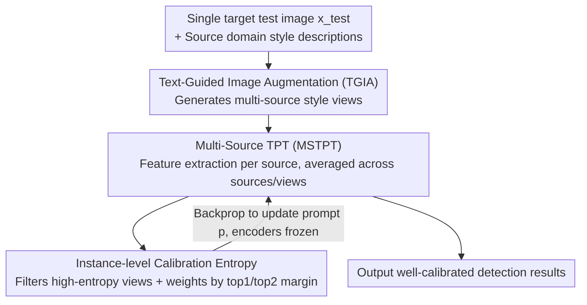

# InsCal: Calibrated Multi-Source Fully Test-Time Prompt Tuning for Object Detection

**Conference**: CVPR 2026  
**Paper**: [CVF Open Access](https://openaccess.thecvf.com/content/CVPR2026/html/Que_InsCal_Calibrated_Multi-Source_Fully_Test-Time_Prompt_Tuning_for_Object_Detection_CVPR_2026_paper.html)  
**Code**: Not released  
**Area**: Object Detection / Test-Time Adaptation  
**Keywords**: Test-time prompt tuning, cross-domain object detection, model calibration, entropy minimization, vision-language models

## TL;DR
This paper extends test-time prompt tuning (TPT) from classification to text-driven object detection and identifies that entropy minimization leads to overconfidence and miscalibration. Consequently, the authors propose InsCal, which aggregates multi-domain knowledge through multi-source prompt tuning, narrows domain gaps via text-guided style augmentation, and suppresses overconfidence using instance-level calibration entropy. On cross-domain detection benchmarks, InsCal reduces the Detection Expected Calibration Error (D-ECE) from approximately 20% to 10% while improving mAP.

## Background & Motivation

**Background**: Text-driven open-vocabulary detectors (e.g., GDINO) treat detection as image-text matching, achieving zero-shot transfer through large-scale vision-language pre-training. To adapt such pre-trained VLMs to new distributions, Test-Time Adaptation (TTA) is a viable path. Specifically, Test-Time Prompt Tuning (TPT) utilizes only a single test image for online prompt optimization by minimizing the prediction entropy of multiple augmented views without requiring target domain labels.

**Limitations of Prior Work**: The authors tested pre-trained GDINO across domains on the Diverse Weather Dataset and found a significant gap between zero-shot transfer and fine-tuning, particularly in harsh environments like NightRainy and DuskRainy where predictions were poor. Directly applying TPT to cross-domain detection introduced new issues: entropy minimization forces the model to assign high confidence to all augmented views—even for incorrect predictions—resulting in "overconfidence." On DayClear→NightClear, TPT exhibited a large gap between confidence and true accuracy (D-ECE as high as 19.5%), indicating severe miscalibration.

**Key Challenge**: The objective of entropy minimization (reducing prediction entropy to increase confidence) is inherently in conflict with the goal of calibration (where confidence should faithfully reflect accuracy). Under domain shift, incorrect predictions are frequent; forcibly reducing entropy makes these errors more confident, further degrading calibration. Moreover, the lack of target domain labels prevents direct supervision for calibration.

**Goal**: Under the constraints of Fully Test-Time Adaptation (FTTA, single-sample online, source-free, no target labels), this work aims to simultaneously address three issues for text-driven detectors: single knowledge source, large source-target domain gaps, and overconfidence from entropy minimization.

**Key Insight**: The authors observe that existing TPT methods (e.g., UPT) utilize only a single source domain and model, which fails to cover diverse unknown target domains. Overconfidence essentially stems from the "undifferentiated boosting of the highest class probability." If the weight can be dynamically adjusted based on the confidence structure of each instance, "true confidence" and "false confidence" can be treated differently.

**Core Idea**: The method expands TPT into a multi-source framework (aggregating knowledge from multiple source models) combined with Text-Guided Image Augmentation (pulling target images toward source styles without reference images) and Instance-level Calibration Entropy (weighting the entropy of each view by the difference between the highest and second-highest logits). These three components work together to suppress overconfidence and reduce domain gaps.

## Method

### Overall Architecture
Given a set of source models $\{f^s_\theta\}_{s=1}^S$ (different image encoders obtained by fine-tuning GDINO on various source domains, sharing a text encoder) and style descriptions for each source domain. For each incoming target test image $x_{test}$: First, **TGIA** augments the image into multiple source-style views based on the text direction "target style → source style." Then, **MSTPT** uses each source image encoder to extract features from corresponding style views, calculating similarity with learnable prompt text features to obtain prediction probabilities, which are averaged across all sources and views. Finally, **Instance-level Calibration Entropy** filters high-entropy views and weights each view by its confidence structure to derive the InsCal entropy loss. Backpropagation updates only the prompt, while encoders remain frozen.

### Key Designs

**1. Text-Guided Image Augmentation (TGIA): Aligning target to source styles via text without source images**

FTTA forbids access to source domain images, making traditional reference-based style transfer inapplicable. TGIA utilizes style text: given target style text $tgt_{sty}$ and source style text $src_{sty}$, the embedding $z=\text{ENC}_I(x^{crop}_{test})$ of random crops is used to optimize a directional contrastive loss: $\varepsilon^*=\min_\theta \sum_z (1-\frac{|\Delta I_z|}{|\Delta T|}\cdot\frac{\Delta I_z\cdot\Delta T}{|\Delta I_z||\Delta T|}) + \rho\|A_\theta(z)-z\|_2^2$. Here, $\Delta I_z=\text{ENC}_I(A_\theta(z))-\text{ENC}_I(z)$ is the image embedding change direction after augmentation, and $\Delta T=\text{ENC}_T(tgt_{sty})-\text{ENC}_T(src_{sty})$ is the style transformation direction in text. The first term aligns the image change direction with the text style direction (using the magnitude ratio $\frac{|\Delta I_z|}{|\Delta T|}$ to match transformation intensity), while the second term (L2 regularization) keeps the content close to the original image. This satisfies FTTA requirements as it only requires high-level source style descriptions.

**2. Multi-Source Test-Time Prompt Tuning (MSTPT): Aggregating knowledge to cover diverse target domains**

Single-source methods like UPT are fragile against unknown target domains. MSTPT fine-tunes GDINO to obtain $S$ source image encoders $\{\text{ENC}^s_I\}$ (sharing a text encoder as semantics are domain-agnostic). TGIA generates $N$ augmented views for each source style. Corresponding source encoders extract features for cosine similarity calculation: $\text{SIM}_i=\cos(\text{ENC}^s_I(A^s_j(x_{test})), \text{ENC}_T(p_i))$. These are passed through a temperature softmax. The prompt $p\in\mathbb{R}^{L\times D}$ is optimized in the text embedding space to minimize the entropy of the **averaged prediction distribution**: $\tilde p_p(y_i|x_{test})=\frac{1}{SN}\sum_s\sum_j p_p(y_i|A^s_j(x_{test}))$. An indicator function $\mathbb{1}[H(p_i)\le\tau]$ filters high-entropy (unreliable) views to suppress noise.

**3. Instance-level Calibration Entropy: Dynamic weighting via top1/top2 margin to suppress overconfidence**

Direct minimization of average entropy pushes all augmentations toward high confidence, causing overconfidence. This design rewrites entropy with a calibration factor: $\tilde H[\tilde p_p]=-(1+(p_{1st}-p_{2nd})^\phi)\,p_i\log p_i$, where $p_{1st}$ and $p_{2nd}$ are the highest and second-highest class probabilities for that view. The factor $1+(p_{1st}-p_{2nd})^\phi$ adaptively adjusts based on the instance's confidence structure: when $p_{1st}\gg p_{2nd}$ (high margin, true confidence), the factor increases to amplify the reliable prediction; when $p_{1st} \approx p_{2nd}$ (uncertainty, false confidence), the factor decreases to down-weight the prediction. This avoids treating ambiguous predictions as confident samples. The hyperparameter $\phi$ controls sensitivity to the margin.

### Loss & Training
The final optimization objective is the calibrated multi-source TPT entropy: $p^*=\min_p \frac{1}{SN}\sum_i\sum_s\sum_j \tilde H[\tilde p_p(y_i|x_{test})]$. Adaptation occurs in FTTA mode: online prompt optimization for a single test image with frozen encoders. Evaluation uses mAP@0.5 and Detection Expected Calibration Error (D-ECE).

> **D-ECE (Detection Expected Calibration Error)**: Confidence and box property spaces are partitioned into $M$ bins. It is calculated as the weighted sum of the difference between "average precision prec(m)" and "average confidence conf(m)" in each bin: $\text{D-ECE}=\sum_m \frac{|I(m)|}{|D|}|prec(m)-conf(m)|$. Lower values indicate that confidence more faithfully reflects accuracy.

## Key Experimental Results

### Main Results
Benchmarks: Diverse Weather Dataset (DWD, 5 domains, 7 classes) and Art Image (Clipart1k / Comic2k / Watercolor2k). Metrics: mAP@0.5 and D-ECE. For Art Image, two domains serve as sources for the third target domain:

| Domain | Metric | InsCal | FTTA Baseline (GDINO) | Best UDA (CODE) | Description |
|------|------|------|------|------|------|
| Comic | mAP / D-ECE | See Text⚠️ | 25.9 / 17.2 | 33.8 / 17.5 | InsCal outperforms UDA which has source access |
| Clipart | mAP / D-ECE | See Text⚠️ | 30.5 / 16.9 | 39.4 / 17.1 | |
| Watercolor | mAP / D-ECE | See Text⚠️ | 52.8 / 17.0 | 55.8 / 17.3 | |

> ⚠️ Precise values for InsCal on Art Image were partially obscured in the OCR; the paper explicitly states InsCal exceeds UDA methods and significantly reduces D-ECE. Refer to Table 1 in the original paper.

Core findings on DWD (mAP@0.5 / D-ECE):
- **D-ECE**: InsCal achieved the lowest error across all categories and sub-domains, dropping from ~20% to ~10%.
- **mAP**: Led in harsh domains (Dusk Rainy / Night Rainy / Night Clear). In Day Foggy, it was only slightly inferior to UDA methods.

### Ablation Study
Incremental addition of components on DWD:

| Configuration | Key Contribution | Effect |
|------|---------|------|
| EM (Pure Entropy Min.) | Baseline | Nearly zero transferability to highly distinct target domains |
| + TPT (Augmentations + Filter) | View consistency | Gain of ~**1.6** mAP |
| + MS (Multi-Source Models) | Cross-domain aggregation | Further improvement over TPT |
| + TGIA (Text Style Aug.) | Narrows domain gap | Continued improvement |
| + Calibration Loss (Full InsCal) | Suppresses overconfidence | Highest mAP and drastic D-ECE reduction |

### Key Findings
- **Simultaneous Improvement**: The instance-level calibration entropy reduced D-ECE while improving mAP, showing that suppressing "false confidence" also benefits reliable prediction outputs.
- **Multi-Source is Crucial for Harsh Domains**: Single-source TPT failed in extreme domains like NightRainy; multi-source aggregation recovered performance significantly.
- **Open-Vocabulary Scalability**: In the OVOD setup for DWD Day Foggy, InsCal achieved the highest mAP for the new category "Traffic Light" while maintaining the lowest D-ECE.

## Highlights & Insights
- **Optimizable Overconfidence**: Using the top1-top2 margin as a calibration factor explicitly encodes "model certainty" into the loss, which is more suited for online FTTA than offline methods like Temperature Scaling.
- **Source-Free Style Transfer via Text Directions**: Aligning image embedding changes with CLIP-space text directions bypasses FTTA constraints. This strategy is transferable to other source-free alignment tasks.
- **Introduction of Calibration to Test-Time Detection**: The authors identify that domain shift plus the lack of labels makes detection calibration a significant challenge, effectively expanding ECE into D-ECE for loss design.

## Limitations & Future Work
- Requires $S$ pre-trained source models; preparation cost is high, and performance depends on source quality/quantity.
- High online inference overhead due to $S \times N$ forward passes and prompt optimization per test image.
- TGIA relies on "high-level style text," which may be inaccurate for composite styles (e.g., mixed weather).
- Future work: Automatic style estimation from test streams or lightweight source knowledge distillation to reduce overhead.

## Related Work & Insights
- **vs. TPT / DiffTPT / DART**: While they use entropy minimization for single-source FTTA, they ignore overconfidence. InsCal explicitly fixes miscalibration via its calibration loss.
- **vs. UPT**: UPT uses a mean-teacher for zero-shot prompt learning but struggles with diverse target domains as a single-source model.
- **vs. Detection TTA (STFAR / CTAOD)**: These focus on self-training/pseudo-labels for standard detectors, whereas InsCal targets text-driven VLMs via prompt tuning and calibration.

## Rating
- Novelty: ⭐⭐⭐⭐⭐ 
- Experimental Thoroughness: ⭐⭐⭐⭐ 
- Writing Quality: ⭐⭐⭐⭐ 
- Value: ⭐⭐⭐⭐

<!-- RELATED:START -->

## Related Papers

- [\[CVPR 2026\] CD-Buffer: Complementary Dual-Buffer Framework for Test-Time Adaptation in Adverse Weather Object Detection](cd-buffer_complementary_dual-buffer_framework_for_test-time_adaptation_in_advers.md)
- [\[CVPR 2026\] Parameterized Prompt for Incremental Object Detection](parameterized_prompt_for_incremental_object_detection.md)
- [\[CVPR 2026\] Foundation Model Priors Enhance Object Focus in Feature Space for Source-Free Object Detection](foundation_model_priors_enhance_object_focus_in_feature_space_for_source-free_ob.md)
- [\[CVPR 2026\] Bidirectional Multimodal Prompt Learning with Scale-Aware Training for Few-Shot Multi-Class Anomaly Detection](bidirectional_multimodal_prompt_learning_with_scale-aware_training_for_few-shot_.md)
- [\[CVPR 2025\] Test-Time Backdoor Detection for Object Detection Models](../../CVPR2025/object_detection/test-time_backdoor_detection_for_object_detection_models.md)

<!-- RELATED:END -->
