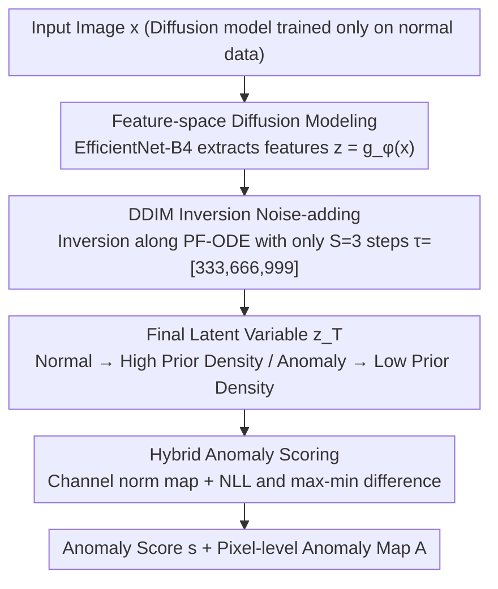

# InvAD: Inversion-based Reconstruction-Free Anomaly Detection with Diffusion Models

**Conference**: CVPR 2026  
**arXiv**: [2504.05662](https://arxiv.org/abs/2504.05662)  
**Code**: [Project Page](https://invad-project.com)  
**Area**: Object Detection
**Keywords**: Anomaly detection, diffusion models, DDIM inversion, reconstruction-free paradigm, industrial/medical defect detection

## TL;DR

Ours proposes InvAD, which shifts diffusion model anomaly detection from the "RGB space denoising reconstruction" paradigm to a "latent space noise-adding inversion" paradigm. By directly inferring the final latent variables through DDIM inversion and measuring deviations under the prior distribution to detect anomalies, it reaches SOTA performance with only 3 inversion steps while increasing inference speed by approximately 2x.

## Background & Motivation

While diffusion-model-based anomaly detection (AD) methods have been successful, they suffer from a fundamental efficiency-precision trade-off: (1) **Noise intensity sensitivity**—excessive noise destroys normal regions and increases false positives, while insufficient noise allows anomalies to be perfectly reconstructed, leading to leakage; (2) **Computationally expensive multi-step denoising**—satisfactory reconstruction requires iterative denoising, with most methods achieving only approximately 1 FPS (e.g., DiAD at 0.1 FPS, GLAD at 0.2 FPS).

Key Insight: Since the diffusion model only learns the normal data distribution, detection does not necessarily require reconstruction. Inversion can be utilized to map images directly to the latent space; normal images map to high-density regions of the prior distribution, whereas anomalous images map to low-density regions. This completely bypasses the reconstruction process and naturally eliminates the need for noise intensity hyperparameter tuning.

## Method

### Overall Architecture

This paper addresses an unavoidable contradiction in diffusion-based anomaly detection: relying on "denoising reconstruction" to locate anomalies requires both meticulous noise intensity tuning and numerous denoising steps, making it slow and difficult to calibrate. InvAD changes the direction—since the diffusion model only learns the distribution of normal data, it foregoes reconstruction and instead "inverts with noise" directly into the latent space to observe where it falls within the prior distribution. Specifically, the input image is first extracted as features $\mathbf{z} = g_\phi(\mathbf{x})$ (**Feature-space diffusion modeling**), then inverted for only 3 steps along a deterministic trajectory via DDIM to obtain the final latent variable $\mathbf{z}_T$ (**DDIM inversion noise-adding**). Normal images are pushed toward high-density regions of the prior distribution, while anomalies fall into low-density regions. Consequently, the anomaly score is calculated based on the deviation of $\mathbf{z}_T$ from the typical distribution (**Hybrid anomaly scoring**). The entire pipeline contains no decoder and performs no reconstruction.

### Key Designs

**1. Feature-space Diffusion Modeling: Diffusion on backbone features rather than raw pixels**

Since the final $\mathbf{z}_T$ obtained through inversion follows a standard Gaussian prior rather than the data distribution, one must first choose the "space in which to perform diffusion." Operating directly in pixel space is susceptible to low-level noise and illumination interference, and high resolution leads to slow inference. InvAD uses features $\mathbf{z} = g_\phi(\mathbf{x}) \in \mathbb{R}^{C \times h \times w}$ extracted by a pre-trained EfficientNet-B4 as the input space for the diffusion model, utilizing DiT as the diffusion backbone. This approach offers two benefits: backbone features are naturally invariant to low-level changes, making inversion results more stable, and the lower resolution reduces the computational cost per inversion step. Ablation studies show that "pixel space + single step" yields only 44.9 mAD, while switching to feature space immediately jumps to 71.0, indicating that this spatial shift is crucial for stability under minimal steps.

**2. DDIM Inversion Noise-adding: Shifting "detection" from denoising reconstruction to noise inversion**

The pain point of the old paradigm lies in the difficulty of tuning noise intensity (too high destroys normal areas; too low misses anomalies) and the requirement for many iterative reconstruction steps. InvAD moves forward along the PF-ODE trajectory, using Euler approximation to infer the final state $\mathbf{x}_T$ directly from $\mathbf{x}_0$ via the discrete update:

$$\mathbf{x}_{\tau_{i+1}} = \sqrt{\alpha_{\tau_{i+1}}}\, f_\theta(\mathbf{x}_{\tau_i}) + \sqrt{1-\alpha_{\tau_{i+1}}}\, \epsilon_\theta^{(\tau_i)}(\mathbf{x}_{\tau_i})$$

Crucially, very few steps are sufficient—taking $S=3$ with the uniform subset $\tau_3 = [333, 666, 999]$. The reason this remains effective despite coarse Euler approximation is that the determinism of PF-ODE ensures a one-to-one mapping between normal images and the prior distribution. Anomalous pixels are inevitably pushed to low-density areas. Detection only requires identifying "deviation from the typical distribution" rather than precise image restoration, so step counts do not need to be stacked as in reconstruction. This also naturally eliminates the noise intensity hyperparameter.

**3. Hybrid Anomaly Scoring: Measuring deviation using final latent variable norms and max-min differences**

Once the inversion final state $\mathbf{z}_T$ is obtained, the "deviation from the prior" must be translated into a score. The pixel-level anomaly map is derived from the Euclidean norm across the channel dimension $\mathbf{z}_T^{\text{normed}}[i,j] = \|\mathbf{z}_T[:,i,j]\|_2$. Higher norms indicate that the position deviates further from the typical distribution. This is then bilinearly interpolated to the original resolution to produce the anomaly map $A$. For the image-level score, log-likelihood (NLL) is not used directly as it suffers from the known reverse-scoring problem and fails to capture small anomalies. Instead, the difference between the maximum and minimum values on the normalized norm map is used ($s = \max_{i,j}\mathbf{z}_T^{\text{normed}}[i,j] - \min_{i,j}\mathbf{z}_T^{\text{normed}}[i,j]$). The motivation is that anomalies are usually locally sparse while most regions remain normal; the max-min diff highlights local sharp deviations while suppressing global outliers, thereby mitigating reverse-scoring.

### Loss & Training

- Training phase: Standard DDPM $\epsilon$-prediction loss, trained only on normal data.
- AdamW optimizer, 300 epochs, $T=1000$, linear noise schedule.
- Inference phase: $S=3$ step inversion, uniform subset $\tau_3 = [333, 666, 999]$.
- Plug-and-play design: Only the inference phase is modified, allowing it to directly replace the inference process of existing diffusion AD methods.

## Key Experimental Results

### Main Results

| Dataset | Metric | Ours (InvAD) | OmiAD (ICML'25) | DiAD (AAAI'24) | FPS |
|--------|------|-----------|-----------------|----------------|-----|
| MVTecAD | I-AUROC | **99.0** | 98.8 | 97.2 | **88.1** vs 39.4 vs 0.1 |
| VisA | I-AUROC | **96.9** | 95.3 | 86.8 | **74.1** vs 35.3 |
| MPDD | I-AUROC | **96.5** | 93.7 | 74.6 | **120** vs 49.8 |
| BMAD (Medical) | mAD | **87.2** | - | - | **88** vs 20 |

### Ablation Study

| Configuration | MVTecAD mAD | Description |
|------|------------|------|
| FDM only (no inversion) | 57.3 | Inversion is the core component |
| Single-step inversion (pixel space) | 44.9 | Pixel space diffusion + single step is insufficient |
| FDM + single-step inversion | 71.0 | Feature space + single step |
| **FDM + multi-step inversion (Full)** | **83.7** | Optimal configuration |

| Inversion Steps $S$ | Reconstruction Method (Optimal $r$) | Inversion Method (Ours) |
|-------------|-------------------|----------------|
| 3 | 64.9 | **99.0** |
| 5 | 75.0 | **98.9** |
| 10 | 97.9 | 98.4 |
| 50 | 98.0 | 96.0 |
| 1000 | 98.2 | 95.4 |

### Key Findings

- The inversion method significantly outperforms reconstruction methods at very low step counts ($S=3,5$); reconstruction methods requires $S \geq 50$ to achieve similar performance.
- The inversion method is tuning-free regarding perturbation timesteps, whereas reconstruction methods are highly sensitive to $r$ and $S$.
- Plug-and-play: DiAD + InvAD gains +1.0 I-AUROC and +88 FPS; MDM + InvAD gains +6.3 I-AUROC and +60.8 FPS.
- The NLL + Diff hybrid score is robust to the number of steps $S$, whereas using NLL or Diff alone results in fluctuations.
- SOTA performance (mAD=87.2) was achieved across 6 datasets in the BMAD medical benchmark, proving cross-domain generalization.

## Highlights & Insights

- **Paradigm Innovation**: The shift from "denoising detection" to "noise-adding detection" is the core contribution, being both concise and profound.
- Inversion naturally eliminates the computational bottleneck of noise intensity tuning and multi-step reconstruction.
- The reason $S=3$ reaches SOTA is that precise reconstruction is unnecessary; one only needs to distinguish the distribution typicality of normal vs. anomalous data.
- The plug-and-play design allows it to serve as a general inference accelerator for existing diffusion AD methods.
- Feature-space diffusion modeling is a critical design choice for improving both efficiency and effectiveness.

## Limitations & Future Work

- It still requires more than one function evaluation (NFE=3), which could be compressed to 1 step via diffusion distillation.
- Pixel-level localization performance (AP, F1_max) is slightly lower than some reconstruction methods, as inversion methods have a natural disadvantage in precise boundary localization.
- The design of the min-max difference in the scoring scheme is somewhat empirical and lacks theoretical support.
- The DiT-giant parameter count is large (1223M); while MLP can reach similar detection accuracy, its localization is worse.
- Optimization of task-specific inversion mechanisms remains unexplored.

## Related Work & Insights

- The deterministic sampling and PF-ODE of DDIM (Song et al. 2020) form the theoretical foundation for the inversion.
- The idea of using score function norms to measure OOD typicality (Heng et al. 2024) inspired the scoring design.
- OmiAD (Feng et al. 2025) achieves 1-step diffusion via adversarial distillation but involves high training complexity.
- Compared to non-diffusion methods like EfficientAD (Batzner et al. 2023), diffusion methods still maintain an advantage in precision.

## Rating

- Novelty: ⭐⭐⭐⭐⭐ The "noise-adding detection" paradigm is a conceptual innovation that is elegant and effective.
- Experimental Thoroughness: ⭐⭐⭐⭐⭐ Covers 4 industrial and 6 medical datasets with comprehensive ablations (components, backbones, scoring, steps, generalization).
- Writing Quality: ⭐⭐⭐⭐ Clear problem analysis, intuitive paradigm comparison diagrams, and well-designed tables.
- Value: ⭐⭐⭐⭐⭐ Highly practical; plug-and-play acceleration for existing methods holds significant meaning for industrial and medical AD.

<!-- RELATED:START -->

## Related Papers

- [\[CVPR 2026\] Geometry-Aligned and Anomaly-Aware Reconstruction for 3D Anomaly Detection](geometry-aligned_and_anomaly-aware_reconstruction_for_3d_anomaly_detection.md)
- [\[ICCV 2025\] DISTIL: Data-Free Inversion of Suspicious Trojan Inputs via Latent Diffusion](../../ICCV2025/object_detection/distil_data-free_inversion_of_suspicious_trojan_inputs_via_latent_diffusion.md)
- [\[AAAI 2026\] CountSteer: Steering Attention for Object Counting in Diffusion Models](../../AAAI2026/object_detection/countsteer_steering_attention_for_object_counting_in_diffusion_models.md)
- [\[CVPR 2026\] SubspaceAD: Training-Free Few-Shot Anomaly Detection via Subspace Modeling](subspacead_training-free_few-shot_anomaly_detection_via_subspace_modeling.md)
- [\[CVPR 2026\] VisualAD: Language-Free Zero-Shot Anomaly Detection via Vision Transformer](visualad_language-free_zero-shot_anomaly_detection_via_vision_transformer.md)

<!-- RELATED:END -->
