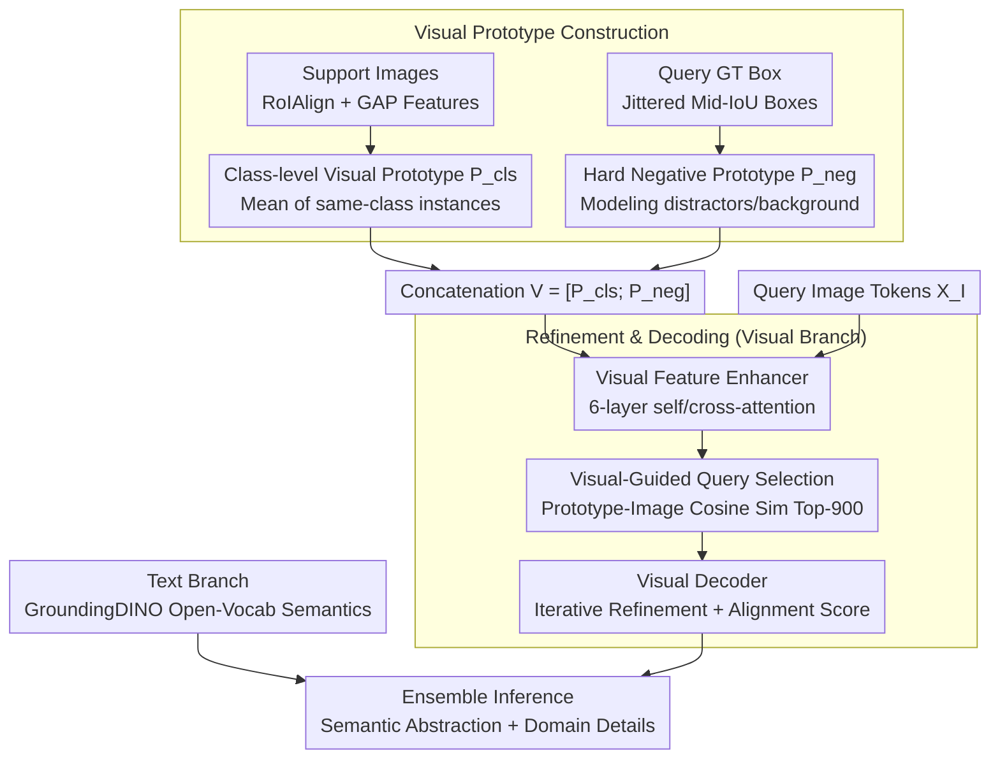

# Learning Multi-Modal Prototypes for Cross-Domain Few-Shot Object Detection

**Conference**: CVPR 2026 Findings  
**arXiv**: [2602.18811](https://arxiv.org/abs/2602.18811)  
**Code**: None  
**Area**: Object Detection  
**Keywords**: Cross-Domain Few-Shot Object Detection (CD-FSOD), Visual Prototypes, Multi-Modal, GroundingDINO, Hard Negatives

## TL;DR
The authors propose LMP, a dual-branch framework that introduces a visual prototype branch (including positive class prototypes and hard negative prototypes) into GroundingDINO. By jointly training this with the text branch and integrating them during inference, the method achieves SOTA performance in cross-domain few-shot object detection.

## Background & Motivation
CD-FSOD requires detecting new categories in an unseen domain with only a few annotations. Although VLM-based open-vocabulary detectors like GroundingDINO possess strong transferability, they rely entirely on text prompts, leading to two systemic failure modes:

**Semantic-Appearance Mismatch**: Text prototypes capture category semantics but overlook domain-specific cues such as style, texture, and lighting, resulting in weak localization.

**Confusable Context**: In few-shot scenarios, visually similar backgrounds or near-object regions often dominate training, producing numerous false positives.

Simply using support images as visual prompts is insufficient—unstructured features mix category evidence with incidental context and fail to explicitly model hard negatives. Therefore, structured visual prototypes are necessary to provide domain-adaptive information.

## Method

### Overall Architecture

LMP aims to address the issue where open-vocabulary detectors like GroundingDINO, relying solely on text prompts, fail to capture target domain styles and are easily misled by visually similar backgrounds. The core idea is to attach a **visual guidance branch** alongside the text branch to structure visual evidence from support images into "prototypes." The workflow is as follows: the text branch maintains open-vocabulary semantics; the visual branch constructs positive class prototypes and hard negative prototypes from support images; after refinement via a feature enhancer, query selection is performed using prototype similarity, and boxes are output through a visual decoder. Finally, predictions from both branches are integrated to complement abstract semantics with domain-adaptive details.

### Key Designs

**1. Class-level Visual Prototypes: Domain-specific visual anchors for each new category**

Text prompts are often insufficient for coarse labels like "Coleoptera." In an $C$-way $K$-shot setting, LMP utilizes RoIAlign + GAP to extract features from each annotated instance in support images, averaging them to obtain class-level prototypes $\mathbf{p}_c \in \mathbb{R}^{D_I}$, aggregated into $\mathbf{P}_{\mathrm{cls}} \in \mathbb{R}^{C \times D_I}$. These prototypes encode exactly what each category looks like in the target domain, recovering missing visual cues.

**2. Hard Negative Prototypes: Explicitly modeling common false positive sources**

Most false positives in CD-FSOD come from domain-specific distractors. LMP samples $N$ jittered boxes around each GT box $b_j$ in query images, retaining only those with $\mathrm{IoU} \in [0.1, 0.5]$ to extract negative prototypes $\mathbf{p}_{\mathrm{neg},j}^{(n)}$. These prototypes represent regions that "look like the target but are not." Concatenating positive and negative prototypes into $\mathbf{V} = [\mathbf{P}_{\mathrm{cls}}; \mathbf{P}_{\mathrm{neg}}] \in \mathbb{R}^{N_V \times D_I}$ exposes the model to hard cases near the decision boundary during training, suppressing false detections.

**3. Prototype Refinement and Visual Decoding: Aligning prototypes with image features**

The visual feature enhancer uses 6 layers of self-attention and cross-attention to allow bidirectional interaction between image tokens $\mathbf{X}_I$ and prototypes $\mathbf{V}$, outputting refined items $\mathbf{V}'$ and $\mathbf{X}'_I$. Visual-guided query selection identifies Top-900 tokens based on cosine similarity to initialize queries. The visual decoder mirrors the text branch's cross-modal decoder, iteratively refining boxes and category logits based on prototype alignment scores. This symmetric structure facilitates natural fusion during ensemble inference.

### Loss & Training
Both branches utilize Focal classification loss + $L_1$ bounding box regression loss + GIoU loss:

$$\mathcal{L}_{\text{total}} = \mathcal{L}_{\text{text}} + \alpha \mathcal{L}_{\text{visual}}$$

where $\alpha = 1.0$. A two-stage training strategy is adopted: stage one trains the visual branch only, followed by joint training in stage two. Hungarian matching is used for one-to-one supervision. Hard negative prototypes are integrated naturally through the attention mechanism without requiring additional contrastive losses.

## Key Experimental Results

### Main Results

| Dataset | Shot | LMP (Ours) | Domain-RAG (Prev. SOTA) | Gain |
|--------|------|-----------|----------------------|------|
| Average (6 domains) | 1-shot | **34.3** | 33.6 | +0.7 |
| Average (6 domains) | 5-shot | **44.0** | 42.7 | +1.3 |
| Average (6 domains) | 10-shot | **46.6** | 45.4 | +1.2 |
| ArTaxOr | 1-shot | **58.5** | 57.2 | +1.3 |
| ArTaxOr | 5-shot | **75.0** | 70.0 | +5.0 |

Compared to the GroundingDINO baseline, LMP improves performance by 8.0, 3.6, and 2.1 mAP in 1, 5, and 10-shot settings, respectively.

### Ablation Study

| Configuration | Avg mAP (5-shot) | Description |
|------|-------------------|------|
| Text Prototypes only (GD baseline) | 40.4 | Baseline |
| + Class-level Visual Prototypes | 42.8 | Improvement across all domains |
| + Hard Negative Prototypes | **44.0** | Optimal performance across all domains |

Hyperparameters: $N=3$ hard negative prototypes is optimal; $\alpha=1.0$ performs best across all shot settings.

### Key Findings
- The largest gains are observed in datasets with coarse-grained labels (e.g., ArTaxOr, where labels like "Coleoptera" provide minimal text-based visual guidance).
- Improvement is most significant at 1-shot (+8.0 mAP), suggesting that multi-modal prototypes are highly effective in extreme data-scarce scenarios.
- t-SNE visualizations show that hard negative samples cluster at the category decision boundaries, validating the effectiveness of negative prototypes.
- Qualitative analysis: Reduced background false positives in Clipart, more accurate texture discrimination in NEU-DET, and improved recall for small fish in DeepFish.

## Highlights & Insights
1. **Dual-Branch Design**: The text branch maintains open-vocabulary capabilities while the visual branch provides domain adaptation; they act as complements rather than substitutes.
2. **Hard Negative Prototypes**: A clear intuition using GT box jittering to explicitly model the most common false positive sources (background interference and partial overlaps).
3. **Weight Initialization**: The visual branch is initialized with weights from the text branch, leveraging existing knowledge to accelerate convergence and ensure stability.
4. **Simplification**: No extra contrastive loss is needed, as hard negatives are integrated via the attention mechanism.
5. **Efficiency**: Training is feasible on a single RTX 3090, making the approach reproducible with reasonable resources.

## Limitations & Future Work
- The dual-branch inference doubles computational overhead; future work could explore distilling the framework into a single branch.
- Sensitivity to atypical support samples: abnormal support images may degrade prototype quality.
- Hard negative prototypes only consider regions near GT boxes; this could be extended to explore ring/context areas and proposal-level distractors.
- Explorations into adaptive prototype construction (dynamically selecting weights or counts) rather than fixed strategies.
- Current ensemble weights are fixed at 1:1; learnable adaptive fusion could be investigated.

## Related Work & Insights
- Unlike MQ-Det (using cross-attention in the text encoder) or VisTex-OVLM (projecting visual examples as textual tokens), LMP maintains a distinct visual branch for structural clarity.
- CD-FSOD domain: LMP follows benchmarks like CD-ViTO and methods like Domain-RAG, being the first to introduce a dual-branch multi-modal prototype scheme.
- Hard negative mining insights could be generalized to other few-shot tasks such as segmentation or Re-ID.
- The dual-branch integration strategy inspires injecting other modalities (depth, thermal) into the detection pipeline.

## Rating
- Novelty: ⭐⭐⭐⭐ Innovative dual-branch + hard negative design.
- Experimental Thoroughness: ⭐⭐⭐⭐ 6 domains × 3 shot settings with comprehensive ablations.
- Writing Quality: ⭐⭐⭐⭐ Clear logic and well-illustrated diagrams.
- Value: ⭐⭐⭐⭐ Significant practical contribution to the CD-FSOD field.

<!-- END -->

<!-- RELATED:START -->

## Related Papers

- [\[CVPR 2026\] Remedying Target-Domain Astigmatism for Cross-Domain Few-Shot Object Detection](remedying_target-domain_astigmatism_for_cross-domain_few-shot_object_detection.md)
- [\[CVPR 2026\] A Closer Look at Cross-Domain Few-Shot Object Detection: Fine-Tuning Matters and Parallel Decoder Helps](a_closer_look_at_cross-domain_few-shot_object_detection_fine-tuning_matters_and_.md)
- [\[CVPR 2026\] DyFCLT: Dynamic Frequency-Decoupled Cross-Modal Learning Transformer for Multimodal Tiny Object Detection](dyfclt_dynamic_frequency-decoupled_cross-modal_learning_transformer_for_multimod.md)
- [\[CVPR 2026\] Bidirectional Multimodal Prompt Learning with Scale-Aware Training for Few-Shot Multi-Class Anomaly Detection](bidirectional_multimodal_prompt_learning_with_scale-aware_training_for_few-shot_.md)
- [\[CVPR 2026\] Evaluating Few-Shot Pill Recognition Under Visual Domain Shift](evaluating_few-shot_pill_recognition_under_visual_domain_shift.md)

<!-- RELATED:END -->
