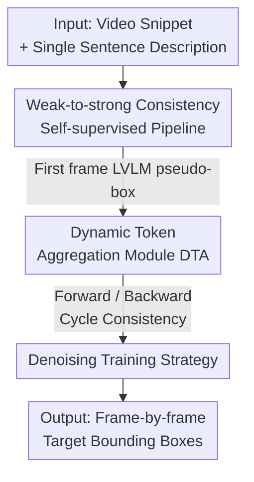

# Learning to Track Instance from Single Nature Language Description

**Conference**: CVPR 2026  
**arXiv**: [2605.07064](https://arxiv.org/abs/2605.07064)  
**Code**: None  
**Area**: Vision-Language Tracking / Self-Supervised Learning / Multimodal Fusion  
**Keywords**: Self-supervised VL tracking, dynamic token aggregation, pseudo-labels, weak-to-strong consistency, language guidance

## TL;DR
SVLTrack proposes a **completely box-annotation-free** self-supervised vision-language tracking framework. It utilizes a Large Vision-Language Model (LVLM) to generate a pseudo-box for the first frame of a video, performs forward/backward tracking self-supervision under weak-to-strong consistency, and designs a Dynamic Token Aggregation (DTA) module to tightly align language tokens with a few key visual tokens. Ultimately, it tracks arbitrary targets based solely on a single natural language description, surpassing existing self-supervised methods across four VL tracking benchmarks.

## Background & Motivation
**Background**: Vision-Language (VL) tracking aims to specify and continuously track targets using a natural language description (rather than tedious frame-by-frame boxes), offering a more intuitive and cost-effective mode of human-computer interaction. Current mainstream methods like JointNLT, UVLTrack, and DUTrack follow a fully-supervised path—fine-tuning multimodal fusion modules on datasets containing millions of box annotations such as LaSOT, TNL2K, and OTB99.

**Limitations of Prior Work**: ① Fully-supervised methods rely heavily on tens of thousands of boundary box annotations, which are time-consuming and labor-intensive to produce (JointNLT uses 3.52 million boxes from LaSOT and 1.24 million from TNL2K). ② They fuse **all** visual tokens and language tokens equally into multi-head attention, resulting in significant redundant computation and hindering precise alignment between visual and linguistic representations—since most tokens in a frame are background noise irrelevant to the language description.

**Key Challenge**: To eliminate reliance on box annotations, there is no supervision signal to train the tracker; conversely, fusion that treats all tokens equally allows the precise semantic signal of language to be diluted by a sea of irrelevant visual tokens. The core problem is "how to precisely align a sentence with the actual target tokens in a frame without prior box annotations."

**Goal**: To advance VL tracking from fully-supervised to **self-supervised**—discarding all box annotations, training with only implicit single-sentence language descriptions, and quantifying the semantic guidance contribution of natural language to tracking.

**Key Insight**: The authors observe that LVLMs (e.g., APE, LISA) possess rich world knowledge and can localize instances based on language. Thus, an LVLM is used to generate a pseudo-box for the **first frame only** as a starting point (as language descriptions typically align with the semantics of the first frame and may mismatch over time); temporal cycle consistency is then leveraged to turn unlabeled videos into a source of supervision.

**Core Idea**: Replace "manual box annotation + equal multimodal fusion" with "LVLM pseudo-labels + weak-to-strong consistency self-supervision + unequal dynamic token aggregation," enabling the tracker to autonomously learn language-guided instance tracking from unlabeled videos.

## Method

### Overall Architecture
SVLTrack addresses how to train a tracker capable of tracking arbitrary targets when provided only with a sentence and no box annotations. The overall pipeline consists of three steps: first, an LVLM generates a pseudo-box $\mathcal{B}_0 = LVLM(I_0, Q_{\text{text}})$ only for the first frame $I_0$ as a starting point. Second, each unlabeled frame is processed into two versions: a weak augmentation $A^w$ (e.g., center jitter) and a strong augmentation $A^s$ (e.g., color jitter), which enter a tracking network comprising "template frame + search snippet + language description." The core is a Dynamic Token Aggregation (DTA) module that fuses language with key visual tokens before passing them to the prediction head for target localization. Finally, a constraint is applied such that "the prediction of the strong augmentation frame should match the weak augmentation frame as much as possible," with a denoising strategy used to exclude noisy samples introduced by pseudo-labels.

The network contains four components: a visual encoder $\mathcal{E}_v$ (ViT-Base + DropMAE pre-training), a language encoder $\mathcal{E}_l$ (BERT), a dynamic token aggregation module $\mathcal{M}$, and a prediction head $\mathcal{H}$. The forward tracking process is:

$$\mathcal{F}_{vl} = \mathcal{M}(\mathcal{E}_v(\mathcal{V}), \mathcal{E}_l(Q_{\text{text}})), \quad \mathcal{B} = \mathcal{H}(\mathcal{F}_{vl} + \mathcal{E}_v(\mathcal{V}))$$

Backward tracking swaps the roles of the template and search frames and re-runs the network, forming a bidirectional closed loop for temporal cycle consistency. The total loss is $\mathcal{L}_{total} = \mathcal{L}_s + \mathcal{L}_u$, where the supervised loss $\mathcal{L}_s$ is calculated only on the first frame with the pseudo-label, and the unsupervised loss $\mathcal{L}_u$ is calculated on unlabeled video frames.

### Key Designs

**1. Weak-to-strong consistency self-supervision pipeline: Turning unlabeled video into supervision**

The lack of box annotations prevents training in a fully-supervised manner, which is the fundamental obstacle to self-supervised tracking. SVLTrack first uses an LVLM to generate a pseudo-box $\mathcal{B}_0$ for only the first frame $I_0$ (trusting only the first frame because language descriptions gradually mismatch as the target's appearance or motion changes), treating the first frame as a (weakly) labeled template. For each unlabeled frame, two types of augmentations are applied: weak augmentation $A^w$ (center jitter, minor geometric perturbation) and strong augmentation $A^s$ (color jitter, major appearance perturbation). The training goal is to make the **prediction of the strong augmentation frame approximate the prediction of the weak augmentation frame**. The weak result, being more reliable, acts as a temporary "teacher," while the strong result acts as the "student," thereby extracting appearance and motion cues from the unlabeled video. Combined with temporal cycle consistency, forward tracking (template → search) and backward tracking (search → template, roles swapped) form bidirectional constraints, increasing sample diversity and allowing the model to learn richer representations. Ablations show that removing the weak-to-strong framework drops AUC by 0.9%.

**2. Dynamic Token Aggregation (DTA): Treating visual tokens unequally to align language with the true target**

Traditional fusion feeds all visual tokens equally into multi-head self-attention (MHSA). Background tokens constitute the majority but are treated the same as target tokens, which is redundant and dilutes the semantic signal of the language. DTA is inserted between the MHSA and MLP layers, selecting only the most discriminative visual tokens for alignment with language in three steps. **Step 1: Select target tokens**: An anchor token, initialized to zero, learns the target appearance representation. The anchor, language, template, and search tokens are concatenated along the spatial dimension and fed into multi-head attention. The cross-attention $Attn_{az}$ between the anchor and template frame measures the importance of each template token, and a TopK operation selects the target tokens $T_z = TopK(\mathcal{F}_z, Attn_{az})$, with the quantity dynamically adjusted to align with the number of language tokens for modal balance. **Step 2: Aggregate into language tokens**: The selected $T_z$ are merged based on attention scores to retain discriminative visual information, then aggregated into language tokens to obtain fused features $\mathcal{F}_{vl} = Merging(T_z, \mathcal{F}_l)$, establishing a tighter semantic link while reducing computation. **Step 3: Purify search tokens for temporal association**: The fused language tokens act as guidance signals to select potential target tokens $T_s = TopK(\mathcal{F}_s, Attn_{ls})$ from the search frame ($Attn_{ls}$ is the cross-attention between language tokens and the search frame), filtering irrelevant background noise and propagating purified target tokens to subsequent frames to strengthen temporal cues. These steps allow the model to learn instance-level tracking under weak target cues, serving as the main contributor to performance—removing DTA drops AUC by 1.1%.

**3. Denoising Training Strategy: Removing dirty samples introduced by LVLM pseudo-labels**

Pseudo-boxes generated by LVLMs are inevitably coarse or inaccurate; training on them directly can make self-supervised learning unstable. The authors use the classification score map $\mathcal{P}_c$ and regression score map $\mathcal{P}_r$ produced during training to calculate the Euclidean distance $\mathcal{D}(\mathcal{P}_c, \mathcal{G}) = \|\mathcal{P}_c - \mathcal{G}\|_2^2$ between the **strong augmentation classification map** and a **pseudo-Gaussian map $\mathcal{G}$** generated from the weak augmentation prediction box. Samples are ranked by distance, and the top-K% (empirically 20%) with the largest distances are judged as noise and excluded from loss calculation. Ablation comparisons show that Euclidean distance characterizes overall sample differences better than cross-entropy (AUC 52.5% vs 47.9%), and removing denoising drops AUC by 0.5%. Remaining normal samples are optimized using a joint Focal classification loss $\mathcal{L}_{cls}$, GIoU loss, and $\mathcal{L}_1$ loss.

### Loss & Training
The per-frame/per-sample loss is $\mathcal{L} = \mathcal{L}_{cls} + \lambda_1 \mathcal{L}_1 + \lambda_2 \mathcal{L}_{GIoU}$ (used for both $\mathcal{L}_s$ and $\mathcal{L}_u$). Training data includes LaSOT + TNL2K + OTB99; optimized with AdamW, backbone learning rate of $2.5\times10^{-5}$, others $2.5\times10^{-4}$, weight decay $10^{-4}$, for 150 epochs (learning rate reduced by 0.1 after 120 epochs). 10,000 image pairs are randomly sampled per epoch. Training used 4×80GB A800 GPUs with a batch size of 16. Visual encoder is ViT-Base (DropMAE pre-trained), language encoder is BERT; each video snippet contains 3 unlabeled frames + 1 initial frame with a pseudo-label. SVLTrack-384 runs at 56 FPS on an A100.

## Key Experimental Results

### Main Results
Four VL tracking benchmarks (LaSOT / LaSOext / TNL2K / OTB99). SVLTrack-L is the self-supervised VL tracking variant using "language initialization only," and SVLTrack-V is the self-supervised visual tracking variant using "initial box only." AUC denotes Success Rate, P denotes Precision.

| Benchmark | Metric | SVLTrack-L384 (Language Only) | ATTracker (NL+BBox) | Gain |
|-----------|--------|-------------------------------|---------------------|------|
| TNL2K     | AUC    | 43.9                          | 40.6                | +3.3 |
| LaSOT     | AUC    | 53.9                          | 48.9                | +5.0 |
| OTB99     | AUC    | 66.7                          | 55.5                | +11.2|
| LaSOext   | AUC    | 35.2                          | —                   | —    |

> Note: The text states that SVLTrack-L256 improves AUC by 1.9% / 3.6% / 9.9% on TNL2K/LaSOT/OTB99 respectively compared to ATTracker; the table uses L384 variant data, which is slightly higher than L256.

| Benchmark | Metric | SVLTrack-V256 (Box Only, Self-sup) | Diff-Tracker (Unsupervised) | Gain |
|-----------|--------|------------------------------------|-----------------------------|------|
| LaSOT     | AUC    | 65.1                               | 48.6                        | +16.5|
| OTB99     | AUC    | 67.9                               | 66.1                        | +1.8 |

The visual variant SVLTrack-V comprehensively outperforms all unsupervised trackers and significantly narrows the gap with fully-supervised methods on LaSOext (V384 AUC 49.7%, approaching fully-supervised ARTrack's 51.9% and ODTrack's 52.4%).

### Ablation Study
(LaSOT benchmark, SVLTrack full model AUC 52.5%)

| Configuration          | AUC  | PNorm | P    | Description              |
|------------------------|------|-------|------|--------------------------|
| Full model             | 52.5 | 60.0  | 52.3 | Full model               |
| − Weak-to-strong consistency | 51.6 | 59.1  | 51.1 | Drop 0.9%                |
| − DTA                  | 51.4 | 59.0  | 50.8 | Drop 1.1% (Most critical)|
| − Denoising            | 52.0 | 59.7  | 51.4 | Drop 0.5%                |

| Analysis Item       | Configuration      | AUC  | Conclusion                                       |
|---------------------|--------------------|------|--------------------------------------------------|
| Search token count  | 4 / 8 / 16         | 51.9 / 52.5 / 52.1 | 8 is optimal; too many introduce background noise|
| Noise metric        | Cross-entropy / Euclidean | 47.9 / 52.5 | Euclidean distance is more robust                |
| LVLM Selection      | LISA / APE         | 48.4 / 52.5 | APE’s instance-level perception generates better pseudo-boxes |

### Key Findings
- **DTA contributes the most**: Removing it drops AUC by 1.1%, proving that "treating visual tokens unequally and dynamically selecting key tokens for alignment with language" is the core source of improvement.
- **Optimal search token count**: Incrementing from 4 to 8 improves performance by 0.6%, but increasing to 16 causes a decline—excessive tokens introduce noise from non-target areas, undermining stability.
- **Pseudo-label quality is the ceiling**: APE (instance-level perception) generates pseudo-boxes more consistent with language descriptions than LISA (reasoning segmentation), resulting in a 4.1% higher AUC. This indicates the robustness of the cross-modal understanding encoder directly determines the upper bound of self-supervision.
- **20% denoising ratio is best**: The combination of Euclidean distance and a 20% discard ratio provides the most robust self-supervised tracker across different scenarios.

## Highlights & Insights
- **First to push VL tracking to pure self-supervision (language-only)**: Training based only on a single-sentence language description by discarding all box annotations and explicitly quantifying the semantic guidance contribution represents a substantial advancement in task setting.
- **"Trusting only the first frame's pseudo-label" is a simple yet crucial judgment**: The authors recognize that language descriptions gradually mismatch with target appearance/motion over time. By only labeling the first frame with an LVLM and relying on video cycle consistency thereafter, they avoid continuous contamination by erroneous pseudo-labels—making this cleaner than multi-stage training (e.g., ATTracker).
- **The "unequal fusion" logic of anchor tokens + TopK is transferable**: Using a learnable zero-initialized anchor token as an "importance probe" to TopK-select tokens transforms modal alignment from "full and equal" to "concise and refined." This mechanism is valuable for any task requiring precise language-to-visual-part localization (e.g., referring expression segmentation, grounding).
- **Euclidean distance outperforms cross-entropy for noise filtering** (52.5 vs 47.9): In pseudo-label training, the overall difference in score maps is a more robust indicator of dirty samples than point-wise distribution differences.

## Limitations & Future Work
- **Author's acknowledgment**: Pseudo-label generation remains limited by the capabilities of the LVLM; the quality of pseudo-boxes directly affects tracking performance. Improving the quality of target identity information is key to further gains.
- **Gap between self-supervision and full supervision remains**: SVLTrack-L384 achieves only 43.9% AUC on TNL2K, significantly lower than the 64.9% of the fully-supervised DUTrack. Language-only self-supervision drops more notably in long-tail/high-appearance-change scenarios like LaSOext (L384 only 35.2%), indicating that pure language cues are still insufficient in complex scenes.
- **Dependency on external large models**: The pipeline effectively "outsources" the hard task of language understanding and localization to APE/LISA. It is essentially a downstream tracking adaptation under the premise that the LVLM already possesses grounding capabilities. If the target is an open-vocabulary object unfamiliar to the LVLM, the pseudo-box may fail.
- **Future Directions**: Explore multi-frame or online pseudo-label self-correction (rather than trusting only the first frame), use tracking confidence to provide temporal feedback to the LVLM, or introduce lighter grounding models to reduce dependency on heavy LVLMs.

## Related Work & Insights
- **vs JointNLT / UVLTrack / DUTrack (Supervised VL Tracking)**: These methods fine-tune multimodal fusion on millions of box annotations and fuse all tokens equally. This work discards all box annotations for language-only self-supervision and uses DTA to selectively pick key tokens. The advantage is zero box annotation cost; the disadvantage is that absolute accuracy still lags (TNL2K AUC 43.9 vs DUTrack 64.9).
- **vs ATTracker (Semi-supervised VL Tracking)**: ATTracker fine-tunes large models to generate redundant pseudo-labels followed by complex multi-stage training, making it prone to noise. This work only uses first-frame pseudo-boxes + weak-to-strong consistency + denoising, which is simpler and results in higher AUC under self-supervised settings (e.g., +9.9% on OTB99).
- **vs Diff-Tracker / SSTrack (Unsupervised/Self-supervised Visual Tracking)**: These rely on optical flow/diffusion/cycle consistency for visual pseudo-labels without language. This work introduces language as a target reference signal; the visual variant SVLTrack-V still comprehensively outperforms them (LaSOT is +16.5% higher than Diff-Tracker).
- **Insight**: When downstream tasks lack annotations, the paradigm of "using foundation models rich in world knowledge to generate sparse and reliable seed labels (labeling only the most trustworthy first frame) + self-supervision via data consistency constraints + actively removing dirty samples" represents a universal and low-cost alternative.

## Rating
- Novelty: ⭐⭐⭐⭐ Accomplishing self-supervised VL tracking with zero box annotations and only a single sentence is a significant novelty in both task setting and the DTA mechanism.
- Experimental Thoroughness: ⭐⭐⭐⭐ Coverage of four benchmarks + multiple comparisons against supervised/unsupervised methods + five ablation sets (modules/tokens/metrics/LVLMs/denoising ratios).
- Writing Quality: ⭐⭐⭐⭐ Method steps are clear, and motivation is well-derived; limitations regarding pseudo-label quality are honestly addressed.
- Value: ⭐⭐⭐⭐ Significantly reduces the annotation cost for VL tracking. The "pseudo-label + consistency + denoising" paradigm is transferable to other self-supervised tasks.

<!-- RELATED:START -->

## Related Papers

- [\[CVPR 2026\] Mining Instance-Centric Vision-Language Contexts for Human-Object Interaction Detection](mining_instance-centric_vision-language_contexts_for_human-object_interaction_de.md)
- [\[CVPR 2026\] Object-Generalized Re-Identification: A Step Towards Universal Instance Perception](object-generalized_re-identification_a_step_towards_universal_instance_perceptio.md)
- [\[CVPR 2026\] Expert-Teacher-Student Collaborative Learning for Domain Adaptive Object Detection](expert-teacher-student_collaborative_learning_for_domain_adaptive_object_detecti.md)
- [\[CVPR 2026\] LocateAnything3D: Vision-Language 3D Detection with Chain-of-Sight](locateanything3d_vision-language_3d_detection_with_chain-of-sight.md)
- [\[CVPR 2026\] VisualAD: Language-Free Zero-Shot Anomaly Detection via Vision Transformer](visualad_language-free_zero-shot_anomaly_detection_via_vision_transformer.md)

<!-- RELATED:END -->
