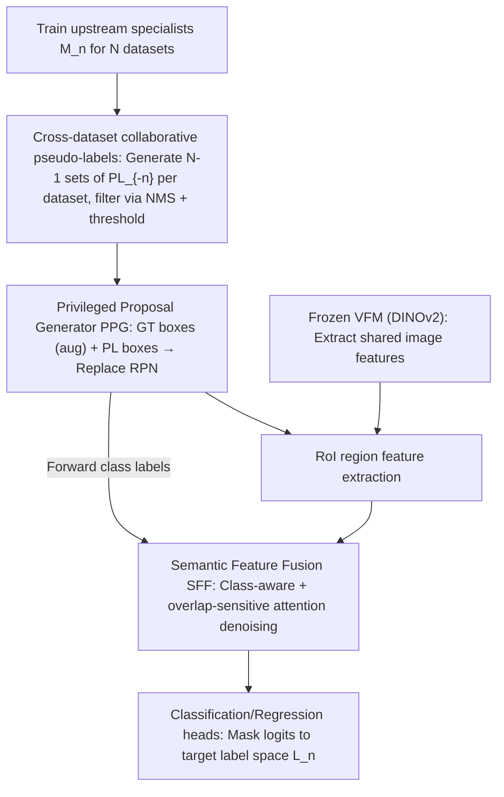

# Mind the Gap: Transferring Labels to Align Object Detection Datasets

**Conference**: CVPR 2026  
**Paper**: [CVF Open Access](https://openaccess.thecvf.com/content/CVPR2026/html/Kennerley_Mind_the_Gap_Transferring_Labels_to_Align_Object_Detection_Datasets_CVPR_2026_paper.html)  
**Code**: TBD  
**Area**: Object Detection / Multi-dataset Training  
**Keywords**: Multi-dataset object detection, label alignment, pseudo-labeling, privileged information, class-aware attention  

## TL;DR
This paper proposes the Label-Aligned Transfer (LAT) framework, which projects annotations from multiple detection datasets with diverse labeling protocols into a fixed target dataset's label space in a **multi-to-one** manner. By utilizing a Privileged Proposal Generator (PPG) (replacing RPN with ground truth and cross-dataset pseudo-labels) and Semantic Feature Fusion (SFF) (denoising via class-aware attention), the method simultaneously resolves inconsistencies in category semantics and bounding box styles, achieving up to a +8.4 AP improvement across multiple benchmarks.

## Background & Motivation

**Background**: Merging multiple detection datasets is a common strategy to enhance generalization and expand category coverage, particularly in domains where annotations are scarce or expensive. Existing approaches follow two paths: model-centric methods rely on vision-language alignment or ontology graphs to construct a shared label space; data-centric methods project source dataset annotations into the target label space.

**Limitations of Prior Work**: **Naive merging** of datasets with different label spaces introduces fourfold inconsistencies: category semantics, annotation granularity, background definitions, and bounding box styles (e.g., Fig. 1: Cityscapes separates riders and bicycles, while Waymo/nuImages treat them as a single entity with different class names; nuImages has the finest granularity, while Waymo is the coarsest). While model-centric methods favor "average generalization," they do not maintain fidelity to a specific target label space. Data-centric methods often rely on manual remapping, support only one-to-one transfer, or align bounding boxes while ignoring semantic mismatches. Manual re-labeling is prohibitively expensive at scale, and large differences in label definitions make it nearly equivalent to labeling from scratch.

**Key Challenge**: There is a lack of paired supervision—ground truth for the same image **never** appears simultaneously in both source and target label spaces. Consequently, mappings between category definitions or bounding box conventions cannot be learned directly. This is further complicated by category sparsity, semantic overlap, and naming inconsistencies, making cross-dataset label transfer exceptionally difficult.

**Goal**: To transfer all source dataset annotations (including category and bounding box) into the label space $L_n$ of a fixed target dataset $n$ without **unifying label spaces or relying on manual mapping**. This achieves a multi-to-one transfer $L_{-n} \to L_n$ while correcting both semantic (category) and spatial (bounding box) inconsistencies.

**Key Insight**: Instead of forcing label unification, the authors **train a detector for each dataset**, which then generates pseudo-labels in the other datasets' label spaces. These cross-dataset pseudo-labels act as "implicit bridges" between datasets. Using ground truth as an anchor and treating pseudo-labels as noisy alignment hints, the model learns semantic and spatial correspondences through multi-source training.

**Core Idea**: Replace "ontology unification/embedding unification" with "cross-dataset collaborative pseudo-labels + privileged information (GT + pseudo-labels) alignment directly at the proposal/feature level." This transfers labels at the region and feature levels, avoiding semantic drift and preserving the fine-grained details of each dataset.

## Method

### Overall Architecture
LAT extends a standard two-stage detector (backbone + RPN + RoI) by injecting "privileged information." Step 1: Train an upstream model $M_n$ for each dataset $D_n$ (specialized in its native label space $L_n$), then use each $M_m$ ($m \neq n$) to run on images from $D_n$, generating $N-1$ sets of cross-label-space pseudo-labels $PL_{-n}$, filtered via NMS and confidence thresholds. Step 2 (Downstream Training): Replace the backbone with a **frozen Vision Foundation Model (VFM, e.g., DINOv2)** to extract shared features. Replace the RPN with a **Privileged Proposal Generator (PPG)**—which does not predict but instead feeds GT boxes (augmented with slight jitter/random deletion) and pseudo-label boxes as proposals to the RoI head, forwarding corresponding class labels to the SFF. After RoI extracts region features, the **Semantic Feature Fusion (SFF)** refines them using class-aware, overlap-sensitive attention to suppress noisy pseudo-labels. Finally, classification logits are masked to the categories present in the current batch (training) or the target label space (inference) before calculating loss.

### Key Designs

**1. Cross-dataset Collaborative Pseudo-labeling: Building "Implicit Bridges" with Specialist Detectors**

Direct learning of label mappings is impossible without paired supervision. LAT bypasses this: each dataset $D_n$ trains an upstream model $M_n$ to fit its native label space $L_n$. Then, every $M_m$ ($m \neq n$) labels the images in $D_n$, resulting in $N-1$ sets of pseudo-labels $PL_{-n}$ per dataset, totaling $N(N-1)$ projections globally. The framework operates on triples $\{I_n, \{PL^{(m\to n)}\}_{m\neq n}, GT_n\}$. These cross-space predictions serve as bridges—since annotations from different datasets often overlap on the same object (e.g., "car" in Cityscapes corresponds to "vehicle" in Waymo), multiple sets of pseudo-labels corroborate each other. Using GT as an anchor, collaborative training learns category + box correspondences while diluting noise. Key convention: To maintain label discreteness, **concatenate all label sets instead of merging by name**, preventing the erroneous merging of classes with the same name but different semantics.

**2. Privileged Proposal Generator (PPG): Replacing RPN for Cross-Dataset Overlap Supervision**

The standard RPN produces class-agnostic proposals but discards valuable signals regarding how a region is labeled in other datasets. PPG is entirely **non-predictive**—it neither generates proposals nor estimates categories. It merely receives GT boxes (with light augmentation like jitter or selective deletion) and pseudo-label boxes, forwarding them with their class labels to the RoI layer and entering the SFF. Because these annotations come from multiple label spaces, they often produce **overlapping regions** on the same object (e.g., car $\leftrightarrow$ vehicle), even if the names differ. This overlap is the core source of supervision for SFF to learn cross-dataset correspondences. In essence, PPG explicitly injects "privileged information" (GT category/box of the current image plus pseudo-labels from other spaces) into the detection pipeline, exposing the model to diverse annotation styles.

**3. Semantic Feature Fusion (SFF): Class-Aware Attention + Row-Level Thresholds to Suppress Noise**

Pseudo-labels are noisy; using them directly contaminates features. SFF performs scaled dot-product attention $A=\frac{QK^\top}{\sqrt{d}}$ over $M$ RoI proposals ($Q,K\in\mathbb{R}^M \times d$ are projections of RoI features) and introduces two value paths: $V_c$ from linear projection of classification scores and $V_r$ from region feature projections. A confidence vector $S_c \in \mathbb{R}^M$ is defined, where GT proposals are set to 1 and pseudo-labels are set to $\max(C_m)$ (the maximum of the proposal's classification score vector). This weights the feature branch attention to prioritize reliable pseudo-labels. To suppress noise, **row-level scaling** is applied to the **classification branch** attention matrix: the maximum value of each row is truncated at a threshold $T = 1/\sqrt{N}$ ($N$ being the number of datasets). This encourages aggregating overlapping pseudo-labels from multiple datasets while suppressing isolated (likely incorrect) predictions. The final fused feature is:

$$SA = \text{clamp}(\text{softmax}(A))\,V_c + \text{softmax}(S_c \circ A)\,V_r$$

where $\circ$ denotes element-wise multiplication, softmax is computed row-wise, and clamp ensures no row maximum exceeds $T$. During training, classification logits are masked to categories within the batch before calculating the loss, ensuring within-dataset supervision dominates while benefiting from cross-dataset relationships. During inference, they are masked to the specified target label space.

## Key Experimental Results

### Main Results
Two benchmarks were used. **Label Divergence Benchmark** (Cityscapes $\leftrightarrow$ nuImages $\leftrightarrow$ Waymo) evaluates differences in label granularity: the three datasets have 8, 24, and 3 classes, respectively; for instance, Waymo’s "vehicle" covers five Cityscapes classes and nine nuImages classes. To isolate variables, 3,000 images were sampled from nuImages/Waymo to match Cityscapes' scale. **Scale Divergence Benchmark** (Cityscapes $\leftrightarrow$ ACDC $\leftrightarrow$ BDD100K $\leftrightarrow$ SHIFT) evaluates gaps between small and large datasets. Implementation used Detectron2’s FRCNN and RT-DETR, with frozen DINOv2 features, trained on 4$\times$ RTX 3090. AP refers to standard COCO mean Average Precision.

| Benchmark | Downstream Model | Method | Cityscapes | nuImages | Waymo |
|-----------|------------------|--------|------------|----------|-------|
| Label Div. | FRCNN | Baseline (Target Only) | 55.2 | 39.2 | 44.6 |
| Label Div. | FRCNN | Student-Teacher (Semi) | 55.1 | 40.1 | 44.2 |
| Label Div. | FRCNN | Pseudo-Label (Transfer) | 56.9 | 40.6 | 45.6 |
| Label Div. | FRCNN | **LAT (Ours)** | **60.1** | **41.7** | **48.5** |
| Label Div. | RT-DETR | Baseline | 56.8 | 37.0 | 45.3 |
| Label Div. | Def-DETR | Plain-DET (Unification) | 52.2 | 22.0 | 43.6 |
| Label Div. | RT-DETR | **LAT (Ours)** | **60.6** | **39.5** | **49.6** |

On the Label Divergence benchmark, LAT (FRCNN) improved Cityscapes from 55.2 to 60.1 (+4.9 AP), outperforming semi-supervised and pseudo-labeling baselines across all datasets. Notably, the label unification method Plain-DET crashed to 22.0 on nuImages (forced unification of fine-grained labels is harmful), highlighting LAT's advantage in "preserving label spaces while projecting."

### Scale Divergence / Ablation Study

| Downstream Model | Method | Cityscapes | ACDC | BDD100K | SHIFT |
|------------------|--------|------------|------|---------|-------|
| FRCNN | Baseline | 55.2 | 45.0 | 57.2 | 69.9 |
| FRCNN | Student-Teacher | 55.4 | 48.2 | 56.2 | 68.6 |
| FRCNN | Pseudo-Label | 58.5 | 50.7 | 56.1 | 68.9 |
| FRCNN | **LAT (Ours)** | **60.0** | **53.4** | 56.1 | 69.3 |
| FRCNN | LAT (Long Train) | 60.2 | 53.3 | 57.8 | 71.4 |

| Configuration | Key Result | Description |
|---------------|------------|-------------|
| LAT | Waymo 60.6 / nuImages 39.5 / 49.6 | LAT only |
| SAM3 | 60.1 / 32.6 / 49.2 | VLM-based label transfer baseline |
| LAT + SAM3 | 61.0 / 39.6 / 49.9 | Incorporating SAM3 predictions into LAT (Best) |

### Key Findings
- **Small datasets benefit most, large datasets require longer training**: LAT achieved a +8.4 AP gain (45.0 $\to$ 53.4) on the small ACDC dataset and +4.8 AP on Cityscapes. Large datasets like BDD100K/SHIFT showed slight performance drops under standard training (constrained by small-set label spaces), but **Long Train recovered and improved performance** (SHIFT 69.9 $\to$ 71.4).
- **"Preserve + Align" beats "Unification"**: Plain-DET suffered a catastrophic drop on the fine-grained nuImages (39.2 $\to$ 22.0), whereas LAT avoided semantic drift by concatenating label sets and using SFF to learn cross-dataset correspondences.
- **Complementary to VLMs**: Integrating VLM-style predictions from SAM3 into LAT (LAT+SAM3) achieved the best results across all datasets, indicating that LAT's privileged information framework is orthogonal to and stackable with foundation model predictions.
- **Qualitative Error Correction**: Fig. 4 shows LAT correctly separating "cyclist" and "bicycle" in the Cityscapes label space (which are often mixed in Waymo) and recovering small objects missed by pseudo-labels using GT anchors.

## Highlights & Insights
- **The "Privileged Information" perspective is clever**: Injecting "GT + pseudo-labels from other datasets" as privileged signals visible only during training allows PPG to replace RPN. This is a clean architectural modification that captures cross-dataset supervision without altering the core detector.
- **Row-level threshold $T=1/\sqrt{N}$ is a reusable denoising trick**: Using "overlap confirmation across datasets" as a proxy for pseudo-label reliability. Consensus is kept, isolation is suppressed. This simple logic directly addresses pseudo-label noise.
- **Pragmatic focus on Multi-to-One/Fixed Target Space**: Instead of chasing a "universally optimal unified space," LAT targets real-world deployment—preserving the semantic fidelity of the target dataset's annotations, which is highly valuable for production scenarios with strict labeling standards.
- **Transferability**: The "Specialists generating PL + Consensus-weighted fusion" paradigm could transfer to tasks like segmentation or keypoint detection, which also suffer from inconsistent cross-dataset labeling protocols.

## Limitations & Future Work
- **Upstream model count scales linearly**: Training $N$ upstream specialists to generate $N(N-1)$ pseudo-labels increases training and storage costs as $N$ grows.
- **Large datasets may be hindered by small target spaces**: Performance drops on BDD100K/SHIFT under standard training suggest that fixing a target label space is not always a "free lunch" when the source is much larger than the target.
- **Reliance on pseudo-label quality and overlap assumptions**: The method relies on different datasets overlapping on the same objects. If label definitions are disjoint (e.g., one labels only cars, another labels only text), the bridge signal will be weak.
- **Based on Cached OCR**: Some formula symbols (e.g., $S_c$, clamp details) and hyperparameters may have recognition errors; ⚠️ refer to the original text for precision.

## Related Work & Insights
- **vs. Label Unification (Plain-DET / Ontology Construction / VLM Embedding Alignment)**: These methods build a shared space for average generalization but sacrifice fidelity to specific targets and often fail on fine-grained datasets (e.g., nuImages 22.0). LAT preserves spaces and projects, maintaining granularity.
- **vs. Data-centric Label Transfer (e.g., [16])**: Previous work often relies on manual remapping, is limited to 1-to-1 transfer, or focuses solely on box alignment. LAT supports multi-to-one transfer and corrects both categories and boxes without manual mapping.
- **vs. Semi-supervised/Pseudo-labeling (Student-Teacher, Pseudo-Label)**: These often discard source-specific semantics. LAT retains them and aligns source info to target conventions, yielding higher AP across the board.

## Rating
- Novelty: ⭐⭐⭐⭐ First framework to simultaneously resolve semantic and spatial inconsistencies in a multi-source, fixed-target setting without unification or manual re-labeling; innovative PPG/SFF design.
- Experimental Thoroughness: ⭐⭐⭐⭐ Two benchmarks, two types of downstream detectors, comparisons with multiple baselines + SAM3; up to +8.4 AP improvement.
- Writing Quality: ⭐⭐⭐⭐ Clear problem definition and consistent terminology (label space/privileged information).
- Value: ⭐⭐⭐⭐ Directly addresses the pain point of merging detection datasets; high practical value for multi-source labeling scenarios like autonomous driving.

<!-- RELATED:START -->

## Related Papers

- [\[CVPR 2025\] Large Self-Supervised Models Bridge the Gap in Domain Adaptive Object Detection](../../CVPR2025/object_detection/large_self-supervised_models_bridge_the_gap_in_domain_adaptive_object_detection.md)
- [\[CVPR 2026\] Expert-Teacher-Student Collaborative Learning for Domain Adaptive Object Detection](expert-teacher-student_collaborative_learning_for_domain_adaptive_object_detecti.md)
- [\[CVPR 2026\] From Detection to Association: Learning Discriminative Object Embeddings for Multi-Object Tracking](from_detection_to_association_learning_discriminative_object_embeddings_for_mult.md)
- [\[CVPR 2026\] Parameterized Prompt for Incremental Object Detection](parameterized_prompt_for_incremental_object_detection.md)
- [\[CVPR 2026\] Partial Weakly-Supervised Oriented Object Detection](partial_weakly-supervised_oriented_object_detection.md)

<!-- RELATED:END -->
