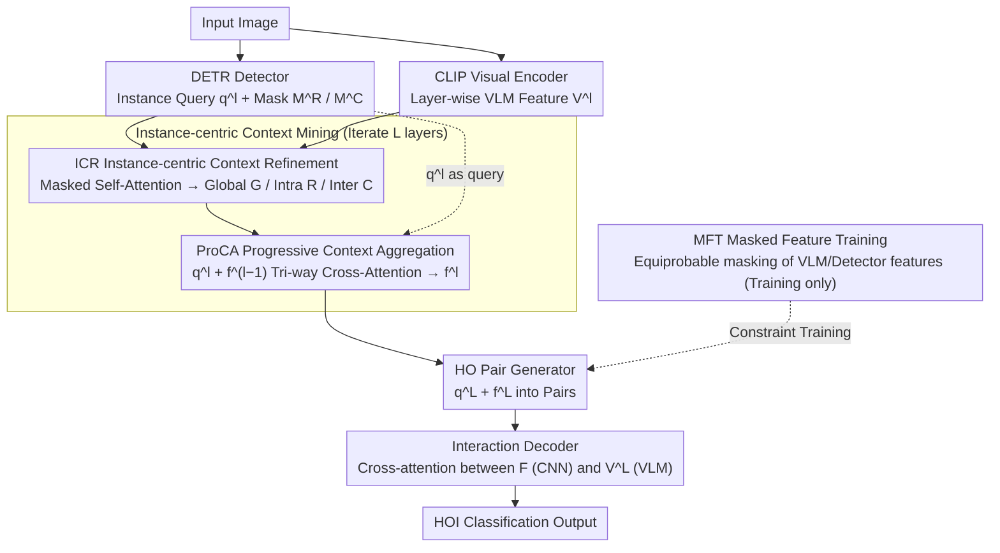

# Mining Instance-Centric Vision-Language Contexts for Human-Object Interaction Detection

**Conference**: CVPR 2026  
**arXiv**: [2604.02071](https://arxiv.org/abs/2604.02071)  
**Code**: [https://github.com/nowuss/InCoM-Net](https://github.com/nowuss/InCoM-Net)  
**Area**: Object Detection / Human-Object Interaction Detection  
**Keywords**: HOI Detection, Vision-Language Models, Instance-level Context, Multi-context Features, Attention Mechanisms

## TL;DR

This paper proposes InCoM-Net, which extracts three levels of context—intra-instance, inter-instance, and global—separately for each instance from VLM features. Through progressive context aggregation and fusion with detector features, it achieves SOTA results in HOI detection on HICO-DET (Full mAP 43.96) and V-COCO ($AP_{role}^{S1}$ 73.6).

## Background & Motivation

1.  **Background**: HOI detection aims to localize human-object pairs and classify their interactions, serving as a fundamental task for visual understanding. Recent methods based on Transformers and VLMs (e.g., CLIP, BLIP) have significantly improved performance.
2.  **Limitations of Prior Work**: Existing VLM integration methods either use scene-level VLM features solely as global semantic priors (e.g., HOICLIP, UniHOI) or restrict VLM features within object bounding boxes via RoI alignment (e.g., ADA-CM, BCOM), failing to fully exploit multi-level contextual cues distributed across the scene.
3.  **Key Challenge**: HOI reasoning requires a simultaneous understanding of the target instance's visual cues, its relationships with surrounding instances, and the global scene context. However, current methods apply context information uniformly to all instances, lacking instance-specific context modeling.
4.  **Goal**: To extract multi-level contextual information from VLM features for each instance and effectively fuse them into the detector's instance features.
5.  **Key Insight**: The authors observe that human judgment of HOI relies on three types of cues: the internal visual features of the target, its relationships with other instances, and the surrounding scene. Thus, they design an instance-centric multi-context mining scheme.
6.  **Core Idea**: Extract intra-instance, inter-instance, and global contexts from VLM features via masked self-attention, then progressively fuse them into detector queries.

## Method

### Overall Architecture

The core problem InCoM-Net addresses is that while human reasoning for "what a person is doing with an object" depends on cues at different levels (appearance, relationships, scene), existing methods treat all instances identically. InCoM-Net employs a dual-branch architecture: a DETR detector branch outputting instance-level query features $q^l$ and a CLIP visual encoder outputting patch-level VLM features $V^l$. These are fed into the Instance-centric Context Mining (ICM) module, composed of Instance-centric Context Refinement (ICR) and Progressive Context Aggregation (ProCA), iterating over $L$ layers. ICR extracts the three context types from $V^l$, and ProCA progressively fuses them. Finally, the HO Pair Generator pairs refined features for the interaction decoder to output HOI classifications. Masked Feature Training (MFT) is used during training to randomly mask VLM or detector features, forcing the model to balance both heterogeneous sources.

### Key Designs

**1. Instance-centric Context Refinement (ICR): Extracting three semantics from shared VLM features**

ICR uses masked self-attention on VLM features $V^l$. For instance $i$, it constructs two masks based on detection boxes: an instance mask $M_i^R$ for the instance itself and a surrounding mask $M_i^C$ for the union of all other instances. Three complementary contexts are generated: global context $G^l$ via unmasked attention, intra-instance context $R_i^l$ via $M_i^R$, and inter-instance context $C_i^l$ via $M_i^C$. Each is encoded by a separate FFN to maintain semantic diversity.

**2. Progressive Context Aggregation (ProCA): Layer-wise fusion into detector queries**

ProCA aligns the three contexts with the detector's instance features. In each layer, the detector query $q_i^l$ plus the previous layer's aggregation $f_i^{l-1}$ is used as a query for tri-way cross-attention over $G^l$, $R_i^l$, and $C_i^l$. The outputs are concatenated and passed through an FFN to obtain $f_i^l$:

$$f_i^l = \mathrm{FFN}\big(\mathrm{Concat}[\,\mathrm{CA}(q_i^l{+}f_i^{l-1},\,G^l),\ \mathrm{CA}(q_i^l{+}f_i^{l-1},\,R_i^l),\ \mathrm{CA}(q_i^l{+}f_i^{l-1},\,C_i^l)\,]\big)$$

This "progressive" approach ensures that information from shallower CLIP layers (texture-heavy) is transferred to deeper layers (semantic-heavy), facilitating alignment between appearance and context.

**3. Masked Feature Training (MFT): Balancing heterogeneous feature sources**

To prevent reliance on a single feature source, MFT applies a dropout-like strategy to multi-modal fusion. During training, three input configurations are sampled with equal probability (1/3 each): Full (VLM + Detector), Detector-only, and VLM-only. When a branch is masked, its features are zeroed and corresponding cross-attentions are disabled. The sum of focal losses from all configurations forces the model to learn complementary information.

### Loss & Training

Focal loss is used for interaction classification. MFT produces three focal losses corresponding to the mask configurations, which are summed for the total loss. DETR and CLIP remain frozen throughout training; only ICR, ProCA, HO Pair Generator, and the interaction decoder are trained. The AdamW optimizer is used with an initial learning rate of $10^{-4}$, decaying 5-fold every 10 epochs for 30 epochs total.

## Key Experimental Results

### Main Results

| Dataset | Metric | InCoM-Net (ViT-L) | NMSR (prev SOTA) | Gain |
|--------|------|------|----------|------|
| HICO-DET | Full mAP | **43.96** | 42.93 | +1.03 |
| HICO-DET | Rare mAP | **45.61** | 42.41 | +3.20 |
| HICO-DET | Non-rare mAP | **43.46** | 43.11 | +0.35 |
| V-COCO | $AP_{role}^{S1}$ | **73.6** | 69.8 | +3.8 |
| V-COCO | $AP_{role}^{S2}$ | **75.4** | 72.1 | +3.3 |

ViT-B version: HICO-DET Full 39.53 (outperforms HORP by +0.92), V-COCO S1 72.2 (outperforms SCTC by +5.1).

### Ablation Study

| Configuration | Full mAP | Rare mAP | Note |
|------|---------|----------|------|
| Baseline (No ICR/ProCA) | 36.17 | 33.11 | Detector features only |
| + ICR | 37.42 | 34.47 | +1.25, Multi-context effectiveness |
| + ProCA | 38.42 | 36.80 | +1.00, Progressive aggregation effectiveness |
| + MFT | **39.53** | **38.87** | +1.11, Balancing heterogeneous features |

Ablation of context types (based on ICR+ProCA):

| Context Config | Full mAP | Rare mAP |
|-----------|---------|----------|
| V only (Original VLM) | 38.30 | 37.31 |
| + G (Global) | 38.65 | 36.76 |
| + R (Intra-instance) | 39.19 | 38.78 |
| + C (Inter-instance) | **39.53** | **38.87** |

### Key Findings

- MFT contributes the most (+1.11 mAP), particularly for Rare classes (+2.07), showing that balancing heterogeneous features is vital for low-frequency interactions.
- Intra-instance context $R$ significantly aids Rare classes (+2.02), indicating that fine-grained instance info is crucial for rare interaction reasoning.
- In zero-shot settings, InCoM-Net achieves SOTA (37.69/39.45 for RF-UC/NF-UC Unseen).
- ProCA performance plateaus after $L=3$ layers.

## Highlights & Insights

- **Instance-level context decomposition**: Adapting the mask mechanism to extract three types of context from shared VLM features is simple yet effective. Separating contexts by semantic role proves superior to using monolithic global features.
- **MFT Strategy**: Applying dropout logic to multi-modal feature fusion effectively prevents model bias toward a single source.
- **Transfer Potential**: This instance-centric mining approach is applicable to scene graph generation and other relationship reasoning tasks.

## Limitations & Future Work

- Frozen DETR and CLIP limit end-to-end optimization; partial fine-tuning of the VLM could be explored.
- Mask accuracy depends entirely on detector quality; missed detections degrade context relevance.
- Static image focus ignores temporal cues (e.g., video HOI).
- Adaptive sampling could replace the equiprobable training configurations in MFT.

## Related Work & Insights

- **vs BCOM (CVPR24)**: BCOM encodes RoI and VLM features in dual branches but lacks inter-instance context. InCoM-Net outperforms BCOM by +4.62 mAP (ViT-L).
- **vs ADA-CM (ICCV23)**: ADA-CM uses adapters for RoI pooling but applies a uniform context. InCoM-Net’s instance-specificity is the key differentiator.
- **vs NMSR (ICCV25)**: The previous SOTA. InCoM-Net's gains (+1.03 on HICO-DET, +3.8 on V-COCO) derive primarily from multi-context refinement and progressive aggregation.

## Rating

- Novelty: ⭐⭐⭐⭐ Instance-level decomposition is novel; MFT is creative.
- Experimental Thoroughness: ⭐⭐⭐⭐⭐ Comprehensive tests across datasets, zero-shot, and ablations.
- Writing Quality: ⭐⭐⭐⭐ Clear structure and coherent motivation.
- Value: ⭐⭐⭐⭐ Achieves HOI SOTA with transferable design insights.

<!-- RELATED:START -->

## Related Papers

- [\[CVPR 2026\] SL-HOI: Streamlined Open-Vocabulary Human-Object Interaction Detection](streamlined_open-vocabulary_human-object_interaction_detection.md)
- [\[CVPR 2026\] Learning to Track Instance from Single Nature Language Description](learning_to_track_instance_from_single_nature_language_description.md)
- [\[CVPR 2026\] CrossVL: Complexity-Aware Feature Routing and Paired Curriculum for Cross-View Vision-Language Detection](crossvl_complexity-aware_feature_routing_and_paired_curriculum_for_cross-view_vi.md)
- [\[CVPR 2026\] Saliency-R1: Enforcing Interpretable and Faithful Vision-language Reasoning via Saliency-map Alignment Reward](saliency-r1_enforcing_interpretable_and_faithful_vision-language_reasoning_via_s.md)
- [\[ICML 2025\] UI-Vision: A Desktop-centric GUI Benchmark for Visual Perception and Interaction](../../ICML2025/object_detection/ui-vision_a_desktop-centric_gui_benchmark_for_visual_perception_and_interaction.md)

<!-- RELATED:END -->
