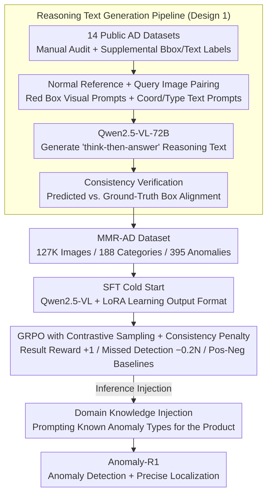

# MMR-AD: A Large-Scale Multimodal Dataset for Benchmarking General Anomaly Detection with MLLMs

**Conference**: CVPR 2026  
**arXiv**: [2604.10971](https://arxiv.org/abs/2604.10971)  
**Code**: [https://xcyao00.github.io/MMR-AD](https://xcyao00.github.io/MMR-AD)  
**Area**: Object Detection  
**Keywords**: Anomaly Detection, Multimodal Large Language Models (MLLM), Reasoning Dataset, Reinforcement Learning, General Anomaly Detection (GAD)

## TL;DR
MMR-AD constructs the largest reasoning-based multimodal industrial anomaly detection dataset to date (127K images, 188 product categories, 395 anomaly types) and proposes the Anomaly-R1 baseline model based on GRPO reinforcement learning, which significantly outperforms general MLLMs.

## Background & Motivation

**Background**: Industrial anomaly detection has evolved from single-class to multi-class and cross-class scenarios. General Anomaly Detection (GAD) is the ultimate goal: training a universal model to detect anomalies in new categories directly without retraining. MLLMs are viewed as powerful tools for achieving GAD due to their robust visual understanding and linguistic reasoning capabilities.

**Limitations of Prior Work**: (1) There is a significant gap between MLLM pre-training data and industrial AD scenarios; (2) Existing AD datasets are in image formats unsuitable for MLLM post-training; (3) Existing multimodal AD datasets (e.g., MMAD, Anomaly-Instruct-125K) either provide only multiple-choice questions without reasoning or contain large amounts of non-industrial web data.

**Key Challenge**: The accuracy of general MLLMs in industrial AD, particularly regarding precise anomaly localization, falls far short of practical requirements. Solving this requires large-scale, high-quality multimodal AD training data.

**Goal**: To build a large-scale reasoning-based multimodal AD dataset for both training and evaluation, and to validate an AD baseline model based on reinforcement learning.

**Core Idea**: Manually audit and filter samples from 14 public AD datasets, annotate bounding boxes, automatically generate reasoning text, and train a reasoning-based AD model using GRPO reinforcement learning.

## Method

### Overall Architecture
This work addresses two primary tasks: constructing a large-scale industrial anomaly detection dataset suitable for MLLM post-training and training a baseline model capable of "reasoning where the anomaly is." On the data side, the authors started with 14 public AD datasets, manually audited them to remove low-quality samples, and added bounding boxes and text labels. They then utilized Qwen2.5-VL-72B to view paired normal reference and query images—aided by visual and text prompts—to automatically generate "reason-then-answer" long-form text. Consistency verification was performed to yield MMR-AD (127K images, 188 categories, 395 anomalies). On the model side, using Qwen2.5-VL + LoRA as the backbone, the model underwent SFT cold-starting with the reasoning text, followed by GRPO reinforcement learning with contrastive sampling and consistency penalties to enhance localization precision. Domain knowledge can also be injected during inference.

### Key Designs

**1. Reasoning Text Generation Pipeline: Upgrading "Anomaly/Normal" labels to reasoning processes**

Most existing AD datasets only contain images or multiple-choice answers, which fail to teach MLLMs step-by-step comparison and localization. The key here is providing the generation model with an image pair—a normal reference image and a query image—as anomalies are essentially deviations from the norm. Within this setup, two prompts are used: visual prompts (red bounding boxes around anomalous areas) and text prompts (anomaly types and coordinates). This forces Qwen2.5-VL-72B to produce annotations in a "describe and compare, then conclude" format rather than a simple Yes/No. Finally, consistency verification filters out samples where the predicted text regions do not align with the ground-truth boxes.

**2. GRPO with Contrastive Sampling + Consistency Penalty: Rewarding "correct localization" over "guessing Yes"**

After SFT, models can often answer correctly but produce blurry localization. If reinforcement learning only rewards answer accuracy, the model quickly learns to exploit the reward by outputting "Yes" indiscriminately. The authors split the reward: a result reward of $+1$ for correct answers, and a consistency penalty of $-0.2$ for each missed ground-truth anomaly box, forcing the model to tie "correct answers" to "accurate boxes." Furthermore, to prevent gradient vanishing in GRPO when all sampled responses are identical (common in concentrated AD tasks), contrastive sampling uses correct MMR-AD text as a guaranteed positive sample and adversary prompts to construct negative samples for queries with uniform positive responses.

**3. Domain Knowledge Injection: Informing the model of "what anomalies to watch for" during inference**

In industrial scenarios, the boundary between normal variation and true anomalies is often blurred. Purely visual models may misidentify harmless differences. This light-weight enhancement during inference explicitly states in the prompt: "This product may have the following anomalies: broken, deformation..." This converges the model's attention onto specific defect types, allowing it to verify these against the image rather than reporting every pixel-level difference.

### Loss & Training
A two-stage training strategy is employed: first, SFT cold-starting using the reasoning text (ablations show that skipping SFT leads to poor RL performance), followed by GRPO reinforcement learning. Deployed objective functions follow the PPO clip logic with KL penalties, using the combined result reward and consistency penalty.

## Key Experimental Results

### Main Results

| Model | MVTecAD Det. Acc | MVTecAD Loc. Acc | VisA Det. Acc |
|------|----------------|----------------|-------------|
| GPT-4o | ~70% | ~30% | ~65% |
| Gemini-2.5 | ~72% | ~35% | ~68% |
| Anomaly-R1-7B | ~85% | ~60% | ~80% |
| Anomaly-R1-7B† (+ Domain Knowledge) | ~88% | ~65% | ~83% |

### Ablation Study

| Configuration | Detection | Localization | Description |
|------|------|------|------|
| Full (SFT+RL) | Best | Best | Complete model |
| SFT only | Second Best | Moderate | RL significantly improves localization |
| Direct RL (No SFT) | Poor | Poor | Cold start is necessary |
| w/o Consistency Penalty | High Det. | Low Loc. | Model learns to guess "Yes" blindly |

### Key Findings
- Current state-of-the-art general MLLMs (GPT-4o, Gemini-2.5) fall significantly short of industrial standards, especially in localization.
- Reasoning-based text is more effective than simple answer labels for training MLLMs in general AD capabilities.
- Reinforcement learning provides the most significant boost to localization precision compared to pure SFT.
- Domain knowledge injection provides a consistent performance gain.

## Highlights & Insights
- **Dataset Extensibility**: By providing raw bounding boxes, future stronger MLLMs can be used to regenerate reasoning text; this forward-thinking design is noteworthy.
- **Consistency Penalty**: Cleverly incorporates localization accuracy into the reward function, avoiding the common "correct but imprecise" trap in reinforcement learning.

## Limitations & Future Work
- The text is generated by Qwen2.5-VL-72B, which may introduce model bias.
- Although 127K images is large, some categories remain imbalanced.
- Future work could explore more advanced RL algorithms and larger model scales.

## Related Work & Insights
- **vs MMAD**: MMAD only utilizes a multiple-choice format and cannot be used for training; MMR-AD provides trainable reasoning text.
- **vs AnomalyGPT**: AnomalyGPT uses direct SFT without a reasoning process, leading to inferior generalization.

## Rating
- Novelty: ⭐⭐⭐⭐ First large-scale reasoning AD dataset; RL baseline is highly practical.
- Experimental Thoroughness: ⭐⭐⭐⭐⭐ Comprehensive model comparisons, ablations, and RL technique analyses.
- Writing Quality: ⭐⭐⭐⭐ Clear description of dataset construction and methodology.
- Value: ⭐⭐⭐⭐⭐ Significant contribution to the AD community.

<!-- RELATED:START -->

## Related Papers

- [\[CVPR 2026\] Omni-AD: A Large-scale and Versatile Benchmark for Industrial Anomaly Detection](omni-ad_a_large-scale_and_versatile_benchmark_for_industrial_anomaly_detection.md)
- [\[ICCV 2025\] Kaputt: A Large-Scale Dataset for Visual Defect Detection](../../ICCV2025/object_detection/kaputt_a_large-scale_dataset_for_visual_defect_detection.md)
- [\[CVPR 2026\] Bidirectional Multimodal Prompt Learning with Scale-Aware Training for Few-Shot Multi-Class Anomaly Detection](bidirectional_multimodal_prompt_learning_with_scale-aware_training_for_few-shot_.md)
- [\[ICLR 2026\] ForestPersons: A Large-Scale Dataset for Under-Canopy Missing Person Detection](../../ICLR2026/object_detection/forestpersons_a_large-scale_dataset_for_under-canopy_missing_person_detection.md)
- [\[CVPR 2026\] Towards an Incremental Unified Multimodal Anomaly Detection: Augmenting Multimodal Denoising From an Information Bottleneck Perspective](towards_an_incremental_unified_multimodal_anomaly_detection_augmenting_multimoda.md)

<!-- RELATED:END -->
