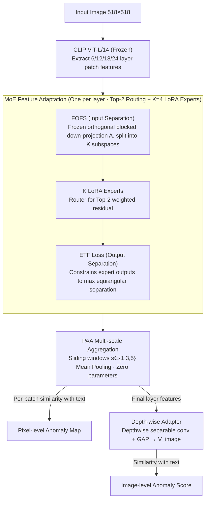

# MoECLIP: Patch-Specialized Experts for Zero-shot Anomaly Detection

**Conference**: CVPR 2026  
**arXiv**: [2603.03101](https://arxiv.org/abs/2603.03101)  
**Code**: [Available](https://github.com/CoCoRessa/MoECLIP)  
**Area**: Object Detection  
**Keywords**: Zero-shot anomaly detection, Mixture-of-Experts, CLIP, LoRA, expert specialization

## TL;DR

This paper proposes MoECLIP, which introduces the Mixture-of-Experts architecture into Zero-Shot Anomaly Detection (ZSAD). By employing Frozen Orthogonal Feature Separation (FOFS) and Equiangular Tight Frame (ETF) loss, it achieves patch-level dynamic expert routing and specialization, reaching SOTA performance across 14 industrial and medical benchmarks.

## Background & Motivation

### 1. Background
Visual Anomaly Detection (AD) aims to identify regions deviating from normal patterns and is crucial for industrial defect detection and medical diagnosis. Traditional Unsupervised Anomaly Detection (UAD) learns solely from normal data but still requires a large number of normal samples. Zero-Shot Anomaly Detection (ZSAD) leverages the powerful generalization of Vision-Language Models like CLIP to detect anomalies without training data from target categories, becoming an emerging paradigm.

### 2. Limitations of Prior Work
The pre-training objective of CLIP focuses on global semantic understanding, which is not optimized for detecting local anomalies. Existing ZSAD methods (PromptAD, AnomalyCLIP, AdaCLIP, AA-CLIP) enhance patch representations through prompt learning or adapters but primarily adopt a **patch-agnostic design**, applying the same uniform transformation to all patches. This ignores the unique characteristics of different image regions (object parts, backgrounds, and anomalous areas).

### 3. Key Challenge
There is a need to specialize CLIP for anomaly detection while preserving its generalization capabilities. Different patches require differentiated processing; however, simple multi-expert combinations often lead to **functional redundancy**, where experts learn similar features.

### 4. Goal
(1) Break the limitations of patch-agnostic design to achieve patch-level dynamic adaptation; (2) Resolve the functional redundancy in MoE to ensure genuine expert specialization.

### 5. Key Insight
The MoE architecture is integrated with LoRA for ZSAD, imposing constraints on both input and output ends to separate expert functions.

### 6. Core Idea
A MoE architecture dynamically routes each patch to the appropriate LoRA expert. FOFS is used to orthogonally partition the feature space at the input, while ETF loss enforces maximum equiangular separation at the output, eliminating expert redundancy through a dual-pronged approach.

## Method

### Overall Architecture

The core problem MoECLIP addresses is that CLIP patch features treat all regions equally, whereas anomaly detection requires distinguishing between objects, backgrounds, and defects. The approach equips the frozen CLIP Vision Encoder (ViT-L/14-336) with a set of "patch-wise branched" experts. Specifically, MoE modules are inserted at the outputs of the 6th, 12th, 18th, and 24th layers of the encoder. Each module consists of $K=4$ LoRA experts and a linear router, which calculates expert scores for each patch and performs Top-2 weighted selection.

When an image is processed, the CLIP ViT extracts multi-layer patch features. The MoE module at each layer routes patches to suitable experts for residual adaptation based on content. The adapted features are aggregated across multiple scales via PAA, then bifurcated: one branch computes per-patch similarity with text features for pixel-level anomaly maps, while the other processes global features through a Depth-wise Adapter to compute image-level anomaly scores. Training is supervised only on an auxiliary dataset (VisA), while testing is conducted on completely unseen categories. Only the LoRA up-projections, routers, and two lightweight adapter heads are learnable; the CLIP backbone remains frozen.

### Key Designs

**1. MoE Feature Adaptation: Routing patches to specific expert channels**

This directly addresses the "patch-agnostic" pain point. Given that different regions have distinct properties, they should not share the same transformation. When a MoE module receives patch features $F_i^l \in \mathbb{R}^d$, the router selects Top-2 experts to generate weighted residual outputs $F_{i,\text{expert}}^l$. To maintain training stability and generalization, the residual is $\ell_2$-normalized to match the original feature magnitude and mixed with a small weight ($\lambda_{\text{MoE}}=0.1$). Using LoRA (rank=8) as experts reduces parameters and overfitting risks, which is vital for zero-shot scenarios.

**2. FOFS (Frozen Orthogonal Feature Separation): Diverging expert "views" from the input**

FOFS prevents functional redundancy by physically isolating inputs. The $d$-dimensional feature space is partitioned into $K$ non-overlapping subspaces $c_1, \dots, c_K$, such that the $n$-th expert only "sees" the $n$-th block. The LoRA down-projection matrix $A_n \in \mathbb{R}^{r \times d}$ is constructed as a block matrix: only columns corresponding to the $n$-th subspace contain an orthogonal matrix $Q_n$ (obtained via QR decomposition), with all other columns set to zero. Thus, for any two experts:

$$A_n A_m^\top = 0 \quad (n \neq m),$$

ensuring the input subspaces are inherently orthogonal. $A_n$ remains frozen while only $B_n$ is learned, preserving CLIP's generalization while aligning with recent findings that randomly initialized orthogonal down-projections perform as well as learned ones.

**3. ETF Loss (Equiangular Tight Frame Loss): Separation at the output**

While FOFS manages the input, the learnable $B_n$ could still pull outputs into similar directions. ETF loss computes the Gram matrix of the $\ell_2$-normalized outputs of $K$ experts for each patch, penalizing the divergence from an "ideal ETF structure." The ideal structure requires 1 on the diagonal (unit norm) and $-1/(K-1)$ for off-diagonal elements, forcing maximum equiangular separation on the hypersphere. Combined with FOFS, this reduces expert similarity from 0.45 in vanilla MoE to near 0.02.

**4. PAA (Patch Average Aggregation): Earlier multi-scale perception**

ViT patch sizes are fixed, making it difficult to capture both small defects and large lesions. PAA reshapes patch embeddings into a 2D grid and applies mean pooling with sliding window scales $s \in \{1, 3, 5\}$ to produce multi-scale features without additional parameters. This is particularly effective for medical datasets where lesion sizes vary significantly.

**5. Depth-wise Adapter: Global representation for semantic alignment**

To obtain a clean global vector for image-level scores, MoECLIP employs a lightweight 1D depthwise separable convolution (Depthwise + Pointwise) on the final PAA features. Global Average Pooling (GAP) then yields the image-level vector $V_{\text{image}}$. This structure integrates local features into a semantically aligned representation with minimal parameter overhead.

> Routing learns content-related division: Grad-CAM visualizations show Expert 1 focuses on anomaly regions, Expert 2 on the object body, and Expert 3 on the background.

### Loss & Training

Total Loss: $$\mathcal{L}_{\text{total}} = \mathcal{L}_{\text{seg}} + \mathcal{L}_{\text{ac}} + \lambda_{\text{etf}}\mathcal{L}_{\text{etf}} + \lambda_{\text{bal}}\mathcal{L}_{\text{bal}}$$

- **Segmentation Loss** $\mathcal{L}_{\text{seg}}$: Focal + Dice Loss, applied to multi-layer multi-scale anomaly maps.
- **Classification Loss** $\mathcal{L}_{\text{ac}}$: BCE Loss, applied to image-level anomaly scores.
- **ETF Loss**: $\lambda_{\text{etf}}=0.01$, constrains expert outputs to be equiangular.
- **Balance Loss**: $\lambda_{\text{bal}}=0.01$, prevents expert collapse using the squared coefficient of variation for routing probabilities.

Training config: OpenCLIP ViT-L/14-336, 518×518 images, Adam $\text{lr}=5 \times 10^{-4}$, 20 epochs, 2×V100 16GB.

## Key Experimental Results

### Main Results

Evaluated against 6 SOTA methods across 14 datasets (5 industrial + 9 medical). VisA was used for training (except when evaluating VisA, where MVTec-AD was used).

**Table 1: Image-level Anomaly Classification (AUROC, AP)**

| Method | MVTec-AD | VisA | BTAD | RSDD | DTD-Syn | BrainMRI | HeadCT | LiverCT | RetinaOCT | **Avg** |
|------|----------|------|------|------|---------|----------|--------|---------|-----------|----------|
| WinCLIP | (91.8,95.1) | (78.1,77.5) | (83.3,84.1) | (85.3,65.3) | (95.0,97.9) | (45.1,80.3) | (83.7,81.6) | (66.5,56.1) | (53.7,44.3) | (75.8,75.8) |
| AnomalyCLIP | (91.9,96.2) | (82.1,85.4) | (92.5,94.2) | (74.0,73.2) | (93.3,97.7) | (70.8,90.6) | (95.1,95.3) | (68.2,63.4) | (74.7,73.9) | (82.5,85.5) |
| AA-CLIP | (90.9,96.0) | (79.2,83.7) | (94.8,97.5) | (94.9,94.2) | (92.5,97.7) | (79.6,94.4) | (95.4,94.3) | (58.4,49.7) | (83.4,83.8) | (85.5,87.9) |
| Bayes-PFL | (92.2,96.1) | (86.8,89.3) | (93.0,96.7) | (91.3,89.7) | (93.5,97.7) | (81.9,94.5) | (95.4,93.2) | (61.7,55.2) | (83.7,81.8) | (86.6,88.2) |
| **MoECLIP** | **(93.9,96.8)** | **(83.6,86.2)** | **(93.1,98.0)** | **(95.3,95.1)** | **(95.5,98.6)** | **(88.5,97.1)** | **(96.6,94.5)** | **(74.0,64.6)** | **(85.5,84.9)** | **(89.6,90.6)** |

**Table 2: Pixel-level Anomaly Segmentation (AUROC, AP) - Selected Data**

| Method | MVTec-AD | BTAD | BrainMRI | ColonDB | ClinicDB | Kvasir | **Avg** |
|------|----------|------|----------|---------|----------|--------|----------|
| AA-CLIP | (91.6,45.4) | (95.6,49.4) | (96.7,55.1) | (82.8,31.5) | (89.2,49.8) | (86.0,52.9) | (93.2,45.8) |
| Bayes-PFL | (91.9,48.4) | (95.6,48.6) | (95.7,42.9) | (82.9,30.7) | (88.2,49.1) | (85.6,53.4) | (93.2,44.3) |
| **MoECLIP** | **(92.5,45.7)** | **(96.8,50.4)** | **(97.3,61.3)** | **(85.4,34.8)** | **(89.7,49.9)** | **(88.1,57.6)** | **(94.3,47.5)** |

### Ablation Study

**Table 3: Component Ablation (Pixel AUROC, Image AUROC)**

| Configuration | MVTec-AD | DTD-Syn | HeadCT | ColonDB | Average |
|------|----------|---------|--------|---------|------|
| Vanilla CLIP | (38.4,74.1) | (33.9,71.6) | (-,56.5) | (49.5,-) | (40.6,67.4) |
| w/o FOFS & ETF | (91.6,91.7) | (97.8,93.1) | (-,94.4) | (84.1,-) | (91.2,93.1) |
| w/o FOFS | (92.0,92.8) | (98.3,93.9) | (-,95.0) | (85.3,-) | (91.9,93.9) |
| w/o ETF Loss | (92.2,92.7) | (98.2,93.4) | (-,96.1) | (84.6,-) | (91.7,94.1) |
| w/o Depth Adapter | (92.0,92.5) | (98.1,93.8) | (-,94.5) | (85.0,-) | (91.7,93.6) |
| w/o PAA | (92.1,92.8) | (98.1,94.7) | (-,93.1) | (81.9,-) | (90.7,93.5) |
| **MoECLIP (full)** | **(92.5,93.9)** | **(98.8,95.5)** | **(-,96.6)** | **(85.4,-)** | **(92.2,95.3)** |

### Key Findings

1. **FOFS and ETF are complementary**: Removing either component degrades performance; removing both results in a significantly larger drop, proving the necessity of dual constraints.
2. **Functional Redundancy Quantification**: Inter-expert cosine similarity drops from 0.45 (vanilla MoE) to 0.24 (with FOFS) and finally to 0.02 (with ETF), eliminating nearly all redundancy.
3. **PAA is crucial for the medical domain**: Removing PAA drops HeadCT by 3.5% and ColonDB by 3.5%, highlighting the importance of multi-scale context in medical AD.
4. **Optimal Expert Count**: $K=4$ is optimal; larger $K$ values lead to performance degradation due to redundancy.
5. **Cross-domain Generalization**: Even when trained on industrial data, MoE experts specialize and route effectively for medical data.

## Highlights & Insights

1. **First introduction of MoE to ZSAD**: Pioneering shift from patch-agnostic to patch-specialized paradigms.
2. **Elegant Dual-Constraint Design**: FOFS physically isolates subspaces at the input (frozen, zero overhead), while ETF loss enforces geometric constraints at the output.
3. **Intuitive Visual Verification**: Grad-CAM clear shows content-based routing (Expert 1: anomaly, Expert 2: object, Expert 3: background).
4. **Effective usage of frozen A matrices in FOFS**: Leverages insights from LoRA research (random orthogonal A $\approx$ learned A) to gain separation, parameter efficiency, and reduced overfitting.

## Limitations & Future Work

1. **Static Expert Count**: $K=4$ is empirical; lacks an adaptive mechanism for determining the number of experts.
2. **Equal Subspace Partitioning in FOFS**: Dimensionality is split evenly among experts without considering that different experts might require different capacities.
3. **Backbone Scale**: Validated only on ViT-L/14; the impact of larger or smaller backbones (e.g., ViT-B, ViT-H) remains unexplored.
4. **Training Data Diversity**: Relies on VisA as the auxiliary training set; the impact of alternative training sets on generalization is unknown.
5. **Fixed PAA Scales**: Windows $s \in \{1, 3, 5\}$ are manually set; adaptive or learnable scale selection could be explored.

## Related Work & Insights

- **Evolution of ZSAD**: From WinCLIP $\rightarrow$ April-GAN $\rightarrow$ AnomalyCLIP $\rightarrow$ AdaCLIP $\rightarrow$ AA-CLIP $\rightarrow$ Bayes-PFL $\rightarrow$ MoECLIP. The trend has shifted from manual prompt engineering to learnable prompts, adapters, and finally dynamic MoE routing.
- **Solving MoE Redundancy**: Traditional methods (contrastive loss, orthogonal regularization) act only on outputs. This paper's dual-sided constraint (input + output) is a generalizable idea for other MoE applications.
- **LoRA Orthogonality**: Works like VeRA have verified frozen down-projection matrices. Combining this with orthogonal separation for MoE is a promising direction for PEFT research.

## Rating

- Novelty: ⭐⭐⭐⭐ Introduces MoE to ZSAD for a patch-specialized paradigm; unique dual-constraint approach (FOFS+ETF).
- Experimental Thoroughness: ⭐⭐⭐⭐⭐ Extensive evaluation on 14 datasets, ablation studies, visualization, and redundancy quantification.
- Writing Quality: ⭐⭐⭐⭐ Clear motivation, systematic methodology, and rich visualizations.
- Value: ⭐⭐⭐⭐ Elegantly solves both the ZSAD patch-agnostic problem and MoE functional redundancy, with potential for broader PEFT+MoE applications.

<!-- RELATED:START -->

## Related Papers

- [\[AAAI 2026\] PromptMoE: Generalizable Zero-Shot Anomaly Detection via Visually-Guided Prompt Mixing of Experts](../../AAAI2026/object_detection/promptmoe_generalizable_zero-shot_anomaly_detection_via_visually-guided_prompt_m.md)
- [\[CVPR 2026\] From Attraction to Equilibrium: Physics-Inspired Semantic Gravitons for Zero-Shot Anomaly Detection](from_attraction_to_equilibrium_physics-inspired_semantic_gravitons_for_zero-shot.md)
- [\[CVPR 2026\] AnomalyVFM -- Transforming Vision Foundation Models into Zero-Shot Anomaly Detectors](anomalyvfm_--_transforming_vision_foundation_models_into_zero-shot_anomaly_detec.md)
- [\[CVPR 2026\] FB-CLIP: Fine-Grained Zero-Shot Anomaly Detection with Foreground-Background Disentanglement](fb-clip_fine-grained_zero-shot_anomaly_detection_with_foreground-background_dise.md)
- [\[CVPR 2026\] CoPS: Conditional Prompt Synthesis for Zero-Shot Anomaly Detection](cops_conditional_prompt_synthesis_for_zero-shot_anomaly_detection.md)

<!-- RELATED:END -->
