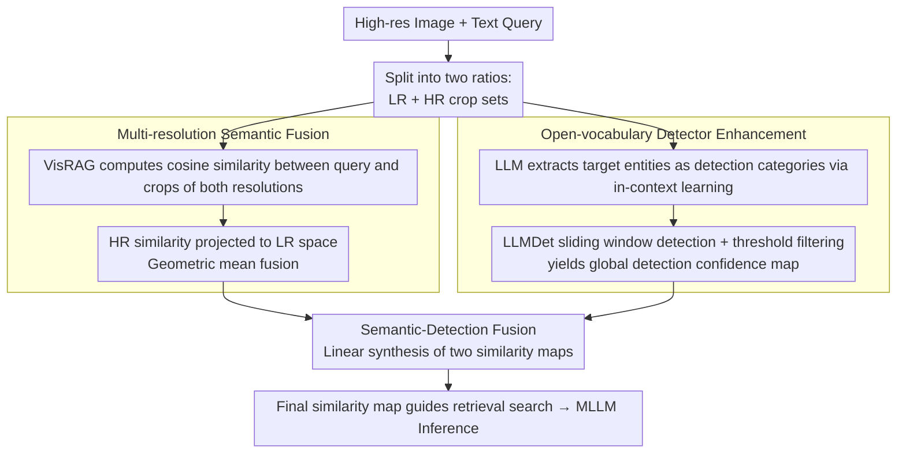

# MRD: Multi-resolution Retrieval-Detection Fusion for High-Resolution Image Understanding

**Conference**: CVPR2026  
**arXiv**: [2512.02906](https://arxiv.org/abs/2512.02906)  
**Code**: [yf0412/MRD](https://github.com/yf0412/MRD)  
**Area**: Object Detection / High-Resolution Image Understanding  
**Keywords**: High-resolution image understanding, Multimodal Large Language Models (MLLM), Retrieval-Augmented Perception, Open-vocabulary Detection, Multi-resolution Fusion, Training-free

## TL;DR

Proposes MRD, a training-free multi-resolution retrieval-detection fusion framework that alleviates object fragmentation through multi-resolution semantic fusion and suppresses background interference with an open-vocabulary detector, significantly enhancing MLLM capabilities for high-resolution image understanding.

## Background & Motivation

1. **MLLM High-Resolution Bottleneck**: Mainstream MLLMs are limited by fixed low-resolution inputs, making it difficult to effectively process details such as small objects, fine textures, and text in high-resolution images.
2. **High Training Costs**: Localize-and-zoom-in methods based on SFT/RL suffer from high training costs, long convergence cycles, and poor cross-architecture transferability, limiting practical deployment.
3. **Object Fragmentation (FRAG)**: Retrieval-based methods use fixed grids to crop high-resolution images. Large objects are sliced into multiple patches, leading to semantic bias in embeddings and incomplete retrieval, affecting 65.2% of failed samples.
4. **Background Interference (BG)**: Complex background regions generate spurious high similarity with the query, introducing false positive patches that mislead subsequent reasoning, affecting 54.3% of failed samples.
5. **Scale Sensitivity**: Crop resolution is a difficult-to-tune hyperparameter—large resolutions introduce background noise that dilutes target semantics, while small resolutions exacerbate fragmentation.
6. **Defects in Multi-object Scenarios**: Existing top-down methods tend to miss non-primary targets during the initial coarse-grained search phase, performing poorly on multi-object tasks.

## Method

### Overall Architecture

MRD addresses two types of systemic failures in MLLM high-resolution image processing: retrieval-based methods using fixed grids cause object fragmentation resulting in semantic bias (FRAG), and complex backgrounds cause spurious high similarity with the query (BG). It is a **training-free** unified multi-scale framework that can be integrated with any MLLM without training: given a high-resolution image and a text query, it first crops the image into low-resolution and high-resolution sets at two ratios. It then branches into two paths—one for multi-resolution semantic fusion at the local scale to correct fragmentation, and another for explicit localization and background suppression using an open-vocabulary detector at the global scale. The outputs are linearly fused into a final similarity map to guide retrieval search and MLLM inference.

### Key Designs

**1. Multi-resolution Semantic Fusion: Correcting Fragmentation via Cross-resolution Consistency**

Fixed grid cropping splits large objects across multiple patches; each patch embedding only captures local information, causing semantic bias and incomplete retrieval (affecting 65.2% of failed samples). MRD divides the high-resolution image into two proportions: low-resolution crop set $P$ (resolution $l$) and high-resolution crop set $\hat{P}$ (resolution $\hat{l}=k \cdot l$). These sets have spatial correspondence (each HR crop corresponds to $k^2$ LR crops). Using the vision-language model of VisRAG, cosine similarities between the query and both resolution crops are calculated. The HR similarity is then projected into the LR space, and a geometric mean fusion is performed: $s_t^m = \sqrt{\tilde{s}_t \cdot s_t}$, which is reshaped into a 2D semantic similarity map. Using the geometric mean instead of a sum naturally penalizes semantic bias at a single resolution—only regions considered relevant across both resolutions receive high scores.

**2. Open-vocabulary Detector Enhancement: Supplementing Retrieval with Explicit Spatial Localization and Background Suppression**

Semantic similarity alone cannot suppress background interference (affecting 54.3% of failed samples). An explicit "where is the target" signal is required. MRD first uses LLM in-context learning to extract target entities from the free-text query as detection categories. Then, LLMDet performs open-vocabulary detection region-by-region on the HR image using a sliding window strategy, where the sliding window grid is strictly aligned spatially with the semantic fusion module. Finally, detection boxes are filtered by a threshold, confidence scores are mapped to corresponding crop positions, and the average across windows is taken to obtain a global detection confidence map $c^g(i,j)$. The detector only responds strongly where objects truly exist, effectively suppressing regions in the background that "happen to have similar semantics."

**3. Semantic-Detection Fusion: Complementary Linear Synthesis of the Final Similarity Map**

The two paths handle different issues—the semantic map provides fine-grained matching, while the detection map provides spatial localization and background suppression. They are combined to cover the complete set of failure modes. MRD uses a balance weight $w$ for linear fusion:

$$s^f(i,j) = (1-w) \cdot s^m(i,j) + w \cdot c^g(i,j)$$

The fused similarity map possesses both semantic integrity and spatial accuracy, ensuring that the retrieval is neither hindered by fragmentation nor misled by the background.

## Key Experimental Results

### Main Results (V* Bench)

| Method | Attribute | Spatial | Overall |
|------|-----------|---------|---------|
| LLaVA-v1.5-7B (baseline) | 43.5 | 56.6 | 48.7 |
| LLaVA-v1.5-7B-RAP | 90.4 | 96.1 | 91.1 |
| **LLaVA-v1.5-7B-MRD** | **97.4** | **96.1** | **95.6** |
| LLaVA-ov-0.5B-RAP | 80.0 | 84.2 | 83.6 |
| **LLaVA-ov-0.5B-MRD** | **89.6** | **85.6** | **88.9** |

- Based on LLaVA-v1.5-7B, MRD achieves a 46.9% overall Gain on V* Bench (nearly doubling), surpassing GPT-4o (66.0).
- On HR-Bench 4K/8K, it consistently outperforms RAP with an average overall Gain of 2.8%.

### Ablation Study

| Module Combination | Overall | BG Error Rate | FRAG Error Rate |
|----------|---------|-----------|-------------|
| RAP (baseline) | 83.6 | 10.7% | 8.9% |
| OVD only | 85.3 (+1.7) | 5.7% (-46.7%) | 6.2% (-30.3%) |
| RAP + Multi-Res | 85.8 (+2.2) | 6.7% (-37.4%) | 5.3% (-40.4%) |
| RAP + OVD | 86.7 (+3.1) | 4.9% (-54.2%) | 5.8% (-34.8%) |
| **MRD (All)** | **88.9 (+5.3)** | **4.0% (-62.6%)** | **4.4% (-50.6%)** |

The two modules are complementary: Multi-Res primarily alleviates fragmentation (FRAG ↓40.4%), while OVD primarily suppresses the background (BG ↓54.2%). The full MRD significantly reduces both types of errors.

### Efficiency Comparison

| Method | Search Time | Total Time | Max VRAM |
|------|---------|--------|---------|
| RAP (v1.5-7B) | 52.8s | 63.4s | 21.2 GB |
| MRD (v1.5-7B) | 15.2s (-71.2%) | 53.4s (-26.2%) | 23.4 GB (+10.4%) |

While MRD increases RAG and detection overhead, more precise localization significantly reduces retrieval search steps, resulting in a 26.2% reduction in total time.

## Highlights & Insights

- **Training-free**: Enhances high-resolution understanding of any MLLM in a plug-and-play manner without additional training.
- **Complementary Dual-path Design**: Semantic fusion addresses fragmentation, and detection enhancement addresses background interference, covering 89.6% of failure modes.
- **Cross-resolution Consistency Fusion**: Uses a geometric mean rather than simple summation to naturally penalize semantic bias present at a single resolution.
- **Efficiency Gain**: Precise initial localization reduces time consumption during the search phase by 71%, leading to a shorter total execution time.
- **Strong Generalization**: Consistently effective across multiple MLLM backbones (LLaVA-v1.5, LLaVA-ov) and benchmarks.

## Limitations & Future Work

1. **Dependence on External Detector**: Requires an additional OVD model (LLMDet), increasing system complexity and VRAM overhead (+10-12%).
2. **Sliding Window Efficiency**: The sliding window strategy introduces an additional 15-16 seconds of detection time, which may be slower for ultra-large images.
3. **Multi-object OVD Constraints**: Ablation shows that OVD alone is less effective than RAP on multi-object tasks, potentially missing objects in complex multi-target scenarios.
4. **Fixed Linear Fusion Weight**: The semantic-detection fusion weight $w$ is a fixed hyperparameter and is not adaptively adjusted for different scenarios.
5. **Limited Evaluation Scope**: Only evaluated on V* Bench and HR-Bench; lacks validation on more diverse scenarios such as document understanding or remote sensing.

## Related Work & Insights

| Method | Type | Training-free | Multi-object | Fragmentation Handling | Background Suppression |
|------|------|-----------|--------|-----------|---------|
| ZoomEye | Localize-zoom | ✗ | Weak | ✗ | ✗ |
| RAP | Retrieval-augmented | ✗ | Medium | ✗ | ✗ |
| SFT Methods | Localize-zoom | ✓ | Medium | ✗ | Partial |
| **MRD** | **Retrieval-Detection Fusion** | **✗** | **Strong** | **✓** | **✓** |

MRD is the first method to jointly model local semantic integrity and global spatial localization within a retrieval-augmented perception framework, outperforming all training-based methods under training-free conditions.

## Rating

- Novelty: ⭐⭐⭐⭐ — The dual-path complementary design of multi-resolution fusion + OVD enhancement is innovative, and the failure mode analysis for retrieval-augmented perception is insightful.
- Experimental Thoroughness: ⭐⭐⭐⭐ — Validated across multiple benchmarks and backbones with comprehensive ablation, efficiency, and visualization analysis.
- Writing Quality: ⭐⭐⭐⭐ — The problem definition is clear, the quantitative analysis of failure modes is persuasive, and the methodology is rigorously described.
- Value: ⭐⭐⭐⭐ — Provides an effective training-free solution for high-resolution understanding that is friendly to practical deployment.

<!-- RELATED:START -->

## Related Papers

- [\[CVPR 2026\] Toward Generalizable Whole Brain Representations with High-Resolution Light-Sheet Data](toward_generalizable_whole_brain_representations_with_high-resolution_light-shee.md)
- [\[CVPR 2026\] Beyond Semantic Search: Towards Referential Anchoring in Composed Image Retrieval](beyond_semantic_search_towards_referential_anchoring_in_composed_image_retrieval.md)
- [\[CVPR 2026\] SFR-Net: Steering-Fusion-Refining Network in Multi-label Zero-Shot Sewer Defect Detection](sfr-net_steering-fusion-refining_network_in_multi-label_zero-shot_sewer_defect_d.md)
- [\[CVPR 2026\] UniMMAD: Unified Multi-Modal and Multi-Class Anomaly Detection via MoE-Driven Feature Decompression](unimmad_unified_multi-modal_and_multi-class_anomaly_detection_via_moe-driven_fea.md)
- [\[CVPR 2026\] Distribution-Aligned Multimodal Fusion for Robust Object Detection](distribution-aligned_multimodal_fusion_for_robust_object_detection.md)

<!-- RELATED:END -->
