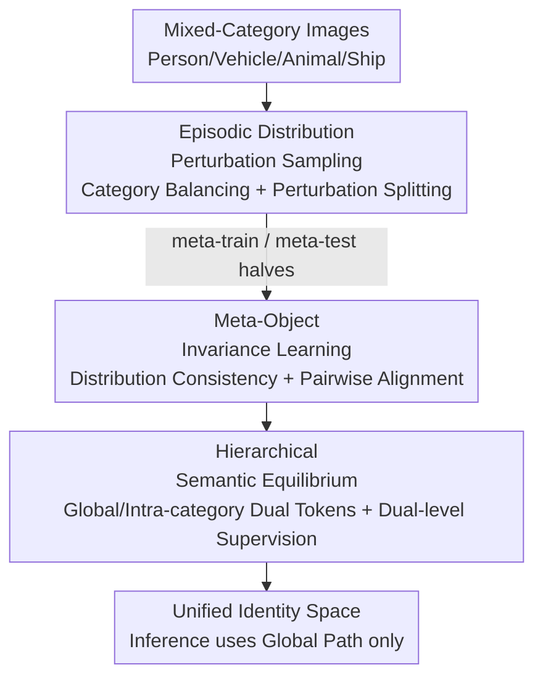

# Object-Generalized Re-Identification: A Step Towards Universal Instance Perception

**Conference**: CVPR 2026  
**Paper**: [CVF Open Access](https://openaccess.thecvf.com/content/CVPR2026/html/Chen_Object-Generalized_Re-Identification_A_Step_Towards_Universal_Instance_Perception_CVPR_2026_paper.html)  
**Code**: https://github.com/whucsy/OG-ReID  
**Area**: Object Detection / Instance Perception / Re-Identification  
**Keywords**: Object Re-Identification, Cross-Category Generalization, Meta-Learning, Semantic Invariance, Universal Instance Perception

## TL;DR
Proposes the Object-Generalized ReID (OG-ReID) paradigm—using a unified model to recognize the "same instance" of heterogeneous objects such as people, vehicles, animals, ships, and buildings. The MGOR framework is designed to reinterpret meta-learning as "semantic distribution regularization," outperforming existing ReID methods on 100+ unseen categories without target domain adaptation.

## Background & Motivation

**Background**: The task of object re-identification (ReID) is to recognize the "same individual" across different camera views and sensors. Over the past decade, person ReID and vehicle ReID have achieved high performance, with deep features and metric learning reaching remarkable instance-level accuracy within their respective categories.

**Limitations of Prior Work**: Almost all methods are built on a "category consistency hypothesis"—where training and testing data originate from the same category of objects. This implies that for every new object type (person, car, ship, animal...), an independent model must be trained, leading to expensive labeling, wasted computational resources, and poor scalability. In real-world scenarios (smart cities, ecological monitoring), vision systems must handle dozens of heterogeneous objects simultaneously; modeling them category-by-category is unsustainable.

**Key Challenge**: Can we directly use Domain Generalized ReID (DG-ReID)? No. DG-ReID addresses **domain shift** (changes in viewpoint and lighting for the same category), assuming all samples share the same semantic structure. However, OG-ReID faces **category shift**: humans are identified by body parts, vehicles by geometric contours, and animals by texture patterns—the "definition" of identity cues differs. This heterogeneity breaks the shared feature hypothesis, causing existing DG methods to generalize poorly on mixed categories, sometimes even performing worse than standard supervised models.

**Goal**: To learn a category-agnostic identity representation trained from mixed-category data that can directly transfer to completely unseen object categories for instance matching.

**Key Insight**: The authors revisit meta-learning. Previously, meta-learning was used to "simulate domain shifts and repeatedly adapt to synthetic domain partitions," which essentially remains adaptation at the appearance level. The observation is: if **meta-learning is viewed not as "adapting to new tasks" but as "maintaining identity discriminative power under shifting semantic distributions"**, it becomes a tool for learning semantic-invariant representations.

**Core Idea**: Reinterpreting meta-learning as **semantic distribution regularization**—actively creating controlled category distribution perturbations to force a balance between "semantic diversity" and "identity discriminative power." This allows invariance to emerge naturally as an **equilibrium state**, rather than being forced through explicit alignment or adversarial losses.

## Method

### Overall Architecture
The input to MGOR (Meta-Generalized Object Re-Identification) consists of mixed multi-category images (people/vehicles/animals/ships...), identity labels, and category labels. The output is a shared encoder $f_\theta$ that maps object images of any category to a unified identity space. At inference, only the global representation is used for retrieval. The pipeline revolves around "learning invariance under controlled semantic perturbation" through three progressive components: first, **EDPS** creates a controlled category distribution perturbation in each mini-batch and splits it into meta-train/meta-test halves; then, **MOIL** treats each episode as a "distribution consistency test," requiring the same parameters to maintain discriminative power before and after perturbation; finally, **HSE** uses dual tokens and dual-level supervision to balance category invariance and intra-category discrimination in the representation space.

### Key Designs

**1. Episodic Distribution Perturbation Sampling (EDPS): Creating controlled category perturbation per mini-batch**

Traditional ReID uses $P{\times}K$ sampling to ensure identity diversity within a batch but exerts no constraints on the **semantic composition** (the proportion of people, cars, animals, etc.). Consequently, the training process rarely encounters the "category ratio variations" it must generalize to. EDPS works by: first sampling a subset $S_b$ from the category set $S$, selecting at least two identities per category with $K$ images each to construct a **category-balanced, identity-paired** batch $B$; then, $B$ is divided into two non-overlapping halves $B^{\text{train}}, B^{\text{test}}$ such that $|B^{\text{train}}| = |B^{\text{test}}| = \tfrac{1}{2}|B|$. Each batch thus becomes a "controlled perturbation of category distribution"—where category proportions are artificially disrupted—repeatedly testing and regularizing the model's identity stability under evolving semantics. The key lies in "control": increasing the category disjoint probability between meta-train/meta-test trades off seen-category (MSMT17) accuracy for improved multi-category generalization, providing a tunable knob.

**2. Meta-Object Invariance Learning (MOIL): Resisting distribution perturbation with fixed parameters instead of re-adapting**

Once EDPS creates the perturbation, MOIL determines "how to learn from it." Its main difference from adaptation-based meta-learning (learning on meta-train then updating one step for meta-test) is the **refusal to let the model re-adapt to new category mixes**. Specifically: identity classification loss $L^{\text{train}}_{\text{id}}$ and metric loss $L^{\text{train}}_{\text{met}}$ (e.g., batch-hard triplet) are optimized on meta-train; then, **$\theta$ is frozen**, and $L^{\text{test}}_{\text{id}}$ is calculated on meta-test to verify if the same parameters remain stable under the new semantic composition. This turns "semantic invariance" into an explicit stability requirement for the same set of parameters $\theta$.

To further align the discriminative geometry before and after perturbation, MOIL introduces **Conditional Pairwise Alignment**: each representation is decomposed into an identity prototype plus a residual $z_i = \mu_{y_i} + r_i$, where $\mu_y = \tfrac{1}{|X(y)|}\sum_{x_j \in X(y)} f_\theta(x_j)$ is the identity prototype. The distributions of distances for same-identity and different-identity pairs are collected across the two splits and aligned using the 1D sliced Wasserstein distance $S(\cdot,\cdot)$:

$$L_{\text{pair}} = S\big(D^+_{\text{train}}, D^+_{\text{test}}\big) + S\big(D^-_{\text{train}}, D^-_{\text{test}}\big)$$

By applying lightweight constraints only within "semantically comparable pairing units" (identity prototypes or mini-clusters), the model preserves global semantic diversity while stabilizing the local discriminative geometry that supports identification, essentially requiring the distance distributions of positive and negative samples to be identical across perturbations.

**3. Hierarchical Semantic Equilibrium (HSE): Dual-token, dual-level supervision to balance "Cross-Category Invariance" and "Intra-Category Discrimination"**

OG-ReID contains a pair of contradictory goals: it must be category-agnostic (mapping identities of different objects to a unified space) while remaining intra-category discriminative (separating individuals within the same class). HSE decomposes the label space into two complementary levels: the global identity space is the disjoint union of identity sets $Y = \bigsqcup_{s \in S} Y_s$, with a projection $\pi: Y \to S$ assigning category labels; thus, a single representation $z$ receives two types of supervision—the **global view** treats all identities as mutually exclusive (ignoring category info), while the **intra-category view** performs fine-grained differentiation only within $Y_s$ (strengthening intra-class separation).

A ViT with two class tokens is implemented: the global token $c_G$ captures category-agnostic identity evidence, and the local token $c_L$ captures category-specific details. Both share the backbone and attend to the same patches, outputting $z_G$ and $z_L$ respectively to a global classifier $g$ and a set of category-conditional classifiers $\{g^{(s)}\}$. The losses are:

$$\ell_{\text{glob}}(x, y) = -\log g(z_G)_y, \qquad \ell_{\text{spec}}(x, \tilde{y}, s) = -\log g^{(s)}(z_L)_{\tilde{y}}$$

where $\tilde{y}$ is the local index within its category. Supervision is applied **asymmetrically**: meta-train uses both global and intra-category signals, while meta-test only verifies the stability of the global path under semantic perturbation. This allocates category-agnostic and category-sensitive factors to complementary subspaces with almost zero architectural overhead. Only the global path $z_G$ is used during inference. The total episode loss combines meta-train discrimination, meta-test stability, and HSE dual-level supervision, with backpropagation occurring once per episode.

### Loss & Training
The backbone is a ViT-B/16 pre-trained on ImageNet-1K. Inputs are resized to $256{\times}256$ with 10-pixel padding and 0.5 horizontal flip probability. Each iteration constructs an episode: a category-balanced meta-train batch ($P{\times}K, K=4$) and a category-perturbed meta-test batch, with a total batch size of 64. Optimized with SGD, initial LR $10^{-3}$, weight decay $10^{-4}$, one backpropagation per episode, training for 60 epochs.

## Key Experimental Results

Training utilizes 5 single-category datasets covering 5 domains (Pedestrian: Market-1501, Vehicle: VeRi, Marine: VesselReID, Animals: iPanda-50 / ATRW), totaling 2,092 identities and 72,317 images. Testing is conducted on 9 highly diverse datasets, including new settings for seen categories (Pedestrian: MSMT17, UAV-view vehicles: UAV-VeID) and unseen categories/tasks such as 69+ wildlife species, CUTE (50 lab object classes), University-1652 (Satellite-to-UAV building geolocation), and PetFace (fine-grained pet face ReID). All comparison methods except VICP (which requires 128 target domain images for adaptation) were reproduced under the same settings.

### Main Results

Average over 9 datasets (Single-class + Multi-class) (mAP / mINP / R1):

| Method | Type | Single-class Avg mAP | Multi-category Avg mAP | 9-Dataset Avg mINP | Avg R1 |
|------|------|------|------|------|------|
| TransReID (ICCV'21) | Domain-Specific | — | — | 14.9 | 45.9 |
| CLIP-ReID (AAAI'23) | Domain-Specific | — | — | 12.4 | 45.9 |
| PAT (ICCV'23) | Domain-Generalized | — | — | 15.3 | 47.6 |
| VICP† (ICCV'25) | Universal Object | — | — | 6.8 | 43.5 |
| **MGOR (Ours)** | OG-ReID | — | **32.9 (CUTE)** | **17.5** | **51.1** |

> The table represents combined averages for the nine datasets. MGOR boosts average mINP from PAT's 15.3 to 17.5 and average Rank-1 from 47.6 to 51.1. The advantage is more pronounced in multi-category scenarios (e.g., PetFace mAP 41.4 vs PAT 35.8, Wildlife71 mINP 54.5 vs PAT 46.8).

Key Observation: Many DG-ReID methods (ReNorm, BAU, ADSR) deteriorate significantly when jointly trained on multiple categories due to "semantic entanglement," sometimes performing worse than basic supervised models. VICP, which relies on target domain adaptation, performs well on single categories but drops sharply on mixed categories—confirming that a "unified representation without adaptation" is the correct solution for OG-ReID.

### Ablation Study

Incremental component additions across 6 datasets (mAP):

| Configuration | CUTE | MSMT17 | PetFace | Univ-1652 | Wildlife71 | ELPephants |
|------|------|--------|---------|-----------|------------|------------|
| Baseline (ViT/TransReID) | 23.3 | 14.2 | 31.5 | 13.5 | 83.3 | 11.8 |
| + EDPS & MOIL | 31.6 | 16.2 | 40.5 | 18.2 | 85.3 | 13.6 |
| + EDPS & MOIL & HSE (Full) | **32.9** | **18.1** | **41.4** | **19.5** | **86.0** | **14.0** |

### Key Findings
- **EDPS + MOIL are the primary drivers of Gain**: Adding just these two components jumps CUTE mAP from 23.3 to 31.6 (+8.3) and PetFace from 31.5 to 40.5 (+9.0), demonstrating that "controlled semantic perturbation + invariance learning without re-adaptation" effectively regularizes the feature space.
- **HSE provides the finishing touch**: Adding HSE further improves all six datasets (MSMT17 +1.9, Univ-1652 +1.3). Dual-level supervision stabilizes cross-category representations without sacrificing intra-category discrimination.
- **EDPS "disjoint probability" is a tunable knob**: Increasing the category disjointness between meta-train and meta-test benefits multi-category generalization at the cost of single-category (MSMT17) accuracy; EDPS offers more controlled category allocation compared to random PK sampling.
- **Visual Evidence**: t-SNE visualizations show that Ours' representations mix different domains (colors) more uniformly within each cluster with weaker domain boundaries, indicating the learning of more cross-domain invariant identity features.

## Highlights & Insights
- **Redefining the generalization axis for ReID**: While previous generalization focused on "domain shift" (appearance changes within the same category), this work is the first to treat "category shift" (fundamental differences in identity cues across categories) as the core problem, backed by a comprehensive 100+ category evaluation protocol.
- **Clever Re-framing of Meta-Learning**: Instead of using meta-learning for "new task adaptation," it is used as "semantic distribution regularization"—freezing parameters during meta-test to verify stability, allowing invariance to emerge as an equilibrium rather than through explicit alignment.
- **Near-Zero Cost Dual-Token Decoupling**: Using one global and one local token separates "category-agnostic identity" and "category-specific details" into complementary subspaces. Using only the global path at inference makes it highly efficient for deployment.
- **Distance Distribution Alignment via Sliced Wasserstein**: Aligning the **shapes of distance distributions** for positive/negative pairs, rather than directly aligning features, provides a more stable and lightweight conditional regularization for metric learning.

## Limitations & Future Work
- **Dependency on existing labeled data**: The authors acknowledge that training relies on labeled datasets, which have limited scale and category coverage—essentially "using 5 domains to generalize to 100+ categories," which caps the diversity of semantic perturbations.
- **Manual perturbation tuning**: The category disjoint probability in EDPS is a trade-off between seen and unseen categories and lacks an adaptive mechanism.
- **Lack of deep integration with Vision-Language Models (VLM)**: Utilizing VLMs for stronger semantic transfer is noted as a future direction; the current framework doesn't leverage open-vocabulary semantics from large-scale pre-training.
- **Improvement Ideas**: Introduce self-supervised or continual meta-learning to reduce label dependency, or use larger open benchmarks to expand the semantic perturbation space.

## Related Work & Insights
- **vs. DG-ReID (QAConv, PAT, ReNorm, etc.)**: These focus on "domain invariance" assuming shared semantics. Most DG methods degrade on mixed categories due to entanglement (e.g., ReNorm Avg mINP is only 7.5); this work solves category shift directly and leads on all averages.
- **vs. Adaptation-based Meta-Learning ReID**: Their primary assumption is that "repeatedly adapting to synthetic domain splits" is sufficient for generalization at the appearance level. This work **does not re-adapt** during meta-test, focusing instead on semantic invariance.
- **vs. VICP (ICCV'25, Universal Object ReID)**: VICP requires target domain samples for prompt adaptation and suffers on mixed categories (Wildlife71 mINP only 1.2). This work **requires zero target domain adaptation**, making it more stable and suitable for open-world "plug-and-play" scenarios.
- **vs. CLIP-ReID**: CLIP-ReID's cross-category priors make it slightly better on MSMT17, but this work is more consistent across nine diverse domains. Combining the two is a natural next step.

## Rating
- Novelty: ⭐⭐⭐⭐⭐ First to identify OG-ReID category shift and reinterpret meta-learning as semantic distribution regularization.
- Experimental Thoroughness: ⭐⭐⭐⭐ Extensive testing across 9 datasets, 100+ categories, and cross-task evaluation, though training diversity is limited by the 5 source domains.
- Writing Quality: ⭐⭐⭐⭐ Clear motivation and component progression; formulas are complete.
- Value: ⭐⭐⭐⭐⭐ A significant step toward universal identity perception with direct applications in smart cities and ecological monitoring.

<!-- RELATED:START -->

## Related Papers

- [\[CVPR 2026\] AR²-4FV: Anchored Referring and Re-identification for Long-Term Grounding in Fixed-View Videos](ar2-4fv_anchored_referring_and_re-identification_for_long-term_grounding_in_fixe.md)
- [\[CVPR 2026\] FSLoRA: Harmonizing Detection and Re-Identification via Freq-Spatial Low-Rank Adapter for One-Stage Person Search](fslora_harmonizing_detection_and_re-identification_via_freq-spatial_low-rank_ada.md)
- [\[CVPR 2026\] Mining Instance-Centric Vision-Language Contexts for Human-Object Interaction Detection](mining_instance-centric_vision-language_contexts_for_human-object_interaction_de.md)
- [\[CVPR 2026\] Prompt-Free Universal Region Proposal Network](prompt-free_universal_region_proposal_network.md)
- [\[CVPR 2026\] Learning to Track Instance from Single Nature Language Description](learning_to_track_instance_from_single_nature_language_description.md)

<!-- RELATED:END -->
