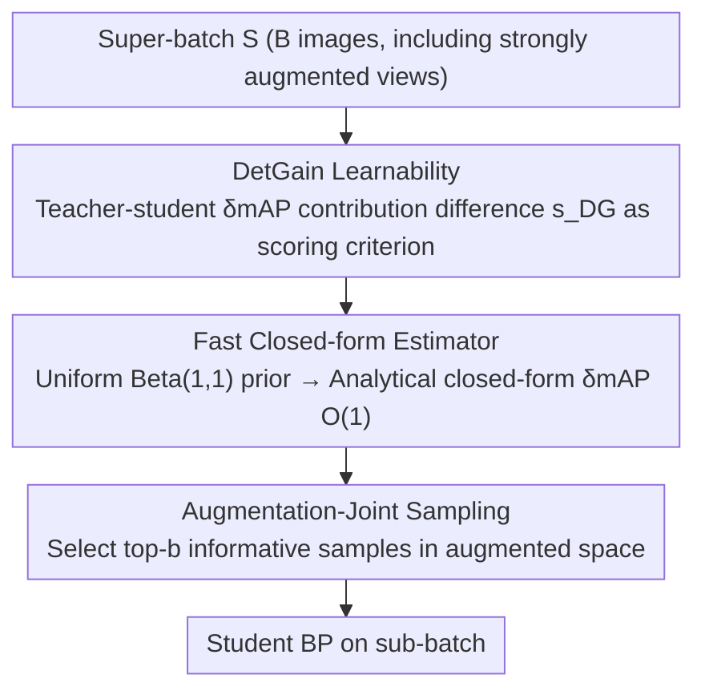

# Online Data Curation for Object Detection via Marginal Contributions to Dataset-level Average Precision

**Conference**: CVPR 2026  
**Paper**: [CVF Open Access](https://openaccess.thecvf.com/content/CVPR2026/html/Sun_Online_Data_Curation_for_Object_Detection_via_Marginal_Contributions_to_CVPR_2026_paper.html)  
**Code**: To be confirmed  
**Area**: Object Detection / Online Data Curation / Data-efficient Learning  
**Keywords**: Online Data Curation, Object Detection, Marginal mAP Contribution, Teacher–Student Learnability, Plug-and-play Sampling

## TL;DR
DetGain is the first truly effective online data curation method for object detection. Instead of relying on unstable training losses, it estimates the "marginal contribution" of each image to the "dataset-level mAP." By using the teacher–student contribution difference as the learnability signal to select the most informative samples in each iteration, it is architecture-agnostic and plug-and-play. It brings stable improvements of up to +2.7 mAP for various detectors on COCO and up to +6.9 mAP under low-quality data.

## Background & Motivation

**Background**: In the scaling-law era, high-quality data is the primary driver of performance. Carefully curated datasets often match or exceed larger uncurated datasets with lower computational costs. **Online data curation** takes this further by dynamically deciding "which samples to learn next" based on the current model state during training. In classification and multimodal contrastive learning, a common approach is to use "learnability" scoring: the loss difference between a **pre-trained teacher** and the **current student**. Samples where the teacher performs well (low loss) but the student struggles (high loss) are considered to contain residual knowledge and are prioritized.

**Limitations of Prior Work**: This online curation has rarely achieved quantifiable improvements in object detection for two reasons. First, **defining a "score for a single image" is difficult in detection**: an image may contain zero or multiple instances, some informative and others noisy or ambiguous. Second, **detection loss is inherently unstable**: it consists of heterogeneous terms (classification, localization, centerness, etc.) and is affected by stochastic proposal sampling/assignment rules (e.g., RPN, Hungarian matching). This causes the loss to fluctuate and drift significantly between iterations, architectures, and even within the same image. Consequently, loss-based "learnability" is unreliable in detection, and directly applying general curation metrics leads to a severe domain gap.

**Key Challenge**: Online curation requires a score for each image that is **stable, comparable, and aligned with evaluation targets**. However, detection loss is neither stable nor directly aligned with mAP, and existing proposal/anchor-level sampling (e.g., ATSS, Focal Loss) is tightly coupled with architectures, providing per-RoI gradients rather than image-level selection signals.

**Goal**: Design an image-level, architecture-agnostic online curation score for object detection that is aligned with dataset-level mAP and computationally efficient for real-time use.

**Key Insight**: Since the final evaluation metric is mAP, **directly use "the marginal contribution of this image to the global mAP"** as the learnability signal. This bypasses unstable losses by moving the "hard task of mAP optimization" from the gradient stage to the data sampling stage.

**Core Idea**: Score the learnability of each image using the teacher-student difference in "marginal contributions to dataset-level mAP": $s_{DG}=\delta mAP(x;f_t,D)-\delta mAP(x;f_s,D)$. Use an analytical closed-form solution under a uniform prior to achieve $O(1)$ real-time computation.

## Method

### Overall Architecture
DetGain is a plug-and-play online sampler that **only modifies the data pipeline without changing the model architecture, loss, optimizer, or training schedule**. In each iteration, it first loads a "super-batch" $S$ ($B$ images). The goal is to select a smaller, more informative sub-batch $B=\{x_i\}_{i=1}^b\subset S$ for gradient updates, where the selection ratio is $k=b/B$. For each image in the super-batch, progress is made through the **fixed pre-trained teacher** $f_t$ and the **current student** $f_s$ to obtain predicted boxes with confidence scores, classes, and IoUs with ground truth (GT). Based on this, the marginal perturbation $\delta mAP$ to the global mAP is estimated for each image. The difference between teacher and student is taken as the learnability score to select the top-$b$ samples for backpropagation. To prevent the "collapse into a narrow subspace" caused by only picking high-learnability samples, **strong online augmentation** is added, passing samples into an augmented space before sub-sampling.

### Key Designs

**1. DetGain Learnability: Replacing Unstable Loss with mAP-aligned Contribution**

To address the issues of detection loss instability and misalignment with mAP, the authors redefine learnability as a metric-driven signal. For a dataset $D$ and detector $f$, the COCO-style mAP is averaged over classes $C$ and IoU threshold set $T$: $mAP(f;D)=\frac{1}{|C||T|}\sum_{c}\sum_{\tau}AP_{c,\tau}(f;D)$. The **DetGain** of a candidate image $x$ is defined as the marginal perturbation to the mAP after merging it into the dataset: $\delta mAP(x;f,D)\triangleq mAP(f;D\cup\{x\})-mAP(f;D)$. This measures how the true/false positives (TP/FP) of $x$ and their rankings reshape the global precision–recall curve. Learnability is then the difference: $s_{DG}(x)=\delta mAP(x;f_t,D)-\delta mAP(x;f_s,D)$. A high value implies the teacher's contribution to global mAP exceeds the student's, indicating the student lags in "dataset-level utility" and the image contains residual knowledge. Given a super-batch, images are ranked to select top-$b$. An additive approximation $\delta mAP(B;f,D)\approx\sum_{x\in B}\delta mAP(x;f,D)$ (valid when $b\ll|D|$) enables per-image online scoring.

**2. Fast Closed-form DetGain Estimator: O(1) Solution via Uniform Prior**

Precisely calculating marginal mAP updates per iteration is expensive and noisy due to the ranking-based, non-continuous nature of AP. The authors treat each detection from a single image as a small perturbation to the global accumulated TP/FP counts $(T,F)$. They model the score distribution of TP/FPs continuously over the "confidence threshold domain": let the threshold $u\in(0,1)$ sweep from high to low, where TP/FP counts above the threshold are $C_{TP}(u)=T(1-F_{TP}(u))$ and $C_{FP}(u)=F(1-F_{FP}(u))$. This allows expressing the marginal change in AP, $\delta^{TP}_{AP}(s)$ and $\delta^{FP}_{AP}(s)$, when inserting a TP or FP with score $s$. The final image-level aggregation is $\delta mAP(x)\approx\frac{1}{|C||T|}\sum_c\sum_\tau\sum_j[\,y_{j,\tau}\delta^{TP}_{AP}(s_j)+(1-y_{j,\tau})\delta^{FP}_{AP}(s_j)\,]$. A critical engineering simplification is setting all TP/FP scores to follow a **Uniform distribution $Beta(1,1)$** (i.e., $f_{TP}\equiv f_{FP}\equiv 1$), which removes the need to fit distributions per model and results in a **compact closed-form solution**:

$$\delta^{TP}_{AP}(s)=\frac{1}{T^{GT}_c}\!\left[\frac{T(1-s)+1}{A(1-s)+1}+\frac{TF}{A^2}\ln\frac{A+1}{A(1-s)+1}\right],\quad \delta^{FP}_{AP}(s)=-\frac{T^2}{T^{GT}_c A^2}\ln\frac{A+1}{A(1-s)+1}$$

Where $A=T+F$, and $T^{GT}_c$ is the total GT count for class $c$. These functions are monotonic with $s$ (TP increasing, FP decreasing), with a complexity of $O(1)$ per detection and $O(m)$ per image. The uniform prior is equivalent to a "maximum entropy/random guess" baseline; DetGain quantifies the current detector's improvement over this naive prediction. Since selection is based on the difference between teacher and student DetGain, both compared against the same neutral baseline, the **induced ranking is stable** even if the absolute values are approximations.

**3. Augmentation-Joint Sampling: Preventing Collapse via Augmented Space**

Pure online sampling is prone to overfitting: repeatedly picking high-learnability samples can collapse training into a narrow subspace of the training set, causing training mAP to surge while validation mAP stagnates. Existing methods mitigate this using hold-out teachers or augmented datasets, requiring extra data or splits. The authors propose a simpler alternative: apply a **strong online augmentation** operator $A(\cdot)\sim\lambda$ to each sample before DetGain scoring. This expands the data space before sub-sampling. This paired design simplifies the RHO-style setup—**the teacher is trained on clean data, while the student learns from augmented views, requiring no hold-out split**. This combination significantly expands the sampling space, allowing the sampler to filter out low-quality augmentations while focusing on informative regions.

### Loss & Training
The method introduces no new loss—it operates at the data pipeline level. Training follows default detector configurations (MMDetection) with an effective batch size of 16. During online sampling, a super-batch of 80 images is assembled per iteration, and the top 20% (16 images) based on the teacher-student DetGain difference are selected for backpropagation. CNN detectors use a 1× schedule ($\approx 90,000$ iters, SGD), and Deformable DETR uses a 50-epoch schedule ($\approx 3.7 \times 10^5$ iters, AdamW). The student typically uses a ResNet-50 backbone, and the teacher uses a larger backbone (Res101/Res152) pre-trained on the same training set.

## Key Experimental Results

### Main Results (COCO val2017, Student ResNet-50; +DetGain Select Ratio 20% + Strong Aug.)
| Detector | Type | Baseline AP | +Data Aug. AP | +DetGain AP |
|--------|------|-------------|---------------|-------------|
| Faster R-CNN | Two-stage, anchor | 37.5 | 37.5 (+0.1) | **40.0 (+2.5)** |
| ATSS | One-stage, anchor | 39.2 | 38.6 (−0.8) | 41.5 (+2.3) |
| FCOS | One-stage, anchor-free | 38.2 | 38.2 (+0.0) | **41.0 (+2.8)** |
| GFL | One-stage, anchor | 40.2 | 40.3 (+0.1) | 42.0 (+1.8) |
| VFNet | One-stage, anchor | 40.7 | 40.3 (−0.4) | 42.9 (+2.2) |
| Deform. DETR | DETR, anchor-free | 46.6 | 47.5 (+0.9) | 48.9 (+2.3) |

Average gain across six detectors is $\approx +2.0$ mAP with **changes only to the sampling strategy**. Strong augmentation alone often provides no benefit or even hurts (e.g., ATSS −0.8), but DetGain enables filtering of low-quality augmentations for stable gains.

### Comparison with Other Online Sampling Metrics (COCO val2017, AP)
| Sampling Metric | Faster R-CNN | FCOS | ATSS |
|----------|-------------|------|------|
| Uniform (Baseline) | 37.3 | 38.2 | 39.4 |
| Loss (hard mining) | 36.3 | 34.5 | 37.7 |
| GradNorm | 37.4 | 38.4 | 39.3 |
| Image-AP | 38.3 | 39.4 | 40.0 |
| Loss-learnability | 38.9 | 38.1 | 40.4 |
| **DetGain (ours)** | **40.0** | **40.9** | **41.6** |

Loss/gradient-based metrics fluctuate significantly due to internal loss scales and dynamics (hard mining even performs worse than baseline). DetGain is the most consistent and highest across architectures due to its direct alignment with dataset-level mAP.

### Ablation Study: Complementarity of Augmentation and Online Sampling
| Strong Aug. | Online Sampling | Train AP | Val AP |
|--------|----------|----------|--------|
| ✗ | ✗ | 44.6 | 37.4 |
| ✗ | ✓ | 50.3 (+5.7) | 37.3 (−0.1) |
| ✓ | ✗ | 40.4 (−4.2) | 37.5 (+0.1) |
| ✓ | ✓ | 45.3 (+0.7) | **39.9 (+2.5)** |

### Key Findings
- **Sampling and Augmentation are both indispensable**: Sampling only $\rightarrow$ Train +5.7, Val −0.1 (typical collapse overfitting); Augmentation only $\rightarrow$ lack of focus, no gain. Combining both yields +2.5 Val gain.
- **Robustness to Annotation Noise**: DetGain is more stable than loss-learnability and uniform baselines when injecting false boxes, deleting boxes, or perturbing labels, yielding up to +6.9 mAP under low-quality data.
- **Stronger Teacher leads to Better Student**: As teacher backbone scales from Res50 $\rightarrow$ Res101 $\rightarrow$ Res152, Faster R-CNN gains increase from +2.2 $\rightarrow$ +2.5 $\rightarrow$ +2.6, suggesting "sampling curation $\approx$ implicit knowledge distillation."
- **Complementary to KD**: DetGain alone matches PKD/CrossKD performance and is less sensitive to teacher strength. Combining it with CrossKD on FCOS-Res101 reaches 42.2 (+3.7)—KD transfers feature-level knowledge, while DetGain enhances sample-level quality.
- **Minimal Cost of Uniform Prior**: The Spearman $\rho$ between the $Beta(1,1)$ closed-form and model-fitted Beta prior ranking is $\approx 0.94$. Downstream performance is nearly identical, but the former is $O(1)$ and requires no fitting.

## Highlights & Insights
- **Moving "mAP Optimization" from Gradient Stage to Sampling Stage**: mAP is non-smooth, non-decomposable, and difficult as a direct training objective. DetGain keeps mAP as the target but uses it only for data selection, bypassing the gradient difficulty—this "metric-as-selector" idea is transferable to any task where evaluation metrics are hard to use as loss functions.
- **Uniform Prior Closed-form Solution**: Using a maximum entropy distribution provides $O(1)$ analytical computation, eliminates per-model fitting, and is architecture-agnostic. Since the final metric is the teacher-student difference, absolute accuracy is secondary to stable ranking.
- **Clean Teacher / Augmented Student**: This configuration eliminates the need for hold-out splits used in RHO-LOSS, making it more efficient for engineering pipelines.
- **Zero-Intrusion Pipeline**: Being a pure data pipeline modification, it正交 (orthogonally) stacks with proposal-level sampling (ATSS/Focal Loss) and feature-level KD (PKD/CrossKD).

## Limitations & Future Work
- **Extra Training Overhead**: Pre-sampling requires additional forward passes for both teacher and student on the super-batch, increasing training time.
- **Simple Augmentations**: Current strong augmentation operators are basic; better strategy designs could further improve performance.
- **Uniform Prior Approximation**: Absolute DetGain values are inaccurate (only ranking is reliable), which might limit its use in scenarios requiring exact marginal contribution values.
- **Future Directions**: Adaptive/learnable augmentations, reducing forward overhead for pre-sampling, and verification on longer schedules and more diverse backbones.

## Related Work & Insights
- **vs RHO-LOSS / JEST / ACED (loss-learnability)**: These use teacher-student loss differences, which are effective in classification but unstable in detection. DetGain replaces these with mAP-aligned signals for stable gains.
- **vs Active Learning / Offline Coreset (CDAL, MI-AOD, etc.)**: These are mostly offline or semi-offline and aim to "match full supervision with minimal labels." DetGain performs real-time online sampling on fully labeled data.
- **vs Image-AP (Teacher-student difference of per-image AP)**: Image-AP is discrete and local; DetGain estimates continuous marginal contributions to the **global mAP**, resulting in more stable ranking and higher performance.
- **vs ATSS / Focal Loss (Proposal/Anchor sampling)**: Those are coupled with architecture and operate on per-RoI gradients, failing to provide image-level selection signals. DetGain decouples data flow from model internals, allowing migration across detector families.

## Rating
- Novelty: ⭐⭐⭐⭐⭐ First truly effective image-level online curation for detection; "marginal mAP contribution + uniform prior closed-form" is a novel and self-consistent approach.
- Experimental Thoroughness: ⭐⭐⭐⭐⭐ Covers 6 detectors, compares with multiple sampling metrics, includes noise robustness, KD complementarity, and prior ranking consistency.
- Writing Quality: ⭐⭐⭐⭐ Motivation and derivation are clear, though the closed-form derivation is dense.
- Value: ⭐⭐⭐⭐⭐ Plug-and-play, architecture-agnostic, and stackable with KD; high general value for data-efficient detection training.

<!-- RELATED:START -->

## Related Papers

- [\[CVPR 2025\] Interpreting Object-level Foundation Models via Visual Precision Search](../../CVPR2025/object_detection/interpreting_object-level_foundation_models_via_visual_precision_search.md)
- [\[CVPR 2026\] Reasoning-Driven Anomaly Detection and Localization with Image-Level Supervision](reasoning-driven_anomaly_detection_and_localization_with_image-level_supervision.md)
- [\[CVPR 2026\] Heuristic-inspired Reasoning Priors Facilitate Data-Efficient Referring Object Detection](heuristic-inspired_reasoning_priors_facilitate_data-efficient_referring_object_d.md)
- [\[CVPR 2026\] HeROD: Heuristic-inspired Reasoning Priors Facilitate Data-Efficient Referring Object Detection](herod_heuristic_inspired_reasoning_data_efficient_rod.md)
- [\[CVPR 2026\] Toward Generalizable Whole Brain Representations with High-Resolution Light-Sheet Data](toward_generalizable_whole_brain_representations_with_high-resolution_light-shee.md)

<!-- RELATED:END -->
