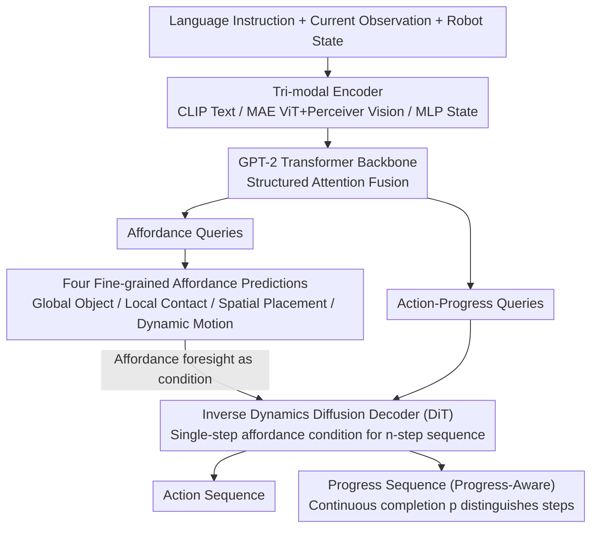

# PALM: Progress-Aware Policy Learning via Affordance Reasoning for Long-Horizon Robotic Manipulation

**Conference**: CVPR 2026  
**arXiv**: [2601.07060](https://arxiv.org/abs/2601.07060)  
**Code**: [Project Page](https://plan-lab.github.io/palm)  
**Area**: Object Detection / Robotic Manipulation / VLA Model  
**Keywords**: Long-horizon manipulation, affordance reasoning, progress-awareness, vision-language-action model, Diffusion Transformer

## TL;DR

Ours proposes PALM, a unified VLA framework that uses structured fine-grained affordance predictions (global, local, spatial, and dynamic) as implicit reasoning anchors, combined with continuous sub-task progress estimation for seamless task switching. It achieves an average completion length of 4.48 on CALVIN ABCD (surpassing Prev. SOTA by 12.5%), a 91.8% success rate on LIBERO-LONG, and over 2x the baseline performance in real-world long-horizon generalization tests.

## Background & Motivation

1. **Background**: VLA models have made significant progress in short-horizon manipulation, represented by autoregressive (OpenVLA, RT series), diffusion-based (Diffusion Policy, $\pi_0$), and predictive (Seer) methods. However, they struggle with long-horizon, multi-step tasks.

2. **Limitations of Prior Work**: (1) Lack of structured affordance cues—the model does not know "which object to manipulate next, which part to touch, where to place it, or what motion to use"; (2) Lack of internal sub-task progress tracking—visually similar states may correspond to different action stages, leading to common long-horizon failure modes such as repeated actions, skipped steps, or premature termination.

3. **Key Challenge**: Standard behavior cloning mixes demonstrations from different task stages during training, which collapses stage differences. Visually similar states at different stages become indistinguishable, resulting in policy instability during long-horizon execution.

4. **Goal**: (1) Provide the policy with explicit, structured affordance representations as "reasoning anchors"; (2) Introduce continuous sub-task progress signals to eliminate stage ambiguity and stabilize long-horizon execution.

5. **Key Insight**: Construct a closed loop of perception-action-progress. Affordance prediction serves as an "intermediate implicit reasoning step," while progress signals act as a "temporal regularizer."

6. **Core Idea**: Use four types of affordances to perform structured predictions of future interaction scenarios, and then jointly generate action and progress sequences using a progress-aware inverse dynamics model.

## Method

### Overall Architecture

PALM addresses the issue where standard VLAs "look right but don't know what to do next" in long-horizon tasks. It inserts a structured "interaction prediction" layer between perception and action, using a progress scalar to anchor the execution rhythm. The pipeline operates as follows: language instruction $l$, current observation $o_t$, and robot state $s_t$ are encoded (CLIP for text, MAE ViT + Perceiver Resampler for vision, MLP for state) and concatenated as tokens for a GPT-2 Transformer backbone for structured attention fusion. This fused context drives two sets of learnable queries: fine-grained affordance queries predicting future interaction cues $\hat{\mathbf{F}}_{t+n}$, and action-progress queries that take affordances as conditions for a Diffusion Transformer (DiT) inverse dynamics model to decode future $n$-step action sequences $\hat{a}_{t:t+n-1}$ and progress sequences $\hat{p}_{t:t+n-1}$. Essentially, affordance is the implicit reasoning step for "what, where, and how," while progress is the temporal ruler across these $n$ steps.

### Key Designs

**1. Four Fine-grained Affordance Predictions: Breaking down "what to do next" into four concrete supervised problems**

A direct cause of long-horizon failure is the lack of structured interaction cues. PALM avoids vague "future representations" and instead uses four specialized sub-queries to answer specific questions, with supervision signals distilled from existing tools: **Global** uses Grounding DINO + SAM to produce target object segmentation masks ("which object"); **Local** converts contact points into Gaussian heatmaps ("which part"); **Spatial** uses SpatialVLM + RoboPoint to sample placement candidates supervised by set matching loss ("where to place"); **Dynamic** tracks motion trajectories via CoTracker to extract dynamic regions supervised by VAE reconstruction loss ("how to move"). These categories complement each other—semantics define the object, geometry defines contact, spatial defines placement, and dynamics define motion—providing the policy with task-relevant scene priors more compact and aligned with control than full-frame future image prediction.

**2. Progress-Aware Policy: Distinguishing "visually similar but different stage" states with a scalar**

Long-horizon manipulation suffers from stage ambiguity—e.g., a gripper hovering over a cup could mean "about to grasp" or "just released," which look nearly identical but require opposite actions. PALM addresses this by appending a continuous completion value $p_t \in [0,1]$ to the action output, requiring the policy to jointly predict $(a_t, p_t)$. This scalar acts as a temporal regularizer, forcing latent states to evolve monotonically along sub-tasks. Consequently, visually similar states with different progress are separated in the representation space, enabling smooth sub-task transitions. Supervision comes from human-annotated progress labels and signals extracted from semantic segmentation of long-horizon videos (EPIC-KITCHENS, RoboCerebra). This eliminates the need for an independent high-level planner.

**3. Inverse Dynamics Diffusion Transformer Decoding: Scaling "two frames for one action" to "one affordance for n-step action-progress"**

Traditional inverse dynamics infer a single action from adjacent frames. PALM extends this paradigm: conditioned on current input plus single-step affordance latent variables, it infers an $n$-step action-progress sequence using a DiT for conditional denoising:

$$(\hat{a}_{t:t+n-1},\ \hat{p}_{t:t+n-1}) = \text{DiT}(l,\ o_t,\ s_t,\ \hat{\mathbf{F}}_{t+n})$$

Training utilizes standard diffusion denoising objectives. Diffusion is chosen over regression because manipulation actions are often multi-modal (multiple valid trajectories for one scene); diffusion models this multi-modality effectively and generates smoother temporal trajectories consistent with the progress signal.

### Loss & Training

- Affordance Loss: $\mathcal{L}_{global}$ (Focal + Dice), $\mathcal{L}_{local}$ (Focal + KL), $\mathcal{L}_{spatial}$ (Set Matching L2), $\mathcal{L}_{dynamic}$ (VAE ELBO)
- Action-Progress Loss: Standard diffusion denoising loss $\mathcal{L}_{DiT}$
- Training Strategy: Large-scale pre-training (DROID + BridgeV2 + EPIC-KITCHENS + RoboCerebra) → Fine-tuning (942 human-annotated trajectories)
- Backbone: GPT-2 Transformer, 384-dim, 24 layers, 12 heads
- Vision: MAE ViT-B + Perceiver Resampler

## Key Experimental Results

### Main Results

CALVIN ABCD (1000 rollouts/task):

| Method | 1 Task | 2 Tasks | 3 Tasks | 4 Tasks | 5 Tasks | Avg.Len. ↑ |
|------|-------|-------|-------|-------|-------|-----------|
| OpenVLA | 91.3% | 77.8% | 62.0% | 52.1% | 43.5% | 3.27 |
| $\pi_0$ | 93.8% | 85.0% | 76.7% | 68.1% | 59.9% | 3.92 |
| Seer | 94.4% | 87.2% | 79.9% | 72.2% | 64.3% | 3.98 |
| PALM (w/o progress) | 95.3% | 85.6% | 79.5% | 74.3% | 67.0% | 4.02 |
| **PALM** | **96.9%** | **93.8%** | **89.3%** | **85.9%** | **82.0%** | **4.48** |

LIBERO Full Suite (3 seeds × 500 episodes):

| Method | Average | Spatial | Object | Goal | Long |
|------|------|---------|--------|------|------|
| CoT-VLA | 81.1% | 87.5% | 91.6% | 87.6% | 69.0% |
| CoA-VLA | 79.8% | 85.3% | 93.1% | 85.8% | 55.0% |
| **PALM** | **94.5%** | **95.2%** | **96.7%** | **94.3%** | **91.8%** |

### Ablation Study

Ablation on CALVIN ABCD:

| Ablation | Pre-training Avg.Len. | Fine-tuning Avg.Len. |
|------|----------------|--------------|
| PALM (Full) | 4.48 | 4.48 |
| w/o Affordance Foresight | 3.90 | 3.58 |
| w/o Inverse Dynamic | 4.17 | 3.92 |
| w/o Progress Prediction | 3.73 | 4.02 |

Real-world long-horizon generalization (6-step continuous tasks):

| Generalization Setting | OpenVLA Avg.Len. | Octo Avg.Len. | PALM Avg.Len. |
|---------|-----------------|--------------|--------------|
| Random Position | 0.95 | 0.65 | **3.05** |
| Visual Distraction | 1.60 | 0.95 | **3.80** |
| Unseen Lighting | 1.25 | 1.05 | **3.55** |

### Key Findings

- **Progress prediction is core for long-horizon generalization**: Removing progress prediction drops the CALVIN 5-task success rate from 82.0% to 67.0% (-15%). The drop is even more significant in pre-training (4.48→3.73), indicating that large-scale long-horizon video data is particularly beneficial for learning progress priors.
- **Affordance prediction is critical in the fine-tuning stage**: Removing affordance drops fine-tuning Avg.Len. from 4.48 to 3.58 (the largest drop), showing that structured affordances are indispensable for adaptation to downstream robot data.
- **Cumulative contribution of four affordance types**: Performance improves step-by-step from Global→Local→Spatial→Dynamic, with dynamic affordance (motion area prediction) providing the final incremental Gain.
- **22.8% Gain on LIBERO-LONG**: Performance increases from 69.0% (CoT-VLA) to 91.8%, proving the advantage of affordance + progress in challenging long-horizon scenarios.
- **Real-world generalization is ~2-3x baseline**: Across three generalization settings, PALM consistently achieves an Avg.Len. 2-3 times that of OpenVLA.

## Highlights & Insights

- **Elegant closed-loop design**: The cycle of perception (affordance prediction) → action (diffusion policy) → progress (sub-task tracking) is clearly divided into functional modules but tightly coupled through a shared Transformer backbone.
- **Progress signal resolves stage ambiguity**: This simple yet effective regularization—a single scalar $p_t \in [0,1]$—significantly improves long-horizon performance and can be transferred to any long-horizon policy learning task.
- **Reasonable structured attention**: Affordance sub-queries attend only to context tokens (maintaining decoupling), while action queries attend to both context and affordances (obtaining conditional info). 

## Limitations & Future Work

- Supervision for affordances relies on multiple off-the-shelf tools (DINO/SAM/SpatialVLM/CoTracker), making the pipeline complex.
- The four categories of affordance are manually defined and may miss other important interactive cues (e.g., force/tactile, audio).
- Fine-tuning uses only 942 annotated trajectories + 200 real demos; while efficient, generalization to entirely new task types needs further validation.
- Real-world evaluation is limited to single-arm tabletop tasks; dual-arm or mobile manipulation remains untested.

## Related Work & Insights

- **vs Seer**: Seer predicts future images as foresight; PALM predicts structured affordance (more compact, task-relevant). CALVIN Avg.Len. improves from 3.98 to 4.48.
- **vs $\pi_0$**: Both use diffusion policies, but $\pi_0$ lacks explicit affordance and progress signals; PALM improves CALVIN 5-task success from 59.9% to 82.0%.
- **vs CoT-VLA/CoA/TraceVLA**: Various methods enhance VLA reasoning (CoT/chains/traces), but none track progress, leading to significant Gaps on LIBERO.
- The combination of progress signals + affordance prediction is transferable to other fields requiring long-term planning, such as autonomous driving.

## Rating

- Novelty: ⭐⭐⭐⭐ The combination of affordance prediction and progress estimation is a novel closed-loop design, though sub-components (MAE/CLIP/DiT) are mature.
- Experimental Thoroughness: ⭐⭐⭐⭐⭐ Comprehensive evaluation on two major benchmarks and three real-world settings with complete ablations.
- Writing Quality: ⭐⭐⭐⭐ Clear structure and rich illustrations, though the technical depth requires careful reading.
- Value: ⭐⭐⭐⭐⭐ Significant improvement in the core challenge of long-horizon manipulation; the progress signal concept is widely applicable.

<!-- RELATED:START -->

## Related Papers

- [\[CVPR 2026\] RC-NF: Robot-Conditioned Normalizing Flow for Real-Time Anomaly Detection in Robotic Manipulation](rc-nf_robot-conditioned_normalizing_flow_for_real-time_anomaly_detection_in_robo.md)
- [\[CVPR 2026\] PaQ-DETR: Learning Pattern and Quality-Aware Dynamic Queries for Object Detection](paq-detr_learning_pattern_and_quality-aware_dynamic_queries_for_object_detection.md)
- [\[CVPR 2026\] CHAL: Causal-guided Hierarchical Anomaly-aware Learning for Moving Infrared Small Target Detection](chal_causal-guided_hierarchical_anomaly-aware_learning_for_moving_infrared_small.md)
- [\[CVPR 2026\] Bidirectional Multimodal Prompt Learning with Scale-Aware Training for Few-Shot Multi-Class Anomaly Detection](bidirectional_multimodal_prompt_learning_with_scale-aware_training_for_few-shot_.md)
- [\[CVPR 2026\] GS-CLIP: Zero-shot 3D Anomaly Detection by Geometry-Aware Prompt and Synergistic View Representation Learning](gs-clip_zero-shot_3d_anomaly_detection_by_geometry-aware_prompt_and_synergistic_.md)

<!-- RELATED:END -->
