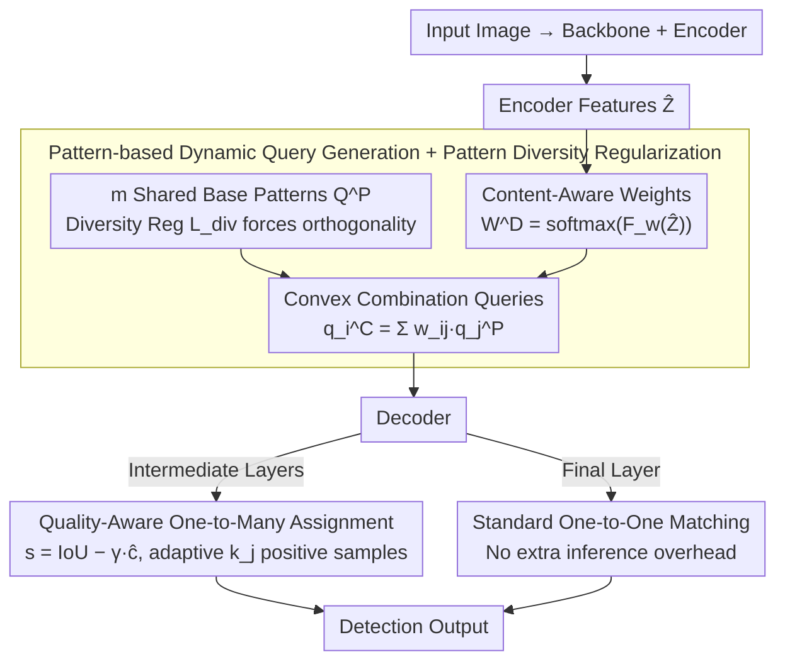

# PaQ-DETR: Learning Pattern and Quality-Aware Dynamic Queries for Object Detection

**Conference**: CVPR 2026  
**arXiv**: [2603.06917](https://arxiv.org/abs/2603.06917)  
**Code**: None  
**Area**: Object Detection  
**Keywords**: DETR, Dynamic Queries, Pattern Learning, Quality-Aware Assignment, Object Detection

## TL;DR
PaQ-DETR proposes dynamic query generation based on shared patterns (content-aware weighted combinations of shared base patterns) combined with quality-aware one-to-many assignment (adaptive positive sample selection based on localization-classification consistency). This uniformly addresses the imbalance in query representation and supervision in DETR, achieving stable gains of 1.5%-4.2% mAP across various backbones.

## Background & Motivation
1. **Background**: DETR redefines object detection as a set prediction task but still relies on fixed learnable queries and suffers from severe query utilization imbalance.
2. **Limitations of Prior Work**: (i) Static queries lack adaptability to input images; (ii) content-dependent dynamic queries improve flexibility but introduce semantic instability; (iii) one-to-one matching leads to extremely sparse supervision—only a few "winning" queries consistently receive strong gradients.
3. **Key Challenge**: Imbalance in query representation and supervision are two sides of the same issue—a minority of queries capture most gradients (Gini coefficient as high as 0.97), while most queries are weakly optimized or idle.
4. **Goal**: Design a unified framework to simultaneously improve query adaptability and supervision balance.
5. **Key Insight**: Represent queries as convex combinations of shared patterns (modulated by encoder features) while increasing positive samples using quality-aware assignment.
6. **Core Idea**: Shared base patterns + content-aware weights → gradient sharing to mitigate imbalance; Quality-aware one-to-many assignment → enriched supervision signals.

## Method

### Overall Architecture
PaQ-DETR aims to resolve two long-standing issues in DETR: non-adaptive query representation and sparse supervision signals. It treats these as a single structural problem caused by one-to-one matching—where a few queries monopolize gradients (Gini coefficient up to 0.97) while others remain idle. Based on this observation, two modules are added atop the standard DETR encoder-decoder: after the encoder produces image features, the "Pattern-based Dynamic Query Generation" module uses a set of shared semantic base patterns to create queries as weighted combinations based on image content, using a diversity regularizer to ensure the patterns are orthogonal and non-degenerate. After these queries enter the decoder, a "Quality-Aware One-to-Many Assignment" dynamically determines the number of positive samples for each GT based on prediction quality. This is applied only to intermediate decoding layers, while the final layer maintains standard one-to-one matching. These modules address query generation and supervision distribution respectively, corresponding to the two identified issues.

### Key Designs

**1. Pattern-based Dynamic Query Generation: Breaking "Winner-Take-All" with Shared Base Patterns**

Traditional DETR allows each query to learn independently, resulting in matched queries taking all gradients while others are rarely updated. PaQ instead learns $m$ **shared** base patterns $\mathbf{Q}^P = \{q_1^P, \dots, q_m^P\}$, and each actual query is formulated as a convex combination of these bases: $q_i^C = \sum_{j=1}^m w_{ij}^D q_j^P$. The weights are not fixed but generated based on image content—encoder features $\hat{\mathbf{Z}}$ pass through feature extraction, multi-scale fusion, and an MLP, then a softmax to obtain $\mathbf{W}^D = \text{softmax}(F_w(\hat{\mathbf{Z}}))$. The softmax ensures that each query is a valid convex combination weight. The benefit lies in the gradient path: when any query is matched, its gradients flow back through the shared base patterns, indirectly updating all queries and leading to naturally balanced optimization. Meanwhile, content-dependent weights provide input adaptability.

**2. Quality-Aware One-to-Many Assignment: Distributing Positive Samples via Prediction Quality**

One-to-one matching assigns only one positive sample per GT, resulting in sparse supervision; conversely, fixed-$k$ one-to-many assignment ignores quality variance between predictions. PaQ makes the number and selection of positive samples dependent on prediction quality. It first calculates a quality score $s_{i,j} = \text{IoU}(\hat{b}_i, g_j) - \gamma \hat{c}_i$ for each prediction-GT pair, balancing localization accuracy and classification confidence. Based on this, it adaptively determines the number of positive samples for each GT as $k_j = \max(\lceil \sum_{i \in \text{top-k}} s_{i,j} \rceil, l)$—the more high-quality predictions around a GT, the more positive samples it receives, with $l$ as a lower bound for supervision. Positive samples are weighted using IoU-aware Varifocal Loss. This encourages the model to treat predictions with high IoU but lower confidence as positive samples, guiding the model to learn from "informative but challenging" samples.

**3. Pattern Diversity Regularization: Forcing Orthogonality**

A risk in shared base patterns is that patterns might become too similar, causing the convex combination to degenerate. To prevent this, PaQ penalizes the cosine similarity between normalized base patterns: $\mathcal{L}_{div} = \frac{1}{m(m-1)}\sum_{i \neq j}|\cos(\hat{q}_i^P, \hat{q}_j^P)|$. This encourages orthogonality, ensuring the base patterns cover diverse semantic directions and maintain a rich combination space.

### Loss & Training
The total loss is $\mathcal{L}_{total} = \mathcal{L}_{1:m} + \mathcal{L}_{aux} + \beta \mathcal{L}_{div}$. $\mathcal{L}_{1:m}$ is the primary loss under one-to-many assignment, $\mathcal{L}_{aux}$ represents auxiliary layer losses, and $\beta \mathcal{L}_{div}$ weights the diversity regularization. Classification uses Varifocal Loss, while regression uses L1 + GIoU. A critical training-inference split is maintained: quality-aware one-to-many assignment is only used in intermediate decoding layers to enrich supervision, whereas the final layer preserves standard one-to-one matching to ensure no additional inference overhead.

## Key Experimental Results

### Main Results

| Method | Backbone | Epochs | mAP | Note |
|------|----------|--------|-----|------|
| PaQ-Deformable-DETR | ResNet-50 | 12 | +1.5-2.0% | Consistent improvement |
| PaQ-DN-DETR | ResNet-50 | 12 | +1.5-2.0% | Consistent improvement |
| PaQ-DINO | ResNet-50 | 12 | +1.5-2.0% | Consistent improvement |
| PaQ-DINO | Swin-L | 12 | +Gain | Effective for large backbones |

### Ablation Study

| Configuration | mAP Change | Note |
|------|--------|------|
| + Pattern Dynamic Query | + Gain | Enhanced query adaptability |
| + Quality-Aware Assignment | + Gain | More sufficient supervision |
| + Both Combined | Optimal | Synergistic effect |
| Gini Coefficient Comparison | Lowered from 0.97 | More balanced query utilization |

### Key Findings
- PaQ-DETR consistently improves several DETR variants by 1.5-4.2% mAP, demonstrating strong generalizability.
- Visualizations show that dynamic patterns semantically cluster across different object categories, validating the interpretability of patterns.
- Quality-aware assignment is more effective than fixed-$k$ assignment as it adapts to the distribution of prediction quality.
- The reduction in the Gini coefficient directly confirms the mitigation of query utilization imbalance.

## Highlights & Insights
- The **unified perspective viewing query representation and supervision balance as the same problem** is profound—both stem from the structural constraints of one-to-one matching.
- **Gradient sharing via shared patterns** is a simple yet powerful mechanism—gradients from matched queries flow to all queries via the base patterns.
- The method is completely lightweight, requiring no additional decoders or inference overhead.

## Limitations & Future Work
- The number of base patterns $m$ requires hyperparameter tuning (experimental results suggest 48-64 works best).
- Quality-aware assignment adds a small amount of training time (matching computation), but inference remains cost-free.
- Improvement is more significant on smaller datasets like CityScapes, with diminishing marginal returns on very large datasets.

## Related Work & Insights
- **vs DDQ-DETR**: Uses static basis combinations to construct queries but doesn't depend on image content. PaQ uses encoder features to generate weights dynamically.
- **vs Co-DETR**: Introduces auxiliary branches for positive samples but requires extra decoders. PaQ's quality-aware assignment has no extra inference overhead.
- **vs DINO**: DINO relies on pure learnable queries + denoising training, while PaQ improves both query representation and supervision.

## Rating
- Novelty: ⭐⭐⭐⭐ Unified perspective is novel, though components build on prior work.
- Experimental Thoroughness: ⭐⭐⭐⭐⭐ Various backbones + DETR variants + datasets + Gini analysis.
- Writing Quality: ⭐⭐⭐⭐ Thorough problem analysis and rigorous experimental design.
- Value: ⭐⭐⭐⭐ Practical contribution to DETR optimization with a plug-and-play design.

<!-- RELATED:START -->

## Related Papers

- [\[CVPR 2026\] Balanced Hierarchical Contrastive Learning with Decoupled Queries for Fine-grained Object Detection in Remote Sensing Images](balanced_hierarchical_contrastive_learning_with_decoupled_queries_for_fine-grain.md)
- [\[CVPR 2026\] DyFCLT: Dynamic Frequency-Decoupled Cross-Modal Learning Transformer for Multimodal Tiny Object Detection](dyfclt_dynamic_frequency-decoupled_cross-modal_learning_transformer_for_multimod.md)
- [\[CVPR 2026\] Beyond Caption-Based Queries for Video Moment Retrieval](beyond_caption-based_queries_for_video_moment_retrieval.md)
- [\[ICLR 2026\] DeCo-DETR: Decoupled Cognition DETR for efficient Open-Vocabulary Object Detection](../../ICLR2026/object_detection/deco-detr_decoupled_cognition_detr_for_efficient_open-vocabulary_object_detectio.md)
- [\[CVPR 2026\] CHAL: Causal-guided Hierarchical Anomaly-aware Learning for Moving Infrared Small Target Detection](chal_causal-guided_hierarchical_anomaly-aware_learning_for_moving_infrared_small.md)

<!-- RELATED:END -->
