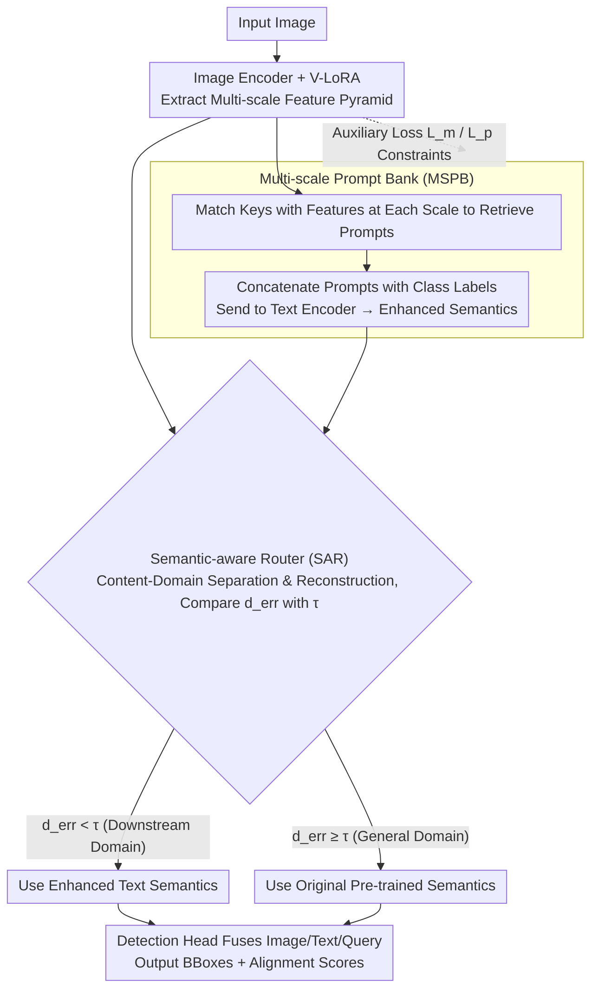

# Parameter-Efficient Semantic Augmentation for Enhancing Open-Vocabulary Object Detection

**Conference**: CVPR 2026  
**arXiv**: [2604.04444](https://arxiv.org/abs/2604.04444)  
**Code**: None  
**Area**: Object Detection / Open Vocabulary  
**Keywords**: Open-Vocabulary Object Detection, Parameter-Efficient Fine-Tuning, Semantic Augmentation, prompt bank, Domain Adaptation

## TL;DR

HSA-DINO proposes a multi-scale prompt bank to learn hierarchical semantic prompts from image feature pyramids to enhance text representations. In parallel, a semantic-aware router dynamically determines whether to apply domain-specific augmentation during inference, achieving a superior balance between domain adaptation and open-vocabulary generalization (obtaining the best H-mean scores across three vertical domain datasets).

## Background & Motivation

1. **Background**: Open-vocabulary object detection (OVOD) has achieved impressive zero-shot performance in general scenarios (e.g., OV-COCO) due to large-scale pre-training (GLIP, Grounding DINO, OV-DINO, etc.).

2. **Limitations of Prior Work**: (a) Pre-trained OVOD models experience significant performance drops in vertical domains (e.g., insect classification in ArTaxOr, remote sensing in DIOR, underwater in UODD) because fine-grained categories are scarce and semantically weak in pre-training data; (b) Full fine-tuning improves target domain performance but severely damages generalization to general domains (e.g., OV-DINO's mAP_coco drops from 50.6 to 36.1 after fine-tuning on ArTaxOr); (c) Existing prompt methods (pre-defined templates, CoOp) lack multi-faceted visual semantic descriptions.

3. **Key Challenge**: The fundamental conflict between domain adaptation and open-vocabulary generalization—updating parameters for downstream tasks inevitably destroys pre-trained semantic knowledge.

4. **Goal**: How to (a) enhance text representations with rich visual semantics to improve alignment within a parameter-efficient fine-tuning framework, and (b) automatically select appropriate semantic strategies during inference so that domain adaptation does not impair open-vocabulary capabilities.

5. **Key Insight**: The multi-scale feature pyramids of OVOD models already contain hierarchical semantic information from coarse to fine (high-level context like "flowers," low-level textures like "spotted wings"), which can serve as auxiliary prompts for category labels. Simultaneously, constructing a more accurate router by explicitly modeling content and domain information addresses the difficulty of distinguishing domain distributions.

6. **Core Idea**: Use prompts selected from multi-scale visual features to enhance the text representation of category labels, integrated with a semantic-aware router that explicitly separates content/domain to dynamically switch augmentation strategies during inference.

## Method

### Overall Architecture

HSA-DINO addresses the OVOD dilemma: while parameter-efficient fine-tuning on vertical domains (insects, remote sensing, underwater) improves target domain accuracy, it erodes pre-trained open-vocabulary generalization. The proposed approach adopts a "divide and conquer" strategy—encapsulating domain knowledge into a set of plug-and-play augmentation modules and deciding whether to use them per image during inference. The pipeline is built on OV-DINO: during training, LoRA is attached only to the image encoder to learn domain visual features. Multi-scale feature maps from each image retrieve relevant prompts from a prompt bank, which are prepended to category label embeddings and fed into the text encoder. The detection head then fuses image, text, and detection queries to output boxes. During inference, a lightweight router examines the input image to determine if it resembles the downstream domain or the general domain, thereby choosing between "domain-augmented text semantics" and "original pre-trained semantics." Three designs handle creating, learning, and applying these augmentations respectively.

### Key Designs

**1. Multi-scale Prompt Bank (MSPB): Enabling the Text Encoder to "See" Hierarchical Image Semantics**

The performance drop of pre-trained OVOD in vertical domains stems from thin text representations of fine-grained categories—a class name (e.g., a specific beetle) is scarce in pre-training corpora and lacks semantic depth. Fixed templates or single-scale prompts like CoOp cannot compensate for these details. MSPB treats the visual pyramid itself as a semantic source. It maintains $N$ pairs of (key, prompt) $\{(\mathbf{k}_i, \mathbf{P}_i)\}_{i=1}^N$, where key $\mathbf{k}_i \in \mathbb{R}^D$ shares the same dimension as image features, and prompt $\mathbf{P}_i \in \mathbb{R}^{D \times M}$ consists of $M$ learnable vectors. For an image, features at $S$ scales are extracted. Following global average pooling, cosine similarity is calculated between each scale feature and all keys to retrieve the best-matching prompt. The $S$ selected prompts are concatenated with category labels:

$$\mathbf{t}_p^k = \text{concat}(\mathbf{P}_1; ...; \mathbf{P}_S; [\text{CLS}]_k)$$

This is then fed into the text encoder. High-level features provide coarse semantics like "flower/context," while low-level features provide texture details like "spotted wings." The text representation is supported by multi-granularity visual descriptions, making it far richer than single-scale global features.

**2. Semantic-aware Router (SAR): Accurate "Augmentation Triggering" via Content-Domain Separation**

While MSPB boosts target domain performance, it nearly collapses the general domain (mAP_coco drops from 22.7 to 0.5 in ablation studies). Thus, a switch is required to decide when to enable augmentation during inference. A naive approach uses an autoencoder to determine the domain based on reconstruction error, but methods like DDAS/MoEAdapter4CL that feed raw image features often fail because reconstruction errors for different domains overlap heavily. The key to SAR is separating "what it looks like" (content) from "which domain it belongs to" (style statistics). Given image feature $\tilde{f}$, its mean $\mu$ and standard deviation $\sigma$ are taken as domain statistics $\mathcal{D} = \{\mu, \sigma\}$. Instance normalization yields the content embedding $c = \frac{\tilde{f} - \mu}{\sigma + \epsilon}$. The autoencoder reconstructs only the content $c \to \hat{c}$, then adds back domain statistics $\hat{f} = \hat{c} \cdot \sigma + \mu$. The reconstruction error is:

$$d_{err} = |\hat{f} - \tilde{f}|^2$$

Based on threshold $\tau$: if $d_{err} < \tau$, the image falls within the downstream domain's content distribution learned by the autoencoder, so domain-augmented semantics are used; otherwise, it is treated as a general domain image, reverting to pre-trained semantics. Since the autoencoder is no longer distracted by domain style and models only content, the error distributions for different domains are widely separated, significantly improving routing accuracy (SAR achieves an H_mean 8.2 higher than DDAS in ablation).

**3. LoRA Integration and Auxiliary Loss: Ensuring the Prompt Bank Learns "Domain Knowledge" Rather than Noise**

For the augmentation module to be effective, both the visual features learned by LoRA and the prompts learned by MSPB must align with the domain and avoid redundancy. LoRA is attached only to the image encoder to absorb hierarchical domain visual features. The training of MSPB is guided by two auxiliary losses: matching loss

$$\mathcal{L}_m = \sum_{s=1}^S (1 - \gamma(\tilde{\mathbf{z}}^s, \mathbf{k}_{i_s}))$$

which aligns selected keys with their corresponding image features to ensure keys capture domain semantics; and orthogonality loss

$$\mathcal{L}_p = \frac{1}{N(N-1)} \sum |\langle \mathbf{P}_i, \mathbf{P}_j \rangle|$$

which minimizes the inner product between different prompts, forcing them to point toward different semantic directions and preventing the $N$ prompts in the bank from collapsing into homogeneous representations.

### Loss & Training

The total loss is $\mathcal{L} = \mathcal{L}_{DINO} + \lambda_m \mathcal{L}_m + \lambda_p \mathcal{L}_p$, where $\mathcal{L}_{DINO}$ includes focal loss, regression loss, GIoU loss, and denoising loss. The SAR autoencoder is trained separately using MSE reconstruction loss for 24 epochs. The primary detection framework is fine-tuned for 24 epochs with batch size 16 and AdamW (lr=1e-3). Key hyperparameters are $N=10, M=12, S=3, \tau=0.039, \lambda_m=0.7, \lambda_p=0.3$.

## Key Experimental Results

### Main Results

Comparison of harmonic mean (H) between downstream tasks and OV-COCO:

| Method | ArTaxOr mAP_tgt/mAP_coco/H | DIOR H | UODD H |
|------|---------------------------|--------|--------|
| ZiRa (PEFT) | 81.5/44.1/**57.2** | 49.9 | 46.5 |
| OV-DINO (PEFT) | 78.5/24.0/36.8 | 22.1 | 47.6 |
| **HSA-DINO** | 76.8/49.9/**60.5** | **53.0** | **49.6** |

OV-COCO+ extended evaluation:

| Method | w/ ArTaxOr | w/ DIOR | w/ UODD |
|------|-----------|--------|--------|
| ZiRa | 46.9 | 44.4 | 46.0 |
| **HSA-DINO** | **52.3** | **50.1** | **50.5** |

### Ablation Study

Contribution of each component on ArTaxOr dataset:

| V-LoRA | MSPB | SAR | mAP_tgt | mAP_coco | H |
|:------:|:----:|:---:|---------|----------|------|
| ✗ | ✗ | ✗ | 1.4 | 50.6 | 2.7 |
| ✓ | ✗ | ✗ | 61.6 | 22.7 | 33.2 |
| ✓ | ✓ | ✗ | 79.1 | 0.5 | 1.0 |
| ✓ | ✗ | ✓ | 59.5 | 50.4 | 54.6 |
| ✓ | ✓ | ✓ | **76.8** | **49.9** | **60.5** |

### Key Findings

- **MSPB significantly boosts domain adaptation**: Adding MSPB improves mAP_tgt from 61.6 to 79.1 (+17.5), but severely damages the general domain (mAP_coco drops from 22.7 to 0.5).
- **SAR is crucial for balance**: With SAR, mAP_coco recovers from 0.5 to 49.9 (near pre-trained level 50.6), while mAP_tgt only slightly drops to 76.8.
- SAR outperforms DDAS by 8.2 in H_mean (54.4 vs. 46.2) due to explicit content/domain separation reducing reconstruction error overlap.
- Comparison of text semantic augmentation strategies: MSPB (54.4) > AttriCLIP (53.0) > CoOp (52.1) > Predefined (49.9).
- Optimal hyperparameters: bank size $N=10$, prompt length $M=12$, routing threshold $\tau=0.039$.

## Highlights & Insights

- **"Augmented but Switchable" Philosophy**: Instead of chasing a single model that adapts to all domains universally, the authors train domain-specific augmentations and switch them dynamically via a router. This elegantly avoids the radical conflict between adaptation and generalization.
- **Content-Domain Separation in Routing**: Decoupling content from domain statistics before reconstruction provides a much clearer signal for the autoencoder than raw features (as in DDAS). This insight is transferable to other scenarios requiring domain-aware routing.
- **Multi-scale Prompt Bank as a Visual-Text Bridge**: Allowing the text encoder to "view" multi-scale visual details provides more expressive power than using global features or fixed templates.

## Limitations & Future Work

- The SAR threshold $\tau$ is fixed (0.039); theoretically, optimal thresholds might vary across downstream domains.
- MSPB selection relies on global average-pooled scale features, losing spatial local information.
- Each fine-tuning session trains a separate MSPB + SAR for one task; multiple downstream tasks require multiple training sessions.
- Future directions: Exploring a unified prompt bank for multi-task joint training; using finer-grained region features (e.g., RoI features) to guide prompt selection.

## Related Work & Insights

- **vs. ZiRa**: ZiRa uses dual-norm penalties to constrain residual detection branches for continual learning. Its H-scores are lower than HSA-DINO, particularly on DIOR (49.9 vs. 53.0), suggesting dynamic routing is more flexible than norm constraints.
- **vs. CoOp/AttriCLIP**: These methods rely on single-scale global features for prompt selection, making them less semantically rich than the multi-scale prompt bank.
- **vs. MR-GDINO**: Although memory+retrieval mechanisms preserve some pre-trained knowledge, mAP_coco drops to 0.1 on UODD, indicating a near-total loss of generalization.

## Rating

- Novelty: ⭐⭐⭐⭐ The multi-scale prompt bank and content-domain separation router are novel, though the overall framework follows the PEFT + routing paradigm.
- Experimental Thoroughness: ⭐⭐⭐⭐⭐ Comprehensive testing across three vertical domains + OV-COCO + OV-COCO+ extended evaluation, with detailed ablations and visualizations.
- Writing Quality: ⭐⭐⭐⭐ Technical descriptions are detailed and clear; diagrams are intuitive, and motivations are well-argued.
- Value: ⭐⭐⭐⭐ Effectively addresses the real-world domain adaptation vs. generalization trade-off in OVOD. The use of the H-measure as a comprehensive metric is highly referential.

<!-- RELATED:START -->

## Related Papers

- [\[CVPR 2026\] Consistency Beyond Contrast: Enhancing Open-Vocabulary Object Detection Robustness via Contextual Consistency Learning](consistency_beyond_contrast_enhancing_open-vocabulary_object_detection_robustnes.md)
- [\[CVPR 2026\] NoOVD: Novel Category Discovery and Embedding for Open-Vocabulary Object Detection](noovd_novel_category_discovery_and_embedding_for_open-vocabulary_object_detectio.md)
- [\[CVPR 2026\] WeDetect: Fast Open-Vocabulary Object Detection as Retrieval](wedetect_fast_open-vocabulary_object_detection_as_retrieval.md)
- [\[CVPR 2026\] Thermal-Det: Language-Guided Cross-Modal Distillation for Open-Vocabulary Thermal Object Detection](thermal-det_language-guided_cross-modal_distillation_for_open-vocabulary_thermal.md)
- [\[CVPR 2026\] ViTPrompt: Training-Free Prompt Refinement with Visual Tokens for Open-Vocabulary Detection](vitprompt_training-free_prompt_refinement_with_visual_tokens_for_open-vocabulary.md)

<!-- RELATED:END -->
