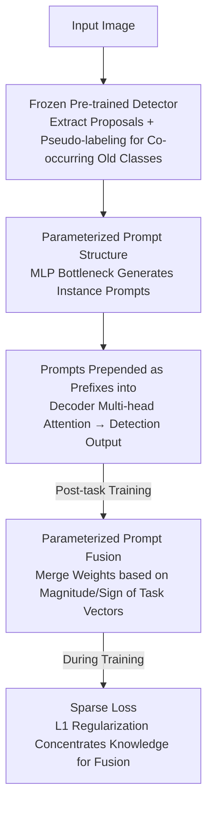

# Parameterized Prompt for Incremental Object Detection

**Conference**: CVPR 2026  
**Paper**: [CVF Open Access](https://openaccess.thecvf.com/content/CVPR2026/html/An_Parameterized_Prompt_for_Incremental_Object_Detection_CVPR_2026_paper.html)  
**Code**: https://github.com/EMLS-ICTCAS/P2IOD  
**Area**: Object Detection / Incremental Learning / Prompt  
**Keywords**: Incremental Object Detection, Parameterized Prompt, Prompts Pool Confusion, Model Fusion, Catastrophic Forgetting

## TL;DR
To address the failure of the "prompts pool" in Incremental Object Detection (IOD) caused by the inherent co-occurrence phenomenon in detection scenarios, this paper replaces the discrete prompts pool with a parameterizable MLP bottleneck. Combined with task-vector-based prompt fusion and sparse loss, this approach allows old task knowledge to be holistically preserved and updated, achieving SOTA results on PASCAL VOC2007 and MS COCO.

## Background & Motivation

**Background**: Injecting trainable prompts into frozen pre-trained models is a mainstream approach in incremental learning. Methods like L2P, DualPrompt, and CodaPrompt maintain a "prompts pool"—storing a set of task-specific prompts for each task. During inference, top-K matching is performed based on the similarity between a query and each prompt to alleviate catastrophic forgetting without modifying the backbone.

**Limitations of Prior Work**: While this prompts pool paradigm is successful in incremental classification, it fails when transferred to Incremental Object Detection (IOD). The unique challenge of IOD is the **co-occurrence phenomenon**: in training images of the current task, objects belonging to old tasks often appear in the background without being labeled. The prompts pool assumes disjoint task categories, which directly conflicts with this phenomenon.

**Key Challenge**: The authors categorize the failure of the prompts pool in IOD as "prompts pool confusion," specifically: ① **Matching Confusion**—an object appearing across tasks shows high similarity to all task-specific prompts, making it impossible to match the "most relevant" one; ② **Task Confusion**—current task prompts are biased by old-class objects in the background during learning, absorbing knowledge that does not belong to the current task and damaging prompt representation clarity. The root cause is the mechanism of "storing knowledge in task-based isolation" in prompts pools, which contradicts the IOD requirement for "holistic knowledge flow across tasks."

**Goal**: Design a prompt structure that can **adaptively consolidate** cross-task knowledge in co-occurrence scenarios while **constraining key parameter updates** to prevent forgetting.

**Key Insight**: The authors observe that neural networks inherently possess "global evolution" characteristics—networks naturally update learned knowledge according to the loss. Instead of using a pool of discrete, isolated prompt vectors, it is better to encode the "prompting" into the weight space of a small network.

**Core Idea**: Redesign the prompts pool as a **parameterized prompt**—an MLP bottleneck that carries prompt knowledge via network weights rather than discrete vectors; then utilize **parameterized prompt fusion** to constrain cross-task parameter updates, fundamentally eliminating prompts pool confusion.

## Method

### Overall Architecture
P2IOD is built upon Transformer-based detectors (Deformable-DETR / Co-DETR). The backbone and encoder-decoder are frozen throughout, and only the category/box embeddings and the parameterized prompt structure $\theta$ are trained. The input image first passes through the frozen detector $\theta^*$ to extract a set of proposals, which are compressed into instance-level queries by a query function. These are then fed into the parameterized prompt structure (MLP bottleneck) to generate instance-specific prompts, which are prepended as prefixes into the multi-head self-attention of the decoder to output detection results. After each incremental task, an additional **parameterized prompt fusion** is performed: current task prompt weights are merged with historical prompt weights based on the magnitude and direction of parameter changes. During training, a **sparse loss** is superimposed to concentrate knowledge into a few parameters for easier fusion, and a pseudo-labeling mechanism is used to mine old-class objects in the background.

### Key Designs

**1. Parameterized Prompt Structure: Replacing Discrete Pools with MLP Bottleneck Weight Space**

This is the core step to eliminate "prompts pool confusion." Instead of storing prompt vectors for each task, the knowledge is encoded into an MLP bottleneck consisting of two feed-forward layers, allowing it to generate prompts directly based on instances. Specifically, the frozen detector performs a single forward pass on input $x$ to obtain $N$ proposals. The query function **averages** them into a query vector $Q(x,\theta^*)=\frac{1}{N}\sum_{n=1}^N \{\theta^*(x)\}_n$; this passes through the bottleneck $p=\mathrm{ReLU}(Q\cdot W^{(1)})\cdot W^{(2)}$, where $W^{(1)}\in\mathbb{R}^{D\times d}$ reduces dimensionality and $W^{(2)}\in\mathbb{R}^{d\times \hat D}$ ($\hat D=D\times L_p$) expands it to generate a prompt of length $L_p$. The generated $p$ is split into $p_k, p_v$ (following DualPrompt) and concatenated to $V_m q_o$ and $W'_m q_o$ in the decoder's self-attention. A counter-intuitive discovery: the authors found that **compressing both foreground and background proposals** is more effective than compressing foreground only, as background knowledge helps the detector distinguish foreground/background better. This contradicts findings in MD-DETR where "adding background queries leads to performance drops." The authors argue that the drop in MD-DETR stems from the prompts pool matching mechanism being unable to absorb background knowledge, reinforcing that pools are unsuitable for IOD. Since prompts are generated by a continuous differentiable network, old knowledge is updated naturally and holistically via the loss of co-occurring objects, avoiding confusion.

**2. Parameterized Prompt Fusion: Merging Cross-task Weights by Task Vector Magnitude and Sign**

Parameterized prompts still suffer from forgetting. The authors insert a model fusion step after training each incremental task ($t\geq 2$), merging the current $\theta_t$ with the previous fusion result $\theta^f_{t-1}$ to obtain $\theta^f_t$ for testing. First, the **task vector** $v_t=\theta_t-\theta^f_{t-1}$ is calculated and decomposed into magnitude $\mu_t=|v_t|$ and sign $\gamma_t=\mathrm{sgn}(v_t)$; similarly, $v^f_{t-1}=\theta^f_{t-1}-\theta_{init}$ describes the historical change. Fusion assigns values based on four cases (see the equation below): historical key parameters (index set $\mathcal{I}^f_{t-1}$) with magnitudes in the top $k\%$ are preserved; current task parameters (set $\mathcal{I}_t$) in the top $l\%$ that do not overlap with historical ones are kept; positions where signs match $\gamma_t=\gamma^f_{t-1}$ and are not occupied by the first two steps take the average; remaining positions revert to old values.

$$\theta^f_t[i]=\begin{cases}\theta^f_{t-1}[i], & i\in\mathcal{I}^f_{t-1}\\ \theta_t[i], & i\in\mathcal{I}_t\setminus\mathcal{I}^f_{t-1}\\ \tfrac{1}{2}(\theta_t[i]+\theta^f_{t-1}[i]), & \gamma_t[i]=\gamma^f_{t-1}[i],\ i\notin\mathcal{I}^f_{t-1}\cup\mathcal{I}_t\\ \theta^f_{t-1}[i], & \text{otherwise}\end{cases}$$

This preserves the most important parameters for each task (stability) while averaging parameters with consistent directions (consensus/plasticity), maintaining low computational overhead.

**3. Sparse Loss: Concentrating Knowledge to Fewer Parameters for Better Fusion**

Model fusion depends on identifying "important parameters," but learned parameters are often redundant. The authors add an $L_1$ sparse loss $L_s=\lambda\sum_j|\theta_j|$ (where $\theta_j$ are parameters of the $j$-th decoder layer and $\lambda$ controls sparsity), forcing the model to compress key knowledge into a small subset. Post-sparsification, important parameter subsets of different tasks are less likely to conflict, making the top-$k\%$ magnitude sorting cleaner. Ablations show this brings an overall gain of approximately 1.1%.

> Additionally, the authors follow the pseudo-labeling mechanism from MD-DETR: using the detector from the previous task to infer on current images and filtering high-score predictions by threshold $\tau$ to mine old objects in backgrounds.

### Loss & Training
During incremental training, only category/box embeddings and the parameterized prompt structure $\theta$ are trainable; others $\theta^*$ are frozen. The training target adds the sparse loss $L_s$ to the detection loss. Parameterized prompt fusion is executed after each task to obtain $\theta^f_t$. Prompts are independently parameterized at each decoder layer to increase diversity.

## Key Experimental Results

### Main Results
PASCAL VOC2007 (20 classes) and MS COCO (80 classes) using mean AP at IOU=0.5 (AP50, %). The table shows VOC2007 single-step settings (increasing co-occurrence from 19+1 to 10+10). "1-N / N-20" reflect old class stability and new class plasticity, respectively.

| Setting | Metric | MD-DETR (Obj365) | P2IOD (Obj365) | Gain |
|------|------|------------------|----------------|------|
| 19+1 | 1-20 | 88.3 | **89.1** | +0.8 |
| 15+5 | 1-20 | 85.8 | **89.7** | +3.9 |
| 10+10 | 1-20 | 84.6 | **89.8** | +5.2 |

The higher the co-occurrence (19+1 → 10+10), the larger the advantage of P2IOD over the prompts pool baseline, validating the mitigation of prompts pool confusion. On MS COCO multi-step settings (40+20+20, 40+10x4), P2IOD reached 68.8 / 64.8 AP50 at the final step, significantly higher than MD-DETR's 60.3 / 49.4.

### Ablation Study
PASCAL VOC2007, 5+5+5+5 four-step setting (AP50, %), incrementally adding four components:

| Config | Pseudo-labels | Parameterized Prompt | Model Fusion | Sparse Loss | 1-5 (Stability) | 6-20 (Plasticity) | 1-20 |
|------|:---:|:---:|:---:|:---:|------|------|------|
| (a) baseline | | | | | 73.3 | 65.4 | 67.4 |
| (b) | ✓ | | | | 73.3 | 64.6 | 66.8 |
| (c) | ✓ | ✓ | | | 70.7 | 76.6 | 75.1 |
| (d) | ✓ | ✓ | ✓ | | 73.1 | 76.0 | 75.3 |
| (e) | | ✓ | ✓ | ✓ | 67.0 | 73.0 | 71.5 |
| (f) full | ✓ | ✓ | ✓ | ✓ | **74.0** | **77.2** | **76.4** |

### Key Findings
- **Parameterized Prompt Structure contributes most**: From (b) to (c), new class performance (6-20) jumped from 64.6 to 76.6 (+9.5%), showing huge plasticity gains, though old classes (1-5) dropped by 2.6%.
- **Model Fusion restores stability**: (c) to (d) brought old classes back to 73.1, balancing stability and plasticity.
- **Pseudo-labels require the right structure**: Adding pseudo-labels alone (a) to (b) caused a performance drop, but without them in (e), stability dropped significantly. This proves that pseudo-labeling only works effectively once prompts pool confusion is eliminated.
- The full configuration improved overall performance by 9.0% over the baseline.

## Highlights & Insights
- **Prompts as Weights**: Shifting prompts from discrete vectors to network weights allows old knowledge to be updated smoothly via gradients, transforming the "catastrophic forgetting" problem into "weight update constraint."
- **Systematic Characterization of "Prompts Pool Confusion"**: Breaking it down into matching and task confusion and providing visualization evidence adds significant value to the problem definition.
- **Task Vector Arithmetic**: Leverages magnitude/sign decomposition to provide a low-overhead fusion scheme suitable for edge deployment.
- The observation that "compressing background proposals is beneficial" reverses previous findings in MD-DETR, proving that pool mechanisms limit background knowledge absorption.

## Limitations & Future Work
- **Prompts limited to Multi-Head Attention**: Prompts are only injected into the decoder's interaction layers and not the Deformable Attention, as the latter's spatial local structure is harder to integrate with global prompts.
- **Hyper-parameters**: The top-k% ratios, sparsity $\lambda$, and bottleneck dimensions require careful tuning. 
- **Cumulative Stability**: Fusion requires sorting and merging parameters at each step; performance under much longer task sequences remains to be fully explored.
- ⚠️ Some formulas (query function, MLP) are derived from OCR; refer to the original paper for precise notation.

## Related Work & Insights
- **vs MD-DETR [2]**: MD-DETR introduced prompts to IOD but suffered from confusion in co-occurrence scenarios. P2IOD replaces the pool with parameterized prompts and fusion.
- **vs L2P / DualPrompt / CodaPrompt**: These assume disjoint classes; P2IOD demonstrates that this assumption is invalid for detection co-occurrence and replaces discrete matching with continuous weight spaces.
- **vs Distillation-based IOD (ERD / CL-DETR / SDDGR, etc.)**: Distillation implicitly mines old classes via output/feature regularization; P2IOD shows the superior potential of prompt engineering, significantly outperforming distillation methods on multi-step COCO.

## Rating
- Novelty: ⭐⭐⭐⭐ Defined prompts pool confusion and solved it with parameterized prompts + fusion.
- Experimental Thoroughness: ⭐⭐⭐⭐ Complete VOC/COCO benchmarks and component ablations.
- Writing Quality: ⭐⭐⭐⭐ Solid motivation; notation is a bit dense.
- Value: ⭐⭐⭐⭐ Provides a practical new paradigm for prompt-based IOD for edge devices.

<!-- RELATED:START -->

## Related Papers

- [\[CVPR 2026\] Beyond Prompt Degradation: Prototype-Guided Dual-Pool Prompting for Incremental Object Detection](beyond_prompt_degradation_prototype-guided_dual-pool_prompting_for_incremental_o.md)
- [\[CVPR 2026\] Incremental Object Detection via Future-Aware Decoupled Cross-Head Distillation](incremental_object_detection_via_future-aware_decoupled_cross-head_distillation.md)
- [\[AAAI 2026\] YOLO-IOD: Towards Real Time Incremental Object Detection](../../AAAI2026/object_detection/yolo-iod_towards_real_time_incremental_object_detection.md)
- [\[CVPR 2026\] InsCal: Calibrated Multi-Source Fully Test-Time Prompt Tuning for Object Detection](inscal_calibrated_multi-source_fully_test-time_prompt_tuning_for_object_detectio.md)
- [\[CVPR 2026\] EW-DETR: Evolving World Object Detection via Incremental Low-Rank DEtection TRansformer](ew-detr_evolving_world_object_detection_via_incremental_low-rank_detection_trans.md)

<!-- RELATED:END -->
