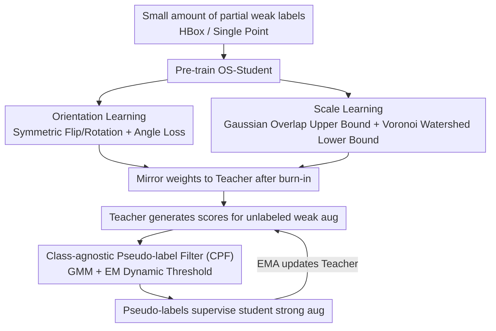

# Partial Weakly-Supervised Oriented Object Detection

**Conference**: CVPR 2026  
**Paper**: [CVF Open Access](https://openaccess.thecvf.com/content/CVPR2026/html/Liu_Partial_Weakly-Supervised_Oriented_Object_Detection_CVPR_2026_paper.html)  
**Code**: https://github.com/VisionXLab/PWOOD  
**Area**: Object Detection / Oriented Object Detection / Weakly-Supervised / Remote Sensing  
**Keywords**: Oriented object detection, partial weakly-supervised, teacher-student framework, pseudo-label filtering, annotation cost

## TL;DR
This paper introduces the new setting of "Partial Weakly-Supervised Oriented Object Detection (PWOOD)"—utilizing only a small amount of weak annotations (Horizontal Boxes or single points) combined with a large amount of unlabeled data. By employing a teacher-student framework (OS-Student) capable of learning orientation and scale from weak labels and a Class-agnostic Pseudo-label Filtering (CPF) mechanism based on Gaussian Mixture Models, the approach approaches or even surpasses semi-supervised methods using rotated boxes on DOTA/DIOR at a significantly lower annotation cost.

## Background & Motivation

**Background**: Oriented Object Detection (OOD) is in high demand in fields like remote sensing, but Rotated Box (RBox) annotation is expensive. Existing solutions roughly fall into three categories: ① Fully-supervised (using complete RBox); ② Semi-supervised SOOD (using a subset of RBox + unlabeled data); ③ Weakly-supervised WOOD (using cheaper annotations like Horizontal Boxes (HBox) or single points). All three involve trade-offs between "annotation speed/cost" and performance.

**Limitations of Prior Work**: Semi-supervised methods still rely on expensive rotated boxes; although weakly-supervised methods are cheaper, existing approaches assume weak labels are provided for **all** data, failing to fully exploit the more cost-effective combination of "a small amount of weak labels + a massive amount of unlabeled data." In other words, previous work has not integrated the two cost-reduction dimensions of "partial annotation" and "weak annotation."

**Key Challenge**: Weak annotations (especially single points) inherently lack orientation and scale information. Furthermore, teacher-student semi-supervised frameworks rely heavily on **static thresholds** to filter pseudo-labels. In early training, a weak teacher produces low scores, while a stronger teacher in later stages produces high scores; fixed thresholds cannot adapt to this dynamic distribution, leading to threshold inconsistency and reduced robustness.

**Goal**: ① Define and implement the more cost-effective "partial weakly-supervised" setting; ② Enable the student model to learn accurate poses from a small number of weak annotations lacking orientation/scale; ③ Replace static thresholds with adaptive thresholds to improve pseudo-label quality.

**Key Insight**: The authors adopt the teacher-student paradigm but inject two self-supervised paths—**Orientation Learning** and **Scale Learning**—into the student to compensate for missing information in weak labels. Additionally, pseudo-label filtering is modeled as a class-agnostic classification problem solvable via EM using Gaussian Mixture Models.

**Core Idea**: A teacher-student framework utilizing "partial weak-label pre-training + unlabeled self-training," featuring an OS-Student that learns orientation and scale from weak labels and a Class-agnostic Pseudo-label Filter (CPF) with dynamic thresholding.

## Method

### Overall Architecture
PWOOD is a teacher-student self-training framework where the teacher and student share the backbone/neck/head (FCOS + ResNet50 + FPN). First, the OS-Student is pre-trained using a small amount of weakly annotated data (partial HBox or partial points), where orientation and scale learning modules enable the student to perceive pose from weak labels. After a burn-in phase, student weights are mirrored to the teacher. Subsequently, unlabeled data is introduced: the teacher generates predictions on weakly augmented views, which are filtered by CPF (dynamic thresholding based on GMM + EM) to produce high-quality pseudo-labels for supervising the student's predictions on strongly augmented views. The student then updates the teacher via EMA, creating a positive feedback loop.

### Key Designs

**1. Orientation Learning: Extracting orientation from weak labels using symmetric/rotational self-supervised consistency**

Neither HBox nor single points contain orientation. Inspired by symmetric learning (H2RBox-v2), the authors enable the student to learn orientation. During training, input images are vertically flipped or randomly rotated by angle $\theta$ to obtain transformed views. Both original and transformed views pass through the network to generate predictions. Weak labels undergo the same transformations to form weakly-supervised pairs; meanwhile, since a deterministic mapping exists between views, their predictions must satisfy the same mapping, forming self-supervised pairs. The angle loss (Smooth-L1) is defined as:

$$L^s_{Ang}=\begin{cases}L^s_{Ang}(\theta_{flip}+\theta,\,0), & trans=flip\\ L^s_{Ang}(\theta_{rot}-\theta,\,R), & trans=rotate(\theta)\end{cases}$$

This constrains the predicted angles to be consistent with geometric transformations. Through these dual branches, the student learns accurate orientation even under the HBox-only setting.

**2. Scale Learning: Supplementing scale using Gaussian overlap upper bounds and Voronoi watershed lower bounds**

Single point annotations lack scale entirely. The authors use spatial layout learning to bound the scale from above and below. **Upper Bound**: Treating the RBox as a Gaussian distribution, the Bhattacharyya coefficient measures the overlap between different predicted boxes. Minimizing this overlap prevents boxes from expanding infinitely: $L^s_O=\frac{1}{N}\sum_{i,j\neq i}B(\mathcal{N}_i,\mathcal{N}_j)$, where $B$ is the coefficient for distributions $i,j$. **Lower Bound**: Using Voronoi ridge lines as background markers and point annotations as foreground markers, the watershed algorithm segments the "basins" of each object. These basins are rotated to the current predicted orientation to regress width/height targets using the Gaussian Wasserstein Distance loss $L^s_W=L_{GWD}$ for $w_t$ and $h_t$. These dual constraints enable reasonable box sizing from point labels.

**3. Class-agnostic Pseudo-label Filtering (CPF): Replacing static thresholds with GMM + EM dynamic adjustment**

To address the limitations of static thresholds, the confidence scores of the teacher's predictions are modeled as a mixture of two 1D Gaussians: $P(s)=w_p\mathcal{N}_p(\mu_p,\sigma_p^2)+w_n\mathcal{N}_n(\mu_n,\sigma_n^2)$, corresponding to positive and negative sample distributions. The positive mean is initialized to the maximum score and the negative to the minimum, with weights set to 0.5. The EM algorithm iteratively calculates the posterior $P_p$ (the likelihood that a detection is a pseudo-object). The dynamic threshold is selected as $T_d=\arg\max_s P_p(s,\mu_p,\sigma_p^2)$. Since it observes the score distribution regardless of category, CPF is "class-agnostic" and adaptively shifts the threshold to improve stability.

### Loss & Training
The student supervised loss is $L_s=\alpha_1 L^s_{cls}+\alpha_2 L^s_{cen}+\alpha_3 L^s_{box}+\alpha_4 L^s_{Ang}+\alpha_5 L^s_{O}+\alpha_6 L^s_W$, where classification/centerness/box losses follow FCOS (focal / cross-entropy / IoU), with $(\alpha_1,\alpha_2,\alpha_3)=1$ and $(\alpha_4,\alpha_5,\alpha_6)=(0.2,10,5)$. The unlabeled side loss is $L_u=\omega(L^u_{cls}+L^u_{cen}+L^u_{box})$, where $\omega$ is tied to individual scores to give high-confidence points higher weights. Total loss $L=\alpha L_s+\beta L_u$, with $\alpha=\beta=1$. The implementation uses MMRotate, AdamW optimizer, with 10%/20% settings trained for 120k steps and 30%/full settings for 180k steps.

## Key Experimental Results

### Main Results
Evaluations were conducted on DOTA-v1.0/v1.5/v2.0 and DIOR using mAP (AP50 for DOTA), with 10%/20%/30% of images used as labeled and the rest as unlabeled data. The Vanilla Baseline is a simplified MCL (without GCA/CCSL) for SOOD using **partial RBox**; PWOOD uses the cheaper partial HBox or partial points. The table below shows results for DIOR and DOTA-v1.0/v2.0 (mAP, %):

| Method (Label) | DIOR 20% | DOTA-v1.0 20% | DOTA-v2.0 20% |
|------|------|------|------|
| H2RBox-v2 (WOOD, partial HBox) | 51.33 | 54.38 | 28.56 |
| Vanilla Baseline (SOOD, partial RBox) | 57.07 | 62.82 | 34.03 |
| **PWOOD (partial HBox)** | **57.89** | **62.93** | **36.39** |
| PWOOD (partial Point) | 35.17 | 45.01 | 18.49 |

PWOOD using **HBox** equals or surpasses the SOOD baseline using expensive rotated boxes (e.g., DIOR: 54.01/57.07/60.25 vs 54.33/57.89/60.42), with more pronounced leads on DOTA-v2.0 where small objects are prevalent.

### Comparison on DOTA-v1.5

| Method (Label) | 10% | 20% | 30% |
|------|------|------|------|
| H2RBox-v2 (WOOD) | 42.19 | 49.01 | 55.19 |
| SOOD (partial RBox) | 48.63 | 55.58 | 59.23 |
| MCL (partial RBox) | 52.61 | 59.63 | 62.63 |
| Vanilla Baseline (partial RBox) | 49.53 | 58.28 | 61.00 |
| **PWOOD (partial HBox)** | **52.87** | **59.36** | **61.58** |
| PWOOD (partial Point) | 35.33 | 41.54 | 43.02 |

### Key Findings
- **HBox setting is comparable to or exceeds RBox semi-supervision**: On DOTA-v1.5, PWOOD(HBox) improves over the SOOD baseline by +3.34%/+1.08%/+0.58% (10/20/30%), achieving similar or better results with cheaper labels.
- **Superiority over pure WOOD**: Compared to H2RBox-v2 using the same partial HBox, PWOOD achieves gains of 10.68%/10.35%/6.39% on DOTA-v1.5 and 6.56%~9.79% on DIOR, demonstrating that leveraging unlabeled data is a critical performance driver.
- **Point labels still lag**: The partial point setting performs significantly lower than HBox, as the lack of scale/orientation priors makes lower-bound estimation noisy.
- The lower the annotation ratio (10%), the greater PWOOD's relative advantage, highlighting the value of "label savings."

## Highlights & Insights
- **Combining two cost-reduction dimensions**: Merging "partial annotation (semi-supervised)" and "weak annotation (HBox/Point)" into the PWOOD setting provides a clear and practical problem definition for remote sensing scenarios with limited budgets.
- **Learning pose from weak labels**: The combination of orientation learning (symmetric consistency) and scale learning (Gaussian overlap upper bound + Voronoi watershed lower bound) allows the model to "reconstruct" RBox from incomplete labels.
- **Transforming threshold selection into a learnable problem**: CPF uses GMM+EM to model pseudo-label selection as a posterior identification task, allowing the threshold to evolve with the teacher’s capability and improving pseudo-label stability.

## Limitations & Future Work
- **Weak performance of point labels**: The mAP for single points lags significantly behind HBox; the noisy lower-bound estimates due to lack of priors remain a challenge.
- **Dependency on weak label quality/ratio**: Robustness under extremely low ratios (<10%) or high-noise weak labels has not been fully explored.
- **Complexity**: Multiple modules and loss terms involve several hyperparameters such as $(\alpha_4,\alpha_5,\alpha_6)$, $\alpha/\beta$, and burn-in steps.
- ⚠️ Loss symbols ($L^s_A/L^s_O/L^s_W$, etc.) and exact values in the framework diagram are derived from OCR text; refer to the original paper for precise notation.

## Related Work & Insights
- **vs. SOOD / MCL (Semi-supervised OOD)**: These methods use optimal transport or Gaussian centerness but depend on **rotated boxes**. PWOOD substitutes these with cheaper HBox/points and replaces static thresholds with CPF.
- **vs. H2RBox-v2 / Point2RBox-v2 (Weakly-supervised OOD)**: These use weak labels for all data but ignore unlabeled data. PWOOD uses partial weak labels + massive unlabeled data, leading by 6-10% in the same ratio settings.
- **vs. Wholly-WOOD / PointOBB series**: PWOOD integrates "partial + weak + unlabeled self-training" into a unified teacher-student framework and supports switching between various weak annotation forms.

## Rating
- Novelty: ⭐⭐⭐⭐ First to propose the partial weakly-supervised OOD setting.
- Experimental Thoroughness: ⭐⭐⭐⭐ Comprehensive evaluation across DOTA versions and DIOR.
- Writing Quality: ⭐⭐⭐⭐ Clear motivation, though notation is dense.
- Value: ⭐⭐⭐⭐ Provides a cost-effective training solution for high-annotation-cost domains.

<!-- RELATED:START -->

## Related Papers

- [\[ICLR 2026\] SPWOOD: Sparse Partial Weakly-Supervised Oriented Object Detection](../../ICLR2026/object_detection/spwood_sparse_partial_weakly-supervised_oriented_object_detection.md)
- [\[CVPR 2026\] Fourier Angle Alignment for Oriented Object Detection in Remote Sensing](fourier_angle_alignment_for_oriented_object_detection_in_remote_sensing.md)
- [\[CVPR 2026\] Expert-Teacher-Student Collaborative Learning for Domain Adaptive Object Detection](expert-teacher-student_collaborative_learning_for_domain_adaptive_object_detecti.md)
- [\[ICLR 2026\] Bootstrapping MLLM for Weakly-Supervised Class-Agnostic Object Counting](../../ICLR2026/object_detection/bootstrapping_mllm_for_weaklysupervised_classagnostic_object_counting.md)
- [\[CVPR 2026\] From Detection to Association: Learning Discriminative Object Embeddings for Multi-Object Tracking](from_detection_to_association_learning_discriminative_object_embeddings_for_mult.md)

<!-- RELATED:END -->
