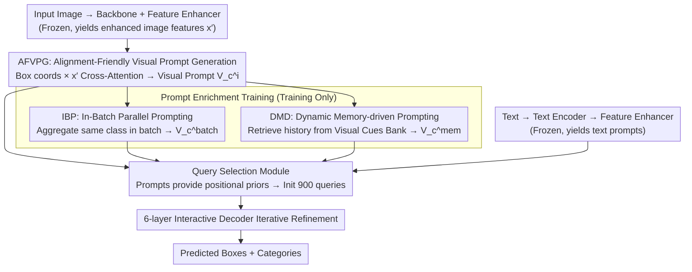

# PET-DINO: Unifying Visual Cues into Grounding DINO with Prompt-Enriched Training

**Conference**: CVPR 2026  
**arXiv**: [2604.00503](https://arxiv.org/abs/2604.00503)  
**Code**: [https://fuweifuvtoo.github.io/pet-dino](https://fuweifuvtoo.github.io/pet-dino)  
**Area**: Object Detection / Open-Vocabulary Detection  
**Keywords**: Open-Vocabulary Object Detection, Visual Prompts, Grounding DINO, Training Strategies, Prompt Learning

## TL;DR

PET-DINO constructs a universal object detector based on Grounding DINO that simultaneously supports text and visual prompts. It introduces an Alignment-Friendly Visual Prompt Generation (AFVPG) module and two prompt-enriched training strategies (IBP and DMD), achieving competitive performance on zero-shot detection tasks with significantly less training data.

## Background & Motivation

**Background**: Open-vocabulary object detection (OSOD) aims to identify new categories unseen during training. Text prompt methods (e.g., Grounding DINO, GLIP) achieve zero-shot generalization by aligning visual features with pre-trained text encoders. Visual prompt methods (e.g., T-Rex2, CP-DETR, YOLOE) supplement text prompts by using visual representations of targets as prompts.

**Limitations of Prior Work**: (1) Text features often fail to correspond effectively to visual concepts in specialized domains or for complex targets, making these categories difficult to distinguish; (2) Long-tail categories lack sufficient image-text paired samples; (3) Existing visual prompt methods (T-Rex2, CP-DETR) utilize tightly coupled multi-modal architectures and multi-stage training, leading to long development cycles; (4) Effective training strategies for data-driven OSOD models have not been fully explored.

**Key Challenge**: Visual prompts naturally contain rich information beyond text descriptions, but during training, visual prompts are derived from the input image itself, which limits diversity—making it difficult to model global visual prompts across images and at the category level, as well as preventing offline pre-extraction during training.

**Goal**: (1) Efficiently add visual prompt capabilities on top of advanced text-prompt detectors rather than building a multi-modal system from scratch; (2) Design the first large-scale training strategy for dual-modal prompt detectors, enabling the model to simulate various practical usage scenarios in parallel during training.

**Key Insight**: An "inheritance" strategy is adopted—starting from a pre-trained Grounding DINO, adding only the visual prompt generation module and sharing parameters with the existing text path to reduce the development cycle.

**Core Idea**: Graft a visual prompt module onto a text-pre-trained detector and enhance zero-shot detection capabilities through in-batch parallel prompting and dynamic memory-driven prompt enrichment training strategies.

## Method

### Overall Architecture

PET-DINO aims to solve the problem of how to cost-effectively grow "search-by-image" visual prompt capabilities on a pre-trained text prompt detector (Grounding DINO) without rebuilding a multi-modal system. Overall, it maintains two parallel detection routes. The text route inherits Grounding DINO without modification—text is encoded to generate embeddings, which then interact with image features through a Feature Enhancer to obtain text prompts. The visual route is newly added: the prompt box coordinates provided by the user enter the AFVPG module, interact with image features enhanced by the same Feature Enhancer, and aggregate into a visual prompt $V_c^i$; during training, the IBP and DMD strategies expand this single-image prompt into cross-image ($V_c^{batch}$) and cross-iteration ($V_c^{mem}$) prompts to improve category-level generalization. Regardless of the route, prompts are sent to the Query Selection Module to provide positional priors, initializing 900 queries, which are then iteratively refined through a 6-layer interactive decoder for final box and category prediction. During training, only modules related to visual prompts are unfrozen, while the backbone and text path remain frozen, restricting modifications to a small "grafted" section.

### Key Designs

**1. AFVPG (Alignment-Friendly Visual Prompt Generation): Generating Visual Prompts from "Aligned" Features**

A direct approach would be to crop the prompt box area from the raw features of the backbone to serve as a visual prompt, but experiments show this performs poorly—raw features are not yet aligned with the instance semantics inside the detector. AFVPG instead extracts information from features $x'_i$ already enhanced by deformable self-attention and FFN in the Feature Enhancer: for each category, it initializes learnable content embeddings $C \in \mathbb{R}^{K \times D}$ ($K$ prompt boxes) plus a universal carrier $C'$. It encodes the prompt box coordinates and performs multi-scale deformable cross-attention with the enhanced image features, then aggregates them into a global visual prompt vector $V \in \mathbb{R}^{1 \times D}$ via self-attention and FFN. A key step is that AFVPG directly reuses the deformable self-attention and FFN parameters from the text branch's Feature Enhancer, allowing the high-level semantics learned by the text path to flow into the visual prompt. The benefits of this fusion are substantial: compared to the visual encoder of T-Rex2, it gains +4.8 AP on Visual-I and +2.7 AP on Visual-G.

**2. IBP (In-Batch Parallel Prompting): Expanding Single-Image Prompts to Cross-Image Category-Level Prompts via Batches**

The natural drawback of visual prompts is that they can only originate from the current image, limiting diversity; the model can easily degenerate into "copying instances from this image" without learning generalized category concepts. IBP fills this gap at no additional data cost: within a mini-batch, visual prompts $V_c^j$ of category $c$ from other images in the same batch are treated as cross-image prompts for the current image, and prompts of the same category are aggregated into a category-level global prompt $V_c^{batch}$. Thus, for category $c$ on image $i$, two types of prompts exist simultaneously: $V_c^i$ from its own image (corresponding to the interactive Exemplar-Guided Route) and $V_c^{batch}$ aggregated from the batch (corresponding to the Global-Concept Route). Especially when the current image does not contain category $c$, prompts contributed by other images help expand the category discrimination space. IBP is the most powerful of the three designs, pulling Visual-G from 12.5 AP up to 37.2 AP (+24.7).

**3. DMD (Dynamic Memory-driven Prompting): Extending Prompt Diversity from "One Batch" to the "Entire Training History"**

IBP is still limited by which categories appear in the current batch. DMD maintains a Visual Cues Bank—a FIFO queue (length $M=16$) for each category that dynamically stores visual prompt embeddings extracted from historical iterations. Each iteration, $d$ categories are randomly sampled, and historical prompts are retrieved from the bank to aggregate into a third type of prompt:

$$V_c^{mem} = \frac{1}{M}\sum_{k=1}^{M} \tilde{V}_c^k,$$

thus each category ultimately possesses three types of visual prompts $\{V_c^i, V_c^{batch}, V_c^{mem}\}$. This memory bank also has a side effect: rare categories that seldom appear together in a single batch can now utilize historical prompts for contrastive learning. DMD adds a further 3.1 AP on top of IBP.

### An Example: How Three Types of Prompts for the Category "Zebra" are Assembled

Assume the current batch contains 4 images, where image $i$ has one zebra, two other images each have one zebra, and the fourth image has no zebra. For the category "Zebra": AFVPG first extracts $V_{zebra}^i$ from the enhanced features of image $i$, which is the "exemplar" prompt closest to the current instance; IBP then aggregates the zebra prompts from the other two images with $V_{zebra}^i$ to form $V_{zebra}^{batch}$, so even if the fourth image has no zebra, the model has already seen the "category-level" visual concept; DMD retrieves zebra prompts accumulated over the past several iterations from the Visual Cues Bank's length-16 queue and averages them into $V_{zebra}^{mem}$. The three $\{V_{zebra}^i, V_{zebra}^{batch}, V_{zebra}^{mem}\}$ correspond to interactive, global conceptual, and cross-iteration real-world scenarios, respectively, and are supervised together in a single forward pass, forcing the model to shift from "remembering this one" to "understanding the zebra category."

### Loss & Training

The training objective is $\mathcal{L} = \mathcal{L}_{L1} + \mathcal{L}_{GIoU} + \mathcal{L}_{alignment}$, where the alignment term is Focal loss. To prevent the new visual route from degrading the original text capabilities, cyclic training is used: one round of text prompt training is interspersed every eight rounds of visual prompt training. Only modules related to visual prompts are trainable (learning rate 1e-4), while the backbone is frozen; the model is trained for 12 epochs, with the learning rate decreasing by 10x at epochs 8 and 11.

## Key Experimental Results

### Main Results

Zero-shot Interactive Detection (Visual-I), Swin-T:

| Method | VLM sup. | Data | COCO AP | LVIS AP | ODinW35 AP |
|------|----------|--------|---------|---------|------------|
| T-Rex2 | CLIP | 3.1M | 56.6 | 59.3 | 37.7 |
| CP-DETR-T | CLIP | 3.3M | 61.8 | 64.1 | 41.0 |
| **PET-DINO** | **None** | **0.6M** | **64.0** | 61.8 | 38.8 |
| **PET-DINO** | **None** | **2.5M** | **64.3** | **64.5** | **48.3** |

Zero-shot Generic Detection (Visual-G), Swin-T:

| Method | Data | COCO AP | LVIS AP | ODinW35 AP |
|------|--------|---------|---------|------------|
| T-Rex2 | 3.1M | 38.8 | 37.4 | 23.6 |
| **PET-DINO** | 0.6M | **40.3** | 29.6 | 20.4 |
| **PET-DINO** | 2.5M | 38.4 | 31.5 | **25.5** |

Retention of text prompts: PET-DINO Swin-L achieves 54.0 AP on COCO (Grounding DINO +1.0, MM-Grounding-DINO +1.0) and 39.3 AP on LVIS (+2.6).

### Ablation Study

| Configuration | COCO Visual-I | COCO Visual-G | COCO Text | Note |
|------|---------------|---------------|-----------|------|
| AFVPG only | 67.0 | 12.5 | 49.7 | Visual-G is very low |
| AFVPG + DMD | 63.5 | 24.7 | 49.8 | +12.2 Visual-G |
| AFVPG + IBP | 63.2 | 37.2 | 49.6 | IBP contributes the most |
| AFVPG + IBP + DMD | 64.0 | **40.3** | 49.8 | Full model |

AFVPG vs. T-Rex2 Encoder: Visual-I +4.8 AP, Visual-G +2.7 AP.

Inheritance vs. Training from Scratch: Visual-G +7.6 AP (Inheritance strategy).

### Key Findings

- **IBP is the key factor for improving Visual-G**: Increasing from 12.5 → 37.2 (+24.7 AP), indicating that single-image prompts alone cannot learn generalized category-level prompts.
- DMD further improves by 3.1 AP on top of IBP, bringing cross-iteration prompt diversity.
- The drop in Visual-I (67.0 → 64.0) in exchange for the massive gain in Visual-G (12.5 → 40.3) is a reasonable trade-off—the model shifts from copying specific instances to learning generalizable category patterns.
- Inheriting text pre-training yields a higher upper bound than training from scratch (Visual-G +7.6 AP), as global high-level semantic representations aid in understanding category concepts.
- PET-DINO exceeds CP-DETR (using 3.3M data) on COCO Visual-I using only 0.6M data.

## Highlights & Insights

- **"Inheritance" Philosophy**: Grafting visual prompt capabilities onto an already pre-trained text detector rather than building a multi-modal system from scratch. This not only reduces development cycles but also leverages semantic knowledge from the text branch to improve visual prompts—a very practical engineering approach.
- **IBP's Clever Use of In-Batch Parallelism**: Constructing cross-image, category-level, and interactive prompt scenarios at zero cost allows a single training session to cover multiple actual deployment scenarios. This idea can be extended to any model requiring multiple prompt modes.
- **Quantitatively Proven Transfer Value of Text Pre-training for Visual Prompts** (+7.6 AP), breaking the common assumption that visual prompts require independent training.

## Limitations & Future Work

- There is still a gap in Visual-G performance on LVIS compared to T-Rex2 (35.7 vs 47.6 Swin-L); visual prompt generalization for long-tail categories remains a challenge.
- No supervision signals from VLM (e.g., CLIP) were used—integrating CLIP features might further improve cross-domain generalization.
- The cyclic training strategy (8:1 visual:text) is manually set; adaptive scheduling might be superior.
- The queue length $M=16$ and sample number $d=40$ for the Visual Cues Bank need adjustment based on the dataset, lacking an adaptive mechanism.
- The combined use of visual + text prompts (e.g., providing both text and example images simultaneously) was not explored.

## Related Work & Insights

- **vs. T-Rex2**: T-Rex2 is a closed-set (not open) dual-modal prompt detector requiring CLIP supervision and large-scale data like SA-1B. PET-DINO openly supports text prompts, does not require CLIP supervision, and is still better on COCO Visual-I with over 5x less data. However, T-Rex2 leads significantly on LVIS Visual-G, indicating that massive data and CLIP still hold advantages for the long tail.
- **vs. CP-DETR**: CP-DETR uses a tightly coupled early-fusion approach; PET-DINO is more flexible based on an inheritance strategy. CP-DETR Swin-L reaches 71.6 AP on LVIS but uses the COCO training set (not zero-shot).
- **vs. YOLOE**: YOLOE targets real-time scenarios and uses MobileCLIP; PET-DINO focuses more on accuracy upper bounds.

## Rating

- Novelty: ⭐⭐⭐⭐ The inheritance strategy is novel, and the IBP/DMD training strategies represent the first systematic exploration in this direction.
- Experimental Thoroughness: ⭐⭐⭐⭐ Three protocols, multiple benchmarks, complete ablations, and pre-training analysis, though it lacks a fairer comparison with CLIP-supervised methods.
- Writing Quality: ⭐⭐⭐⭐ The structure is clear, though some descriptions are slightly verbose and could be more concise.
- Value: ⭐⭐⭐⭐ Provides valuable references for the training strategies of dual-modal prompt detectors.

<!-- RELATED:START -->

## Related Papers

- [\[CVPR 2026\] ViTPrompt: Training-Free Prompt Refinement with Visual Tokens for Open-Vocabulary Detection](vitprompt_training-free_prompt_refinement_with_visual_tokens_for_open-vocabulary.md)
- [\[AAAI 2026\] Connecting the Dots: Training-Free Visual Grounding via Agentic Reasoning](../../AAAI2026/object_detection/connecting_the_dots_training-free_visual_grounding_via_agent.md)
- [\[CVPR 2026\] Bidirectional Multimodal Prompt Learning with Scale-Aware Training for Few-Shot Multi-Class Anomaly Detection](bidirectional_multimodal_prompt_learning_with_scale-aware_training_for_few-shot_.md)
- [\[ICCV 2025\] Dynamic-DINO: Fine-Grained Mixture of Experts Tuning for Real-time Open-Vocabulary Object Detection](../../ICCV2025/object_detection/dynamicdino_finegrained_mixture_of_experts_tuning_for_realti.md)
- [\[CVPR 2026\] Beyond Prompt Degradation: Prototype-Guided Dual-Pool Prompting for Incremental Object Detection](beyond_prompt_degradation_prototype-guided_dual-pool_prompting_for_incremental_o.md)

<!-- RELATED:END -->
