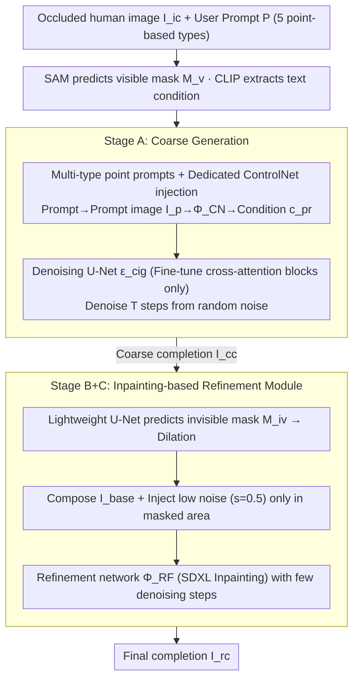

# PHAC: Promptable Human Amodal Completion

**Conference**: CVPR 2026  
**arXiv**: [2603.14741](https://arxiv.org/abs/2603.14741)  
**Code**: None  
**Area**: Object Detection  
**Keywords**: Human amodal completion, Diffusion models, ControlNet, Pose-guided generation, Image inpainting

## TL;DR

A new task titled Promptable Human Amodal Completion (PHAC) is proposed. By utilizing point-based user prompts (pose/bounding box) coupled with ControlNet for conditional signal injection, and a refinement module based on inpainting to preserve the appearance of visible regions, high-quality and controllable completion of occluded human images is achieved.

## Background & Motivation

**Limitations of Human Amodal Completion (HAC)**: Existing HAC methods can only hallucinate invisible regions from occluded images and cannot accept user-specified constraints (e.g., target pose or spatial extent), requiring repeated sampling to obtain satisfactory results.

**Limitations of Pose-Guided Person Image Synthesis (PGPIS)**: While PGPIS allows for pose-conditional input, it struggles to maintain the visible appearance of specific instances and tends to generate content biased toward the training distribution (e.g., clothing features from the DeepFashion dataset).

**Visible Appearance Degradation**: Denising in latent space and VAE reconstruction often lose fine visible details. Existing decoder fine-tuning schemes introduce blurriness and boundary artifacts, while UV-coordinate-based schemes lose details when coordinates are noisy.

**Lack of Multi-type Prompt Support**: Prior methods do not support multiple types of user prompts (pose + bounding box), limiting the ability to flexibly balance performance and user interaction costs.

**Weak Zero-shot Generalization**: PGPIS baselines (e.g., PIDM, MCLD) often exhibit severe appearance hallucinations on real-world images outside the training set, such as extreme failure cases where an elderly male is transformed into a female.

**Boundary Artifacts**: Directly splicing visible regions with generated regions introduces obvious artifacts at the mask boundaries, lacking a smooth transition mechanism.

## Method

### Overall Architecture

The core challenge PHAC addresses is that existing HAC can only "hallucinate" occluded areas without user-specified poses or spatial ranges, while PGPIS fails to preserve the authentic appearance of visible regions. The completion process is split into two stages: (A) Coarse Generation and (B+C) Refinement. Given an occluded human image $I_{ic}$ and a user prompt $P$ (supporting 5 types: pose $p_{po}$, ROI bbox $p_{ib}$, full bbox $p_{eb}$, pose + ROI bbox $p_{poib}$, and pose + full bbox $p_{poeb}$), the prompt is first rendered into a prompt image $I_p$. This is encoded into a conditional signal $c_{pr}$ via a dedicated ControlNet $\Phi_{CN}$ and injected into a denoising U-Net $\epsilon_{cig}$ (where only cross-attention blocks are fine-tuned to preserve generative priors). A coarse completion $I_{cc}$ is obtained after $T$ denoising steps from random noise. Subsequently, a lightweight U-Net $\mathcal{U}_{iv}$ predicts the invisible region mask $M_{iv}$, which is then dilated. Low-amplitude noise is injected only into the masked area, and the refinement network $\Phi_{RF}$ performs a few denoising steps to produce the final output $I_{rc}$.

### Key Designs

**1. Multi-type Point Prompts + Dedicated ControlNet: Controlling Pose and Range with Few Points**

Controlling completion should not require heavy inputs like 3D information or dense masks. PHAC compresses constraints into a small number of points: pose prompts involve the user completing missing joints on OpenPose-detected visible joints, and bbox prompts require only two corner points. Five combinations are supported ($p_{po}$, $p_{ib}$, $p_{eb}$, $p_{poib}$, $p_{poeb}$). These points are rendered into prompt images $I_p$, fed into **ControlNets $\Phi_{CN}$ trained separately for each prompt type** to be encoded as conditional signals $c_{pr}$, and then injected into the denoising U-Net. Simultaneously, SAM is used to predict the visible mask $M_v$ from the input image, and CLIP extracts text conditions, removing the dependency on ground truth mask annotations (unlike existing methods requiring GT masks). These prompts are extremely lightweight, allowing users to balance interaction cost and control precision.

**2. Fine-tuning Cross-Attention Blocks Only: Preserving Pre-trained Generative Priors**

Training from scratch or full-parameter fine-tuning can damage the inherent human generation capabilities of diffusion models. PHAC fine-tunes only the cross-attention blocks of the denoising U-Net $\epsilon_{cig}$ while freezing other weights. This allows the prompt signals to enter the generation process efficiently via cross-attention, achieving strong prompt alignment while keeping the pre-trained DM's generative priors intact to balance alignment and image quality.

**3. Inpainting-based Refinement Module: Preserving Visible Regions, Eliminating Splicing Artifacts, and Plug-and-Play Capability**

Coarse completions lose visible details after latent space denoising and VAE reconstruction. Hard-splicing the visible region with the generated region ($I_{base}=I_{ic}\odot M_v + I_{cc}\odot(1-M_v)$) leaves obvious artifacts at mask boundaries. PHAC does not re-generate the RGB of the masked region: first, a lightweight U-Net $\mathcal{U}_{iv}$ takes $I_{ic}$, $I_{cc}$, and $M_v$ as input to predict the invisible mask $M_{iv}$ and dilates it (to avoid missing boundary pixels). Then, a small amount of noise ($s=0.5$) is injected into the masked area of the composite image, and a pre-trained SDXL Inpainting refinement network $\Phi_{RF}$ executes approximately 40% of the steps (20 steps) of denoising. This keeps the visible area largely unchanged while creating a smooth transition to the generated region, erasing boundary artifacts. This refinement is not tied to the generation stage of PHAC itself—it can serve as a universal post-processing component for other diffusion models: when applied to MCLD, MSE decreases by ~60% and KID by ~71%; when applied to pix2gestalt, LPIPS decreases by 37%.

### Loss & Training

- **Coarse Generation Loss**: Standard diffusion denoising objective $\mathcal{L} = \mathbb{E}[\|\epsilon - \epsilon_{cig}(z_t, t, c_{te}, c_{pr})\|_2^2]$
- **Mask Prediction Loss**: Weighted combination of BCE and Dice $\mathcal{L} = \mathcal{L}_{BCE} + 0.5 \cdot \mathcal{L}_{Dice}$
- **Refinement Network**: Uses pre-trained SDXL Inpainting model directly, no additional training required.
- **Training Setup**: DM learning rate $5 \times 10^{-6}$, ControlNet learning rate $5 \times 10^{-5}$, batch size 14, 1750 epochs (4×A6000, ~16 hours); mask U-Net trained for 40 epochs (1×RTX 3090, ~30 minutes).
- **Stochastic Inference**: DM generates $N=16$ coarse outputs for each training image; the mask U-Net randomly samples one for supervision during training.

## Key Experimental Results

### Main Results

**Datasets**: OccThuman2.0 (synthetic, 5260 images) + AHP (real-world, 56 images)

| Method | Prompt Type | LPIPS*↓ | SSIM↑ | KID*↓ | PSNR↑ | Joint Err.↓ |
|------|----------|---------|-------|-------|-------|-------------|
| PIDM | 2D pose | 126.33 | 0.797 | 56.91 | 16.80 | 113.72 |
| MCLD | UV map | 115.90 | 0.833 | 41.11 | 18.37 | 53.38 |
| pix2gestalt | - | 90.11 | 0.911 | 16.51 | 22.63 | 36.65 |
| SDHDO | 2D pose | 81.39 | 0.924 | 16.41 | 23.80 | 43.49 |
| **Ours** | **2D pose** | **49.47** | **0.948** | **6.12** | **25.86** | **23.33** |

*Results on OccThuman2.0 dataset, values ×10³*

| Method | LPIPS*↓ | SSIM↑ | KID*↓ | PSNR↑ | Joint Err.↓ |
|------|---------|-------|-------|-------|-------------|
| SDHDO | 64.19 | 0.956 | 6.05 | 24.45 | 9.24 |
| **Ours** | **38.77** | **0.970** | **1.25** | **26.93** | **6.37** |

*Results on AHP real-world dataset*

### Ablation Study

**Comparison of different prompt types (OccThuman2.0)**:

| Prompt Type | LPIPS*↓ | SSIM↑ | PSNR↑ | Joint Err.↓ |
|----------|---------|-------|-------|-------------|
| Pose $p_{po}$ | 49.47 | 0.948 | 25.86 | 23.33 |
| ROI bbox $p_{ib}$ | 51.83 | 0.942 | 24.99 | 24.01 |
| Full bbox $p_{eb}$ | 52.28 | 0.941 | 25.07 | 28.23 |
| Pose + ROI bbox | 49.35 | 0.947 | 25.69 | 22.15 |
| Pose + Full bbox | 49.42 | 0.946 | 25.49 | 21.96 |

**Ablation of noise intensity ($s$ parameter)**: $s=0.5$ is optimal for both OccThuman2.0 and AHP. Too small (0.1) leads to insufficient denoising, while too large (0.9) destroys original appearance.

**Plug-and-play effect of refinement module**: Applying it to MCLD reduces MSE by ~60% and KID by ~71%; applying it to pix2gestalt reduces LPIPS by 37%.

### Key Findings

1. Pose prompts provide the most effective single-prompt guidance; bbox prompts mainly constrain the spatial range but leave pose ambiguity.
2. Combined prompts (pose + bbox) consistently reduce joint error while maintaining perceptual quality.
3. The refinement module improves all metrics even when the coarse generation of the proposed method already outperforms baselines.
4. ROI bbox offers the highest gain per point ($\Delta$JE pp=2.86), optimizing user interaction efficiency.

## Highlights & Insights

- **Novel Task Definition**: It is the first to propose the promptable human amodal completion task, establishing a natural connection between HAC and PGPIS.
- **Practical Prompt Design**: Point-based prompts are extremely lightweight (just a few points), avoiding difficult-to-obtain inputs like 3D information or dense masks.
- **Generality of Refinement Module**: The inpainting-based refinement is a universal plug-and-play component that significantly enhances other methods.
- **Cross-Attention Fine-tuning**: Achieving strong prompt alignment with minimal parameter changes while preserving pre-trained priors.
- **High Training Efficiency**: The main model takes 16 hours on 4 GPUs, and the mask network takes 30 minutes on a single GPU, keeping total costs manageable.

## Limitations & Future Work

- Contextual diversity is limited as training was conducted only on synthetic data (OccThuman2.0, 526 3D humans).
- Evaluation scale on real-world scenes is small, with the AHP test set containing only 56 images.
- Real-time performance is lacking, as refinement relies on pre-trained SDXL Inpainting, taking ~4 seconds per image.
- Pose prompts require manual labeling of missing joints, increasing interaction burden under heavy occlusion.
- Comparison with recent DiT architectures or video diffusion models is missing.
- Fusion with text prompts or other high-level semantic conditions has not yet been explored.

## Related Work & Insights

- **HAC Methods**: pix2gestalt (general amodal completion + diffusion prior) and SDHDO (human-specific + 2D pose prior), but they lack user prompt support and suffer from visible appearance degradation.
- **PGPIS Methods**: PIDM (2D pose map conditional diffusion) and MCLD (UV map conditional), but training data bias leads to severe appearance hallucinations.
- **ControlNet**: Serves as the base architecture for multi-type prompt injection, with dedicated ControlNets trained for each prompt type.
- **SAM**: Utilized for automatic prediction of visible region masks, replacing traditional schemes that depend on ground truth masks.

## Rating

- Novelty: ⭐⭐⭐⭐ — Innovative task definition and clever prompt mechanism design.
- Experimental Thoroughness: ⭐⭐⭐⭐ — Multi-baseline comparisons and multi-dimensional ablation (prompt type/noise intensity/plug-and-play), though real-world data scale is small.
- Writing Quality: ⭐⭐⭐⭐ — Clear structure, complete formulas, and rich diagrams.
- Value: ⭐⭐⭐⭐ — Excellent application prospects for the general refinement module and practical prompt design.

<!-- RELATED:START -->

## Related Papers

- [\[CVPR 2026\] SL-HOI: Streamlined Open-Vocabulary Human-Object Interaction Detection](streamlined_open-vocabulary_human-object_interaction_detection.md)
- [\[CVPR 2026\] Mining Instance-Centric Vision-Language Contexts for Human-Object Interaction Detection](mining_instance-centric_vision-language_contexts_for_human-object_interaction_de.md)
- [\[CVPR 2025\] ProbPose: A Probabilistic Approach to 2D Human Pose Estimation](../../CVPR2025/object_detection/probpose_a_probabilistic_approach_to_2d_human_pose_estimation.md)
- [\[CVPR 2025\] Show, Don't Tell: Detecting Novel Objects by Watching Human Videos](../../CVPR2025/object_detection/show_dont_tell_detecting_novel_objects_by_watching_human_videos.md)
- [\[NeurIPS 2025\] DETree: DEtecting Human-AI Collaborative Texts via Tree-Structured Hierarchical Representation Learning](../../NeurIPS2025/object_detection/detree_detecting_human-ai_collaborative_texts_via_tree-structured_hierarchical_r.md)

<!-- RELATED:END -->
