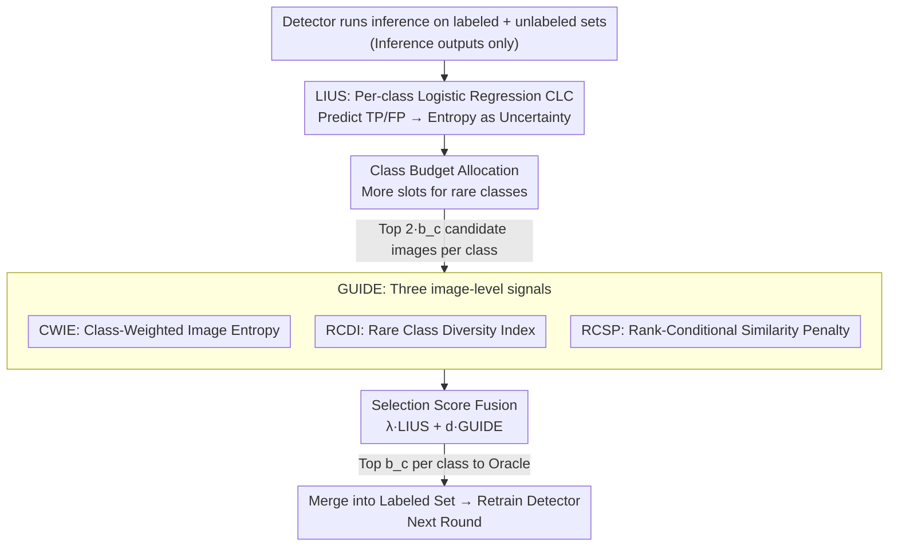

# Portable Active Learning for Object Detection

**Conference**: CVPR 2026 (Highlight)  
**arXiv**: [2605.10349](https://arxiv.org/abs/2605.10349)  
**Code**: None  
**Area**: Object Detection / Active Learning  
**Keywords**: Active Learning, Object Detection, Instance Uncertainty, Class Imbalance, Detector-Agnostic

## TL;DR
PAL proposes an active learning framework that **only reads detector inference outputs without modifying internal models or training pipelines**. It estimates the probability of each detection being a True Positive (TP) or False Positive (FP) using a lightweight logistic regression classifier based on two features—"pre-NMS box count + confidence"—and uses entropy as the Instance Uncertainty Score (LIUS). This is combined with three image-level signals (GUIDE) for diversity and class-balanced selection. PAL achieves higher detection accuracy with fewer annotations than baselines like PPAL on COCO, VOC, and BDD100K.

## Background & Motivation
**Background**: Object detection relies heavily on large-scale box-level annotations. Drawing boxes is both expensive and slow, serving as the primary bottleneck when migrating detectors to new domains or rare classes. Active Learning (AL) aims to select only the "most valuable" images for the oracle (annotator) in each round, approaching full-dataset accuracy with minimal labeling effort.

**Limitations of Prior Work**: Most existing AL methods in detection suffer from two issues. First, they are **intrusive**—methods like LearnLoss, MIAL, and PPAL either add loss prediction modules/adversarial heads to the detector, modify training schedules, or rely on intermediate features (gradients/feature maps). This makes integration costly and limits portability across different detectors. Second, they utilize **single-mode signals**—pure instance uncertainty methods (MIAL/LearnLoss) rarely combine **image-level signals, class imbalance cues, and instance-level uncertainty**, leading to batches that are either redundant or concentrated in specific classes.

**Key Challenge**: To be both "effective and easy to integrate"—the method must be detector-agnostic and non-intrusive (using only inference outputs) while ensuring that sample selection accounts for uncertainty, diversity, and class balance, which typically require deep model access.

**Goal**: Design a plug-and-play scoring function that depends only on inference outputs for any detector, covering four dimensions: instance uncertainty, image-level informativeness, image diversity, and rare class budgets.

**Key Insight**: The authors observe that whether a detection is a **TP/FP can be distinguished using only two inference by-products**: the number of boxes surrounding it during the pre-NMS stage (dense high-confidence clusters usually imply a real object) and its detection confidence. Therefore, instead of touching model internals, a two-dimensional logistic regression can learn the TP/FP decision boundary.

**Core Idea**: Rewrite "instance uncertainty" as the "entropy of the TP/FP prediction from logistic regression" (LIUS), then supplement image-level informativeness and diversity using three pure image/inference-level signals (GUIDE). The weighted fusion of these parts forms the selection score—maintaining zero modifications to the model or training code.

## Method

### Overall Architecture
PAL is an iterative AL framework: in each round, the detector trained on the current labeled set $L_r$ **runs inference on both the labeled set and the unlabeled pool**. Detections from the labeled set (with TP/FP ground truth) are used to train **Class-specific Logistic Classifiers (CLC)**, which then assign LIUS uncertainty scores to each detection in the unlabeled pool. After selecting candidate images for each class based on budgets, the GUIDE stage utilizes three image-level signals (Class-Weighted Image Entropy - CWIE, Rare Class Diversity Index - RCDI, and Rank-Conditional Similarity Penalty - RCSP) for final ranking. Top images are annotated by the oracle, merged into $L_{r+1}$, and used to retrain the detector.

The final score for instance $j$ in image $I$ is the weighted sum of instance-level and image-level components:

$$\text{Score}(I, j) = \lambda \cdot S_{\text{LIUS}}(I_j) + d \cdot S_{\text{GUIDE}}(I), \quad \lambda + d = 1$$

### Key Designs

**1. LIUS: Rewriting instance uncertainty as "TP/FP Entropy from Logistic Regression"**

Traditional instance uncertainty depends on internal features or modified heads. PAL uses two inference artifacts as features: $x_1$ is the **pre-NMS box count** (extracted by assigning pre-NMS boxes to final detections using an IoU threshold; dense clusters imply true objects), and $x_2$ is the **detection confidence**. For each class $c$, a 2D logistic regression classifier (CLC) is trained using the labeled set:

$$P(Y=1 \mid x) = \frac{1}{1 + e^{-(\beta_0 + \beta_1 x_1 + \beta_2 x_2)}}$$

This yields the probability of being a TP. Shannon entropy is then used to convert this into the LIUS score:

$$\text{LIUS}(I_j) = -\sum_{Y_j \in \{0,1\}} P(Y_j) \log P(Y_j)$$

Probabilities closer to 0.5 (hardest to distinguish TP/FP) yield higher entropy. Visualization (Fig.2/3) shows that early on, TP/FP for rare classes like "bus" are inseparable in feature space, but as AL adds samples, they separate into high-confidence/high-count zones, cleaning the CLC boundary. Simple **Logistic Regression** is preferred over XGBoost to avoid overfitting on rare classes.

**2. Class Budget Allocation: Reserved slots for rare classes to counter long-tail distributions**

To prevent high-frequency classes from dominating the budget, PAL introduces weights $r_c$, where lower frequency implies higher weight:

$$r_c = 1 - 0.5\left(\frac{n_{c,l}}{N_l} + \frac{n_{c,u}}{N_u}\right)$$

where $n_{c,l}, n_{c,u}$ are the instance counts in the labeled/unlabeled sets. The total budget $b$ is distributed:

$$b_c = \min\!\left(n_{c,u},\; b \cdot \frac{r_c}{\sum_{c_i \in C} r_{c_i}}\right), \quad \sum_{c \in C} b_c = b$$

For each class, the **top $2b_c$ candidate images** with the highest LIUS instances enter the GUIDE stage. This ensures rare classes are continuously sampled.

**3. GUIDE: Three pure image/inference signals for "Informativeness + Diversity"**

LIUS focuses on instance-level difficulty but ignores image-level redundancy. GUIDE re-ranks candidates using three signals:

- **CWIE (Class-Weighted Image Entropy)**: Measures image-level uncertainty while suppressing dominant high-frequency classes using $r_{c_i}$. For image $I$ with $O$ targets, $\text{CWIE}(I) = -\sum_{i \in O} r_{c_i} \sum_{j \in C} p_{ij} \log p_{ij}$.
- **RCDI (Rare Class Diversity Index)**: Rewards images spanning multiple classes, especially rare ones: $\text{RCDI}(I) = \sum_{k \in K} r_k$, where $K$ is the set of distinct classes in the image.
- **RCSP (Rank-Conditional Similarity Penalty)**: Uses a pre-trained ViT encoder to embed images. Images are ranked by LIUS per class; the first image gets a score of 1. For rank $i$, the score is $1 - \max_{m \in [1, i-1]} \cos(e_i, e_m)$. This "only penalizes the lower-ranked image" in a similar pair, preventing both from being discarded.

**4. Selection Score Fusion**

Composite score per image:

$$\text{Score}(I) = \lambda \cdot \text{LIUS}(I_j) + \gamma \cdot \text{RCSP}(I) + \delta\,(\text{CWIE}(I) + \text{RCDI}(I))$$

Constraints: $2\delta + \gamma = d$. Experiments use $\lambda=0.9, \delta=0.04, \gamma=0.02$. These weights are set empirically.

### Loss & Training
PAL **introduces no new loss functions**. Detectors are trained with their original objectives. PAL only trains lightweight CLCs and computes GUIDE scores offline after inference. Time complexity grows linearly with the number of instances/images. Since CLCs and GUIDE scoring can be parallelized, the overhead is minimal.

## Key Experimental Results

### Main Results
Evaluated on COCO, PASCAL VOC, and BDD100K across RetinaNet, Faster R-CNN, SSD, YOLOX-Tiny, and YOLO11s.

| Dataset / Detector | Metric | Ours (Final) | Prev. SOTA | Gain |
|--------|------|------|----------|------|
| COCO / RetinaNet | AP@0.5-0.95 | — | PPAL | +1.4 |
| PASCAL VOC / RetinaNet | mAP@0.5 | — | PPAL | +0.9 |
| BDD100K / RetinaNet | mAP@0.5 | 46.7 | PPAL (45.5) | +1.2 |
| BDD100K / YOLOX-Tiny | mAP@0.5 | 13.3 | Entropy (12.2) | +1.1 |
| COCO / YOLO11s | AP@0.5-0.95 | 12.2 | Random (10.7) | +1.5 |

**Annotation Efficiency**: To reach the same accuracy as PAL, PPAL requires approximately **20.7%** more annotations on average across datasets and rounds for RetinaNet.

### Ablation Study
(COCO + RetinaNet, 2% seed + 4 rounds of 2% each)

| Configuration | Key Finding |
|------|---------|
| Full PAL | Baseline |
| w/o CWIE | Most significant drop in early rounds |
| w/o RCSP | Diversity drop leads to redundancy |
| w/o RCDI | Poor coverage of rare classes |
| LIUS only ($d=0$) | Significant degradation in early rounds; approaches PAL in final rounds |
| XGBoost vs LR | Complex classifiers overfit on rare classes; LR is superior |
| Encoder (ViT/CLIP/DINOv2) | Google ViT performs best in early rounds |

### Key Findings
- **CWIE is the most critical component of GUIDE**: Removing it results in the largest performance drop in early rounds.
- **Diversity (GUIDE) is vital in small-data regimes**: While LIUS-only approaches PAL performance in later rounds, the gap is large early on.
- **Simplicity > Complexity**: Logistic regression and Google ViT outperform more complex alternatives like XGBoost or DINOv2, proving that simple models are more robust for rare classes.

## Highlights & Insights
- **Zero-Intrusion Plug-and-Play**: By using only inference outputs, PAL integrates with any detector (RetinaNet, Faster R-CNN, YOLO, etc.) with near-zero cost—highly practical for industrial deployment.
- **Minimalist Feature Design**: The use of "pre-NMS box count + confidence" as a proxy for TP/FP is an elegant observation that bypasses the need for complex model features or gradients.
- **RCSP "Rank-Conditional" Logic**: Unlike traditional similarity filters that might discard both images in a similar pair, RCSP only penalizes the lower-ranked one, preserving the most informative sample.
- **Mutual Enhancement**: Visualizations show that AL rounds not only improve the detector but also clean the CLC's decision boundary, demonstrating how selection and learning reinforce each other.

## Limitations & Future Work
- **Fixed GUIDE Weights**: Ablations suggest that GUIDE can sometimes be detrimental in later rounds as LIUS variance increases. An adaptive weighting mechanism across rounds is missing.
- **Reliance on per-class CLC**: Extremely rare classes in COCO may not have enough samples to train a CLC, forcing the system to rely solely on GUIDE for those categories.
- **Pre-NMS Dependency**: The semantic meaning of "pre-NMS box count" might vary between one-stage/anchor-free architectures (e.g., YOLO), requiring further stability analysis.

## Related Work & Insights
- **vs PPAL**: PPAL relies on model-specific features for diversity and difficulty calibration. PAL achieves the same accuracy while saving ~20.7% annotations without touching model internals.
- **vs MIAL / LearnLoss**: These require additional adversarial heads or loss modules. PAL is entirely offline and inference-driven.
- **vs CoreSet / CDAL**: These often cluster in latent feature spaces. PAL uses external ViT embeddings and rank-conditional penalties to decouple diversity from the detector's internal representation.

## Rating
- Novelty: ⭐⭐⭐⭐ Rewriting uncertainty as TP/FP entropy and combining it with pure inference signals is a novel, engineering-oriented combination.
- Experimental Thoroughness: ⭐⭐⭐⭐⭐ Extensive testing across 3 datasets and 5 detectors with multiple repeats and deep ablations.
- Writing Quality: ⭐⭐⭐⭐ Clear structure and great storytelling through visualization.
- Value: ⭐⭐⭐⭐⭐ Highly practical for industry due to being detector-agnostic, non-intrusive, and parallelizable. CVPR Highlight is well-deserved.

<!-- RELATED:START -->

## Related Papers

- [\[ICCV 2025\] From Easy to Hard: Progressive Active Learning Framework for Infrared Small Target Detection with Single Point Supervision](../../ICCV2025/object_detection/from_easy_to_hard_progressive_active_learning_framework_for_infrared_small_targe.md)
- [\[CVPR 2026\] From Detection to Association: Learning Discriminative Object Embeddings for Multi-Object Tracking](from_detection_to_association_learning_discriminative_object_embeddings_for_mult.md)
- [\[CVPR 2026\] Balanced Hierarchical Contrastive Learning with Decoupled Queries for Fine-grained Object Detection in Remote Sensing Images](balanced_hierarchical_contrastive_learning_with_decoupled_queries_for_fine-grain.md)
- [\[CVPR 2026\] Towards Persistence: Learning Topological Constraints for Event-based Small Object Detection](towards_persistence_learning_topological_constraints_for_event-based_small_objec.md)
- [\[CVPR 2026\] Expert-Teacher-Student Collaborative Learning for Domain Adaptive Object Detection](expert-teacher-student_collaborative_learning_for_domain_adaptive_object_detecti.md)

<!-- RELATED:END -->
