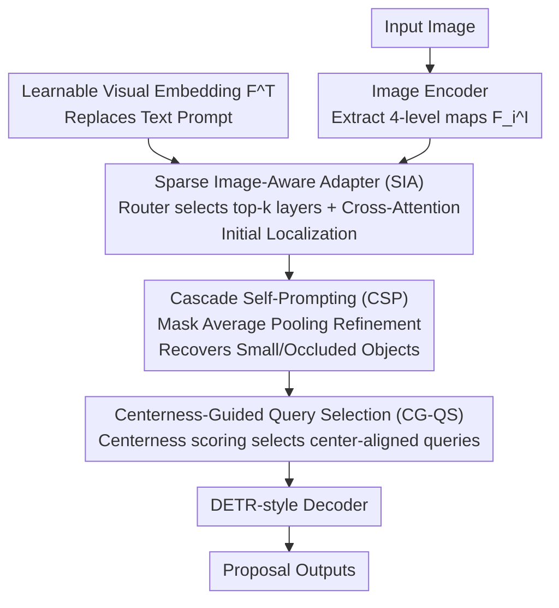

# Prompt-Free Universal Region Proposal Network

**Conference**: CVPR 2026  
**arXiv**: [2603.17554](https://arxiv.org/abs/2603.17554)  
**Code**: [GitHub](https://github.com/tangqh03/PF-RPN)  
**Area**: Object Detection  
**Keywords**: Region Proposal, Prompt-Free Detection, Zero-Shot Generalization, Learnable Embeddings, Open World

## TL;DR

PF-RPN replaces text/image prompts with learnable visual embeddings. Through three modules—Sparse Image-Aware Adapter, Cascade Self-Prompting, and Centerness-Guided Query Selection—it achieves SOTA zero-shot region proposal across 19 cross-domain datasets using only 5% of COCO data for training.

## Background & Motivation

**Background**: Region Proposal Networks (RPN) are core components of object detection, responsible for generating candidate boxes. Open-Vocabulary Object Detection (OVD) models like Grounding DINO and YOLO-World utilize text category names or examplar images as prompts to localize objects, demonstrating cross-domain generalization.

**Limitations of Prior Work**: OVD methods rely on external prompts (category names/exemplar images), which are often unavailable in practical scenarios—such as industrial defect detection or underwater object detection, where target categories and reference images cannot be obtained in advance. Although some prompt-free OVD methods (e.g., GenerateU, DetCLIPv3) use large vision-language models to generate text descriptions to eliminate manual prompting, they introduce massive memory and latency overhead.

**Key Challenge**: To achieve "prompt-free" universal object localization, the system must avoid reliance on external text/image inputs while also avoiding computationally expensive generative VLMs. A lightweight and efficient way to replace the role of text embeddings is needed.

**Goal**: Design a lightweight region proposal network that can localize arbitrary objects in unknown domains without any external prompts, utilizing only visual features.

**Key Insight**: The authors observe that the role of text embeddings in OVD models is essentially to provide query signals to match visual features. Therefore, a **learnable visual embedding** can replace the text embedding, and this embedding can be dynamically updated using the image's own visual features. Further observations show: (1) target internal features possess stronger localization capabilities than learnable embeddings themselves, and (2) queries closer to the target center produce more accurate proposals than edge queries.

**Core Idea**: Replace text prompts with learnable visual embeddings and implement prompt-free universal object localization through adaptive aggregation of multi-level visual features and iterative refinement via cascade self-prompting.

## Method

### Overall Architecture

PF-RPN aims to answer: how can a detector localize arbitrary objects in unseen domains without any text category names or reference images? It is built upon Grounding DINO (Swin-B backbone), but replaces the entire query signal originally provided by the text encoder with a learnable visual embedding $F^T$. The image's own features are then used to "feed" this embedding into a reliable localization signal.

Specific mechanism: The input image first passes through an encoder to extract 4 levels of feature maps $F_i^I \in \mathbb{R}^{H_i \times W_i \times C}$. The SIA module selects the most informative levels among these four, merging them into the learnable embedding for initial localization. The CSP module, recognizing that SIA might miss small or occluded objects, uses the already activated target region features to iteratively refine the embedding over multiple rounds. The CG-QS module then selects high-quality queries that fall near the target centers from the refined queries. Finally, these queries are passed to a DETR-style decoder to output proposal boxes. All three modules share the theme of "nourishing learnable embeddings with visual features," gradually refining the embedding from a coarse semantic pointer to a precise target pointer.

### Key Designs

**1. Sparse Image-Aware Adapter (SIA): Selecting Optimal Feature Layers**

A naive approach would merge all 4 feature levels into the learnable embedding. However, shallow layers benefit small objects while deep layers capture large objects; the useful layers vary per image, and merging all introduces noise from irrelevant layers. SIA performs selection before fusion: Global Average Pooling (GAP) is applied to each layer to obtain a compact representation $\bar{F}_i^I$, and a lightweight MLP router predicts importance weights $w_i = \text{Router}(\bar{F}_i^I)$. Following a Mixture-of-Experts (MoE) approach, only the top-$k$ layers ($k \leq 4$, default $k=2$) are selected. The selected layers update the embedding via cross-attention:

$$\tilde{F}^T = \sum_{j=1}^{k} \tilde{w}_{\sigma(j)} \cdot \text{Attn}(F^T, [\bar{F}_{\sigma(j)}^I, F_{\sigma(j)}^I])$$

The attention keys/values incorporate both global representations $\bar{F}_{\sigma(j)}^I$ and local features $F_{\sigma(j)}^I$, providing the embedding with both coarse semantic clues and fine-grained structural cues. Placing "layer selection" before attention is critical—removing MoE and applying attention to all layers drops CD-FSOD AR100 from 60.7 to 58.6 and ODinW13 from 76.5 to 68.7, as attention within a single layer cannot replace cross-layer filtering.

**2. Cascade Self-Prompting (CSP): Refining Embeddings with Internal Features**

After the SIA single-step adaptation, activated regions may still contain background noise, and small or occluded objects are easily missed. CSP leverages the observation that internal features of an object localize better than the learnable embedding itself. It allows activated target regions to guide embedding updates in a cascaded manner from deep to shallow layers, first stabilizing semantic aggregation and then recovering structural details. At layer $i$, cosine similarity between the previous embedding and current features is calculated; a target region mask $M_i = \mathbb{1}(\cos(\tilde{F}_{i-1}^T, F_i^I) > \delta)$ is obtained via threshold $\delta=0.3$. Mask Average Pooling (MAP) then integrates these features back:

$$\tilde{F}_i^T = \tilde{F}_{i-1}^T + \text{MAP}(M_i, F_i^I)$$

This effectively allows the embedding to "look in the mirror" at each layer, updating itself to closer match the actual target appearance. Defaulting to 3 iterations improves AR100 from 59.6 to 60.7 compared to 1 iteration, with a latency cost of only ~4.6ms.

**3. Centerness-Guided Query Selection (CG-QS): Prioritizing Center-Aligned Queries**

Refinement produces candidate queries, but visualization reveals that queries near the target center provide much more accurate regression than those at edges, which often produce false positives. CG-QS explicitly assigns a centerness score to each query $f_i$: a lightweight MLP predicts $g_i$, supervised by ground truth constructed from distances $l,r,t,b$ to the four edges of the GT box:

$$c_i = \sqrt{\frac{\min(l,r)}{\max(l,r)} \times \frac{\min(t,b)}{\max(t,b)}}$$

$c_i$ is 1 at the center and nears 0 at the edges. The supervision loss is $\mathcal{L}_{ctr} = \sum_i \|g_i - c_i\|_1$. During inference, the predicted centerness and classification scores are combined to determine the final candidate queries, suppressing false positives from edge queries by prioritizing "positional reliability."

### Loss & Training

Total loss: $\mathcal{L} = \mathcal{L}_{reg} + \mathcal{L}_{cls} + \mathcal{L}_{rt} + \lambda \mathcal{L}_{ctr}$, where $\mathcal{L}_{reg}$ includes L1 and GIoU losses, $\mathcal{L}_{cls}$ is a contrastive loss between queries and learnable embeddings, and $\mathcal{L}_{rt} = \text{std}(w_i)$ is an MoE router load-balancing auxiliary loss. $\lambda=5$.

Training data utilizes only **5% COCO** (80 classes) + **5% ImageNet** (1000 classes, with pseudo-boxes). ImageNet data is added to mitigate image encoder bias caused by fine-tuning on detection data. Training was completed on 4x RTX 4090.

## Key Experimental Results

### Main Results

Evaluated via Average Recall on CD-FSOD (6 cross-domain datasets) and ODinW13 (13 diverse domain datasets):

| Method | Prompt-Free | CD-FSOD AR100/300/900 | ODinW13 AR100/300/900 |
|------|-------------|----------------------|----------------------|
| GDINO (text prompt) | ✗ | 52.9/53.5/54.7 | 72.1/73.4/74.0 |
| GDINO ("object") | ✓ | 54.7/57.8/61.6 | 69.1/70.9/72.4 |
| YOLOE-v8-L | ✗ | 44.4/46.2/47.1 | 66.6/67.8/68.3 |
| GenerateU | ✓ | 47.7/54.1/55.7 | 67.3/71.5/72.2 |
| Cascade RPN | ✓ | 45.8/52.0/56.9 | 60.9/65.5/70.2 |
| **PF-RPN (Ours)** | **✓** | **60.7/65.3/68.2** | **76.5/78.6/79.8** |

Ours improves AR100/300/900 by +7.8/+11.8/+13.5 over Grounding DINO on CD-FSOD, and by +4.4/+5.2/+5.8 on ODinW13. Compared to GenerateU, AR100 increases by +13.0, while VRAM usage is only 0.5G (vs 12.2G) and inference is ~20x faster.

### Ablation Study

| Configuration | CD-FSOD AR100 | Description |
|------|--------------|------|
| Baseline (GDINO) | 52.9 | Without any modules |
| + SIA | 57.8 | Visual features more effective than text (+4.9) |
| + SIA + CSP | 60.2 | Cascade self-prompting reduces misses (+2.4) |
| + SIA + CG-QS | 59.6 | Centerness selection improves quality (+1.8) |
| + SIA + CSP + CG-QS (Full) | **60.7** | Optimal complementarity |

### Key Findings

- **SIA module provides largest gain**: Adding it alone increases AR by 4.9, indicating visual features are far more effective queries than text in prompt-free settings.
- **MoE routing is crucial**: Removing MoE drops performance from 60.7 to 58.6 (CD-FSOD) and 76.5 to 68.7 (ODinW13). Attention alone cannot replace cross-layer selection.
- **CSP Iterations**: 3 iterations (AR100=60.7) outperformed 1 iteration (59.6) with only ~4.6ms added latency.
- **Top-k selection**: $k=2$ is optimal; $k=1$ lacks information, while $k=3,4$ introduce redundancy.
- **Plugin support**: Integrating into other detectors is effective; added +3.7 AP to DE-ViT and +5.5 AP to CD-ViTO.
- **Backbone Agnostic**: Significant improvements seen on both SwinB (+7.8 AR100) and ResNet50 (+5.2 AR100).

## Highlights & Insights

- **True Prompt-Free Detection**: Eliminates the prompt dependency bottleneck of OVD by replacing text channels with learnable embeddings, without resorting to external VLM captioners. This approach is transferable to other cross-modal alignment tasks.
- **Extreme Data Efficiency**: Generalizes well across 19 datasets using only 5% COCO for training; increasing data (5%→10%) showed diminishing returns, suggesting the architectural generalization capability is key.
- **MoE Routing for Feature Layer Selection**: An elegant design. While traditional methods use FPN or global attention for multi-scale fusion, this router filters the most relevant layers first, avoiding noise from irrelevant scales.

## Limitations & Future Work

- **Proposal Only, No Classification**: PF-RPN handles only localization and does not provide category names. It must be paired with a downstream classifier for a full detection system.
- **Generalization Ceiling in Extreme Domains**: Improvements may still be needed for extreme domain gaps (e.g., ArTaxOr insect images).
- **Static Threshold $\delta=0.3$**: The CSP module uses a fixed threshold; adaptive thresholds may yield further gains.
- **Learnable Embedding Initialization**: Currently randomly initialized; using pre-trained visual prototypes might improve convergence and final performance.

## Related Work & Insights

- **vs Grounding DINO**: PF-RPN is based on the GDINO framework but removes the text encoder and prompt dependency, replacing language-guided selection with SIA+CSP+CG-QS. It significantly outperforms GDINO in prompt-free settings while being faster.
- **vs GenerateU**: GenerateU uses generative methods to map regions to free-form text names to achieve prompt-free detection but relies on large captioners (12.2G VRAM). PF-RPN requires only 0.5G VRAM, is 20x faster, and performs better (+13.0 AR100).
- **vs YOLOE**: While YOLOE supports prompt-free detection, its zero-shot generalization is limited by static text proxies. PF-RPN achieves stronger generalization via dynamic visual embedding updates.

## Rating

- Novelty: ⭐⭐⭐⭐ Uses learnable embeddings to replace text prompts; the combination of MoE routing and cascade self-prompting is clever, though built on the GDINO framework.
- Experimental Thoroughness: ⭐⭐⭐⭐⭐ 19 cross-domain datasets, exhaustive ablations, multiple backbones, integration experiments, and efficiency comparisons.
- Writing Quality: ⭐⭐⭐⭐ Clear structure, well-articulated motivation for each module, and helpful visualizations.
- Value: ⭐⭐⭐⭐ Solves a major pain point in OVD deployment with high data efficiency and inference speed.

<!-- RELATED:START -->

## Related Papers

- [\[CVPR 2026\] ViTPrompt: Training-Free Prompt Refinement with Visual Tokens for Open-Vocabulary Detection](vitprompt_training-free_prompt_refinement_with_visual_tokens_for_open-vocabulary.md)
- [\[ICLR 2026\] APT: Towards Universal Scene Graph Generation via Plug-in Adaptive Prompt Tuning](../../ICLR2026/object_detection/apt_towards_universal_scene_graph_generation_via_plug-in_adaptive_prompt_tuning.md)
- [\[CVPR 2026\] Visual Prototype Conditioned Focal Region Generation for UAV-Based Object Detection](visual_prototype_conditioned_focal_region_generation_for_uav-based_object_detect.md)
- [\[CVPR 2026\] Object-Generalized Re-Identification: A Step Towards Universal Instance Perception](object-generalized_re-identification_a_step_towards_universal_instance_perceptio.md)
- [\[CVPR 2026\] UniSpector: Towards Universal Open-set Defect Recognition via Spectral-Contrastive Visual Prompting](unispector_towards_universal_open-set_defect_recognition_via_spectral-contrastiv.md)

<!-- RELATED:END -->
