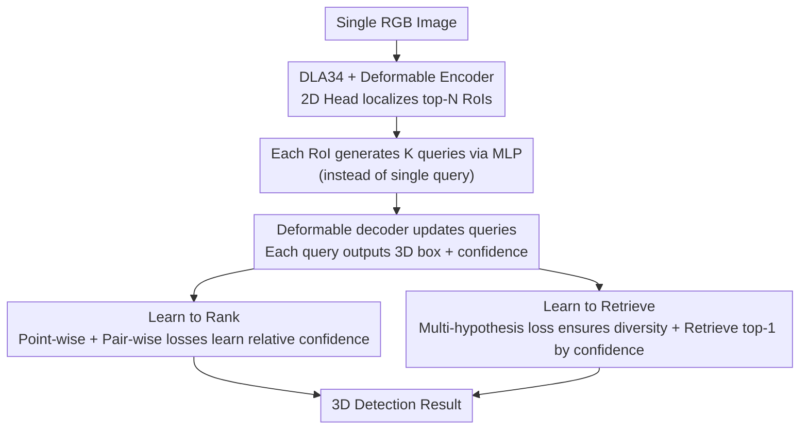

# RARE: Learn to RAnk and REtrieve for Monocular 3D Object Detection

**Conference**: CVPR 2026  
**Paper**: [CVF Open Access](https://openaccess.thecvf.com/content/CVPR2026/html/Park_RARE_Learn_to_RAnk_and_REtrieve_for_Monocular_3D_Object_CVPR_2026_paper.html)  
**Code**: https://github.com/HyeonjeongPark37/RARE  
**Area**: Object Detection / 3D Vision  
**Keywords**: Monocular 3D Detection, Confidence Estimation, learning-to-rank, Multiple Hypotheses, query set

## TL;DR
RARE employs "ranking + retrieval" mechanisms to unify and solve two persistent issues in monocular 3D detection: it transforms confidence estimation from absolute regression to **learning relative rankings**, and constructs a set of queries for each object to predict multiple plausible 3D hypotheses, **retrieving** the optimal solution based on learned confidence. It outperforms several monocular SOTA methods on KITTI and nuScenes.

## Background & Motivation
**Background**: Monocular 3D detection infers 3D bounding boxes, categories, and confidence from a single RGB image, offering a low-cost and easily deployable solution for autonomous driving and robotics. While classification is largely solved (KITTI vehicle 2D mAP >90%), the true difficulties lie in **3D localization** and **confidence estimation**.

**Limitations of Prior Work**: ① Localization is inherently ill-posed—a single 2D observation can correspond to multiple plausible 3D configurations. Even with geometric constraints, existing methods typically regress **a single deterministic 3D box**, often resulting in a "mean-collapsing" estimate that represents none of the actual modes. ② Confidence scores are generally derived by **regressing absolute scores** (using classification scores, depth uncertainty, or 3D box quality), yet diagnostic studies and the authors' tests show these scores are severely misaligned with true localization accuracy.

**Key Challenge**: The authors identify two root causes. First, absolute confidence values are **highly unstable**—small errors in depth or orientation in monocular settings cause drastic changes in true confidence, making absolute regression naturally difficult to learn. Second, point-wise regression conflicts with the **multi-modal nature** of 3D localization; faced with "one 2D to many 3D" ambiguity, point prediction can only yield a conditional mean. The paper provides quantification: with KITTI focal length $f\approx721.54$ and vehicle height $H\approx1.5$m, a 1-pixel change in height causes depth variations of approximately 0.36/0.81/1.43m at distances of 20/30/40m, respectively—the greater the distance, the higher the ambiguity.

**Goal**: To simultaneously overhaul confidence estimation and 3D localization, making the former robust and the latter capable of representing multi-modalities.

**Key Insight**: Since absolute scores are unstable, only the **relative order** should be learned (ranking is far less sensitive to localization errors). Since point-wise regression collapses to the mean, a set of **diverse and plausible hypotheses should be explicitly predicted** and the best one selected.

**Core Idea**: Reformulate monocular 3D detection as "learn to rank (obtaining robust confidence) + learn to retrieve (selecting the optimal from multiple hypotheses)," integrated into a single detection transformer for end-to-end training.

## Method

### Overall Architecture
Given an RGB image, a DLA34 backbone extracts multi-scale features for a multi-scale deformable self-attention encoder. Simultaneously, a 2D head predicts centerness, 2D size, and offset heatmaps to localize RoIs, keeping the top-N RoIs based on centerness. Features are extracted via RoI Align for each RoI and passed through an MLP to generate **K queries** (instead of the traditional 1). A deformable transformer decoder updates this set of queries, each predicting a candidate 3D box and confidence. Two mechanisms are embedded: **learning to rank** uses point-wise and pair-wise losses to learn confidence as relative ranking signals; **learning to retrieve** uses a multi-hypothesis loss to ensure the K queries are both diverse and plausible, retrieving the top-1 by confidence during inference.

### Key Designs

**1. Learning to Rank: Changing Confidence from "Absolute Regression" to "Relative Ranking"**

Addressing the instability of absolute confidence, RARE abandons fitting precise confidence values in favor of learning the **relative quality between detections**. The ground truth confidence for each detection is defined as its maximum 3D IoU with same-class ground truth boxes: $\hat{c}_i = \max_j \delta(y_i=\hat{y}_j)\,\text{IoU}_\text{3D}(b_i,\hat{b}_j)$ (where $\delta$ is the indicator function). The ranking loss consists of two terms $L_\text{rank}=\ell_\text{point}+\ell_\text{pair}$: **point-wise** $\ell_\text{point}=\frac{1}{|D|}\sum_i (c_i-\hat{c}_i)^2$ aligns predicted confidence with ground truth to anchor global calibration (providing an absolute scale); **pair-wise** first defines preference labels $\hat{r}_{i,j}=\text{sign}(\hat{c}_i-\hat{c}_j)\in\{-1,+1\}$, then uses a logistic loss $\ell_\text{pair}=\frac{1}{|P|}\sum_{(i,j)\in P}\log(1+\exp(-\hat{r}_{i,j}(z_i-z_j)))$ to enforce that "detections with higher quality obtain higher scores," refining local ranking ($z_i$ is the unnormalized confidence logit). Both terms are essential: using only pair-wise leads to slow convergence and uninterpretable scores, while using only point-wise results in weaker ranking consistency (Spearman). Together, the point-wise term sets the scale while the pair-wise term polishes the ranking. This differs from 2D methods that optimize ranking by hard-splitting samples into positive/negative sets—RARE **predefines no IoU thresholds and creates no positive/negative sets**, allowing scores to directly encode the relative quality of competing predictions to support subsequent retrieval.

**2. Learning to Retrieve: Generating Hypotheses for Each Object and Retrieving the Optimal**

To counter the collapse of point-wise regression to the mean, RARE uses an MLP for each RoI to generate $K$ queries $\{q_{i,1},\dots,q_{i,K}\}=\text{MLP}(F^\text{RoI}_i)$. Each query predicts a candidate 3D box $b_{i,k}=(x_{i,k},d_{i,k},s_{i,k},\theta_{i,k})$ and confidence $c_{i,k}$ via the decoder, representing $K$ possible spatial configurations for the object. Training uses a **3D box multi-hypothesis loss** to make these hypotheses both accurate and diverse: $K$ confidence logits are passed through a softmax to get $\{p_{i,k}\}$, $L_\text{3D}=\frac{1}{M}\sum_i\sum_k p_{i,k}\ell_\text{box}(b_{i,k},\hat{b}_i)+\sum_k|\bar{p}_k-\tfrac{1}{K}|$. The first term softly weights the pull of each hypothesis toward the ground truth (confident ones are pulled tightly, uncertain ones lightly), while the second term regularizes deviations from a uniform prior using the average selection probability within a batch $\bar{p}_k=\frac{1}{M}\sum_i p_{i,k}$, **preventing probability mass from collapsing into a few hypotheses** and forcing diversity. During inference, the candidate with the highest confidence in each RoI is retrieved: $k^*=\arg\max_k c_{i,k}$. Ablations show the second regularization term is critical—adding retrieval without diversity regularization still allows a single query to dominate. Only after adding it does AP3D improve significantly, indicating that "simply increasing query count is insufficient; retrieval-aware supervision + diversity regularization" is needed to turn candidates into complementary 3D hypotheses. The paper also observes that the learned depth span of hypotheses (e.g., 0.45×3≈1.35m at 40m) closely matches the depth ambiguity caused by pixel quantization (≈1.43m), suggesting the hypotheses adaptively cover the inherent imaging uncertainty.

### Loss & Training
The total end-to-end loss is $L_\text{all}=\lambda_\text{2D}L_\text{2D}+\lambda_\text{3D}L_\text{3D}+\lambda_\text{rank}L_\text{rank}$, where $L_\text{2D}$ is the MSE of 2D heatmaps. Hyperparameters are $\lambda_\text{2D}=\lambda_\text{3D}=1$, with $\lambda_\text{rank}$ set to 10 for $\ell_\text{point}$ and 0.5 for $\ell_\text{pair}$; K=3, RoI pooling 7×7, 3 encoder layers + 3 decoder layers, 8 heads, hidden dimension 256. Hierarchical Task Learning (HTL) with linear warm-up is used, along with MixUp3D and DivAlign augmentation. Trained for 800 epochs using Adam (lr=0.001) on 2×A100. Inference discards detections with 2D scores <0.2 and **does not perform NMS**.

## Key Experimental Results

> Metrics: **AP3D|40 / APBEV|40** are Average Precision for 3D / BEV boxes at 40 recall points (Car IoU=0.7, Pedestrian/Cyclist 0.5); **Pearson / Spearman** measure linear / rank correlation between predicted and ground truth confidence (higher is better); **Depth MAE** is the Mean Absolute Error of predicted depth (lower is better).

### Main Results

| Dataset/Category | Metric | Prev. SOTA (Monocular) | RARE | Gain |
|------|------|------|------|------|
| KITTI test / Car | AP3D Easy/Mod/Hard | 26.35/18.72/15.97 (MonoDGP) | 28.83/19.57/17.38 | +9.4%/+4.5%/+8.8% |
| KITTI test / Car | APBEV Easy/Mod/Hard | 35.24/25.23/22.02 (MonoDGP) | 38.46/26.37/23.46 | +9.1%/+4.5%/+6.5% |
| KITTI test / Cyclist | AP3D Easy/Mod/Hard | 7.34/4.28/3.78 (MonoUNI) | 11.17/5.96/5.28 | +52%/+39%/+40% |
| nuScenes frontal val | Depth MAE (All) | 1.26 (DEVIANT) | 1.05 | Lower is better |

RARE, despite being purely monocular, competes effectively with methods using LiDAR-assisted training (e.g., MonoTAKD†), even surpassing it by +3.3%/+0.7%/+5.3% in AP3D. It achieves the best depth MAE across all distance ranges in cross-dataset testing (KITTI train → nuScenes test), indicating high transferability of learned representations.

### Ablation Study

| Configuration | AP3D Easy/Mod/Hard | Description |
|------|------|------|
| Baseline (Point prediction + Depth uncertainty) | 24.93/19.04/16.57 | MonoDETR-like scheme |
| + Learn to Rank | 26.54/21.15/18.20 | Ranking confidence only |
| + Learn to Retrieve | 27.81/20.64/17.56 | Multi-hypothesis retrieval only |
| + Rank + Retrieve (Full) | 28.58/22.05/19.21 | Complete RARE |

Decomposition of confidence learning (Tab.5): Baseline Pearson/Spearman is only 0.540/0.480. Point-wise only → 0.827/0.650 (linear calibration improves greatly but ranking remains weak). Pair-wise only → 0.820/0.719 (strong ranking, slightly lower calibration). Joint → 0.825/0.754, excelling in both calibration and ranking.

### Key Findings
- **Strong Synergy between Rank and Retrieve**: The full model improves by 14.6%/15.8%/15.9% over the baseline, exceeding the sum of individual improvements. Ranking loss provides reliable confidence to select candidates, while the retrieval module supplies rich multi-modal hypotheses for the ranking to choose from; the two are mutually dependent.
- **Diversity Regularization is Decisive for Retrieval**: Naively supervising all queries with the same ground truth is only slightly better than the baseline (prone to collapsing into nearly identical boxes). Only with retrieval-aware supervision and uniform prior regularization are candidates forced into complementary hypotheses.
- **Maximum Gain for Small/Thin Objects**: The relative improvement for Cyclist is as high as 39%–52% because such objects have small scales and high depth ambiguity, where point-wise regression is lease reliable, making multi-hypothesis + ranking/retrieval particularly effective.
- **Smaller, Faster, and More Accurate**: 32.9M parameters (< MonoDETR 35.9M, MonoDGP 38.9M). Runtime of 35.3ms is only slightly higher than MonoDETR, while achieving the highest Mod. AP3D.

## Highlights & Insights
- **Modeling "Ill-posed Problems" as Multi-modal**: Rather than forcing a single mean, it is better to acknowledge the one-to-many nature of 2D→3D and predict a set of hypotheses followed by retrieval. This "multi-hypothesis + retrieval" paradigm can be transferred to other underdetermined inverse problems like depth or pose estimation.
- **Confidence - "Learn Order, Not Values"**: Relative ranking is far less sensitive to common monocular noises in depth or orientation compared to absolute regression. The combination of point-wise for scale and pair-wise for ranking is elegant and avoids the need for predefined IoU thresholds for positive/negative samples.
- **Hypothesis Span Aligned with Imaging Ambiguity**: The learned depth span of multiple hypotheses naturally matches depth uncertainty caused by pixel quantization (approx. 1.35m vs 1.43m at 40m), providing elegant evidence of model adaptation to geometric priors.

## Limitations & Future Work
- **Fixed Small K**: Generating only K=3 hypotheses per object may not be enough for extremely distant or ambiguous scenes. ⚠️ Precise accuracy/overhead curves for larger K values were not provided; specific saturation points remain to be confirmed.
- **Dependency on 2D Head and RoI Quality**: Queries are generated from RoI features; if 2D centerness misses or the RoI is misaligned, downstream multi-hypotheses cannot recover. Inference still relies on a 2D score threshold (0.2) for filtering.
- **Confidence Ground Truth still uses 3D IoU**: Supervision for ranking comes from IoU with ground truth boxes, requiring 3D annotations for training. How to learn ranking in unannotated or weakly-annotated scenarios is not addressed.
- **Future Directions**: Adapting K based on object distance or ambiguity; expanding retrieval from "per-RoI top-1" to set-level retrieval considering global consistency.

## Related Work & Insights
- **vs MonoDETR / MonoDGP (DETR-based Monocular)**: These still output single-point 3D estimates per object with confidence based on depth uncertainty. RARE retains the DETR architecture but swaps in multi-query multi-hypothesis + ranking confidence, surpassing MonoDGP (19.57 vs 18.72 KITTI Car Mod.) while being smaller and faster.
- **vs MonoDIS / PL (Confidence Proxies)**: MonoDIS derives confidence from regression loss; PL only encodes order in targets. RARE uses joint point-wise + pair-wise learning for relative ranking, achieving high Pearson and Spearman correlations.
- **vs anchor-based multi-box / multi-depth methods**: The former relies on predefined anchors and is sensitive to coverage and category bias; the latter focuses only on depth cues and introduces threshold hyperparameters. RARE generates data-dependent, compact candidate sets of full boxes without requiring fixed anchors or external depth cues.
- **vs camera-multiplex (UCMR)**: Inspired by its soft-averaging of multiple perspectives, but RARE applies this to "a set of 3D box candidates per object + learned confidence retrieval," specifically for monocular 3D detection.

## Rating
- Novelty: ⭐⭐⭐⭐⭐ "rank + retrieve" unified framework, reframing confidence and localization from a new perspective.
- Experimental Thoroughness: ⭐⭐⭐⭐⭐ Three KITTI classes + nuScenes cross-domain + confidence correlation + geometric diversity of multiple hypotheses; thorough ablation.
- Writing Quality: ⭐⭐⭐⭐⭐ Quantified motivation, clearly explained mechanisms and losses.
- Value: ⭐⭐⭐⭐ Purely monocular approach approaching LiDAR-assisted methods; smaller and faster with high practical value (though still within the detection paradigm).

<!-- RELATED:START -->

## Related Papers

- [\[ICCV 2025\] 3D-MOOD: Lifting 2D to 3D for Monocular Open-Set Object Detection](../../ICCV2025/object_detection/3dmood_lifting_2d_to_3d_for_monocular_openset_object_detecti.md)
- [\[CVPR 2026\] EW-DETR: Evolving World Object Detection via Incremental Low-Rank DEtection TRansformer](ew-detr_evolving_world_object_detection_via_incremental_low-rank_detection_trans.md)
- [\[CVPR 2026\] LocateAnything3D: Vision-Language 3D Detection with Chain-of-Sight](locateanything3d_vision-language_3d_detection_with_chain-of-sight.md)
- [\[CVPR 2026\] FSLoRA: Harmonizing Detection and Re-Identification via Freq-Spatial Low-Rank Adapter for One-Stage Person Search](fslora_harmonizing_detection_and_re-identification_via_freq-spatial_low-rank_ada.md)
- [\[CVPR 2026\] Geometry-Aligned and Anomaly-Aware Reconstruction for 3D Anomaly Detection](geometry-aligned_and_anomaly-aware_reconstruction_for_3d_anomaly_detection.md)

<!-- RELATED:END -->
