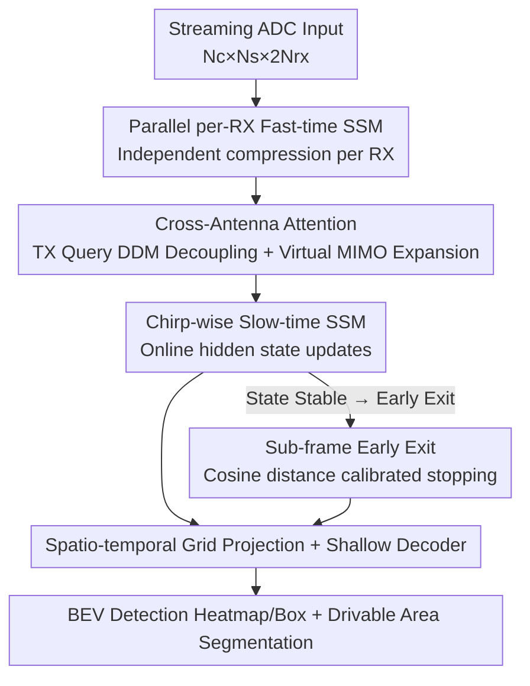

# RAVEN: Radar Adaptive Vision Encoders for Efficient Chirp-wise Object Detection and Segmentation

**Conference**: CVPR 2026  
**Paper**: [CVF Open Access](https://openaccess.thecvf.com/content/CVPR2026/html/Sen_RAVEN_Radar_Adaptive_Vision_Encoders_for_Efficient_Chirp_wise_Object_Detection_CVPR_2026_paper.html)  
**Code**: None  
**Area**: Autonomous Driving / Radar Perception / Object Detection  
**Keywords**: FMCW Radar, MIMO, State Space Models, Early Exit Inference, BEV Detection

## TL;DR
RAVEN feeds raw ADC streams from FMCW radar directly into a lightweight encoder consisting of "per-RX fast-time SSM + cross-antenna attention + chirp-wise slow-time SSM." While preserving the geometry of the MIMO virtual array, it employs a calibrated early-exit rule to produce detection results using only the first few chirps of a frame. Compared to traditional frame-based radar backbones, compute requirements are reduced to approximately 1/170 and end-to-end latency is reduced by ~4x, while still achieving SOTA detection and drivable area segmentation on RADIal and RaDICaL datasets.

## Background & Motivation
**Background**: Millimeter-wave (mmWave) radar is more robust than cameras and LiDAR in adverse weather and lighting conditions. Its ability to directly measure velocity via Doppler makes it an attractive sensing modality for mobile platforms. Mainstream deep learning pipelines for radar are "frame-based": they collect a complete frame of ADC samples, perform a sequence of FFTs across range, angle, and Doppler dimensions to construct a high-resolution RAD (range-angle-Doppler) tensor, and then use dense CNN or Transformer backbones to process these 3D feature maps.

**Limitations of Prior Work**: The frame-based paradigm has two major drawbacks. First, latency is locked to at least one full frame interval, as computation cannot begin until the entire frame is sampled. Second, the RAD cube is massive (e.g., $256 \times 64 \times 12$ for a 3TX$\times$4RX configuration), making both construction and dense inference computationally expensive and difficult to run on embedded or high-speed platforms. Consequently, sequential models that perform inference directly on streaming ADC data (processing chirps as they arrive) have emerged. These offer lower peak memory and theoretically earlier decision-making, but these lightweight sequential methods often suffer from performance degradation in complex tasks like object detection.

**Key Challenge**: The authors identify two root causes for the performance drop in existing lightweight sequential methods. First, they compress or mix multiple receiving (RX) channels early in the pipeline, losing the explicit spatial localization (angle) information provided by the MIMO array. Collapsing the $N_{rx}$-dimensional receive response into a scalar is equivalent to applying a fixed uniform beamformer, which erases relative phase differences (encoding angle). Second, in Doppler Division Multiplexing (DDM) systems, waveforms from different transmitter (TX) antennas are interleaved in the frequency domain and hidden within each receive stream. Failing to explicitly separate these TX components causes virtual array elements to alias, leading to degraded angle estimation and decreased detection accuracy.

**Goal + Core Idea**: The objective is to design an encoder that explicitly preserves the MIMO structure while remaining streaming-friendly. This is achieved through two key components: (1) performing fast-time processing independently for each RX channel to preserve the phase/amplitude structure of each antenna; (2) using a lightweight cross-antenna attention module to learn steering-vector-like weights for cross-channel fusion and to disentangle latent TX structures in DDM. This acts as a "learnable beamformer" that reconstructs virtual array features directly from streaming signals **without constructing RAD tensors or using expensive FFT pipelines**. Additionally, observing that adjacent chirps primarily contribute differential motion (Doppler) information and that detection performance saturates after a few chirps, the authors use early-chirp supervised training and a calibrated stopping rule for "sub-frame" early exit, further reducing FLOPs and latency.

## Method

### Overall Architecture
RAVEN receives a streaming complex ADC input $X \in \mathbb{R}^{N_c \times N_s \times 2N_{rx}}$ ($N_c$ chirps in the slow-time axis, $N_s$ fast-time samples per chirp, $2N_{rx}$ I/Q channels) and outputs BEV object detections (heatmaps + boxes) and drivable area segmentation maps. The pipeline consists of five stages: each RX channel undergoes a fast-time SSM to be compressed into a compact token; cross-antenna attention fuses RX tokens from the same chirp and expands them into virtual MIMO features; a slow-time chirp-wise SSM updates hidden states online; the sequential features are then projected into a $T \times H \times W$ spatio-temporal grid; finally, a shallow CNN decoder outputs detection and segmentation results. The first three stages represent the core innovations; the spatial projection and decoder serve as general scaffolding. During inference, once the hidden state of the slow-time SSM stabilizes, the calibrated stopping rule triggers an early exit, yielding results after processing only a small segment of chirps.

### Key Designs

**1. Parallel per-RX Fast-time SSM Encoding: Preserving Antenna Phase Structure**

To address the issue where early channel mixing loses angle information, RAVEN avoids cross-channel fusion at the frontend. For each receive channel $r$ and each chirp $k$, the fast-time I/Q sequence $\mathbf{x}_{r,k} \in \mathbb{R}^{N_s \times 2}$ is processed by an RX-specific State Space Model encoder (implemented via Mamba blocks) $\mathrm{SSM}_r$ to obtain $\tilde{\mathbf{z}}_{r,k}$. This is adaptively pooled into a minimal per-chirp token $\mathbf{f}_{r,k} = \mathrm{Pool}_1(\tilde{\mathbf{z}}_{r,k}^\top) \in \mathbb{R}^2$. Stacking all receivers yields $\mathbf{F}_k \in \mathbb{R}^{N_{rx} \times 2}$. The key is "independent processing": each RX stream is summarized into a tiny token that still carries the range/phase information of that specific antenna, providing a compact yet geometry-preserving input for downstream fusion—unlike previous methods that average channels into a scalar too early.

**2. Cross-Antenna Attention + Virtual MIMO Expansion: Learnable Beamforming for DDM Decoupling**

This is the core of RAVEN's angular accuracy recovery. It projects the per-RX summaries $\mathbf{F}_k$ into $d$-dimensional tokens and adds learnable RX position embeddings $\mathbf{H}^{rx}_k = \mathbf{W}_{in}\mathbf{F}_k + \mathbf{E}^{rx}$. A set of **learnable TX queries** $\mathbf{Q} \in \mathbb{R}^{N_{tx} \times d}$ is introduced to perform cross-attention with query=TX and key/value=RX: $\mathrm{Attn}(\mathbf{q},\mathbf{k},\mathbf{v}) = \mathrm{softmax}(\mathbf{q}\mathbf{k}^\top/\sqrt{d})\,\mathbf{v}$. After adding TX-side residuals and an FFN, TX-specific summaries $\mathbf{T} \in \mathbb{R}^{N_{tx} \times d}$ are obtained. These TX queries act as learnable steering vectors: they search the RX token field to extract TX-specific information interleaved by DDM. Finally, for each virtual MIMO pair $(r,t)$, the corresponding RX and TX tokens are concatenated and projected into compact 2D features $\mathbf{p}_{r,t} = \mathbf{W}_{pair}[\mathbf{h}^{rx}_r; \mathbf{t}_t] \in \mathbb{R}^2$, which are stacked and normalized to produce the per-chirp output $\mathbf{y}_k = \mathrm{LN}(\mathrm{vec}(\mathbf{P}_k)) \in \mathbb{R}^{2N_{rx}N_{tx}}$. This step effectively reconstructs virtual array features directly from time-domain signals and emphasizes cross-antenna phase-coherent echoes (DDM compatible) while completely bypassing RAD tensor construction and FFTs.

**3. Chirp-wise Slow-time SSM + Sub-frame Early Exit: Stopping When States Stabilize**

The per-chirp $\mathbf{y}_k$ is reduced to a slow-time feature $\mathbf{z}_k \in \mathbb{R}^D$, and a Mamba-style structured SSM is used to extract the final representation $\mathbf{Z}_* = \mathrm{SSM}(\mathbf{Z})$ along the chirp sequence. The SSM supports both streaming online updates and parallel training, allowing the model to make anytime decisions without waiting for the full frame. Early exit is implemented in two stages: training uses **multi-prefix supervision**, where several chirp prefix lengths $\mathcal{L}=\{L_1,\dots,L_M\}$ ($L_M=N_c$) are selected. Each prefix $\mathbf{Z}^{(L)}_*$ passes through the same projection and decoder to compute losses against the same ground truth, forming a deep supervision objective: $\mathcal{L}_{task}=\sum_{L\in\mathcal{L}}[\ell_{det}(\widehat{\mathrm{Det}}^{(L)},\mathrm{Det}^\star)+\ell_{seg}(\widehat{\mathrm{Seg}}^{(L)},\mathrm{Seg}^\star)]$. This encourages the model to converge on earlier chirps. During inference, a calibrated stopping rule is used: for each new chirp hidden state $z_L$, its **minimum cosine distance** relative to all previous states is computed: $d_L = \min_{1\le j<L}(1 - z_L^\top z_j / (\|z_L\|\|z_j\|))$. When $d_L$ falls below a calibrated threshold $\tau$ ($\tau=0.2$ derived from the training set), it indicates hidden dynamics have saturated. Since the decoder operates on blocks of $K$ pooled chirps, the block-average score $\bar d_m = \frac{1}{K}\sum d_L$ is used. The exit index is $L_{exit}=K\cdot\min\{m:\bar d_m\le\tau\}$.

### Loss & Training
On RADIal, detection and drivable area segmentation are jointly trained: segmentation uses Jaccard (IoU) loss, and detection uses Focal loss + Smooth L1 regression. Optimization uses Adam (lr $1\times10^{-4}$, weight decay $5\times10^{-6}$), batch size 8, for 200 epochs. On RaDICaL, BEV occupancy segmentation is trained with BCE loss for 300 epochs. All chirp prefixes share the same ground truth via deep supervision.

## Key Experimental Results

### Main Results
Evaluation was conducted on two radar datasets for autonomous driving: RaDICaL (4RX$\times$2TX TDM-MIMO, BEV occupancy segmentation) and RADIal (12TX$\times$16RX DDM, 192 virtual antennas, joint detection and segmentation). All baselines were trained on the same ADC representation.

On RaDICaL, RAVEN achieved near-optimal mask quality with extremely low compute (0.053 GMACs):

| Model | GMACs ↓ | Params(M) ↓ | Dice ↑ | Chamfer ↓ |
|------|---------|-------------|--------|-----------|
| ChirpNet | 1.480 | 3.780 | 0.986 | 0.097 |
| T-FFTRadNet | 15.990 | 9.000 | 0.995 | 1.108 |
| FFT-RadNet | 41.740 | 4.250 | 0.996 | 0.076 |
| SSMRadNet | 0.108 | 0.566 | 0.996 | 0.086 |
| **RAVEN (Ours)** | **0.053** | **0.347** | **0.997** | 0.082 |

Compared to FFT-RadNet (0.996 Dice / 41.74 GMACs), RAVEN uses ~790x less compute and ~12x fewer parameters (0.35M vs 4.25M) with slightly higher Dice.

On RADIal, the full-frame version of RAVEN led in segmentation (mIoU 0.90) and most detection metrics, with compute far below attention-based SOTA:

| Model | mIoU ↑ | F1 ↑ | mAP ↑ | mAR ↑ | RE(m) ↓ | GMACs ↓ | Lat.(ms) ↓ |
|------|--------|------|-------|-------|---------|---------|------------|
| FFT-RadNet | 0.74 | 0.88 | 0.97 | 0.82 | 0.14 | 146.82 | 53.59 |
| TransRadar | 0.82 | 0.93 | 0.95 | 0.91 | 0.15 | 171.50 | — |
| SSMRadNet | 0.79 | 0.77 | 0.83 | 0.71 | 0.14 | 1.67 | 14.20 |
| **RAVEN (Sub-frame)** | 0.85 | 0.89 | 0.88 | 0.89 | 0.17 | **0.27** | **9.15** |
| **RAVEN (Full-frame)** | **0.90** | **0.93** | 0.95 | **0.92** | **0.12** | 1.02 | 20.08 |

Full-frame RAVEN uses only 1.02 GMACs, which is ~170x more efficient than TransRadar (171.5) and ~95x more efficient than T-FFTRadNet (97), while maintaining comparable or better accuracy.

### Ablation Study
The sub-frame early exit vs. full-frame analysis highlights the efficiency-accuracy trade-off:

| Configuration | mIoU | F1 | GMACs | Lat.(ms) | Description |
|------|------|----|-------|----------|------|
| RAVEN Full-frame (256 chirps) | 0.90 | 0.93 | 1.02 | 20.08 | Accuracy upper bound |
| RAVEN Sub-frame Early Exit | 0.85 | 0.89 | 0.27 | 9.15 | Compute reduced by ~3.8x, latency by ~2.2x, mIoU drops only 0.05 |

### Key Findings
- **Diminishing returns of chirp information provide the physical basis for early exit**: The minimum cosine distance in the training set decreases with the number of chirps and shows a clear "elbow." Validation mIoU/F1 gains saturate after 32–64 chirps; reducing the chirp budget from 256 to the 32–64 range yields >2x speedup with minimal accuracy loss, justifying $\tau=0.2$.
- **Cross-antenna attention is critical for angle recovery**: Preserving per-RX structure and explicit TX decoupling allows RAVEN to achieve low range/angle errors on the DDM-configured RADIal dataset (Full-frame RE 0.12m / AE 0.10°), whereas lightweight sequential methods that mix channels early (e.g., ChirpNet variants) only reach mIoU 0.64–0.66.
- **Scene quality determines early-exit reliability**: In structured multi-car scenes, early chirps form coarse hypotheses that later chirps refine while suppressing hallucinations; however, in cluttered/noisy scenes, early inference is unstable, and the chirp-state signal becomes irregular, potentially making early segmentation unreliable.

## Highlights & Insights
- **Embedding radar physics into network architecture**: Using "per-RX independent encoding + TX query cross-attention" explicitly replicates MIMO virtual arrays and DDM decoupling. This replaces traditional FFT and beamforming with learnable versions, saving the cost of RAD tensors while preserving angle information—a strategy transferable to other array signals (sonar, ultrasound).
- **Anytime inference via hidden state stability instead of extra heads**: The early-exit criterion is directly based on the cosine distance of adjacent SSM hidden states. It avoids the use of heavy intermediate classification heads common in MSDNet or DeeBERT, enabling adaptive stopping with near-zero overhead.
- **Multi-prefix deep supervision is essential for early-exit training**: Computing losses for multiple chirp prefixes on the same frame forces the model to move discriminative power to earlier chirps; without this, simple stopping rules would lead to significant performance drops due to insufficient early feature representation.

## Limitations & Future Work
- The authors acknowledge that early exit is less reliable in cluttered or low-quality data, where segmentation may be unstable throughout the frame and targets may briefly appear and disappear in clutter.
- ⚠️ The cost of sub-frame early exit on RADIal is not just a 0.05 drop in mIoU: mAP drops from 0.95 to 0.88, and AE increases from 0.10° to 0.25°. Detection and angle accuracy losses are more pronounced than segmentation losses, suggesting early exit is better suited for scenarios less sensitive to precise angles.
- Experiments were conducted on only two datasets and two MIMO configurations (TDM RaDICaL, DDM RADIal). RaDICaL labels were generated via RetinaNet from camera data (weak supervision), so ground truth quality and cross-platform generalization remain to be validated.
- The calibration threshold $\tau$ is fixed globally based on training set statistics and does not adapt to scenes; cluttered scenes might benefit from a dynamic $\tau$.

## Related Work & Insights
- **vs. Frame-based RAD Pipelines (FFT-RadNet / TransRadar)**: These construct full RAD cubes and use dense backbones. They achieve high accuracy but compute (>100 GMACs) and latency are fixed to full frames. RAVEN operates on streaming ADCs, bypassing FFTs to achieve 1–2 orders of magnitude lower compute and enabling sub-frame early exit with comparable accuracy.
- **vs. Lightweight Chirp-wise Sequential Models (ChirpNet / SSMRadNet)**: These are also streaming and memory-efficient but mix RX channels early and fail to decouple DDM, leading to a loss of angular cues and significant drops in detection/segmentation (mIoU 0.64–0.79). RAVEN differs by preserving per-RX independent encoding and using cross-antenna attention to explicitly reconstruct MIMO geometry during fusion.
- **vs. General Early-Exit Inference (MSDNet / DeeBERT / FastBERT)**: These rely on additional intermediate classification heads and confidence/entropy criteria. RAVEN bases its exit decision on the stability of SSM hidden states, requiring no extra heads and fitting naturally with streaming sequential backbones.

## Rating
- Novelty: ⭐⭐⭐⭐⭐ Explicitly encoding radar array physics (per-RX phase, DDM TX decoupling) into learnable attention + SSM hidden state early exit is a highly novel combination.
- Experimental Thoroughness: ⭐⭐⭐⭐ Covers TDM/DDM configurations on two datasets with uniform ADC inputs, though a component-wise ablation of the cross-antenna module itself is missing.
- Writing Quality: ⭐⭐⭐⭐⭐ The logic flow from physical motivation to architecture to early exit is very clear, with excellent coordination between formulas and figures.
- Value: ⭐⭐⭐⭐⭐ Reducing compute by two orders of magnitude while enabling sub-frame low latency has high value for the deployment of embedded and high-speed radar perception.

<!-- RELATED:START -->

## Related Papers

- [\[CVPR 2026\] Parameter-Efficient Semantic Augmentation for Enhancing Open-Vocabulary Object Detection](parameter-efficient_semantic_augmentation_for_enhancing_open-vocabulary_object_d.md)
- [\[CVPR 2026\] Expert-Teacher-Student Collaborative Learning for Domain Adaptive Object Detection](expert-teacher-student_collaborative_learning_for_domain_adaptive_object_detecti.md)
- [\[AAAI 2026\] LampQ: Towards Accurate Layer-wise Mixed Precision Quantization for Vision Transformers](../../AAAI2026/object_detection/lampq_towards_accurate_layer-wise_mixed_precision_quantization_for_vision_transf.md)
- [\[CVPR 2025\] Efficient Test-Time Adaptive Object Detection via Sensitivity-Guided Pruning](../../CVPR2025/object_detection/efficient_test-time_adaptive_object_detection_via_sensitivity-guided_pruning.md)
- [\[CVPR 2026\] Heuristic-inspired Reasoning Priors Facilitate Data-Efficient Referring Object Detection](heuristic-inspired_reasoning_priors_facilitate_data-efficient_referring_object_d.md)

<!-- RELATED:END -->
