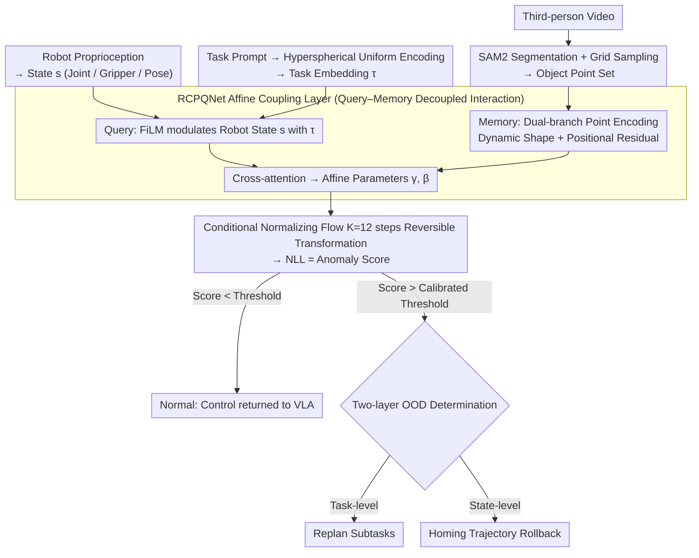

# RC-NF: Robot-Conditioned Normalizing Flow for Real-Time Anomaly Detection in Robotic Manipulation

**Conference**: CVPR2026  
**arXiv**: [2603.11106](https://arxiv.org/abs/2603.11106)  
**Code**: None  
**Area**: Object Detection  
**Keywords**: Anomaly detection, normalizing flow, VLA monitoring, robotic manipulation, out-of-distribution

## TL;DR

Proposes Robot-Conditioned Normalizing Flow (RC-NF), which models the joint distribution of robot states and object trajectories through conditional normalizing flows. It achieves <100ms real-time anomaly detection and serves as a plug-and-play monitoring module for VLA models (e.g., π₀), supporting task-level replanning and state-level trajectory homing.

## Background & Motivation

Vision-Language-Action (VLA) models learn from expert demonstration data via imitation learning to map natural language instructions to low-level control actions. However, they face severe Out-of-Distribution (OOD) challenges during real-world deployment:

**Task-level OOD**: Environmental changes make the current instruction no longer applicable (e.g., the drawer suddenly closes while executing "put the ball in the drawer").

**State-level OOD**: The instruction remains valid, but the physical state of the robot deviates from the training distribution (e.g., an object slips from the gripper).

Limitations of existing runtime monitoring solutions:

- **State Classification Methods** (e.g., Behavior Trees): Rely on exhaustive enumeration of anomalous conditions or manually defined preconditions, making it difficult to cover the combinatorial variability of real-world manipulation.
- **VLM Inference Methods** (e.g., dual-system architectures like Sentinel): Require chain-of-thought reasoning, resulting in latencies of several seconds, which precludes timely intervention.
- **FailDetect** (unsupervised flow matching): Directly concatenates image features with robot states, leaving room for improvement in feature selection and processing.

**Core Motivation**: A need for an anomaly detection module that is trained only on positive samples, operates in real-time (<100ms), and is plug-and-play, without the need to enumerate all anomaly types or perform multi-step reasoning.

## Method

### Overall Architecture

The problem RC-NF aims to solve is: how a VLA can perceive that "something is wrong" within <100ms during real execution using only normal demonstration data. Its core idea is to put "what the robot is doing" and "how the object is moving" into the same conditional normalizing flow to calculate the probability density of the current frame's configuration under the normal distribution—the lower the density, the more anomalous. The entire network is based on the Glow architecture, with the core modification being the design of a new affine coupling layer, RCPQNet (Robot-Conditioned Point Query Network), which injects robot states and task information as conditions into the flow.

The data flow is as follows: SAM2 first segments objects from third-person video into masks, which are then grid-sampled into point sets; the task prompt is encoded into a uniform distribution vector on a hypersphere; robot proprioception simultaneously provides joint, gripper, and pose states. These three information streams enter the normalizing flow conditioned on robot states and task embeddings. After $K=12$ steps of reversible transformations, the negative log-likelihood (NLL) is output as the anomaly score. Once the score crosses a calibrated threshold, tiered correction is triggered: task-level OOD leads to replanning, while state-level OOD triggers trajectory homing to a safe pose.

### Key Designs

**1. Conditional Normalizing Flow: Calculating a comparable probability density for "normal"**

Normal demonstrations actually have a wide distribution (different objects, placements, and grasping sequences). It is nearly impossible for a classifier to enumerate "what counts as normal," so RC-NF uses density estimation instead. Within the condition $c = (s, \tau)$, $s$ represents the robot state (T-dimensional joint state, gripper state, Cartesian pose) and $\tau$ is the task embedding; the object point set $\mathcal{X}$ is mapped to a Gaussian latent distribution $\mathcal{Z} \sim \mathcal{N}(\mu_{\text{task}}, I)$ through $K=12$ reversible transformations. The latent space mean $\mu_{\text{task}}$ is obtained by broadcasting the task embedding. The conditional likelihood is calculated according to the change of variables formula, accumulating the Jacobian determinant of each reversible transformation:

$$\log p_{X|C}(x|c) = \log p_{Z|C}(z|c) + \sum_{i=1}^{K} \log \left| \det \frac{\partial f_{i,c}(y_{i-1})}{\partial y_{i-1}} \right|$$

Its negative value is the anomaly score: normal configurations fall in high-density regions with low scores; once they deviate from the training distribution, the density drops sharply and the score spikes. The task embedding step is equally critical—mapping different task prompts to the surface of a T-dimensional hypersphere. A uniform distribution on the hypersphere ensures that the latent distribution means of different tasks are as separated as possible to avoid density contamination between tasks.

**2. RCPQNet: Aligning "robot action" with "object movement" via query–memory structure**

The effectiveness of a conditional flow depends on how the affine coupling layer consumes the condition. RCPQNet splits this into "query" and "memory" paths. The query path (Task-aware Robot-Conditioned Query) linearly projects the robot state into latent space, then uses the FiLM mechanism to modulate it with the task embedding $\tau$, generating a query token that encodes both robot state and task goals—equivalent to observing the object with the question "I am doing this task, and the robot is currently in this pose." The memory path (Dual-Branch Point Feature Encoding) characterizes object movement through two branches: the Dynamic Shape branch centralizes and normalizes the point set of each frame to eliminate translation and scale effects, treating all object points as a whole and representing relative motion between objects through shape changes; the Positional Residual branch restores the positional information lost during shape normalization, preserving the average displacement in robot–object motion. The two branches are respectively processed by MLP dimension raising → average pooling for frame-level representation → GRU for temporal dependency → Transformer Encoder to form a memory vector. Finally, the query and memory perform cross-attention in a Transformer to output affine transformation parameters $\gamma, \beta$. For example: during gripper slippage, the query shows the gripper should be holding the object, but the memory shows unexpected relative displacement in the object point set; when aligned, the density drops immediately, and the score triggers an alarm.

**3. Decoupled but Interacting Feature Processing: Avoiding entanglement and imbalance in FailDetect**

FailDetect directly concatenates image features and robot states into the flow. The problem is that these two types of features have vastly different dimensions and semantics. Concatenation often leads to "feature entanglement" where one drowns the other, or "feature imbalance" where one dominates. The decoupling in RC-NF addresses this directly: robot states only go through the query path, and object point features only go through the memory path. They only interact at the cross-attention stage. This preserves the causal interaction of "robot state determines how objects should move" while maintaining clear and balanced representations for both paths. Ablation studies confirm this—removing the robot state condition drops the AUC for "Gripper Open" from 0.931 to 0.633; removing the Dynamic Shape branch collapses the "Spatial Misalignment" AUC to 0.102, proving that decoupling and interaction are both indispensable.

**4. Two-layer OOD Detection and Tiered Handling: Linking "sensing" to "correction"**

Calculating an anomaly score is only the first step; practical deployment requires answering "what to do after detecting something is wrong." As a parallel monitoring module, RC-NF continuously reads the vision stream and robot state feedback, treating the negative log-likelihood of the current configuration as the anomaly score at each time step. Once it crosses a static threshold estimated from a calibration set (debiasing during training ensures the temporal smoothness of scores, so the threshold does not need to vary over time), the high-level system determines which type of OOD occurred and handles it hierarchically. Task-level OOD implies the environment or context no longer matches the instruction (e.g., the drawer is closed while the task is "put the blue ball in the open drawer"); at this point, RC-NF notifies the high-level controller (human or LLM planner) to replan a sequence of subtasks fitting the new environment. State-level OOD implies the task remains valid but the physical state of the robot has drifted out of the normal distribution (e.g., the ball slips from the gripper); this triggers homing to return the arm to an initial safe state and locally adjust the trajectory until the score falls below the threshold, after which control is seamlessly returned to the VLA. In practice, the system first attempts lightweight state-level recovery and only escalates to task-level replanning when necessary—this is more granular than a blanket "stop upon failure" and closer to real-world deployment needs.

### Loss & Training

- **Goal**: Maximize the conditional log-likelihood of normal demonstrations (Eq. 5), which is equivalent to minimizing $\frac{1}{2}\|z - \mu_{\text{task}}\|_2^2$ plus the Jacobian determinant term.
- **Unsupervised Training (Positive Samples Only)**: Only successful demonstration data is required; no anomaly samples are needed.
- **Debiasing**: A debiasing operation is applied during training to ensure the temporal smoothness of anomaly scores.
- **Static Threshold**: The upper threshold is estimated from a calibration set: $\text{Upper}_\mathcal{T} = \mu_\mathcal{T} + Q_{1-\alpha}(D_\mathcal{T})$, where $\alpha = 0.05$.
- **Training Setup**: $K=12$ flow steps, trained for 100 epochs, with 50 demonstrations per task.

## Key Experimental Results

### Main Results: LIBERO-Anomaly-10 Benchmark

| Method | Gripper Open AUC | Gripper Open AP | Gripper Slippage AUC | Gripper Slippage AP | Spatial Misalign AUC | Spatial Misalign AP | Avg AUC | Avg AP |
|------|:---:|:---:|:---:|:---:|:---:|:---:|:---:|:---:|
| GPT-5 | 0.914 | 0.964 | 0.894 | 0.872 | 0.490 | 0.402 | 0.850 | 0.851 |
| Gemini 2.5 Pro | 0.864 | 0.933 | 0.863 | 0.851 | 0.517 | 0.427 | 0.819 | 0.831 |
| Claude 4.5 | 0.875 | 0.940 | 0.855 | 0.829 | 0.529 | 0.429 | 0.821 | 0.825 |
| FailDetect | 0.788 | 0.903 | 0.667 | 0.693 | 0.656 | 0.582 | 0.718 | 0.770 |
| **RC-NF (Ours)** | **0.931** | **0.978** | **0.920** | **0.918** | **0.968** | **0.959** | **0.931** | **0.949** |

### Ablation Study: RCPQNet Components

| Configuration | Gripper Open AUC | Gripper Slippage AUC | Spatial Misalign AUC | Avg AUC | Avg AP |
|------|:---:|:---:|:---:|:---:|:---:|
| RC-NF (Full) | 0.931 | 0.920 | 0.968 | 0.931 | 0.949 |
| w/o Task Embedding | 0.877 | 0.867 | 0.814 | 0.864 | 0.901 |
| w/o Robot State | 0.633 | 0.744 | 0.893 | 0.715 | 0.840 |
| w/o Pos. Residual Branch | 0.905 | 0.897 | 0.854 | 0.895 | 0.923 |
| w/o Dyn. Shape Branch | 0.767 | 0.776 | 0.102 | 0.684 | 0.790 |

### Key Findings

1. **RC-NF Outperforms VLM Solutions**: In Spatial Misalignment, VLMs degrade to near-random levels (AUC≈0.5), while RC-NF reaches 0.968, indicating that probability-density-based trajectory methods are far superior to VLM-based semantic reasoning.
2. **The Dynamic Shape Branch is Crucial**: Removing it drops the average AUC from 0.931 to 0.684, and Spatial Misalignment collapses to 0.102, proving that temporal shape evolution is the strongest evidence for anomaly detection.
3. **Robot State Condition is Indispensable**: Removing it causes the Gripper Open AUC to drop from 0.931 to 0.633; since a gripper failing to close does not immediately displace the object, the anomaly is reflected in the relative motion between the robot and the object.
4. **Real-time Performance**: Inference latency on an RTX 3090 is <100ms, far faster than the multi-second latency of VLM solutions.
5. **Successful Real-World Transfer**: RC-NF effectively transfers from simulation to hardware. Integrated with π₀, it successfully handled scenarios like sudden drawer closure (task-level) and ball slipping (state-level).

## Highlights & Insights

1. **Sophisticated Decoupled Conditioning**: Treating robot states as queries and object points as memory avoids feature entanglement while preserving interaction info—a fundamental improvement over FailDetect’s simple concatenation.
2. **Positive Samples Only**: Unsupervised training depends only on successful demonstrations, avoiding the difficulty of enumerating anomaly types, which is more practical for deployment.
3. **Two-layer OOD Handling**: Differentiating between task-level and state-level OOD (replanning vs. homing) provides a more granular and practical approach than simple failure detection.
4. **Plug-and-play**: Does not require modifying the VLA architecture; it runs as a parallel monitoring module, making it engineering-friendly.
5. **Hyperspherical Task Embeddings**: Mapping task prompts to a uniform distribution on a hypersphere ensures maximum separation between tasks, providing a solid geometric structure for density estimation.

## Limitations & Future Work

1. **Dependency on SAM2 Segmentation**: Requires a bbox prompt in the first frame (simulated via graphics, real-world via Gemini 2.5 Pro). Segmentation failure degrades point set quality.
2. **Per-task Training and Calibration**: Each new task requires new demonstrations and threshold calibration, limiting scalability.
3. **Static Thresholds**: While debiasing ensures temporal smoothness, a fixed threshold may not be robust enough in long-tail distribution scenarios.
4. **Single Third-person Camera**: RC-NF only uses one perspective; multi-view fusion could further improve performance.
5. **Coarse Anomaly Classification**: Only distinguishes between task-level and state-level OOD without subdividing types to guide specific recovery strategies.
6. **Limited Scale of LIBERO-Anomaly-10**: Contains only 10 tasks and 3 anomaly categories; larger and more diverse benchmarks are needed.

## Related Work & Insights

- **FailDetect**: Also uses a flow-based unsupervised approach but concatenates features; it is the most direct baseline. RC-NF's decoupled conditioning is the core differentiator.
- **Sentinel / VLM Monitoring**: VLMs are strong in semantic understanding but weak in spatial reasoning and have high latency, highlighting the importance of low-level geometric/trajectory features for manipulation anomaly detection.
- **Pedestrian Anomaly Detection**: The normalizing flow strategy in RC-NF is inspired by pedestrian scenes and transferred to robotic manipulation.
- **VLA Models (e.g., π₀)**: RC-NF is positioned as an auxiliary monitoring module for VLAs, enhancing rather than replacing them.
- **Insight**: The **decoupled design + probability density estimation** could be extended to other robot tasks requiring real-time monitoring (navigation, multi-arm collaboration, etc.).

## Rating

- Novelty: ⭐⭐⭐⭐ — Combining conditional normalizing flows for robot anomaly detection is a novel combination; the RCPQNet decoupled design has engineering and academic value.
- Experimental Thoroughness: ⭐⭐⭐⭐ — Combines quantitative (simulation benchmarks + multi-baseline comparison + ablation) and qualitative (real-world π₀ integration) results with thorough ablation analysis.
- Writing Quality: ⭐⭐⭐⭐ — Clear problem definition, complete method description, and intuitive diagrams.
- Value: ⭐⭐⭐⭐⭐ — Directly addresses a core pain point for VLA deployment with a practical plug-and-play design and <100ms latency.

<!-- RELATED:START -->

## Related Papers

- [\[CVPR 2026\] YOLO-ULM: Ultra-Lightweight Models for Real-Time Object Detection](yolo-ulm_ultra-lightweight_models_for_real-time_object_detection.md)
- [\[CVPR 2026\] BUSSARD: Normalizing Flows for Bijective Universal Scene-Specific Anomalous Relationship Detection](bussard_normalizing_flows_for_bijective_universal_scene-specific_anomalous_relat.md)
- [\[CVPR 2026\] YOLO-Master: MOE-Accelerated with Specialized Transformers for Enhanced Real-time Detection](yolo-master_moe-accelerated_with_specialized_transformers_for_enhanced_real-time.md)
- [\[CVPR 2026\] AKCMamba-YOLO: Selective State Space Models For Real-Time Object Detection](akcmamba-yolo_selective_state_space_models_for_real-time_object_detection.md)
- [\[CVPR 2026\] GPFlow: Gaussian Prototype Probability Flow for Unsupervised Multi-Modal Anomaly Detection](gpflow_gaussian_prototype_probability_flow_for_unsupervised_multi-modal_anomaly_.md)

<!-- RELATED:END -->
