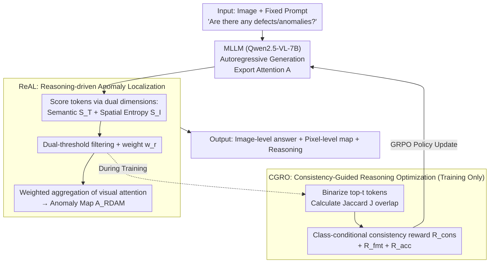

# Reasoning-Driven Anomaly Detection and Localization with Image-Level Supervision

**Conference**: CVPR 2026  
**arXiv**: [2603.27179](https://arxiv.org/abs/2603.27179)  
**Code**: [GitHub](https://github.com/YizhouJin313/ReADL)  
**Area**: Object Detection
**Keywords**: Anomaly Detection and Localization, Reasoning-Driven, Image-level Supervision, MLLM Attention, Reinforcement Learning

## TL;DR

The authors propose two modules, ReAL and CGRO, which generate pixel-level anomaly maps by extracting anomaly-related tokens from the MLLM autoregressive reasoning process and aggregating their visual attention. Combined with consistency-guided reinforcement learning to align reasoning with visual evidence, the system achieves end-to-end anomaly detection, localization, and explainable reasoning using only image-level supervision.

## Background & Motivation

Industrial anomaly detection faces multiple challenges:
- **Limitations of Prior Work**: Traditional methods require training product-specific models on large sets of normal samples, leading to high deployment costs and poor generalization across product lines.
- **Background**: Most MLLM-based methods only perform image-level detection and text reasoning; pixel-level localization still relies on external visual modules (e.g., AnomalyGPT uses pretrained visual experts, EIAD uses SAM), causing error propagation, reasoning-localization misalignment, and increased deployment complexity.
- **Key Challenge**: End-to-end solutions (e.g., OmniAD) depend on dense pixel-level annotations and high-quality reasoning labels, which are expensive to acquire and introduce domain bias.

Key Insight (Fig. 1): During the generation of reasoning text by an MLLM, **only a few tokens' attention focuses on the ground-truth anomaly regions**, and these tokens are typically associated with anomaly-related semantics (e.g., "scratch", "mark"). The attention of most reasoning tokens is scattered or focused on irrelevant areas, which dilutes localization accuracy.

## Method

### Overall Architecture

Given an image $\mathbf{X}_v$ and a fixed textual prompt ("Are there any defects or anomalies in the image?"), a single MLLM autoregressively generates an output sequence of "reasoning process + final answer" while exporting a multimodal attention matrix $\mathbf{A}$ across visual, text, and output tokens. The localization capability is extracted directly from this attention—without external visual experts or SAM. Training uses only image-level labels (normal/abnormal), the most cost-effective annotation, thereby avoiding error propagation and misalignment. Two core modules define this approach:

- **ReAL (Reasoning-driven Anomaly Localization)**: Active during inference, this module screens for tokens that specifically attend to anomalies from the reasoning sequence and aggregates their visual attention into a pixel-level anomaly map $\mathbf{A}_{\text{RDAM}}$.
- **CGRO (Consistency-Guided Reasoning Optimization)**: Active only during training, this uses a "reasoning-localization consistency" reward to drive reinforcement learning, aligning "what the model says" with "what the model sees" via GRPO.

### Key Designs

**1. ReAL (Reasoning-driven Anomaly Localization): Identifying Anomaly-Focused Tokens**

The core observation is that during reasoning generation, only a few tokens focus on anomaly regions. ReAL scores each reasoning token across two complementary dimensions: Cross-modal Semantic Relevance $S_T^r$ (sum of attention weights towards anomaly-related words like "defect" or "abnormal" in the input) and Intra-modal Attention Concentration $S_I^r$ (calculated via spatial entropy after binarizing visual attention maps). Low entropy indicates concentrated attention. Tokens passing dual thresholds ($\hat{S}_T^r > \tau_t$ and $\hat{S}_I^r > \tau_i$) are aggregated using composite weights $w_r = \alpha\hat{S}_T^r + \beta\hat{S}_I^r$ to produce the final map $\mathbf{A}_{\text{RDAM}}$. This allows pixel-level localization to be "read" directly from internal attention.

**2. CGRO (Consistency-Guided Reasoning Optimization): Aligning Output with Evidence**

With limited supervision, MLLMs often exhibit inconsistent reasoning (e.g., identifying an anomaly but describing the image as normal). CGRO utilizes the weights $w_r$ from ReAL to select top-$t$ tokens and measures the spatial overlap $\mathcal{J}$ (Jaccard Index) of their support regions $\Omega_r$. A class-conditional consistency reward $R_{\text{cons}}$ is introduced: for abnormal images ($y=1$), high consistency ($\mathcal{J} > \delta_1$) is encouraged to promote centralized localization; for normal images ($y=0$), low consistency ($\mathcal{J} < \delta_2$) is encouraged to suppress false focus. This is optimized via GRPO alongside format and accuracy rewards, forcing the model to self-constrain its reasoning process.

### Loss & Training

- Based on Qwen2.5-VL-7B, using LoRA to adapt language and cross-modal layers while freezing the visual encoder.
- Training Data: 4K industrial images (VisA, GoodsAD, Vision, PR-REAL, etc.) with only image-level labels.
- Batch size of 16, with 8 candidate responses sampled per input for GRPO.
- Images scaled to 420×420.
- Zero-shot evaluation (no domain overlap between training and test sets).

## Key Experimental Results

### Main Results

Average of four benchmarks (MVTec-AD, WFDD, SDD, DTD), Image-level AUROC/ACC:

| Method | Parameters | Supervision | Image-level AVG(AUROC,ACC) | Pixel-level AVG(AUROC,ACC) | Reasoning(ROUGE-L,SBERT) |
|------|--------|----------|----------------------|---------------------|---------------------|
| GPT-4.1 | — | — | 87.2, 88.4 | N/A | 20.8, 69.9 |
| Qwen2.5-VL+CGRO* (Ours) | 7B | I | **83.9, 86.9** | **80.7, 97.1** | **27.1, 74.7** |
| Qwen2.5-VL+R1* | 7B | I | 80.0, 82.0 | 78.5, 96.7 | 26.3, 73.8 |
| AnomalyGPT | 7B | T+I+P | 71.1, 53.9 | 77.8, 98.4 | 11.9, 36.7 |
| Triad | 7B | T+I | 85.5, 83.8 | N/A | 8.6, 35.9 |

Highlights: Achievement of localization performance comparable to AnomalyGPT (which uses pixel-level labels) using only image-level supervision.

### Ablation Study

Ablation of ReAL + CGRO (Qwen2.5-VL-7B, average across four datasets):

| Configuration | Image AUROC | Pixel AUROC | Pixel ACC |
|------|-------------|-------------|-----------|
| Vanilla | 63.4 | 64.7 | 73.0 |
| Vanilla + ReAL | 63.4 | 61.7 | 85.6 |
| Vanilla + CGRO | 83.9 | 72.7 | 92.6 |
| **Full (ReAL+CGRO)** | **83.9** | **80.7** | **97.1** |

Token selection strategy ablation (Pixel-level):
- $S_I$ only: AUROC 74.1
- $S_T$ only: AUROC 76.7
- $S_T + S_I$ (Full): AUROC **80.7**

### Key Findings

- ReAL and CGRO are complementary: CGRO improves image-level detection (+20.5 AUROC), while ReAL refines pixel-level localization accuracy (+8.0 AUROC).
- Consistency rewards eliminate reasoning-answer contradictions, preventing cases where models "predict anomaly but describe as normal."
- Gains from CGRO are consistent across 3B to 7B parameter scales (+15-20 image-level AUROC).
- Improvements in reasoning quality and localization accuracy are mutually beneficial.

## Highlights & Insights

- **Deep Core Insight**: The authors discovered that MLLM reasoning processes naturally contain anomaly-aware attention patterns that can be harnessed without external modules.
- **High Supervision Efficiency**: Achieves performance comparable to dense-labeling methods using only the cheapest image-level labels.
- **Unified Triad**: Detection, localization, and explainable reasoning are unified in a single model without external dependencies.
- **Elegant Reward Design**: The use of Jaccard Index for class-conditional constraints effectively aligns reasoning quality with spatial focus.

## Limitations & Future Work

- Localization precision has room for improvement (Pixel-level AUPR is 13.3%, significantly lower than specialized segmentation models).
- Token screening depends on threshold hyperparameters $\tau_t, \tau_i$, which may require tuning for different products.
- Training on existing AD datasets may introduce domain biases.
- GRPO training costs are relatively high due to multiple candidate sampling.
- performance in complex, multi-defect scenarios remains a question.

## Related Work & Insights

- **Comparison with LISA**: While LISA uses [SEG] tokens and SAM for reasoning segmentation, this work eliminates external segmentation modules entirely.
- **GRPO/R1 Paradigm**: Extends the reinforcement learning reasoning optimization of DeepSeek-R1 but innovates with consistency rewards.
- **Comparison with OmniAD**: Unlike OmniAD which requires dense labels for end-to-end training, this work only requires image-level labels.
- **Inspiration**: The attention aggregation strategy could be generalized to other spatial tasks like referring segmentation or visual grounding.

## Rating

- **Novelty**: ⭐⭐⭐⭐⭐ — Activating MLLM intrinsic reasoning potential for pixel-level localization is highly innovative.
- **Experimental Thoroughness**: ⭐⭐⭐⭐⭐ — Extensive benchmarks, comparisons with GPT-4, and detailed ablations.
- **Writing Quality**: ⭐⭐⭐⭐ — Clear motivation, though complex notations require careful tracking.
- **Value**: ⭐⭐⭐⭐⭐ — Significantly reduces annotation costs for industrial AD, opening new paths for MLLM applications in inspection.

<!-- RELATED:START -->

## Related Papers

- [\[CVPR 2026\] ADSeeker: A Knowledge-Grounded Reasoning Framework for Industry Anomaly Detection and Reasoning](adseeker_a_knowledge-grounded_reasoning_framework_for_industry_anomaly_detection.md)
- [\[CVPR 2026\] Can a Second-View Image Be a Language? Geometric and Semantic Cross-Modal Reasoning for X-ray Prohibited Item Detection](can_a_second-view_image_be_a_language_geometric_and_semantic_cross-modal_reasoni.md)
- [\[ICCV 2025\] VisRL: Intention-Driven Visual Perception via Reinforced Reasoning](../../ICCV2025/object_detection/visrl_intention-driven_visual_perception_via_reinforced_reasoning.md)
- [\[CVPR 2026\] Wavelet-Driven 3D Anomaly Detection under Pose-Agnostic and Sparse-View](wavelet-driven_3d_anomaly_detection_under_pose-agnostic_and_sparse-view.md)
- [\[CVPR 2026\] Online Data Curation for Object Detection via Marginal Contributions to Dataset-level Average Precision](online_data_curation_for_object_detection_via_marginal_contributions_to_dataset-.md)

<!-- RELATED:END -->
