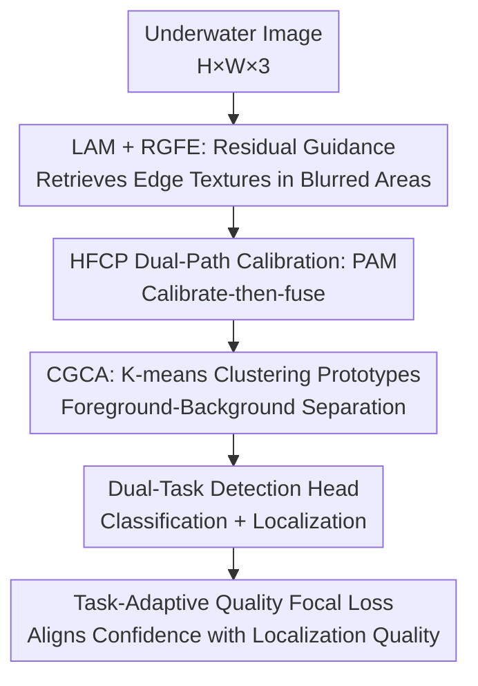

# RHCNet: Residual-Guided Hierarchical Calibration Network for Robust Underwater Object Detection

**Conference**: CVPR 2026  
**Paper**: [CVF Open Access](https://openaccess.thecvf.com/content/CVPR2026/html/Wang_RHCNet_Residual-Guided_Hierarchical_Calibration_Network_for_Robust_Underwater_Object_Detection_CVPR_2026_paper.html)  
**Code**: https://github.com/YitengGuo/RHCNet  
**Area**: Object Detection / Underwater Vision  
**Keywords**: Underwater Object Detection, Residual Guidance, Feature Calibration, Clustering Prototype, Quality Focal Loss

## TL;DR
To address the three major challenges of underwater images—difficult foreground-background distinction, loss of structural details, and low contrast—this paper embeds a Residual-Guided Feature Enhancement module (RGFE) into ResNet-50 to retrieve edge textures in blurred areas. It then utilizes a Hierarchical Feature Calibration Pyramid (HFCP) to perform cross-scale alignment via a "calibrate-then-fuse" approach, and employs K-means clustering prototypes to segregate the foreground from chaotic backgrounds. Ultimately, it achieves AP scores of 70.53% and 53.35% on the DUO and UTDAC underwater benchmarks respectively, soundly outperforming previous state-of-the-art methods.

## Background & Motivation
**Background**: Currently, the mainstream approach in underwater object detection (UOD) is to directly adapt terrestrial detectors (such as Faster R-CNN, FCOS, and the YOLO series) to underwater environments, relying on convolutional features to encode local textures for capturing edges and contours. In recent years, multi-branch feature fusion, attention enhancement, and adaptive alignment mechanisms have been integrated to further boost performance.

**Limitations of Prior Work**: In underwater imaging, light scattering acts as a physical low-pass filter, erasing high-frequency information (edges, textures) and leading to blurred target boundaries and deficient structural details. Simultaneously, the foreground targets and background exhibit high similarity in color, texture, and illumination distribution, making it difficult for detectors to focus on genuine target regions during training. The authors explicitly point out that the ROI Pooling features in Faster R-CNN contain a substantial amount of background noise, causing "semantic misalignment." Meanwhile, general attention mechanisms (e.g., CBAM, SE) rely on implicit feature reweighting, which largely fails under such severe structural degradation.

**Key Challenge**: The authors summarize the core difficulties of underwater detection into three points: (1) a lack of **explicit structural modeling** for blurred target regions; (2) **difficulty in achieving semantic focus** under strong foreground-background interference; and (3) **alignment bias** during multi-scale feature propagation, which impedes cross-scale fusion. Previous advancements mostly relied on increasing network complexity, neglecting feature focusing and semantic consistency modeling.

**Goal**: Instead of stacking network components, this paper aims to design a three-stage synergetic mechanism of "feature focusing $\rightarrow$ semantic calibration $\rightarrow$ scale alignment" to systematically alleviate target boundary blurring, semantic misalignment, and structural heterogeneity.

**Key Insight**: The authors formulate blur as a "signal degradation" problem. Since scattering filters out high-frequency signals, the high-frequency structural clues preserved in shallow layers are **actively injected back** into deep semantic features for compensation. Furthermore, semantic alignment is performed prior to fusion, rather than assuming features are already spatially aligned before direct addition as in FPN/BiFPN.

**Core Idea**: Utilizing "residual guidance" to recover structure, and "hierarchical calibration" (calibrate-then-fuse + clustering prototypes) to ensure semantic consistency and cross-scale alignment.

## Method

### Overall Architecture
RHCNet is an end-to-end single-stage detector that maintains a backbone-neck-head tripartite pipeline, with critical modifications implemented in both the backbone and neck. Given an underwater input image $\in \mathbb{R}^{H\times W\times 3}$, it first passes through the modified ResNet-50. Specifically, a **Location-Aware Module (LAM)** is embedded in several stages of the backbone to provide early spatial priors, and the **RGFE** is integrated to inject shallow high-frequency structural clues into deep semantic features, outputting multi-scale features $F_1{\sim}F_5$. These features are fed into **HFCP**, which avoids direct multi-scale addition. Instead, it first utilizes a **Position-Aware Module (PAM)** to conduct a dual-path calibration of "bottom-up semantic enhancement + top-down fine-grained compensation." Heuristically, a **Cluster-Guided Calibrated Attention (CGCA)** module based on K-means clustering is applied for semantic filtering to isolate the foreground from the background. The calibrated multi-scale features are finally sent to a **dual-task detection head** (adopting AutoAssign-style label assignment) for simultaneous classification and localization. The training is supervised by a task-adaptive quality focal loss and GIoU loss.

### Key Designs

**1. LAM + RGFE: Residual Injection to Retrieve Edge Textures in Blurred Areas**

Addressing Limitation (1)—the lack of structural modeling in blurred regions. The authors conceptualize underwater blur as high-frequency loss caused by scattering. Under a "signal restoration" paradigm, they design RGFE to actively inject high-frequency structural clues preserved in shallow layers into the deep semantic stream to compensate for boundary blur. Specifically, it involves three steps: First, a **Semantic Convolution Transform (SCT)** $H_{SCT}(\cdot)$ acts as a high-frequency extractor, using depthwise separable convolutions to explicitly capture local gradient anomalies (edge clues) and pointwise convolutions for cross-channel mapping, obtaining a structural prior $F_{SCT} = W_{pw}\circledast\sigma(W_{dw}\circledast F)$ (where $\sigma$ is ReLU). Next, $F_{SCT}$ enters a **dual-path correction unit** that uses channel attention $A_c$ and spatial attention $A_s$ to perform **dynamic signal modulation** (rather than static selection) to prevent background noise amplification, yielding residual features $F_{RGFE} = \Phi\big(F_{SCT} \,\|\, (A_c(F_{SCT})\otimes A_s(F_{SCT})\otimes F)\big)$ (where $\|$ denotes channel concatenation and $\otimes$ is element-wise multiplication). Finally, through residual calibration, the recovered structure is injected back into the semantic stream:

$$F_{RF} = H_{SCT}\big(D_{\downarrow s}(F)\big) \oplus \lambda\cdot H_{RGFE}\big(U_{\uparrow s}(D_{\downarrow s}(F))\big),$$

where $D_{\downarrow s}$/$U_{\uparrow s}$ denote down/up-sampling with a scale factor $s$, $\oplus$ is element-wise addition, and $\lambda$ is a **learnable intensity coefficient** updated dynamically to stabilize gradient flow and offset the underwater blur effect. LAM provides localized spatial priors in earlier stages, cooperating with RGFE to enhance local contrast and texture awareness. Unlike the implicit reweighting of CBAM/SE, RGFE explicitly executes "high-frequency extraction $\rightarrow$ attention purification $\rightarrow$ residual injection," successfully restoring boundaries even under severe structural degradation.

**2. HFCP Dual-Path Calibration: Calibrate-then-Fuse Pyramid**

Addressing Limitation (3)—multi-scale alignment bias. Standard pyramids like FPN/BiFPN assume that feature spaces across layers are already aligned and directly sum them, but underwater refraction and scattering violate this assumption, leading to boundary blurring and spatial dithering. Direct summation thus introduces semantic misalignment and foreground contamination. HFCP employs a **calibrate-then-fuse** paradigm with a dual-path framework: The **bottom-up semantic enhancement path** integrates channel and multi-scale branches to progressively accumulate global semantics and strengthen cross-layer consistency; the **top-down fine-grained compensation path** utilizes **PAM** with a spatial branch to address foreground occlusion and spatial misalignment. Since underwater occlusion often fragments low-level target features, PAM treats high-level semantics (which retain global target context) as a "structural template." Through cascaded multi-dimensional attention, it projects global context downwards to restore fragmented responses and align them with global semantic prototypes. The fusion of the three branches is formulated as:

$$F_{PA} = G\Big(\underbrace{\text{Sigmoid}(W_2\cdot\text{ReLU}(W_1\cdot\text{GAP}(F_{RF})))\odot F_{RF}}_{\text{Channel Branch}\uparrow} \oplus \underbrace{\textstyle\sum_{i=1}^{3}\beta_i\cdot\text{Conv}_{k_i}(F_{RF})}_{\text{Multi-scale Branch}\uparrow} \oplus \underbrace{\text{SPC}(F_{RF})\odot F_{RF}}_{\text{Spatial Branch}\downarrow}\Big),$$

where $k_i$ is the receptive field, $\beta_i$ are learnable scale weights, and SPC models features along the spatial dimension. This bottom-up and top-down synergy ensures structural coherence in the fused features under intense background interference.

**3. CGCA: Extracting Foreground via K-means Clustering Prototypes**

Addressing Limitation (2)—difficulty in semantic focusing under foreground-background interference. After PAM spatial correction, $F_{PA}$ undergoes semantic filtering. Standard non-local blocks compute pixel-to-pixel affinity, which is computationally expensive and sensitive to noise. CGCA instead uses **K-means clustering to extract semantic prototypes (clustering centers)**, categorizing pixel features into $K$ clusters based on global context to explicitly isolate foreground targets from chaotic backgrounds. The prototype is represented as $\mu_k = \frac{1}{|c_k|}\sum_{F_{PA}\in c_k} F_{PA}$. It then computes the dot product of each pixel $p_i$ and each prototype $v_k$ as the semantic similarity, passing it through Softmax to produce weights, and computes the weighted sum over all prototypes to obtain attention-enhanced features:

$$\alpha_{i,k} = \frac{\exp(p_i^T v_k)}{\sum_{j=1}^{K}\exp(p_i^T v_j)},\qquad F_{att} = \sum_{k=1}^{K}\alpha_{i,k}\cdot v_k.$$

Crucially, **$K=2$** is set to decouple features into foreground and background prototype classes. In practice, K-means is performed on detached features (disabling gradients) for instance-level clustering to bypass non-differentiable hard assignments. Clustering statistics are then modulated by learnable weights to generate differentiable attention maps, enabling end-to-end training. Compared to static attention, clustering aligns features by content similarity rather than spatial proximity, making it highly adaptive to dynamic semantic drifts caused by environmental changes and effective in suppressing high-response background noise.

**4. Task-Adaptive Quality Focal Loss: Aligning Classification Confidence with Localization Quality**

Targeting the common discrepancy between classification confidence and localization quality (where standard IoU/Dice losses are insensitive to edge blur and target displacement). The total loss is defined as $L_{total} = \lambda_{cls}L_{cls} + \lambda_{reg}L_{reg}$, with $\lambda_{cls}{=}1$ and $\lambda_{reg}{=}2$. Classification employs **continuous quality labels** instead of discrete binary labels. The quality label is constructed via geometric weighting of predicted IoU and centerness as $\hat{y}_i = \text{IoU}_i^{\rho}\cdot\text{Centerness}_i^{1-\rho}$ ($\rho{=}0.5$), forcing the network to prioritize samples with higher geometric overlap with ground truth (GT). The classification loss incorporates a focusing factor $|\hat{y}_i - p_i|^{\gamma}$ to dynamically downweight easy samples and focus on difficult misaligned ones (where $\gamma$ controls focusing strength rather than acting as a classification weight). For regression, GIoU loss is utilized: $L_{reg} = \frac{1}{N_{pos}}\sum_i L_{GIoU}(B_i^{pred}, B_i^{gt})$. This design is inspired by the quality-aware formulations in GFL/ATSS but tailors a soft label construction to address underwater blur, thereby suppressing low-quality false positives from background interference.

### Loss & Training
Training is conducted using the MMDetection framework with a ResNet-50 backbone for 35 epochs. The initial learning rate is set to 0.001, undergoing two-step decay at epochs 27 and 32. The optimizer is SGD (momentum 0.9, weight decay 0.0001). The hardware setup consists of a single RTX 4070 SUPER GPU. The training loss is the aforementioned task-adaptive quality focal loss + GIoU ($\lambda_{cls}{=}1, \lambda_{reg}{=}2$).

## Key Experimental Results

### Main Results
On the DUO (7,782 images) and UTDAC (5,643 images) underwater benchmarks, all general-purpose detectors are retrained on a ResNet-50 backbone to ensure fair comparison. RHCNet ranks first across all 6 metrics on both datasets:

| Dataset | Method | AP | AP50 | AP75 | APS | APM | APL |
|---|---|---|---|---|---|---|---|
| DUO | CIDNet (KBS'25) | 68.83 | 86.56 | 75.78 | 56.52 | 70.63 | 67.34 |
| DUO | RTMD-R (TITS'25) | 68.23 | 86.38 | 75.69 | 55.40 | 70.48 | 67.23 |
| DUO | **RHCNet (Ours)** | **70.53** | **87.56** | **77.29** | **56.63** | **71.70** | **69.94** |
| UTDAC | YOLOv11 (2024) | 49.75 | 85.58 | 54.96 | 23.53 | 45.84 | 56.23 |
| UTDAC | CIDNet (KBS'25) | 49.57 | 85.38 | 54.53 | 23.11 | 45.74 | 56.08 |
| UTDAC | **RHCNet (Ours)** | **53.35** | **86.93** | **58.97** | **27.23** | **48.90** | **59.29** |

AP on DUO is 1.7 points higher than the previous best method, CIDNet. On UTDAC (which features stronger background interference and larger intra-class variation under extreme environments), the AP improvement is even more pronounced (53.35 vs. 49.75, +3.6 points), and the small object performance ($AP_S$) rises from ~23 to 27.23. RHCNet has 70.04M parameters and 145.16G FLOPs, being more efficient than CIDNet (82.50M / 324.48G).

### Cross-Scenario Generalization (COCO)
To verify generalization capability in non-underwater natural scenes, evaluation is conducted on COCO (118,287 images, 80 classes), where RHCNet also achieves the highest AP:

| Method | Backbone| AP | AP50 | AP75 | APS |
|---|---|---|---|---|---|
| YOLOv11 (2024) | C3K2 | 44.18 | 62.43 | 47.78 | 27.44 |
| RTMD-R (TITS'25) | CSPNeXt | 43.27 | 61.72 | 47.57 | 27.03 |
| SqNet (NC'25) | ResNet-50 | 43.16 | 61.99 | 47.23 | 26.82 |
| **RHCNet (Ours)** | ResNet-50 | **45.68** | **63.51** | **49.36** | **28.33** |

This shows that the design of residual guidance + hierarchical calibration is not just "overfitting" to underwater scenes, but also yields gains in general terrestrial detection.

### Ablation Study
Ablation studies on DUO under the same training configuration (split into two parts in Table 2):

| Group | Configuration | AP | AP50 | Description |
|---|---|---|---|---|
| Part I | Baseline (RetinaNet, R-50+FPN) | 57.06 | 78.33 | Baseline |
| Part I | Stronger backbone (R-101, full modules) | 70.03 | 87.29 | Stacking backbone yields limited gains (< complete R-50 model) |
| Part I | General neck (BiFPN) | 66.45 | 84.20 | Underperforms HFCP, verifying necessity of "calibration first" |
| Part I | CGCA replaced with vanilla self-attention | 68.12 | 85.64 | Clustering mechanism is more robust against underwater noise than self-attention |
| Part II | w/o LAM | 66.45 | 84.46 | Decreased by 4.08, local contrast is degraded |
| Part II | w/o RGFE | 66.90 | 84.42 | Decreased by 3.63, texture perception is degraded |
| Part II | w/o LAM & RGFE | 65.26 | 83.83 | Decreased by 5.27, cooperative contribution of both |
| Part II | w/o PAM | 66.74 | 84.27 | Decreased by 3.79, alignment is degraded |
| Part II | w/o CGCA | 65.86 | 83.81 | Decreased by 4.67, fusion stability is degraded |
| Part II | w/o PAM & CGCA | 65.24 | 82.34 | Decreased by 5.29, steepest drop |
| Part II | **RHCNet (Full)** | **70.53** | **87.56** | Complementarity of the four modules |

### Key Findings
- **Structural design is more valuable than stacking backbone parameters**: Switching the backbone from R-50 to R-101 (with all modules included) only yields 70.03, which is slightly lower than the 70.53 of the fully-equipped R-50 version. This confirms that the performance gains stem from the calibration design rather than parameter scaling.
- **HFCP's "calibration first" is crucial**: The general BiFPN only reaches 66.45, which is 4 percentage points lower than HFCP, proving the necessity of performing semantic alignment before fusion in underwater scenarios.
- **The combination of CGCA and PAM is critical**: Removing both PAM and CGCA causes the largest drop (-5.29). Furthermore, removing CGCA alone (-4.67) leads to a heavier loss than removing PAM alone (-3.79), indicating that the clustering prototype's ability to separate foreground and background is the main driver of performance. Replacing CGCA with vanilla self-attention drops performance to 68.12, showing that clustering is significantly more noise-resilient than pixel-level self-attention.
- **RGFE + LAM jointly reconstruct structure**: Discarding either module leads to a 3-4 point drop, and discarding both results in a -5.27 drop, establishing their complementary role in recovering edge textures.

## Highlights & Insights
- **Reformulating "underwater blur" as a signal restoration problem**: Conceptualizing scattering as a physical low-pass filter directly leads to the design of RGFE ("explicitly extracting high-frequency signals + injecting back into deep layers"). This is far more targeted than the implicit reweighting of general attention mechanisms, offering a highly transferable approach for generic degradation tasks featuring high-frequency loss (e.g., dehazing, low-light enhancement).
- **Cleverly using $K=2$ clustering prototypes as a foreground/background discriminator**: Extracting two semantic prototypes via K-means as an alternative to computationally expensive non-local pixel affinity is both computationally efficient and noise-resilient. Furthermore, aligning features "by content similarity rather than spatial proximity" effectively tackles the fundamental challenge of underwater scenes, where foreground and background often share identical colors and textures.
- **Instance-level clustering on detached features bypasses non-differentiable bottlenecks**: Since K-means hard assignments are inherently non-differentiable, the authors perform clustering on detached features, using the resulting cluster statistics modulated by learnable weights to generate differentiable attention maps. This provides a neat end-to-end engineering solution.
- **"Calibrate-then-fuse" directly corrects FPN's underlying assumptions**: The authors explicitly point out that FPN/BiFPN rely on the assumption of pre-aligned spatial features, which is broken by underwater refraction and scattering. Introducing PAM for spatial correction and CGCA for semantic filtering before fusion presents a robust "calibrate-then-fuse" paradigm applicable to any scenario suffering from spatial feature misalignment.

## Limitations & Future Work
- **Limitations acknowledged by the authors**: Inherit domain gaps still exist between different water conditions (e.g., changes in turbidity). Cross-water-condition generalization remains a future challenge.
- **Dependence on fixed backbone and single-GPU scaling**: All experiments are conducted on ResNet-50 and a single RTX 4070 for 35 epochs. The paper does not report performance with larger backbones or longer training regimes, nor does it provide inference FPS (despite reporting lower FLOPs than CIDNet).
- **CGCA fixed $K=2$**: Whether a binary foreground/background split is sufficient for dense multi-class scenes or highly overlapping instances, and whether increasing $K$ provides further gains, remains unexamined. ⚠️ The original paper should be consulted for definitive configurations.
- **Insufficient disclosure of hyperparameter sensitivity**: The sensitivity curves for settings like $\rho{=}0.5$, learnable coefficient $\lambda$, and $\lambda_{reg}{=}2$ are not provided, which may require tuning during replication.

## Related Work & Insights
- **vs. FPN / PANet / BiFPN**: These architectures optimize fusion efficiency via top-down or complex bidirectional paths but perform aggregation under the direct assumption that features are already spatially aligned, neglecting cross-layer structural alignment. RHCNet employs HFCP to calibrate (spatial via PAM + semantic via CGCA) before fusion, specifically tackling spatial jitter and semantic drift in underwater scenes.
- **vs. General Attention (e.g., CBAM / SE)**: These solutions rely on implicit feature reweighting and struggle or fail under severe structural degradation. RGFE explicitly restores structure via "explicit high-frequency extraction $\rightarrow$ attention purification $\rightarrow$ residual injection."
- **vs. GFL / ATSS (Quality-Aware Losses)**: The loss function in this paper is inspired by their formulated quality metrics but creates a customized soft label (geometric weighting of IoU and centerness) to specifically address underwater blur, rendering it more focused on misaligned difficult samples.
- **vs. Early Underwater Enhancement / Dehazing Preprocessing**: Pre-processing methods often disrupt structural consistency and offer limited improvements to downstream detection accuracy. RHCNet integrates structural restoration and semantic calibration directly inside the detection network, facilitating end-to-end optimization.

## Rating
- Novelty: ⭐⭐⭐⭐ Formulating blur as signal restoration, utilizing $K=2$ clustering prototypes to separate foreground/background, and calibrating before fusing is a creative combination, though these are underwater-customized applications of existing concepts.
- Experimental Thoroughness: ⭐⭐⭐⭐ Evaluated on three datasets (DUO/UTDAC/COCO) with exhaustive two-part ablations, comparing against over 16 methods; however, inference speed and ablation of the $K$ values are missing.
- Writing Quality: ⭐⭐⭐⭐ The link between motivation, methodology, and mathematical formulations is clear, directly mapping the three major pain points to three specific designs, offering excellent readability.
- Value: ⭐⭐⭐⭐ Achieves state-of-the-art performance in underwater detection while being open-source and highly efficient in terms of parameters and FLOPs, offering direct practical value to this sub-field.

<!-- RELATED:START -->

## Related Papers

- [\[CVPR 2026\] CHAL: Causal-guided Hierarchical Anomaly-aware Learning for Moving Infrared Small Target Detection](chal_causal-guided_hierarchical_anomaly-aware_learning_for_moving_infrared_small.md)
- [\[CVPR 2026\] Distribution-Aligned Multimodal Fusion for Robust Object Detection](distribution-aligned_multimodal_fusion_for_robust_object_detection.md)
- [\[CVPR 2026\] BDNet: Bio-Inspired Dual-Backbone Small Object Detection Network](bdnetbio-inspired_dual-backbone_small_object_detection_network.md)
- [\[CVPR 2026\] Balanced Hierarchical Contrastive Learning with Decoupled Queries for Fine-grained Object Detection in Remote Sensing Images](balanced_hierarchical_contrastive_learning_with_decoupled_queries_for_fine-grain.md)
- [\[CVPR 2026\] When Transformers Meet Mamba: A Hybrid Transformer-Mamba Network for Video Object Detection](when_transformers_meet_mamba_a_hybrid_transformer-mamba_network_for_video_object.md)

<!-- RELATED:END -->
