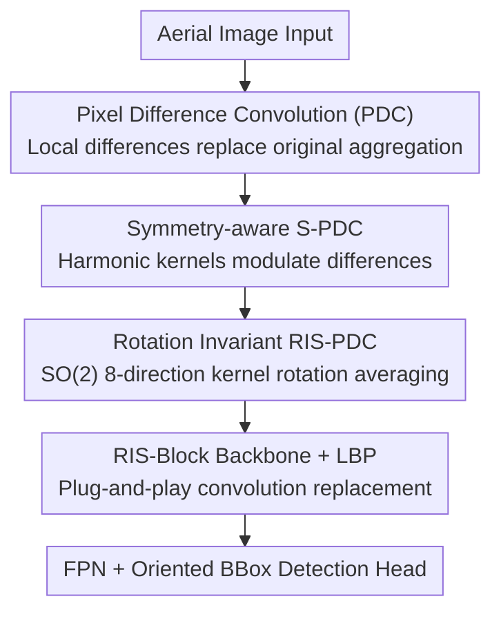

# Rotation Invariant and Symmetry Aware Pixel Difference Network for Remote Sensing Object Detection

**Conference**: CVPR 2026  
**Paper**: [CVF Open Access](https://openaccess.thecvf.com/content/CVPR2026/html/Zhan_Rotation_Invariant_and_Symmetry_Aware_Pixel_Difference_Network_for_Remote_CVPR_2026_paper.html)  
**Code**: https://github.com/yuhua666/RIS-PiDiNet  
**Area**: Remote Sensing Object Detection  
**Keywords**: Rotation Invariance, Symmetry Modeling, Pixel Difference Convolution, SO(2) Group, Polar Harmonic Transform

## TL;DR
This work integrates "continuous rotation invariance" and "structural symmetry" geometric priors directly into the convolutional kernel by proposing the RIS-PDC operator (Pixel Difference + Polar Harmonic Symmetry Kernel + SO(2) 8-direction kernel rotation averaging). As a plug-and-play replacement for convolutions in mainstream remote sensing detectors, it achieves 78.53% mAP on DOTA-v1.0 single-scale without increasing parameters.

## Background & Motivation

**Background**: Mainstream improvements in remote sensing (aerial) object detection in recent years have focused on two main directions: adding orientation to detection boxes (oriented bounding boxes with angle regression + direction-sensitive loss) and enhancing features for small objects (large kernel convolutions to expand the receptive field, such as LSKNet and PKINet).

**Limitations of Prior Work**: Objects in aerial images naturally appear at arbitrary angles (top-down view), and many objects possess strong symmetric structures (e.g., bilateral symmetry in airplanes, radial symmetry in roundabouts). However, existing methods rarely explicitly model these two geometric properties. Angle regression methods suffer from box jitter and instability under extreme viewpoints, while rotation-invariant methods (equivariant networks or data augmentation) often "blur" structural details like mirror symmetry. The authors quantified on DOTA that baseline model ROI response intensities fluctuate drastically with rotation angles (directional bias), indicating a misalignment between learned representations and geometric priors of rotating objects.

**Key Challenge**: Standard convolutions lack built-in mechanisms for rotation and symmetry. Existing approaches either rely on data/receptive field stacking for "approximation" or use group-equivariant convolutions (e.g., ReDet), but the latter depends on heavy feature realignment, incurs high computational costs, and tends to sacrifice symmetric details. In essence, there is a trade-off between geometric priors and "efficiency/plug-and-play capability."

**Goal**: To design a **lightweight, plug-and-play** convolutional operator that simultaneously encodes (i) continuous SO(2) rotation invariance and (ii) structural symmetry, without modifying the detection framework or increasing parameters.

**Key Insight**: Instead of performing alignment or augmentation at the feature map level, geometric priors should be **directly embedded into the mathematical form of the convolutional kernel**. This involves using harmonic kernels from the Polar Harmonic Transform to capture symmetry frequencies and applying kernel rotation averaging via the Lie group SO(2) to achieve rotation invariance.

**Core Idea**: Replace standard convolutions with a unified operator (RIS-PDC) that combines "pixel difference convolution + polar harmonic symmetry kernel + kernel-domain rotation averaging," making geometric consistency endogenous to network weights rather than something learned from data.

## Method

### Overall Architecture
The input to RIS-PiDiNet is an aerial image, and the output consists of oriented bounding boxes. The backbone follows the LSKNet-style stacked block design (four stages with block configurations of 2/2/4/2 + FPN + classification/regression heads). The sole but critical modification is the replacement of standard convolutions with the proposed **RIS-PDC** operator. This operator is not designed in isolation but built through three progressive layers: first, standard convolution is transformed into **Pixel Difference Convolution (PDC)** sensitive to local differences; then, **Symmetry-aware PDC (S-PDC)** is created by injecting symmetry awareness through polar harmonic kernels; finally, full **Rotation Invariance (RIS-PDC)** is achieved via SO(2) 8-direction kernel rotation averaging. The operator also features a parallel LBP (Local Binary Pattern) branch to strengthen fine-grained texture. Since only the operator is changed and parameters remain constant, it can be plugged into layer1, layer2, or detection heads seamlessly.

### Key Designs

**1. S-PDC: Injecting Symmetry Awareness via Polar Harmonic Kernels**

Standard convolutions aggregate local pixels through weighted sums, lacking awareness of "what is symmetric and what is not." This work first revisits **Pixel Difference Convolution (PDC)**: instead of aggregating raw pixel values, it aggregates the difference of each pixel relative to a reference value $q$, $y=\sum_{i\neq c} w_i\,(x_i-q)$ (fixed at $q=0.2$ for stability). This makes the operator naturally act as a high-pass filter sensitive to small object edges. Building on this, the authors introduce **Symmetry-aware Pixel Difference Convolution (S-PDC)**: a set of harmonic kernels $H_i^{(n,l)}$ derived from the Polar Harmonic Transform (PHT) is used to modulate the difference terms. A kernel for a single harmonic order $(n,l)$ is expressed in polar coordinates as:

$$H_i^{(n,l)} = \cos\!\big(2\pi n r_i^2 + l\,\theta_i\big),$$

where $r_i$ is the normalized radial distance to the patch center, $\theta_i$ is the angle, $n$ controls radial frequency, and $l$ controls angular frequency. Real symmetry is rarely a single frequency, so the final response is a learnable linear combination of multi-order harmonics:

$$y = \sum_{(n,l)\in O}\alpha_{n,l}\sum_{i\neq c} w_i\,\cos(2\pi n r_i^2 + l\theta_i)\,(x_i-q),$$

where learnable coefficients $\alpha_{n,l}$ allow the network to automatically and sparsely select "symmetry-consistent" harmonics and suppress non-symmetric noise. Consequently, for an input $x$ with $K$-fold rotation/mirror symmetry, the S-PDC response remains nearly invariant under symmetry transformations $S_k\in G_{\text{sym}}$, i.e., $\text{S-PDC}(S_k x)\approx\text{S-PDC}(x)$, enabling the **inference of occluded or incomplete symmetric structures** from visible parts.

**2. RIS-PDC: Achieving Rotation Invariance via Kernel-Domain SO(2) Rotation Averaging**

While S-PDC addresses symmetry, it does not solve for "arbitrary angles." The authors utilize the Lie group SO(2) to provide a rigorous mathematical basis for continuous rotation: any angle $\theta$ corresponds to a rotation matrix $R_\theta=\left[\begin{smallmatrix}\cos\theta & -\sin\theta\\ \sin\theta & \cos\theta\end{smallmatrix}\right]$. The core innovation is **rotating the convolutional kernel instead of the feature map**. For each sampled angle $\theta$, a rotated kernel $K_\theta=R_\theta(K)$ is generated while the input $x$ remains fixed. Based on the linearity of convolution, equivariance is obtained: $y_\theta=(R_\theta K)*x=R_\theta(K*x)$. To transform "equivariance" into "invariance," the responses across $n$ discrete angles are averaged:

$$y_{\text{final}} = \frac{1}{n}\sum_{j=1}^{n}(R_{\theta_j}K)*x.$$

This kernel-domain averaging cancels out direction-dependent fluctuations, satisfying $\text{RIS-PDC}(R_\varphi x)\approx\text{RIS-PDC}(x)$. In practice, the authors implement this via group convolution on the cyclic group $C_n$ and pooling over the kernel's rotation orbit. Setting $n=8$ (eight directions) provides a "sweet spot" for accuracy and cost: too few directions undersample the orientation space, while $n=16$ yields saturated gains and increased interpolation artifacts on discrete grids. This design unifies symmetry (S-PDC) and rotation (kernel rotation averaging) in a **single operator**, ensuring it is much lighter than feature-level realignment methods like ReDet since it only operates on kernels without rearranging feature maps.

**3. RIS-Block Backbone + LBP: Plug-and-Play without Parameter Increase**

To make the operator practical, the authors embed RIS-PDC into LSKNet-style stacked RIS-blocks (backbone stages of 2/2/4/2) and integrate an **LBP (Local Binary Pattern) operator** in parallel within the operator to enhance local consistency and fine-grained texture representation. The engineering value lies in "zero-cost replacement": RIS-PDC can be inserted in layer1, layer2, or detection heads, **keeping parameter counts constant** while only slightly increasing FLOPs. Thus, it can be directly swapped into mainstream single/two-stage frameworks (YOLO, O-RCNN, RoI Transformer, S²A-Net, R3Det) without modifying the detection pipeline. This is the primary distinction from group-equivariant architectures, which require architecture-level overhauls.

### Loss & Training
The training follows a two-stage process: ImageNet-1K pre-training followed by fine-tuning on remote sensing detection. Ablation experiments are trained for 100 epochs (lr 0.0005, batch 512, drop-path 0.1), while final models are trained for 300 epochs. Fine-tuning on DOTA-v1.0 / HRSC2016 / DIOR-R takes 12 / 36 / 12 epochs respectively. The AdamW optimizer is used ($\beta_1=0.9, \beta_2=0.999$, weight decay 0.05) with DOTA images cropped to $1024\times1024$ (200–500 pixel overlap).

## Key Experimental Results

### Main Results
SOTA performance is achieved across three remote sensing benchmarks with no parameter increase and acceptable computational overhead.

| Dataset | Metric | Ours (RIS-PiDiNet-S) | Prev. SOTA | Gain |
|--------|------|------|----------|------|
| DOTA-v1.0 (Single-scale) | mAP | 78.53% | PKINet-S 78.39% | +0.14 (+1.04 vs LSKNet-S 77.49) |
| DOTA-v1.0 (Multi-scale) | mAP | 81.81% | LSKNet-S 81.64% | +0.17 |
| HRSC2016 | mAP(12) | 98.60% | PKINet-S 98.54% | +0.06 |
| DIOR-R | mAP | 67.28% | PKINet-S 67.03% | +0.25 |

The lightweight RIS-PiDiNet-T version achieves 76.92% mAP on single-scale DOTA with only 21.0M parameters / 159G FLOPs, outperforming LSKNet-T (74.83%) by approximately 2 points with similar parameters.

### Ablation Study

Ablation of harmonic kernel configurations (DOTA-v1.0 single-scale, A1=Std Conv, A2=PDC+LBP baseline):

| Config | Harmonic Order (n,l) | mAP | Description |
|------|------|---------|------|
| A1 | – | 76.57% | Standard Convolution |
| A2 | – | 76.68% | PDC + LBP |
| A3 | (1,0) Single | 76.92% | Single harmonic, slight polar coordinates gain |
| A5 | {(1,0),(2,1),(3,2)} Fixed | 77.23% | Fixed multi-order harmonics |
| A7 | Learned (3-order) | **77.75%** | Best; removing polar terms (A8) → 77.31% |
| A9 | Learned (5-order) | 77.48% | Saturated gain with more orders |

Symmetry modeling comparison (same backbone, different operators):

| Symmetry Modeling Method | #P | FLOPs | mAP |
|------|------|---------|------|
| Laplacian | 31.0M | 206G | 76.98% |
| Hu/Zernike Moments | 31.0M | 206G | 75.12% |
| Gabor Filter | 31.0M | 216G | 76.10% |
| Steerable Filter | 32.1M | 211G | 77.05% |
| RIS-PDC (Ours) | 31.0M | 206G | **77.75%** |

### Key Findings
- **Learnable harmonics + polar coordinates are key to symmetry**: Gains rose from 76.57% (Std Conv) to 77.75% (learnable 3rd-order harmonic), while removing polar coordinate terms dropped performance to 77.31%. Three learnable orders are sufficient to represent common symmetry patterns.
- **8 directions are the rotation sampling sweet spot**: Among 2/4/8/16 directions, SO(2)-8 performed best. Fewer directions undersample, while more directions lead to saturation and interpolation artifacts.
- **Operator insertion positions balance accuracy/efficiency**: Enabling the operator in layer1, layer2, and the head together yielded the highest result (77.75%). Removing only layer2 saves 42G FLOPs while maintaining 77.60%, offering the best cost-performance ratio.
- **High backbone versatility**: As a backbone, the model achieved the highest mAP across five frameworks (YOLO, O-RCNN, RoI Trans., S²A-Net, R3Det). The RIS-PiDiNet-T backbone requires only 4.3M parameters.
- **Angular robustness**: RIS-PiDiNet-S accuracy remained stable across various rotation angles, while LSKNet-S, PKINet-S, and MA3E showed significant directional fluctuations, confirming the effectiveness of geometric consistency.

## Highlights & Insights
- **"Rotating the kernel instead of the feature map"** is a clever engineering trade-off: averaging in the kernel domain via SO(2) only affects weights without rearranging feature maps, enabling zero-parameter-increase and plug-and-play capability. It reduces a "geometric invariance" architecture problem down to an operator-level solution.
- **Explicit encoding of symmetry via PHT into learnable frequencies**: Harmonics such as $\cos(2\pi n r^2 + l\theta)$ naturally correspond to radial/angular symmetry patterns. Learnable coefficients $\alpha_{n,l}$ allow the network to adaptively select symmetry frequencies and suppress non-symmetric noise, proving more flexible and effective than manual Gabor/Steerable filters.
- **Transferability**: This approach of "mathematically embedding geometric priors into kernels + kernel-domain group averaging" can be transferred to any task with strong symmetry or arbitrary orientation priors (e.g., medical imaging, microscopy, industrial defect detection).

## Limitations & Future Work
- The absolute improvement over the strongest baseline (PKINet-S) on the three benchmarks is relatively small (+0.14 for single-scale DOTA-v1.0, +0.06 for HRSC2016). The primary advantage lies in **angular robustness and interpretability** rather than substantial mAP boosts; lead on standard leaderboards is not highly significant.
- Rotation invariance relies on discrete $C_8$ cyclic group approximation of SO(2). This is essentially discrete sampling, which may leave residual interpolation errors for angles not divisible by 8. "Continuous SO(2)" is more of a mathematical motivation than a strict implementation.
- Symmetry modeling assumes objects have clear rotation/mirror symmetry (airplanes, roundabouts). For categories **without obvious symmetric structures**, the gain mechanism of symmetry kernels is unclear, and the paper does not deeply discuss whether harmonic kernels introduce bias for these objects.
- FLOPs are increased compared to pure LSKNet (e.g., 161G to 206G for S version). While parameters don't increase, there is a computational cost for inference.

## Related Work & Insights
- **vs ReDet / Group-Equivariant Convolutions**: These methods achieve equivariance/invariance at the architectural level, relying on heavy feature realignment and high computational costs. RIS-PDC is a plug-and-play operator using kernel-domain group averaging, maintaining efficiency without modifying frameworks or adding parameters.
- **vs LSKNet / PKINet (Large Kernel Receptive Field methods)**: These focus on increasing contextual receptive fields for small objects but do not explicitly model rotation and symmetry. This work builds geometric priors into the operator, offering stronger angular robustness and the ability to "recover" occluded symmetric structures.
- **vs Angle Regression methods (R3Det / S²A-Net / oriented losses)**: These make boxes oriented but are sensitive to viewpoint jitter. This work pursues rotation invariance at the feature representation level, which is orthogonal to and can directly benefit these detectors.

## Rating
- Novelty: ⭐⭐⭐⭐ First remote sensing detector to unify rotation invariance and symmetry modeling in a single operator via SO(2) kernel averaging and polar harmonic kernels.
- Experimental Thoroughness: ⭐⭐⭐⭐⭐ Solid experiments across three benchmarks, multi-framework backbone replacement, and extensive ablations on harmonics, directions, and robustness (TIDE/t-SNE).
- Writing Quality: ⭐⭐⭐⭐ Clear mathematical derivations and geometric motivation. Coordination between formulas and figures is good, though some notation (discrete implementation vs continuous SO(2)) is slightly ambiguous.
- Value: ⭐⭐⭐⭐ High practical engineering utility due to plug-and-play and zero-parameter-increase. However, mAP gains are somewhat limited.

<!-- RELATED:START -->

## Related Papers

- [\[CVPR 2026\] Fourier Angle Alignment for Oriented Object Detection in Remote Sensing](fourier_angle_alignment_for_oriented_object_detection_in_remote_sensing.md)
- [\[CVPR 2026\] Balanced Hierarchical Contrastive Learning with Decoupled Queries for Fine-grained Object Detection in Remote Sensing Images](balanced_hierarchical_contrastive_learning_with_decoupled_queries_for_fine-grain.md)
- [\[AAAI 2026\] SM3Det: A Unified Model for Multi-Modal Remote Sensing Object Detection](../../AAAI2026/object_detection/sm3det_a_unified_model_for_multi-modal_remote_sensing_object_detection.md)
- [\[ICCV 2025\] OpenRSD: Towards Open-prompts for Object Detection in Remote Sensing Images](../../ICCV2025/object_detection/openrsd_towards_open-prompts_for_object_detection_in_remote_sensing_images.md)
- [\[ECCV 2024\] MutDet: Mutually Optimizing Pre-training for Remote Sensing Object Detection](../../ECCV2024/object_detection/mutdet_mutually_optimizing_pre-training_for_remote_sensing_object_detection.md)

<!-- RELATED:END -->
