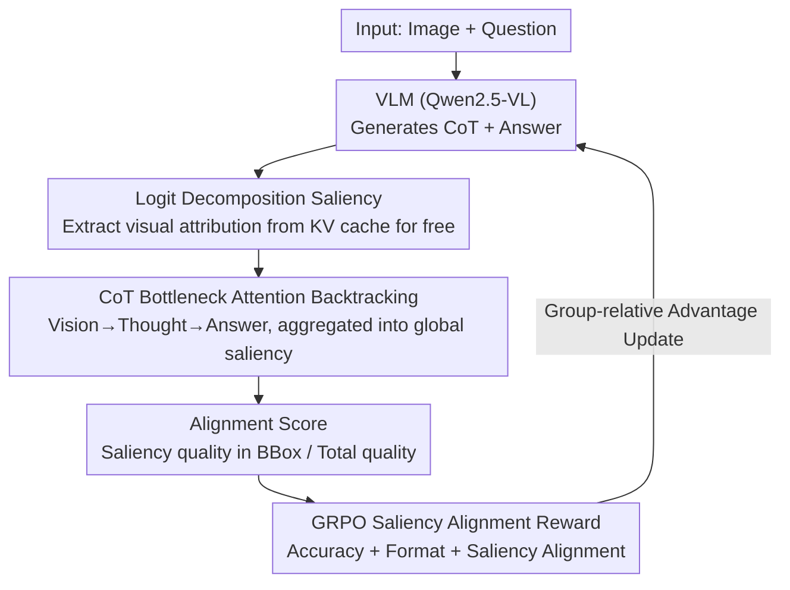

# Saliency-R1: Enforcing Interpretable and Faithful Vision-language Reasoning via Saliency-map Alignment Reward

**Conference**: CVPR 2026  
**arXiv**: [2604.04500](https://arxiv.org/abs/2604.04500)  
**Code**: [https://github.com/peterant330/Saliency_R1](https://github.com/peterant330/Saliency_R1)  
**Area**: Object Detection  
**Keywords**: Vision-Language Models, Saliency Map, GRPO Reinforcement Learning, Interpretable Reasoning, Attention Alignment

## TL;DR

This paper proposes Saliency-R1, which leverages an efficient saliency map technique based on logit decomposition and Chain-of-Thought (CoT) bottleneck attention backtracking. By using the alignment between saliency maps and human-annotated bounding boxes as a GRPO reward, the model is trained to focus on task-relevant image regions during inference, enhancing the interpretability and faithfulness of VLM reasoning.

## Background & Motivation

1. **Background**: VLMs have achieved significant progress in reasoning and question-answering tasks. To enhance trustworthiness, models are often trained to generate natural language explanations (e.g., Chain-of-Thought) to demonstrate their reasoning process. Reasoning models like DeepSeek-R1 have also been trained to produce detailed CoT.

2. **Limitations of Prior Work**: (1) VLMs tend to rely excessively on textual cues, with visual signals playing a relatively minor role; (2) Inconsistencies exist between the generated reasoning trajectories and the final answers—what the model "thinks" differs from what it "does"; (3) The reasoning process itself may misuse visual cues or hallucinate non-existent details.

3. **Key Challenge**: Different reasoning processes may focus on different image regions even if they arrive at the same correct answer. Unfaithful reasoning processes either focus on irrelevant regions or ignore the image entirely, reaching the answer via textual shortcuts.

4. **Goal**: (1) Design an efficient saliency map method to visualize how visual information influences generated tokens; (2) Trace the flow of visual information through the CoT to the final answer; (3) Use saliency alignment as a reward to train the model to focus on correct regions via GRPO.

5. **Key Insight**: Decompose token logits into first-order direct contributions from each context token, extracting the contribution of visual tokens as a saliency map without requiring additional forward or backward passes.

6. **Core Idea**: Measure the visual focus of VLM reasoning using a zero-computational-overhead logit decomposition saliency map, and use its alignment with human annotations as a GRPO reward to train more faithful reasoning.

## Method

### Overall Architecture

The core problem addressed is: when a VLM provides a correct answer, is it "looking at the right place" or "guessing correctly via textual shortcuts"? Saliency-R1 transforms this into an optimizable reward. It first extracts "which image regions each generated token is looking at" from the model's inference process in a zero-overhead manner, then propagates visual attention along the CoT to the final answer tokens to obtain a global saliency map. Finally, it compares this map with human-annotated bounding boxes; higher alignment yields a higher reward, which is integrated into the GRPO reinforcement learning loop. These three stages—extracting, propagating, and rewarding saliency—form a training paradigm where "being right requires looking at the right place."

### Key Designs

**1. Logit Decomposition Saliency: "Zero-overhead" Attribution from KV Cache**

Traditional saliency methods (Grad-CAM needs backprop, TAM needs optimization) are too costly for RL training with multiple rollouts. This work leverages the linearity of Transformer residual connections: the final output logit can be decomposed into the sum of direct contributions from each context token. When predicting $t_{i+1}$, the direct contribution of context token $t_p$ is:

$$c_p = \sum_{l=1}^{L} \sum_{j=1}^{H} \alpha_{i,j,p}^l\, \mathbf{W}_{o,j}^l \mathbf{W}_{v,j}^l \mathbf{h}_p^{l-1}\, \mathbf{E}_u$$

where $\alpha$ is the attention weight, $\mathbf{W}_o, \mathbf{W}_v$ are output and value projections, and $\mathbf{E}_u$ is the unembedding matrix. By taking $c_p$ for visual tokens, rearranging them into a 2D grid, and filtering negative contributions with ReLU, a saliency map is obtained. Crucially, **this requires no extra forward or backward passes** because components like $\mathbf{W}_v^l \mathbf{h}_p^{l-1}$ already exist in the KV cache and $\alpha$ is readable. The trade-off is ignoring multi-layer indirect contributions, but literature suggests direct contributions suffice for reflecting patch importance.

**2. CoT Bottleneck Attention Backtracking: Forcing Information through "Thought Gates"**

Single-token saliency is insufficient; the goal is to judge if the answer is derived "through thinking." The model treats CoT tokens as the unique information bottleneck between vision and the answer. It multiplies the vision-to-thought attention matrix $\mathcal{A}_{vt}^{l,h}$ and the thought-to-answer attention matrix $\mathcal{A}_{ta}^{l,h}$ to get the transition attention:

$$\tilde{\mathcal{A}}_{va}^{l,h} = \mathcal{A}_{vt}^{l,h}\, \mathcal{A}_{ta}^{l,h}$$

If an answer token bypasses the CoT and takes information directly from visual tokens (textual shortcut), the weight on this product path will be low, exposing unfaithful CoT behavior. **Column normalization is intentionally avoided**: tokens like prepositions naturally receive low contributions; original magnitudes are preserved to maintain their appropriately small weights in the global saliency map.

**3. GRPO-based Saliency Alignment Reward: Optimizing "Looking at the Right Place"**

With the global saliency map, the alignment score is defined as the ratio of saliency mass within the bounding box to the total mass:

$$\text{Align} = \frac{\sum_{i \in \text{BBox}} \text{Saliency}(i)}{\sum_{i \in \text{Image}} \text{Saliency}(i)}$$

The total reward $\mathcal{R}$ is the sum of three parts: $\mathcal{R} = \mathcal{R}_{\text{accuracy}} + \mathcal{R}_{\text{format}} + \mathcal{R}_{\text{saliency}}$. $\mathcal{R}_{\text{accuracy}}$ uses LLM-as-judge (GPT-4o-mini) for correctness (0/1), $\mathcal{R}_{\text{format}}$ checks for `<think></think>` tags (0/1), and $\mathcal{R}_{\text{saliency}}$ is the alignment score. Training uses GRPO with 8 rollouts per sample, using group-standardized rewards as the advantage function. The saliency term distinguishes "right for the right reasons" from "right by guessing," forcing the model to use the image faithfully.

### Loss & Training

Two-stage training: (1) Cold-start SFT using a filtered Vision-R1-cold dataset (272,881 samples) via llama-factory; (2) GRPO training using the saliency-r1-8k dataset (8,080 VQA samples with BBox annotations) via TRL framework. Hyperparameters: batch size 64, KL coefficient 0.001, LoRA rank 16, learning rate $10^{-5}$, 8x A6000 GPUs. Base models: Qwen2.5-VL (3B and 7B).

## Key Experimental Results

### Main Results (Saliency Map Faithfulness)

| Method | COCO Cap. Del. 5%↓ | Del. 15%↓ | Del. 30%↓ | Ins. 30%↑ |
|------|-------------------|-----------|-----------|-----------|
| CAM | 86.19 | 82.44 | 78.34 | 28.02 |
| ATTN-LRP | 76.42 | 64.22 | 52.92 | 45.67 |
| TAM | 83.91 | 79.33 | 73.29 | 45.24 |
| **Ours** | **70.96** | **59.45** | **50.34** | 45.22 |

On COCO Captions, the deletion metric is 5.46%/4.77%/2.57% lower than the second-best method, proving the method faithfully captures the relative importance of visual patches.

### Ablation Study

| Reward Config | Description |
|---------|------|
| $\mathcal{R}_{\text{accuracy}}$ only | Pure accuracy reward, baseline |
| $\mathcal{R}_{\text{accuracy}} + \mathcal{R}_{\text{format}}$ | Added format reward |
| $\mathcal{R}_{\text{accuracy}} + \mathcal{R}_{\text{format}} + \mathcal{R}_{\text{saliency}}$ | Full Saliency-R1, improves both faithfulness and accuracy |

### Key Findings

- **Zero-cost saliency outperforms gradient methods**: By leveraging attention weights and KV cache, this method surpasses ATTN-LRP (requires backprop) and TAM (requires optimization) in deletion tests.
- **Saliency rewards improve both faithfulness and accuracy**: Adding saliency rewards not only helps the model focus on correct regions (higher alignment) but also improves final answer accuracy, suggesting that correct focus inherently improves reasoning quality.
- **CoT bottleneck backtracking reveals faithfulness gaps**: Different reasoning trajectories reaching the same answer can have entirely different visual focus; this mechanism detects such unfaithful behavior.
- **Effective across model scales**: Improvements are consistent on both 3B and 7B Qwen2.5-VL models, demonstrating generalizability.

## Highlights & Insights

- **Zero-overhead saliency is a key innovation**: Exploiting existing attention weights and KV cache enables efficient saliency maps that can be embedded directly into GRPO loops without increasing computational burden.
- **"Right for the right reasons" philosophy**: Traditional RL only rewards the final answer. Saliency-R1 requires the model to "look at the right place," fundamentally addressing the issue of unfaithful reasoning. This can be extended to any interpretable reasoning scenario.
- **CoT Bottleneck concept**: Modeling CoT tokens as the information bottleneck between vision and the answer provides both a visualization tool and a quantitative metric for CoT faithfulness.
- **Data Efficiency**: Significant improvements were achieved using only 8,080 BBox-labeled VQA samples, showing that saliency rewards provide a high-quality training signal.

## Limitations & Future Work

- Only considers direct contributions (1st-order decomposition), ignoring multi-layer indirect effects (e.g., non-linear FFN transformations), making the maps slightly imprecise.
- Requires BBox-annotated training data, which limits scalability due to annotation costs.
- The current attention backtracking is heuristic (matrix multiplication approximation) and lacks rigorous theoretical guarantees.
- Only validated on Qwen2.5-VL; applicability to other architectures (e.g., LLaVA, InternVL) remains unconfirmed.
- Future work could introduce finer region annotations (segmentation masks) or more detailed hyperparameter searches for $\mathcal{R}_{\text{saliency}}$.

## Related Work & Insights

- **vs DeepSeek-R1 / Claude**: These models train CoT but do not monitor visual focus, potentially leading to "right answer, wrong reason" scenarios. Saliency-R1 addresses this via alignment rewards.
- **vs Grad-CAM / ATTN-LRP**: Traditional methods require extra computation (gradients/perturbations). Saliency-R1's logit decomposition is comparable or superior in faithfulness while being zero-cost.
- **vs ADAPTVIS**: While ADAPTVIS adjusts attention during inference, Saliency-R1 shapes attention patterns during training via rewards; the two could be complementary.
- This work represents the first attempt to align visual attention with human annotations during the post-training phase of VLMs, opening a new direction for interpretable RL training.

## Rating

- Novelty: ⭐⭐⭐⭐⭐ Zero-overhead saliency + CoT bottleneck backtracking + Saliency-aligned GRPO reward.
- Experimental Thoroughness: ⭐⭐⭐⭐ Strong faithfulness evaluations, though downstream task tables are slightly truncated.
- Writing Quality: ⭐⭐⭐⭐⭐ Intuitive motivation and clear flowcharts with rigorous derivation.
- Value: ⭐⭐⭐⭐⭐ Significant for trustworthy VLM reasoning; practical, reproducible, and introduces a new direction for RL training.

<!-- RELATED:START -->

## Related Papers

- [\[CVPR 2026\] FALCON: False-Negative Aware Learning of Contrastive Negatives in Vision-Language Alignment](falcon_false-negative_aware_learning_of_contrastive_negatives_in_vision-language.md)
- [\[CVPR 2026\] Mining Instance-Centric Vision-Language Contexts for Human-Object Interaction Detection](mining_instance-centric_vision-language_contexts_for_human-object_interaction_de.md)
- [\[CVPR 2026\] CrossVL: Complexity-Aware Feature Routing and Paired Curriculum for Cross-View Vision-Language Detection](crossvl_complexity-aware_feature_routing_and_paired_curriculum_for_cross-view_vi.md)
- [\[CVPR 2026\] VisualAD: Language-Free Zero-Shot Anomaly Detection via Vision Transformer](visualad_language-free_zero-shot_anomaly_detection_via_vision_transformer.md)
- [\[ECCV 2024\] SHINE: Saliency-aware HIerarchical NEgative Ranking for Compositional Temporal Grounding](../../ECCV2024/object_detection/shine_saliency-aware_hierarchical_negative_ranking_for_compositional_temporal_gr.md)

<!-- RELATED:END -->
