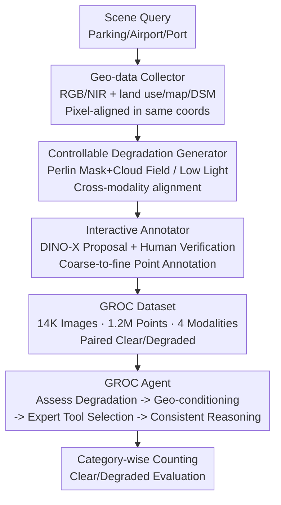

# See What We Cannot See: A Geo-guided Reasoning Benchmark for Object Counting under Adverse Earth Observation Conditions

**Conference**: CVPR 2026  
**Paper**: [CVF Open Access](https://openaccess.thecvf.com/content/CVPR2026/html/Wang_See_What_We_Cannot_See_A_Geo-guided_Reasoning_Benchmark_for_CVPR_2026_paper.html)  
**Code**: https://github.com/jwang-rs/GROC  
**Area**: Object Detection / Remote Sensing Counting  
**Keywords**: Remote Sensing Counting, Geo-multimodal, amodal reasoning, data engine, counting Agent

## TL;DR
This work proposes GROC—the first large-scale benchmark for "geo-guided reasoning counting under adverse Earth observation conditions" (14K images, 1.2M point annotations, with each image aligned to land use / map / DSM geo-modalities alongside clear-degraded pairs). Constructed via a controllable degradation + interactive annotation data engine, it includes a GROC Agent (GPT-5 backbone calling expert counting tools) as a baseline. The study systematically reveals that existing counting models suffer significant performance drops when visual cues are occluded by clouds/fog or low light, whereas geo-modalities provide stable structural and contextual priors that significantly enhance robustness.

## Background & Motivation
**Background**: Remote sensing object counting (RSOC) has progressed rapidly, with mainstream approaches categorized into density map regression, detection, and regression. Corresponding benchmarks (RSOC, NWPU-MOC, CARPK, DroneRGBT, etc.) are also increasing in scale.

**Limitations of Prior Work**: Almost all existing benchmarks are built on an implicit assumption—**targets are visible**. They only evaluate "how accurately the model counts objects already observable in the visual signal (or at most one additional modality)." However, clouds, fog, shadows, and low light are extremely common in real-world Earth observation. When cloud layers completely obscure the ground, the visual information that conventional counting models rely on disappears. Most existing datasets have only 1-2 modalities, limited scale, and lack "clear-degraded" paired images, making it impossible to determine whether a model counts based on visible textures or truly utilizes geographical information to infer invisible objects.

**Key Challenge**: Counting is essentially tied to "direct perception," yet the natural complementarity of Earth observation—where **visual signals fail but geo-modalities remain reliable**—is unexploited. Land use and maps describe the functional context of an area (parking lot/port/airport), while DSM describes surface geometric structures invariant to weather and lighting. These priors remain valid even when appearance cues fail. The authors refer to "inferring the existence and distribution of invisible objects using these priors" as **geo-guided amodal reasoning**.

**Goal**: (1) Create a dataset that truly evaluates this capability, requiring multiple geo-modalities, paired clear/degraded observations, large scale, and reliable annotations; (2) Provide an engine for scalable production of such data; (3) Establish the first benchmark and provide an Agent baseline that utilizes geo-modality reasoning.

**Key Insight**: Starting from the observation that "Earth observation naturally provides geo-modalities"—while vision fails, DSM/map/land use do not—aligning these forces the model to "see the invisible."

**Core Idea**: Package three aligned geo-modalities with paired clear/degraded images into a benchmark, upgrading the counting problem from "accurate perception" to "reasoning based on geographical priors when visual evidence is incomplete."

## Method
As a benchmark paper, the core contributions are the **GROC dataset + scalable data engine + GROC Agent baseline** triad.

### Overall Architecture
GROC is organized around one goal: allowing the benchmark to distinguish whether a model is perceiving visible objects or performing amodal reasoning using geo-priors. To this end, each image in the dataset includes **visual signals (RGB + NIR four bands)** and **three aligned geo-modalities (land use / map / DSM)**, alongside **paired clear and synthetically degraded samples of the same scene**. Data is produced via a three-stage engine pipeline: a geo-data collector first fetches georeferenced imagery based on scene queries (parking lots/airports/ports), crops them into 1024×1024 patches, and preserves coordinates; a controllable degradation generator synthesizes cloud/fog occlusion and low light on clear patches, producing modality-consistent degraded samples; an interactive annotator uses DINO-X for point proposals followed by human verification to complete dense point annotations in a coarse-to-fine manner. Finally, a benchmark is established atop the dataset, evaluating density counting models, detectors, MLLMs, and a GROC Agent calling expert tools, with scoring split into clear and degraded scenarios.

### Key Designs

**1. GROC Dataset: Supporting "Amodal Reasoning" Evaluation with Geo-modalities + Paired Clear/Degraded Samples**

Addressing the pain point that "existing benchmarks have only 1-2 modalities, lack paired degraded images, and cannot distinguish perception from reasoning," GROC achieves three things others haven't combined. First, **Four-Modality Alignment**: Besides RGB/NIR, it aligns land use (coarse semantic context), map (structured spatial layout), and DSM (surface geometry), all **pixel-aligned in the same year and coordinate system** as the imagery. Second, **Paired Clear/Degraded Observations**: The validation/test sets include a degradation subset where the same scene has both clear and degraded versions, allowing "performance drop due to visual degradation" to be quantified. Third, **Scale and Annotation Quality**: 1.2M point annotations, 14K images, GSD 0.25m, focusing on four **movable** target classes: car, truck, boat, and airplane. Movable targets are chosen over static ones because static objects could be counted simply if the degradation disappears, whereas moving targets require context and geo-priors when obscured. Compared to existing benchmarks (see Table 1 summary), GROC is the first to provide 4 modalities with both weather and illumination degradation and instance counts exceeding one million.

**2. Scalable Data Engine: Controllable Degradation + DINO-X Interactive Annotation for Low-cost Paired Samples**

To address the cost of human-annotated paired, multi-modal data, the engine uses three components. The collector fetches georeferenced RGB/NIR/DSM/map/land use from public repositories, crops patches by scene query, and preserves coordinates, exporting both lightweight PNGs and raw TIFFs. The **Controllable Degradation Generator** is key: cloud synthesis is split into "procedural cloud masks" and "cloud appearance fields"—the mask determines spatial coverage and opacity, while the field determines visual features. Clouds are generated using **multi-scale Perlin turbulence**, allowing control over position, thickness, and opacity, covering everything from thin mist to dense overcast. **Crucially, the same cloud/shadow masks are applied to both RGB and NIR to ensure cross-modality occlusion alignment**—vital for geo-guided reasoning. Low light is approximated by reducing exposure, gamma darkening, and injecting signal-dependent noise. The **Interactive Annotator** employs a coarse-to-fine approach: humans annotate sparse areas, while dense areas use DINO-X for point proposals on RGB patches, followed by human correction.

**3. GROC Agent: Linking Geo-modalities and Expert Tools via Reasoning-Action-Observation Loops**

To provide a baseline capable of using geo-modalities, the authors provide a lightweight, interpretable agentic baseline—intentionally not a complex standalone model, but a testbed for "whether multimodal reasoning can help when vision is unreliable." Built on an MLLM with vision-language understanding and tool-calling capabilities (currently **GPT-5** as the backbone, though model-agnostic), it uses **pure prompting without fine-tuning on GROC**. The reasoning process is a structured loop: first, evaluate degradation from visual signals; second, introduce aligned land use/map/DSM for structural and semantic context; third, **adaptively select external expert tools** (BL, PSGCNet, FIDTM, DINO-X, etc.) based on the scene; and finally, perform **consistency-aware reasoning** to refine the estimate. Output includes category-wise counts and a structured reasoning trajectory.

## Key Experimental Results

Evaluation uses official splits (approx. 70%/15%/15%, geo-spatially non-overlapping), with MAE and RMSE as metrics. Degradation evaluation uses 200 representative images from val/test for synthesis.

### Main Results: Counting across Four Categories in Clear Scenarios (Table 2, MAE)

| Method | Airplane MAE | Truck MAE | Boat MAE | Car MAE |
|------|------|------|------|------|
| MCNN (2016) | 3.213 | 5.446 | 12.412 | 11.358 |
| CSRNet (2018) | 3.382 | 5.683 | 6.169 | 8.730 |
| PSGCNet (2022) | 1.115 | 2.636 | 3.512 | 5.412 |
| FIDTM (2023) | 4.138 | 2.856 | 3.887 | 6.089 |
| DINO-X (2025) | 0.345 | 3.130 | 9.102 | 12.429 |
| Qwen3-VL-8B-Instruct (2025) | 0.286 | 3.055 | 10.608 | 11.330 |
| **GROC Agent (ours)** | **0.276** | **2.411** | **3.227** | **5.131** |

In clear scenarios, specialized counting models are already strong (PSGCNet is balanced); open-vocabulary detectors (DINO-X) excel on distinct targets like airplanes (MAE 0.345) but deteriorate on small, dense categories like boats/cars (Boat MAE 9.102). GROC Agent achieves the best overall performance by adaptively integrating multiple expert models. However, the authors note that clear scenarios mainly reflect standard perception; the true challenge of GROC lies in degraded scenarios.

### Robustness in Degraded Scenarios (Table 3, Overall MAE)

| Method | clear MAE | adverse MAE | weather MAE | illumination MAE |
|------|------|------|------|------|
| BL (2019) | 4.968 | 19.322 | 17.659 | 21.075 |
| PSGCNet (2022) | 4.105 | 18.947 | 17.927 | 20.023 |
| FIDTM (2023) | 4.589 | 26.135 | 16.464 | 36.332 |
| GroundingDINO Pro (2024) | 12.437 | 28.759 | 32.613 | 24.647 |
| DINO-X (2025) | 8.418 | 20.608 | 26.948 | 13.924 |
| Qwen3-VL-8B-Instruct (2025) | 40.302 | 40.841 | 41.433 | 40.217 |
| **GROC Agent (ours)** | **3.940** | **14.476** | **15.378** | **13.518** |

All methods drop significantly under clouds or low light, confirming heavy reliance on direct visual signals. For example, PSGCNet's MAE jumps from 4.105 (clear) to 18.947 (adverse). Density-based methods (FIDTM, BL) are relatively stable under weather, while DINO-X is more robust in low light (MAE 13.924). General MLLMs (Qwen3-VL-8B) remain "consistently poor" across all settings. GROC Agent remains best overall (adverse MAE 14.476) by leveraging its adaptive tool combination.

### Key Findings
- **The Clear-to-Degraded Gap is the Core Conclusion**: High-performing models drop significantly under degradation, showing that existing methods lack generalization beyond direct perception; geo-prior-based methods exhibit better robustness.
- **Small and Dense Categories are Weak Points**: Detectors are strong on airplanes but degrade on boats/cars, especially under degradation.
- **Agent Gain has an Upper Bound**: The authors admit that in cases where visual evidence is completely absent, the gains from the Agent are limited—indicating that amodal reasoning remains an open challenge.

## Highlights & Insights
- **"Paired Clear/Degraded + Cross-modality Aligned Occlusion" is extremely clever**: Applying the same cloud/shadow masks to both RGB and NIR ensures modality-consistent degradation, cleanly decoupling "perception" from "reasoning" for evaluation.
- **Engineering "Data Scarcity" with Controllable Degradation**: By parameterizing clouds with multi-scale Perlin turbulence, degradation becomes a tunable knob, allowing for systematic production of paired-evaluation samples.
- **Agent as a Testbed, not just SOTA**: Positioning the Agent as a "probe" rather than an ultimate solution makes the benchmark conclusions more credible.
- **"Geo-guided Amodal Reasoning" is a Transferable Problem Formulation**: Explicitly defining "counting what cannot be seen" as amodal reasoning + geo-priors points towards a new direction for remote sensing.

## Limitations & Future Work
- GROC Agent gains remain limited under extreme degradation; geo-guided reasoning is far from solved.
- **Degradation samples are synthetic** (procedural clouds + gamma noise); realism is discussed in supplementary materials. Distribution shifts between synthetic and real clouds/low light may affect conclusions.
- The degradation evaluation is conducted on a 200-image subset, which is smaller compared to the clear scenario evaluation.
- Class coverage is limited to four types of movable targets.
- Future Work: Moving from "calling expert tools" to "end-to-end learning to use DSM/map for geometric/contextual inference," and introducing more real-world degraded data.

## Related Work & Insights
- **vs. General Object Counting (GOC)**: GOC assumes targets are visible; GROC provides geo-modality cues for reasoning about invisible objects.
- **vs. RS Counting Benchmarks (RSOC, NWPU-MOC)**: These are limited to 1-2 modalities and rarely have paired clear/degraded observations.
- **vs. Multi-modal Counting (MMOC)**: These remain perception-driven, requiring visibility in at least one modality; GROC evaluates counting when all visual modalities fail.

## Rating
- Novelty: ⭐⭐⭐⭐⭐ First to formalize "geo-guided amodal reasoning" and provide a 4-modality + paired-degradation benchmark.
- Experimental Thoroughness: ⭐⭐⭐⭐ Covers density/detection/MLLM/Agent baselines, though degradation set is small.
- Writing Quality: ⭐⭐⭐⭐ Clear motivation and "see what we cannot see" narrative.
- Value: ⭐⭐⭐⭐⭐ Open-sourced dataset, engine, and Agent provide a ready-to-use testbed for robust RS counting.

<!-- RELATED:START -->

## Related Papers

- [\[CVPR 2026\] Does YOLO Really Need to See Every Training Image in Every Epoch?](does_yolo_really_need_to_see_every_training_image_in_every_epoch.md)
- [\[CVPR 2026\] CD-Buffer: Complementary Dual-Buffer Framework for Test-Time Adaptation in Adverse Weather Object Detection](cd-buffer_complementary_dual-buffer_framework_for_test-time_adaptation_in_advers.md)
- [\[CVPR 2026\] Boosting Quantitive and Spatial Awareness for Zero-Shot Object Counting](boosting_quantitive_and_spatial_awareness_for_zero-shot_object_counting.md)
- [\[CVPR 2026\] ADSeeker: A Knowledge-Grounded Reasoning Framework for Industry Anomaly Detection and Reasoning](adseeker_a_knowledge-grounded_reasoning_framework_for_industry_anomaly_detection.md)
- [\[CVPR 2026\] Heuristic-inspired Reasoning Priors Facilitate Data-Efficient Referring Object Detection](heuristic-inspired_reasoning_priors_facilitate_data-efficient_referring_object_d.md)

<!-- RELATED:END -->
