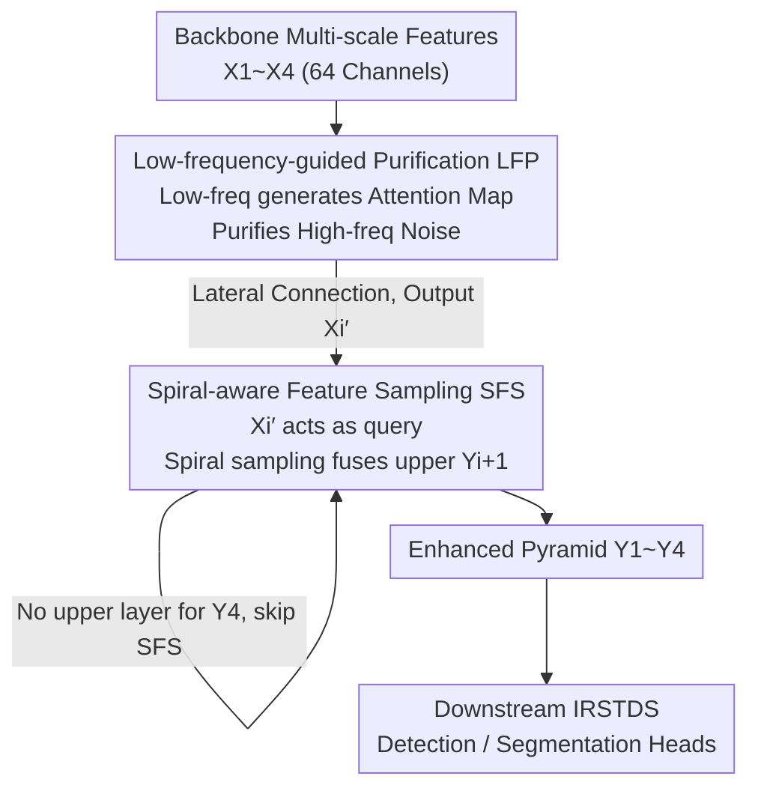

# Seeing Through the Noise: Improving Infrared Small Target Detection and Segmentation from Noise Suppression Perspective

**Conference**: CVPR 2026  
**Paper**: [CVF Open Access](https://openaccess.thecvf.com/content/CVPR2026/html/Yuan_Seeing_Through_the_Noise_Improving_Infrared_Small_Target_Detection_and_CVPR_2026_paper.html)  
**Code**: None  
**Area**: Object Detection / Infrared Small Target  
**Keywords**: Infrared Small Target, Noise Suppression, Frequency Domain Analysis, Feature Pyramid, False Alarm Suppression

## TL;DR
Addressing the issue where enhancing high-frequency features simultaneously increases false alarm rates in infrared small target detection, this paper proposes a noise-suppression feature pyramid network (NS-FPN) from a frequency-domain perspective. By replacing the 1×1 convolutions and upsampling in the FPN with a Low-frequency-guided Feature Purification (LFP) module and a Spiral-aware Feature Sampling (SFS) module, it significantly reduces false alarms and improves localization accuracy with almost no added computational cost.

## Background & Motivation
**Background**: Infrared Small Target Detection and Segmentation (IRSTDS) is currently dominated by CNN-based methods. The mainstream approach involves designing complex feature fusion structures (e.g., DNANet, MSHNet, IRSAM) to integrate high-level semantics with low-level details for precise localization of dim, small targets with minimal texture.

**Limitations of Prior Work**: These methods focus exclusively on "enhancing feature representation" and rely heavily on high-frequency components to depict target edges and details. Consequently, while IoU and Pd (Probability of Detection) are high, the False Alarm rate (Fa) remains elevated—enhancing high-frequency components amplifies the noise embedded within them, leading to background clutter being misidentified as targets.

**Key Challenge**: Discrete Haar wavelet decomposition reveals a fundamental trade-off: ① High-frequency components are crucial for localization but are primary sources of false alarms; ② Low-frequency components degrade localization precision but offer the best cues for suppressing false alarms. In other words, localization accuracy and false alarm suppression are at opposite ends of the frequency spectrum (high vs. low frequency), making it impossible to optimize both by merely stacking high-frequency features.

**Goal / Key Insight**: Instead of adding complexity to the network architecture, the authors adopt a neglected perspective—active "noise suppression" rather than blind "feature enhancement." Specifically: use low frequencies to purify noise in high frequencies, and avoid peripheral background noise during the feature fusion (sampling) stage.

**Core Idea**: Use low-frequency components to guide and purify high-frequency components, and apply structured sampling based on the intensity distribution priors of infrared small targets. Noise suppression is directly embedded into the lateral connections and upsampling of the FPN via lightweight, plug-and-play NS-FPN modules.

## Method

### Overall Architecture
NS-FPN follows the classic top-down structure of FPN: multi-scale features $\{X_1, X_2, X_3, X_4\}$ (strides 2/4/8/16, reduced to 64 channels) are extracted from the backbone to construct the feature pyramid $\{Y_1, Y_2, Y_3, Y_4\}$. Only two standard components are replaced:

- The 1×1 convolution in the lateral connections is replaced by the **LFP module**, which performs low-frequency-guided high-frequency purification for each scale $X_i$ to output denoised $X_i'$ (applied to all 4 scales).
- The upsampling operation is replaced by the **SFS module**, which uses the purified $X_i'$ as the query and the upper-level feature $Y_{i+1}$ as the key/value for fused spiral sampling to output $Y_i$ (applied to $Y_1, Y_2, Y_3$).

The pipeline repeats "LFP purification followed by SFS sampling" at each scale, finally feeding the enhanced $\{Y_1, ..., Y_4\}$ into downstream detection/segmentation heads. As it only replaces standard FPN components, NS-FPN is easily integrated into existing IRSTDS frameworks (e.g., MSHNet for segmentation, YOLOv8n-p2 for detection).

### Key Designs

**1. Low-frequency-guided Feature Purification (LFP): Utilizing Low Frequencies as "Gatekeepers" to Filter High-frequency Noise**

This module addresses the contradiction of high frequencies providing localization but causing false alarms. The core hypothesis is that while low-frequency components have poor localization, they reliably indicate the "approximate target region." Thus, low frequencies generate a weight map of target locations to constrain where high frequencies should be enhanced or suppressed.

In the first stage, a 2D Discrete Wavelet Transform (DWT) decomposes the input feature $X_i$ into low and high frequencies: $[F_l, F_h] = \text{DWT}(X)$. Spatial attention is applied to $F_l$ by concatenating average and max pooling to generate a weight map $A_s = \text{Sigmoid}(\text{Conv}(\text{APool}(F_l)\,\|\,\text{MPool}(F_l)))$, which modulates the high frequency: $\hat{F_h} = A_s \odot F_h$.

In the second stage, a **Gated Gaussian Filter** is applied to $\hat{F_h}$. Smoothing is only applied to "low-confidence high-frequencies" (absolute values below threshold $\tau$), while high-confidence values are preserved:

$$\tilde{F_h} = \mathcal{G}(\hat{F_h}) \cdot \mathbb{I}_{<\tau}(|\hat{F_h}|) + \hat{F_h} \cdot \mathbb{I}_{\geq\tau}(|\hat{F_h}|)$$

where $\mathbb{I}(\cdot)$ is the indicator function for gating, and $\mathcal{G}$ is a Gaussian kernel $\mathcal{G}(i,j;\sigma) = \frac{1}{Z}\exp(-\frac{(i-c)^2+(j-c)^2}{2\sigma^2})$ with a learnable $\sigma$. The Inverse DWT (IDWT) reconstructs the output: $X' = \text{IDWT}(F_l, \tilde{F_h})$.

**2. Spiral-aware Feature Sampling (SFS): Sampling Based on Infrared Target Intensity Distribution to Avoid Background Noise**

During top-down fusion, the upper-level feature $Y_{i+1}$ must be sampled to the current scale. Standard Deformable Attention (DAT) with random sparse sampling is ineffective for infrared small targets, which are dim, compact, and consistent in shape. Random sampling struggles to distinguish targets from backgrounds.

SFS "hardcodes" the sampling priors into a spiral pattern. For upper features, a set of uniform reference points $p$ is sampled using offsets $\Delta p = s + \epsilon$: $Y_{i+1}' = \phi(Y_{i+1}; p+\Delta p)$, where $\phi$ is bilinear interpolation, $s$ is the fixed spiral distribution, and $\epsilon$ is a learnable bias. The spiral pattern is constructed in polar coordinates for each attention head $h$: $s^{(h,k)} = l_s\,[\cos\theta_{h,k}, \sin\theta_{h,k}]^\top$, $\theta_{h,k} = \frac{2\pi k}{P} + \frac{2\pi h}{H}$, where the radius $l_s = l_0 + k\cdot\Delta l$ expands according to the sampling index $k$. This aligns with the Gaussian-like intensity distribution of infrared targets.

After obtaining $Y_{i+1}'$, cross-attention is calculated with $X_i'$ as the query: $F_s = \text{Attn}(\text{LN}(X_i'), \text{LN}(Y_{i+1}'))$, and fused via $Y_i = X_i' + F_s$. **All queries share the same set of learnable offsets** to maintain stable sampling and reduce computation.

## Key Experimental Results

The datasets used are IRSTD-1k (1000 images) and NUAA-SIRST (427 images), with an 8:2 train/test split. Segmentation metrics include IoU/Pd/Fa, while detection uses mAP50/mAP75/mAP.

### Main Results
Segmentation performance compared with SOTA on IRSTD-1k / NUAA-SIRST (Fa in unit $10^{-6}$):

| Method | IRSTD-1k IoU↑ | IRSTD-1k Pd↑ | IRSTD-1k Fa↓ | NUAA IoU↑ | NUAA Pd↑ | NUAA Fa↓ |
|------|------|------|------|------|------|------|
| DNANet (TIP 22) | 65.71 | 91.84 | 17.61 | 74.31 | 98.17 | 15.97 |
| SCTransNet (TGRS 24) | 68.64 | 91.84 | 11.92 | 77.09 | 98.17 | 15.26 |
| MSHNet (CVPR 24) | 67.16 | 93.88 | 15.03 | 74.60 | 99.08 | 17.21 |
| **MSHNet + NS-FPN (Ours)** | **69.29** | **95.24** | **8.58** | **78.75** | **100.0** | **1.60** |

False alarm suppression is the most significant highlight: on NUAA, Fa drops from 17.21 (baseline MSHNet) to 1.60. For detection, YOLOv8n + NS-FPN improves IRSTD-1k mAP75 from 31.9 to 36.9 and NUAA mAP75 from 40.3 to 61.6.

Comparison of FPN variants (increments relative to FPN):

| Method | IoU | Pd | Fa | mAP50 | Params(M) | FLOPs(G) |
|------|------|------|------|------|------|------|
| FPN | 67.0 | 91.2 | 13.1 | 85.9 | 3.91 | 6.80 |
| PANet | 68.9 | 93.5 | 6.7 | 85.0 | +0.41 | +1.41 |
| **Ours** | **69.2** | **95.2** | 8.5 | **86.3** | +0.26 | +1.16 |

### Ablation Study
Incremental validation of LFP and SFS (baseline = MSHNet + FPN):

| LFP | SFS | IRSTD-1k IoU↑ | IRSTD-1k Fa↓ | NUAA IoU↑ | NUAA Fa↓ |
|------|------|------|------|------|------|
| | | 67.04 | 13.06 | 76.04 | 12.42 |
| ✓ | | 68.82 | 9.79 | 76.99 | 12.07 |
| | ✓ | 67.81 | 13.66 | 78.07 | 4.61 |
| ✓ | ✓ | **69.29** | **8.58** | **78.75** | **1.60** |

Comparison of sampling methods:

| Sampling | IoU↑ | Pd↑ | Fa↓ | FLOPs |
|------|------|------|------|------|
| Upsample | 68.82 | 94.56 | 9.79 | 6.80G |
| DAT | 68.52 | 93.54 | 10.40 | +1.24G |
| **SFS (Ours)** | **69.29** | **95.24** | **8.58** | +1.16G |

### Key Findings
- **Complementary Modules**: LFP primarily improves IoU/Pd and reduces Fa on IRSTD-1k, while SFS significantly slashes Fa on NUAA. Combined, they achieve optimal performance.
- **LFP on Large Scales**: Applying LFP to large-scale shallow layers (X1, X2) is more effective for suppressing false alarms.
- **SFS vs. DAT**: Spiral sampling + shared offsets outperforms deformable random sampling while saving 0.08G FLOPs, validating the value of structured sampling aligned with intensity distribution.

## Highlights & Insights
- **Perspective Shift**: Attributing false alarms to high-frequency noise and assigning clear roles (low frequency for suppression, high frequency for localization) is a highly insightful observation.
- **Low-frequency Semantic Gate**: Generating spatial attention from low frequencies to gate high frequencies is an elegant "frequency-guiding-frequency" approach applicable to other low-SNR tasks.
- **Geometric Priors in Sampling**: Encoding the "Gaussian-like, consistent shape" physical prior into the sampling trajectory is more stable and efficient than learning from scratch.
- **Plug-and-play Efficiency**: Replacing standard FPN operators with minimal overhead (+0.26M parameters) makes it highly practical for deployment.

## Limitations & Future Work
- Evaluation is limited to two relatively small datasets (total ~1500 images); generalization to diverse clutter scenes remains to be verified.
- Gated Gaussian filtering relies on an empirical threshold $\tau$. If $\tau$ is poorly chosen, it might blur high-frequency details of weak targets.
- The spiral sampling prior is tailored for small, Gaussian-like targets and may not adapt well to irregular or large objects.
- Future work could extend noise suppression to video sequences using temporal low frequencies or introduce adaptive spiral parameters based on target scale.

## Related Work & Insights
- **vs. MSHNet / DNANet**: While prior works focus on complex fusion to counteract noise, this paper emphasizes active noise suppression, achieving lower false alarms and higher accuracy on the same backbone.
- **vs. HS-FPN**: HS-FPN relies on preset high-frequency bands and ignores low frequencies; this work adaptively uses low-frequency guidance for infrared tasks.
- **vs. DAT**: SFS uses a structured spiral geometry and shared offsets to provide a more stable and efficient alternative to random sparse sampling for compact targets.

## Rating
- Novelty: ⭐⭐⭐⭐⭐ 
- Experimental Thoroughness: ⭐⭐⭐⭐ 
- Writing Quality: ⭐⭐⭐⭐⭐ 
- Value: ⭐⭐⭐⭐⭐ 

<!-- RELATED:START -->

## Related Papers

- [\[CVPR 2026\] Target-Aware Invertible Encoder with Reconstruction Guidance for Infrared Small Target Detection](target-aware_invertible_encoder_with_reconstruction_guidance_for_infrared_small_.md)
- [\[CVPR 2026\] CHAL: Causal-guided Hierarchical Anomaly-aware Learning for Moving Infrared Small Target Detection](chal_causal-guided_hierarchical_anomaly-aware_learning_for_moving_infrared_small.md)
- [\[NeurIPS 2025\] Rethinking Evaluation of Infrared Small Target Detection](../../NeurIPS2025/object_detection/rethinking_evaluation_of_infrared_small_target_detection.md)
- [\[CVPR 2026\] Towards an Incremental Unified Multimodal Anomaly Detection: Augmenting Multimodal Denoising From an Information Bottleneck Perspective](towards_an_incremental_unified_multimodal_anomaly_detection_augmenting_multimoda.md)
- [\[CVPR 2025\] Small Target Detection Based on Mask-Enhanced Attention Fusion of Visible and Infrared Remote Sensing Images](../../CVPR2025/object_detection/small_target_detection_based_on_mask-enhanced_attention_fusion_of_visible_and_in.md)

<!-- RELATED:END -->
