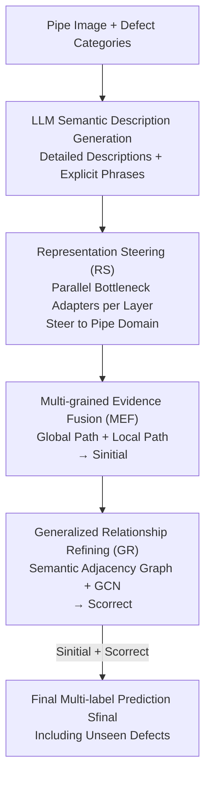

# SFR-Net: Steering-Fusion-Refining Network in Multi-label Zero-Shot Sewer Defect Detection

**Conference**: CVPR 2026  
**Paper**: [CVF Open Access](https://openaccess.thecvf.com/content/CVPR2026/html/Chen_SFR-Net_Steering-Fusion-Refining_Network_in_Multi-label_Zero-Shot_Sewer_Defect_Detection_CVPR_2026_paper.html)  
**Code**: https://github.com/infinitycan/SFR-Net (Available)  
**Area**: Multi-label Zero-Shot / Industrial Defect Detection / Vision-Language Alignment  
**Keywords**: Multi-label Zero-shot Learning, Sewer Defect Detection, CLIP Domain Adaptation, Graph Convolution, Parameter-Efficient Fine-Tuning

## TL;DR
SFR-Net adapts CLIP to sewer defect scenarios using a three-stage "Steering (RS) $\rightarrow$ Fusion (MEF) $\rightarrow$ Refining (GR)" pipeline. It employs lightweight adapters to steer representations toward the pipe domain, fuses global and local evidence for initial scoring, and uses a GCN to learn a transferable "score refinement logic" from seen classes to unseen ones. It achieves SOTA on Sewer-ML and the self-collected WZ-Pipe datasets (e.g., 12.58% mAP on Sewer-ML ML-ZSL, approximately double the second-best method).

## Background & Motivation

**Background**: Urban sewer defect detection is fundamentally a multi-label image recognition task—a single pipe interior image may simultaneously contain multiple defects such as deformation, blockage, cracks, and root intrusion. Prevalent approaches involve training CNN/GNN multi-label classifiers on datasets like Sewer-ML, yielding strong closed-set performance.

**Limitations of Prior Work**: Annotation costs in pipe scenarios are extremely high, and many rare defects only appear after decades of operation. This creates a severe long-tail distribution where some categories have zero training samples. While Multi-label Zero-Shot Learning (ML-ZSL) offers a solution by transferring knowledge from seen to unseen classes via word embeddings, existing ML-ZSL methods fail in this specialized domain: attribute-based methods require manually defined large-scale matrices with poor scalability; VLM-based methods like CLIP suffer from a massive domain gap between sewer data and pre-training data; and prompt tuning methods like CoOp/CoCoOp fail to capture fine-grained features under dim lighting and subtle cracking due to their frozen image encoders.

**Key Challenge**: The authors attribute the root cause to **Alignment Ambiguity**—the inability to establish robust, fine-grained visual-semantic alignment between complex visual environments in pipes and often sparse semantic descriptions. On one hand, the image encoder is not adapted to the pipe domain, resulting in "blurry" features; on the other hand, global CLS features lose local details necessary for identifying subtle defects. Furthermore, the lack of direct supervision for unseen classes leads to biased scoring.

**Goal**: To resolve alignment ambiguity progressively without introducing excessive parameters or compromising CLIP's generalization capability, enabling the model to recognize both seen and unseen defect categories.

**Key Insight**: Rather than attempting hard alignment in one step, it is better to decompose "disambiguation" into three progressive stages: "steering" representations to the pipe domain (addressing feature mismatch), "fusing" multi-grained evidence for a reliable initial judgment (addressing detail loss), and "refining" the scoring logic from seen-class relationships to transfer to unseen classes (addressing zero-shot scoring bias).

**Core Idea**: Gradually resolve visual-semantic alignment ambiguity using a three-stage Steering-Fusion-Refining pipeline and supplement zero-shot generalization via a "transferable score refinement skill."

## Method

### Overall Architecture
SFR-Net is built upon frozen CLIP (ViT-B/16) dual encoders, with the backbones remaining untrained. Given a pipe image, it outputs multi-label prediction scores for all defect categories (including unseen classes). The pipeline consists of three stages: **RS** inserts lightweight adapters in parallel to each encoder layer to "steer" intermediate representations toward the pipe domain; **MEF** produces an initial prediction score $S_{\text{initial}}$ via decoupled global and local paths; **GR** drives a GCN using a semantic similarity-based adjacency graph to learn a "score refinement" skill from seen classes, calculating a correction $S_{\text{correct}}$ to produce the final score $S_{\text{final}}$. Semantic descriptions are pre-generated by an LLM (detailed descriptions for the CLIP text encoder and explicit phrases for GR graph construction). The entire system is trained end-to-end using a joint loss $\mathcal{L}_{\text{scl}}$.

### Key Designs

**1. LLM-Customized Defect Description Generation: Replacing "A photo of X" with Domain Expert Text**

Most ML-ZSL methods use fixed templates like `"A photo of a [Category]"`, which lack semantic depth in the specialized sewer domain. The authors use an LLM (Gemini-2.5 Flash) to generate two types of text for each defect: **Detailed Descriptions**—domain-specific sentences constrained within 77 tokens (CLIP context limit) for robust semantic features; and **Explicit Phrases**—concise, unambiguous noun phrases for the GR module's adjacency matrix. Ablations (Table 4) show that LLM-enhanced descriptions perform best across all tasks, proving that high-semantic-density, domain-specific text is critical for generalization.

**2. Representation Steering (RS): Each-Layer Bottleneck Adapters for Domain Alignment without Forgetting**

The core challenge in using CLIP for zero-shot detection is bridging the domain gap without catastrophic forgetting. RS inserts an independent RS Block in parallel to **every** Transformer layer of both encoders. Given input features $X_{\text{in}}$, a domain-specific correction is calculated via a bottleneck structure ($D\to d\to D$, with $d=128$):

$$X_{\text{rs}} = \text{Linear}_2(\text{Dropout}(\text{GeLU}(\text{Linear}_1(X_{\text{in}}))))$$

This is added back to the original layer output: $X_{\text{out}} = \text{TransformerLayer}(X_{\text{in}}) + X_{\text{rs}}$. This "residual domain feature learning" superimposes progressive domain steering onto intermediate representations. With only 6.05M learnable parameters (Table 7), it boosts ML-GZSL mAP from CLIP's baseline of 9.92% to 39.62%.

**3. Multi-grained Evidence Fusion (MEF): Global Context + Local Details**

CLIP's global CLS vector effectively captures context but loses local details. MEF decouples these using two paths. **Global Path**: Calculates cosine similarity between the global image feature $X_g$ and text features $T_l$ to get $S_{\text{glb}} = \cos(X_g, T_l^\top)$. **Local Path**: Calculates affinity between local image features $X_l \in \mathbb{R}^{P \times D}$ ($P=196$ patches) and text, yielding location weights $W_{\text{affinity}} = \text{Softmax}(\cos(X_l, T_l^\top))$. These weights aggregate local tokens into category-specific evidence, which is processed by an MLP to get $S_{\text{loc}}$. The final initial score is $S_{\text{initial}} = S_{\text{glb}} + S_{\text{loc}}$.

**4. Generalized Relationship Refining (GR): Transferring "Score Correction Logic" from Seen classes**

Zero-shot performance suffers because unseen classes lack supervision. GR assumes that the **logical patterns of interaction between scores are universal across all categories**. LLM-generated phrases are encoded into semantic vectors $T_s$ to create a similarity matrix $M = \cos(T_s, T_s^\top)$, binarized with threshold $\gamma=0.85$ into an adjacency matrix $A$. A two-layer GCN then treats $S_{\text{initial}}$ as node features to learn the correction $S_{\text{correct}}$:

$$S_{\text{correct}} = \tilde{A}\left[\text{ReLU}\left(\tilde{A}\,S_{\text{initial}}\,W^{(0)}\right)\right]W^{(1)}$$

The GCN learns *how* to refine a category's score based on its neighbors—a skill that generalizes even to unseen categories. Table 6 shows that replacing semantic adjacency with an identity matrix (MLP) drops ML-ZSL mAP from 12.58% to 7.74%.

### Loss & Training
The joint objective is the **Synergistic Contrastive Loss** $\mathcal{L}_{\text{scl}} = \mathcal{L}_{\text{mmc}} + \lambda\mathcal{L}_{\text{rank}}$ $(\lambda=10)$. **$\mathcal{L}_{\text{mmc}}$** (Multi-Match Contrastive) pulls images closer to positive labels and pushes them away from all negative labels within a batch. **$\mathcal{L}_{\text{rank}}$** utilizes a margin $m=0.2$ to ensure each positive label score is higher than the hardest negative label score. Training employs a frozen ViT-B/16 with AdamW on a single RTX 3090.

## Key Experimental Results

### Main Results
Testing was performed on **Sewer-ML** (1.3M images, 17 classes) and the private **WZ-Pipe** (63,978 images, 17 classes).

| Dataset / Task | Metric | SFR-Net | Prev. SOTA | Gain |
|--------|------|------|----------|------|
| Sewer-ML / ML-ZSL | mAP | **12.58** | 6.58 (DualCoOp) | +6.00 (Nearly 2×) |
| Sewer-ML / ML-ZSL | F1@1 | **13.59** | 8.22 (ML-Decoder) | +5.37 |
| Sewer-ML / ML-GZSL | mAP | **43.28** | 38.57 (ML-Decoder) | +4.71 |
| WZ-Pipe / ML-ZSL | mAP | **9.88** | 4.07 (ML-Decoder) | ~2.4× |
| WZ-Pipe / ML-GZSL | mAP | **37.42** | 26.99 (MKT) | +10.43 |

### Ablation Study

Incremental addition of modules (Sewer-ML, Table 3):

| Configuration | ML-ZSL mAP | ML-GZSL mAP | Note |
|------|---------|---------|------|
| CLIP Baseline | 4.94 | 9.92 | Nearly unusable |
| +RS | 8.36 | 39.62 | Domain steering provides largest gain |
| +RS +MEF | 9.81 | 40.81 | Local details add +1.45 to ZSL |
| +RS +MEF +GR | 12.25 | 41.54 | Score refinement significantly boosts ZSL |
| Full (+Lrank) | **12.58** | **43.28** | Rank loss for final refinement |

### Key Findings
- **RS is the most critical module**: It accounts for a nearly 30-percentage-point absolute jump in GZSL mAP, proving that domain adaptation is the fundamental requirement for this task.
- **GR primarily boosts zero-shot performance**: The jump from 9.81 to 12.25 in ML-ZSL mAP confirms that the "transferable scoring logic" assumption holds for unseen classes.
- **Efficiency**: With only 6.05M parameters, the model is as lightweight as RAM but significantly outperforms it (12.58 vs. 4.01 mAP).

## Highlights & Insights
- **"Transferable Scoring Logic"**: This insight is the most clever aspect—it bypasses the difficulty of aligning unseen visual/semantic features by instead learning a category-agnostic skill of score interaction through GCN.
- **Progressive Disambiguation**: Each of the three stages targets a specific bottleneck (domain gap, detail loss, and scoring bias), creating a modular template for specialized domain ZSL.
- **LLM as a Semantic Amplifier**: Using LLMs to inject domain knowledge based on inspection standards (TVinspektion) provides a low-cost, high-impact way to enhance specialized vision tasks.

## Limitations & Future Work
- **Low Absolute Accuracy**: Although SFR-Net is SOTA, a 12.58% mAP illustrates the extreme difficulty of zero-shot sewer detection and is not yet ready for fully automated industrial deployment.
- **Background Interference**: The model occasionally focuses on background features like pipe joints or equipment.
- **Lack of Grading**: Currently, the model only classifies defects without assessing severity levels, which is crucial for maintenance decisions.

## Related Work & Insights
- **vs. RAM / MKT**: These methods freeze the image encoder, limiting their ability to capture complex industrial domain knowledge. SFR-Net bridges the domain gap via RS.
- **vs. DualCoOp / ML-Decoder**: While strong in general domains, they lose their edge in fine-grained industrial scenarios. SFR-Net achieves roughly 2.4× the mAP of ML-Decoder on WZ-Pipe.
- **vs. CT-GNN**: Unlike closed-set GNNs that model category co-occurrence, SFR-Net uses GCN to learn a transferable refinement skill, making the graph approach viable for zero-shot tasks.

## Rating
- Novelty: ⭐⭐⭐⭐ The "transferable scoring logic" and three-stage disambiguation are highly effective in this professional domain.
- Experimental Thoroughness: ⭐⭐⭐⭐ Comprehensive results across two datasets and two tasks, though some hyperparameter sensitivity analyses were relegated to supplementary materials.
- Writing Quality: ⭐⭐⭐⭐ Clear logical flow from "Alignment Ambiguity" to the three-stage solution.
- Value: ⭐⭐⭐⭐ Addresses a high-cost industrial pain point; the open-sourced WZ-Pipe dataset and code are significant contributions.

<!-- RELATED:START -->

## Related Papers

- [\[CVPR 2026\] Defect Cue-Preserved Structural Feature Refinement for Few-Shot Anomaly Detection](defect_cue-preserved_structural_feature_refinement_for_few-shot_anomaly_detectio.md)
- [\[CVPR 2026\] AnomalyVFM -- Transforming Vision Foundation Models into Zero-Shot Anomaly Detectors](anomalyvfm_--_transforming_vision_foundation_models_into_zero-shot_anomaly_detec.md)
- [\[CVPR 2026\] MoECLIP: Patch-Specialized Experts for Zero-shot Anomaly Detection](moeclip_patch-specialized_experts_for_zero-shot_anomaly_detection.md)
- [\[CVPR 2026\] VisualAD: Language-Free Zero-Shot Anomaly Detection via Vision Transformer](visualad_language-free_zero-shot_anomaly_detection_via_vision_transformer.md)
- [\[CVPR 2026\] MRD: Multi-resolution Retrieval-Detection Fusion for High-Resolution Image Understanding](mrd_multi-resolution_retrieval-detection_fusion_for_high-resolution_image_unders.md)

<!-- RELATED:END -->
