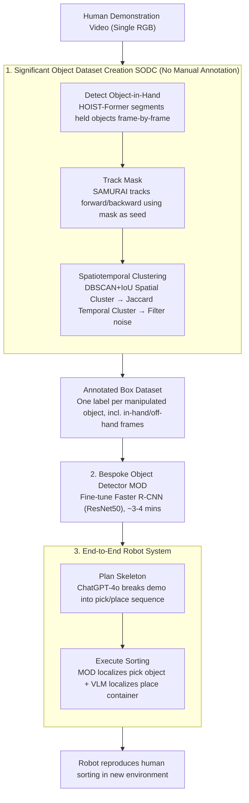

# Show, Don't Tell: Detecting Novel Objects by Watching Human Videos

**Conference**: CVPR 2026  
**arXiv**: [2603.12751](https://arxiv.org/abs/2603.12751)  
**Code**: None  
**Area**: Object Detection / Robotics  
**Keywords**: novel object detection, self-supervised, human demonstration, bespoke detector, robot manipulation

## TL;DR

Proposed the "Show, Don't Tell" paradigm—automatically creating training datasets and training bespoke object detectors by watching human demonstration videos. This approach completely bypasses language descriptions and prompt engineering, significantly outperforming SOTA open-set/closed-set detectors in novel object recognition within real-world robot scenarios.

## Background & Motivation

**Background**: In robot manipulation tasks, accurate identification and localization of target objects are prerequisites for executing operations such as grasping and assembly. Current object detection methods are mainly divided into two categories: closed-set detectors (YOLO, Faster R-CNN, etc.) perform well on predefined categories but cannot handle objects unseen in the training set; open-set detectors (VLM-based GroundingDINO, OWL-ViT) perform zero-shot detection via language descriptions, theoretically handling arbitrary objects.

**Limitations of Prior Work**: Closed-set detectors fail directly when facing out-of-distribution (OOD) novel objects, while open-set detectors, despite theoretical feasibility, face severe practical issues in deployment—requiring humans to meticulously write text prompts (prompt engineering) for every new object, which is both expensive and unreliable. Especially when distinguishing object instances that are similar in appearance but different in function (product different brands, tools of different colors), natural language struggles to provide sufficient discriminative power.

**Key Challenge**: Language has fundamental limitations as a medium for object description—it excels at category-level semantics ("a cup") but is extremely inefficient for precise instance-level identification. What is truly needed is a language-free adaptive object recognition method that can quickly learn to identify specific objects from a single human demonstration.

**Goal**: (1) How to automatically extract object information from human demonstration videos and construct training datasets? (2) How to quickly train a high-precision detector targeted at specific objects? (3) How to integrate the entire process into a real-world robot system for end-to-end deployment?

**Key Insight**: The authors observed that humans naturally display and manipulate target objects from multiple angles during demonstration. This process itself provides rich multi-view training data. Utilizing this "implicit supervision" can completely bypass the bottleneck of language descriptions.

**Core Idea**: Replace language descriptions with visual information from human demonstration videos, automatically creating training datasets to train bespoke object detectors, realizing the "Show, Don't Tell" paradigm for novel object recognition.

## Method

### Overall Architecture

"Show, Don't Tell" aims to avoid the reliance of open-set detectors on language prompts: instead of having humans write text descriptions for every new object, it lets humans "show" it—pick up and manipulate target objects within the robot's camera view, and the system learns to recognize them from the video. The pipeline is organized as a closed loop from demonstration to autonomous operation: humans first complete a sorting demonstration in front of the camera; the system uses the "Significant Object Dataset Creation (SODC)" pipeline to automatically crop the manipulated objects and generate labeled samples with bounding boxes; these samples are then used to fine-tune a "Bespoke Object Detector (MOD)" that recognizes only these specific objects; finally, it is integrated into the robot's perception-planning-execution loop. Crucially, the process requires no manual bounding box annotations or text descriptions—the demonstration action itself serves as both task demonstration and data collection.

### Key Designs

**1. Significant Object Dataset Creation (SODC): Treating "Human Grasping" as a Free Annotation Signal**

The difficulty lies in identifying target objects within a demonstration video containing backgrounds, hands, and clutter. SODC solves this in three steps. **Object-in-hand detection**: Uses the human-object interaction detector HOIST-Former to output segmentation masks of "objects being held" frame-by-frame—treating interaction as a saliency signal. Since HOIST-Former's cross-frame label association is noisy, frames are processed independently. **Mask tracking**: Masks from grasp frames are fed as "seeds" to the tracker SAMURAI, tracking each object forward and backward through the entire video (including non-manipulated frames), resulting in multiple tracks. **Spatiotemporal clustering/merging**: Masks are converted to bounding boxes. DBSCAN (using $IoU$ as distance) performs spatial clustering within each frame; then, temporal tracking consistency is refined using Jaccard similarity to merge trajectories of the same object and filter out noise clusters. The result is an annotated dataset featuring objects in both held and isolated states.

**2. Bespoke Object Detector (MOD): Training a "Small yet Specialized" Model for the Current Task**

Open-set models sacrifice instance-level precision for universal coverage. This method instead uses the SODC dataset to **fine-tune a pre-trained Faster R-CNN (ResNet50 backbone)**, optimizing standard RCNN losses (classification + box regression) to distinguish the specific target objects. Since it only recognizes a small number of categories with high-quality automated samples, training takes ~3–4 minutes on 4 T4 GPUs. Extensive data augmentation (flips, color jitter, cropping, blurring, affine transforms) compensates for small dataset diversity. This bespoke approach supports rapid online adaptation to new objects.

**3. End-to-End Robot System: From Single Demo to Autonomous Sorting Loop**

After a human demonstration, the system automatically processes the video: runs SODC, trains MOD, and **generates a plan skeleton**. ChatGPT-4o is used to parse the video into a sequence of pick/place actions, where "pick" targets use MOD IDs and "place" targets use semantic language names (e.g., "basket"). During execution, the robot uses the MOD to localize novel objects and an open-set VLM for containers that were not directly manipulated. This enables the robot to reproduce the sorting task in a new environment with different container placements.

## Key Experimental Results

### Main Results

| Method | Type | Novel Object Detection Accuracy | Instance Discriminative Power | Manual Prompting Requirement | End-to-end task completion rate |
|------|------|---------------|-------------|-------------|-----------------|
| Pre-trained YOLO | Closed-set | Extremely Low (OOD Failure) | None | None | Low |
| GroundingDINO | Open-set | medium | Weak (Prompt dependent) | High (Per-object) | Medium |
| OWL-ViT + CLIP | Open-set | Medium-Low | Weak | High (Detailed prompts) | Medium-Low |
| Few-shot Detector | Few-shot | Medium | Medium | Medium (Manual support set) | Medium |
| **Show, Don't Tell** | **Bespoke** | **Significantly Optimal** | **Strong (Instance-level)** | **Zero (Fully Auto)** | **Highest** |

### Ablation Study

| Configuration | Change in Detection Performance | Illustration |
|------|-------------|------|
| Full System | Baseline (Optimal) | Auto-dataset + Bespoke Detector + Multi-frame validation |
| Remove multi-frame consistency | Obvious Decrease | Increased label noise, lower data quality |
| Replace Bespoke with General VLM | Significant Decrease | General models lack instance-level discriminability |
| Reduce demo length (50%) | Slight Decrease | System is somewhat robust to data volume |
| Single-frame extraction only | Obvious Decrease | Multi-view coverage is critical for generalization |
| Remove data augmentation | Moderate Decrease | Affine transforms/jitter are vital for small datasets |

### Key Findings

- **"Show" significantly outperforms "Tell"**: Bespoke detectors vastly exceed color-based or language-based open-set methods, especially in distinguishing similar instances.
- **Automatic dataset quality is sufficient**: Spatiotemporal consistency validation provides high-quality labels capable of training high-performance detectors.
- **Rapid adaptability**: New objects require only a single human demonstration, with the entire pipeline from data creation to deployment completed in minutes.
- **Real-world robot validation**: High detection accuracy directly translates to higher task success rates in manipulation.
- **Multi-view coverage is key**: Ablation studies show that multi-frame extraction and multi-view data are vital for detector generalization.

## Highlights & Insights

- **Paradigm Innovation**: Shifting from "Tell" (language) to "Show" (visual) addresses a critical flaw in current VLMs—language is not the optimal interface for all visual tasks. Direct visual alignment is more natural for precise instance-level identification.
- **End-to-End Engineering Loop**: Covering the complete flow from acquisition and automated labeling to training and deployment provides high practical value.
- **"Specialized" over "General"**: In specific applications, a rapidly trained bespoke detector can be more effective than a massive general open-set model, offering a valuable counterpoint to current scaling trends.

## Limitations & Future Work

- **Lack of cross-scene knowledge transfer**: Every new task/object set requires retraining from scratch; meta-learning could accelerate convergence.
- **Reliance on demo video quality**: Performance is sensitive to lighting, occlusions, and how thoroughly the human displays the object.
- **Distinguishing near-identical objects**: Pure visual methods may struggle when instances are almost identical; spatial or sequence cues could be introduced.
- **Scalability**: Further study is needed for large-scale warehouse scenarios involving dozens of objects.

## Related Work & Insights

- **vs GroundingDINO / OWL-ViT**: These methods rely on text; Ours bypasses language. While open-set is better for category-level tasks, Ours is superior for instance-level precision.
- **vs Few-shot Object Detection (FSOD)**: FSOD requires manual support sets; Ours automates this via video.
- **vs Learning from Demonstration (LfD)**: LfD usually targets action policies; Ours extends the paradigm to the perception layer.

## Rating

- Novelty: ⭐⭐⭐⭐
- Experimental Thoroughness: ⭐⭐⭐
- Writing Quality: ⭐⭐⭐⭐
- Value: ⭐⭐⭐⭐

<!-- RELATED:START -->

## Related Papers

- [\[CVPR 2026\] Detecting Unknown Objects via Energy-Based Separation for Open World Object Detection](detecting_unknown_objects_via_energy-based_separation.md)
- [\[CVPR 2026\] ElasticFormer: Detecting Objects in HRW Shots via Elastic Computing Vision Transformer](elasticformer_detecting_objects_in_hrw_shots_via_elastic_computing_vision_transf.md)
- [\[CVPR 2026\] Toward Generalizable Whole Brain Representations with High-Resolution Light-Sheet Data](toward_generalizable_whole_brain_representations_with_high-resolution_light-shee.md)
- [\[CVPR 2026\] PHAC: Promptable Human Amodal Completion](phac_promptable_human_amodal_completion.md)
- [\[CVPR 2026\] NoOVD: Novel Category Discovery and Embedding for Open-Vocabulary Object Detection](noovd_novel_category_discovery_and_embedding_for_open-vocabulary_object_detectio.md)

<!-- RELATED:END -->
