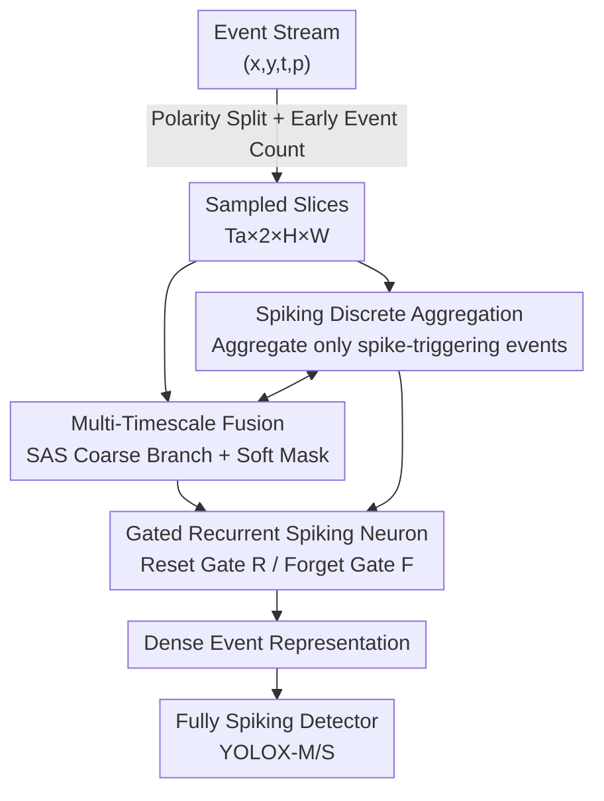

# Spike-driven Discrete Aggregation for Event-based Object Detection

**Conference**: CVPR 2026  
**Paper**: [CVF Open Access](https://openaccess.thecvf.com/content/CVPR2026/html/Li_Spike-driven_Discrete_Aggregation_for_Event-based_Object_Detection_CVPR_2026_paper.html)  
**Code**: None  
**Area**: Object Detection / Event Camera / Spiking Neural Networks  
**Keywords**: Event Camera, Spiking Neural Networks, Discrete Aggregation, Gated Recurrent Spiking Neuron, Multi-Timescale Fusion

## TL;DR
For event-based object detection, this paper proposes a "Discrete Aggregation" approach—utilizing the threshold-firing mechanism of spiking neurons to adaptively select and aggregate only informative events (SDA module + Gated Recurrent Spiking Neuron + Multi-Timescale Fusion). It achieves 43.4% mAP50:95 on Gen1 with fewer parameters, outperforming the previous fully spiking SOTA by 4.5%.

## Background & Motivation
**Background**: Event cameras record pixel-level brightness changes asynchronously, offering ultra-high dynamic range (>120 dB) and microsecond temporal resolution, which are particularly suitable for object detection under motion blur or extreme lighting. However, event streams are asynchronous and sparse, requiring "sampling into time intervals + aggregation into dense tensors (event representations)" before being fed into detection networks. Recent SOTA methods (RVT, SpikeYOLO, EAS-SNN, etc.) focus mostly on the high-level design of the backbone, while the event representation step typically employs simple Event Count.

**Limitations of Prior Work**: The authors categorize nearly all existing aggregation methods as **continuous aggregation**—accumulating **all** events within a sampling interval without filtering. For instance, ASTMNet uses TCN to process pixel-wise event sequences in full; EAS-SNN accumulates membrane potentials even if an event does not trigger a spike. The problem is that event streams are mixed with non-informative events (sensor noise, motion blur artifacts). Continuous aggregation forces this "garbage" into the representation, diluting discriminative spatio-temporal cues and hindering detection accuracy.

**Key Challenge**: Dense representations perform well but suffer from non-informative events due to continuous aggregation; sparse representations (GNN/SNN) are energy-efficient but lack precision. Neither side possesses an aggregation operator that is both **differentiable and selectively filtering**. Previous discrete selection methods like HOTS are selective but non-differentiable, preventing end-to-end optimization.

**Key Insight**: The authors observe that the spike-firing mechanism of SNNs is naturally a "discrete filter"—spikes are fired only when the accumulated membrane potential exceeds a threshold. Non-informative events fail to trigger spikes due to insufficient membrane potential. This aligns perfectly with the requirement for "discrely retaining informative events," and SNNs can be trained end-to-end using surrogate gradients.

**Core Idea**: Use the "firing state" of a spiking neuron to determine "whether to aggregate," coupling event selection and aggregation into a unified, differentiable operation, allowing high-level semantics from the downstream detection network to optimize the aggregation process.

## Method

### Overall Architecture
The objective is to design a **differentiable aggregation module** that achieves three goals: (1) adaptive discrete aggregation of informative events after sampling; (2) full utilization of spatio-temporal correlations; and (3) capturing features across multiple time scales to enhance representation.

The pipeline: The raw event stream is first split by polarity and undergoes early Event Count coarse aggregation (approximating µs events into $T_a$ slices with fixed resolution $\Delta t_a$). These slices are fed into the **Spiking Discrete Aggregation (SDA)** module, where each $(x,y,p)$ coordinate-polarity combination is assigned a **Gated Recurrent Spiking Neuron**. Only events that trigger a spike are accumulated into the representation. To compensate for the limitations of a single timescale, **Multi-Timescale Fusion (MTF)** incorporates a coarse-grained temporal branch (SAS) and uses its membrane potential to generate a soft mask for SDA. The final representation is fed into a **fully spiking detector** (fully spiking YOLOX-M/S).

### Key Designs

**1. Spiking Discrete Aggregation: Using Spike Firing as a Switch for Aggregation**

This is the core contribution addressing the weakness of continuous aggregation. In SDA, each spatial coordinate and polarity $(x,y,p)$ is assigned a LIF neuron. Given a sampled event set $\hat{E}$, an event is **selected for aggregation only if it drives its corresponding neuron to fire a spike**. Aggregation itself consists of accumulating the membrane potential $u$ of selected events. Formally, selection and aggregation are coupled:

$$g_{SDA}(x,y,p) = \sum_{\substack{(x_i,y_i,p_i,t_i)\in\hat{E}(x,y,p) \\ \land\, s_{t_i}(x_i,y_i,p_i)=1}} u_{t_i}(x_i,y_i,p_i)$$

where $s_t=\Theta(u_t - V_{thresh})$ is the firing state (Heaviside step function). Unlike the continuous accumulation in prior SNNs (termed Spiking Continuous Aggregation, SCA, by the authors), which accumulates potential even without spikes, SDA explicitly distinguishes event importance. By leveraging the LIF threshold mechanism, non-informative events are naturally filtered as their potential does not reach the threshold. The process is differentiable via BPTT + surrogate gradients, enabling joint training with the detector.

**2. Gated Recurrent Spiking Neuron (GRSN): Learnable Memory Gates for Importance Assignment**

Standard LIF neurons have simple "integrate-and-fire" dynamics using a constant decay factor $\tau$, which cannot adaptively decide what to remember or forget under noisy/sparse conditions. This work replaces $\tau$ with a learnable **Reset Gate R**:

$$u_t(x,y,p) = R_t(x,y,p)\cdot \hat{u}_{t-1}(x,y,p) + I_t(x,y,p)$$

When $R_t \to 0$, previous states and accumulated noise are discarded. Simultaneously, a **Forget Gate F** and recurrent connections are introduced for input current: $I_t = F_t\cdot I_{t-1} + c_t$, where $c_t = W_I^q q_t + W_I^s s_{t-1}$. Both gates are calculated via sigmoid based on current input and the previous spike: $R_t=\sigma(W_R^q q_t + W_R^s s_{t-1})$, $F_t=\sigma(W_F^q q_t + W_F^s s_{t-1})$. Spatial correlation is captured using $3\times3$ convolutions for weight mapping. GRSN is crucial for SDA to weigh events at different times—removing GRSN drops performance by over 2% mAP.

**3. Multi-Timescale Fusion (MTF): Injecting Coarse Cues via Soft Masking**

Event density correlates strongly with object velocity. To overcome the limitations of a single timescale, MTF incorporates an **SAS (SCA with Adaptive Sampling)** branch, which aggregates events continuously between two spikes (coarse-grained, interval $\Delta t_m \ge \Delta t_a$). Instead of unstable element-wise addition, SAS generates a soft mask from its membrane potential:

$$M_j(x,y,p) = \sigma\Big(\sum_{e_i\in\hat{E}^A_j(x,y,p)} u_{t_i}(x_i,y_i,p_i)\Big)$$

This mask modulates the GRSN current: $I_t = F_t\cdot I_{t-1} + M_j\cdot c_t$. The coarse timescale acts as an "interval-level importance modulator" for fine-grained SDA, providing multi-scale information without introducing interference. This improves mAP50:95 from 42.8% to 43.4%.

### Loss & Training
The framework uses fully spiking versions of YOLOX-M (25.3M) and YOLOX-S (8.9M). The Backbone, FPN, and Head are constructed using P-LIF and SEW-Residual blocks with 3 time steps. Training uses Adam optimizer with an initial learning rate of 0.002 and cosine decay. Data augmentation follows RVT and EAS-SNN. For Gen1, 240 ms of event stream prior to labels is used, with SDA slice interval $\Delta t_a=20$ ms and SAS interval $\Delta t_m=60$ ms.

## Key Experimental Results

### Main Results
Gen1 Results (DASNN uses SDA, DASNN-MTF uses SDA-MTF):

| Method | Repr. | Net | Params | mAP50:95 | mAP50 |
|------|------|------|------|----------|-------|
| EAS-SNN† | ARSNN | SNN | 25.3M | 37.5 | 69.9 |
| SpikeYOLO | HIST. | SNN | 23.1M | 38.9 | 67.2 |
| CREST | MESTOR | SNN | 7.61M | 36.0 | 63.2 |
| Ours (S) SDA | SDA | SNN | 8.9M | 39.9 | 69.9 |
| Ours (S) SDA-MTF | — | SNN | 8.9M | 40.5 | 70.5 |
| Ours (M) SDA | SDA | SNN | 25.3M | 42.8 | 72.6 |
| **Ours (M) SDA-MTF** | — | SNN | 25.3M | **43.4** | **73.1** |

DASNN-MTF(M) achieves 43.4% mAP50:95, 4.5% higher than the previous spiking SOTA (SpikeYOLO). The small model (8.9M) also outperforms SpikeYOLO by 1.6%. Compared to EAS-SNN with the same architecture, DASNN achieves +5.3% gain with half the representation parameters. Energy efficiency is 3.79× higher than ANNs.

### Ablation Study
Gen1 + Fully Spiking YOLOX-M:

| Config | GRSN | Mask | mAP50:95 | mAP50 | Note |
|------|------|------|----------|-------|------|
| Event Count | – | – | 32.3 | 58.0 | Common Repr. |
| Time Surface | – | – | 37.3 | 66.5 | Common Repr. |
| SCA Baseline | ✓ | – | 41.2 | 71.3 | Continuous Agg. |
| SDA | ✓ | – | 42.8 | 72.6 | Discrete Agg. +1.6 |
| SDA-MTF | ✓ | ✗ | 42.8 | 72.8 | Addition Fusion (No Gain) |
| SDA-MTF | ✗ | ✗ | 40.7 | 70.1 | w/o GRSN drops >2% |
| **SDA-MTF** | ✓ | ✓ | **43.4** | **73.1** | Soft Mask Modulation |

### Key Findings
- **Discrete vs. Continuous is a True Gain**: SDA outperforms SCA by +1.6% mAP50:95 at the same 20 ms resolution, proving the benefit comes from "selecting informative events" rather than higher resolution.
- **Soft Mask is Critical for MTF**: Direct addition of two representations does not improve performance (42.8→42.8), whereas modulation via soft masks from SAS membrane potentials reaches 43.4%.
- **Cross-Architecture Generality**: SDA/SDA-MTF consistently improves ANN detectors (YOLOX-S +8.4%, PVT-S +3.0%).
- **High-Speed Benefit**: Gains are most significant for fast-moving objects (Lv4 velocity: 42.5→44.0).
- **Noise Robustness**: SDA shows significantly smaller performance degradation under natural/random noise compared to SCA.

## Highlights & Insights
- **Turning SNN "Defects" into Features**: The spike threshold, originally a byproduct for low-power inference, is reinterpreted as a "natural filter" for non-informative events. This simultaneously satisfies the conflicting needs for discrete selection and differentiable aggregation.
- **Reusable GRSN Component**: The GRU-style reset/forget gates for LIF neurons provide learnable temporal memory, which is transferable to other SNN tasks like classification or action recognition.
- **Soft Mask Multi-scale Fusion**: When simple addition disrupts representation, using one branch's statistics to modulate the other is a robust alternative for multi-scale fusion.

## Limitations & Future Work
- **Hardware Constraints**: Due to current hardware, µs events are still approximated as fixed-resolution slices ($T_a\times2\times H\times W$), falling short of true asynchronous per-event processing.
- **Scale Selection**: MTF only explores two timescales ($\Delta t_a, \Delta t_m$); adaptive selection of more scales remains unexplored.
- **Generalization**: Evaluations are focused on vehicle/general event datasets; performance in complex scenes with longer temporal dependencies requires further validation.

## Related Work & Insights
- **vs. Continuous Aggregation (Event Count / EAS-SNN SCA)**: Prior works accumulate all events including noise. SDA uses spike firing as a gate to aggregate only informative events, resulting in +1.6% gain on Gen1 at equal resolution.
- **vs. HOTS**: HOTS also performs discrete selection (time-surface decay) but is non-differentiable. SDA solves this using surrogate gradients.
- **vs. SpikeYOLO / CREST**: These methods focus on backbone design while using simple event representations. This paper demonstrates that a superior representation layer can outperform complex backbones with fewer parameters.

## Rating
- Novelty: ⭐⭐⭐⭐⭐ Reinterpreting SNN thresholds as differentiable discrete filters is an elegant and rare concept.
- Experimental Thoroughness: ⭐⭐⭐⭐⭐ Three datasets, cross-SNN/ANN architectures, velocity-based analysis, and noise robustness tests.
- Writing Quality: ⭐⭐⭐⭐ Logic is clear, though SAS/masking details are dense.
- Value: ⭐⭐⭐⭐⭐ Highlights the importance of low-level event representation; components are highly transferable.

<!-- RELATED:START -->

## Related Papers

- [\[CVPR 2026\] Towards Persistence: Learning Topological Constraints for Event-based Small Object Detection](towards_persistence_learning_topological_constraints_for_event-based_small_objec.md)
- [\[CVPR 2026\] Black-Box Domain Adaptation for Object Detection with Retention-Driven Knowledge Compression](black-box_domain_adaptation_for_object_detection_with_retention-driven_knowledge.md)
- [\[CVPR 2026\] Beyond Duality: A Hybrid Framework of Leveraging Shared and Private Features for RGB-Event Object Detection](beyond_duality_a_hybrid_framework_of_leveraging_shared_and_private_features_for_.md)
- [\[CVPR 2026\] Reasoning-Driven Anomaly Detection and Localization with Image-Level Supervision](reasoning-driven_anomaly_detection_and_localization_with_image-level_supervision.md)
- [\[NeurIPS 2025\] FlexEvent: Towards Flexible Event-Frame Object Detection at Varying Operational Frequencies](../../NeurIPS2025/object_detection/flexevent_towards_flexible_event-frame_object_detection_at_varying_operational_f.md)

<!-- RELATED:END -->
## Related Papers

- [\[CVPR 2026\] Towards Persistence: Learning Topological Constraints for Event-based Small Object Detection](towards_persistence_learning_topological_constraints_for_event-based_small_objec.md)
- [\[CVPR 2026\] D2FANet: Enhancing Video Object Detection with Dual-Domain Feature Aggregation Network](d2fanet_enhancing_video_object_detection_with_dual-domain_feature_aggregation_ne.md)
- [\[CVPR 2026\] Black-Box Domain Adaptation for Object Detection with Retention-Driven Knowledge Compression](black-box_domain_adaptation_for_object_detection_with_retention-driven_knowledge.md)
- [\[CVPR 2026\] Beyond Duality: A Hybrid Framework of Leveraging Shared and Private Features for RGB-Event Object Detection](beyond_duality_a_hybrid_framework_of_leveraging_shared_and_private_features_for_.md)
- [\[CVPR 2026\] Reasoning-Driven Anomaly Detection and Localization with Image-Level Supervision](reasoning-driven_anomaly_detection_and_localization_with_image-level_supervision.md)

<!-- RELATED:END -->
