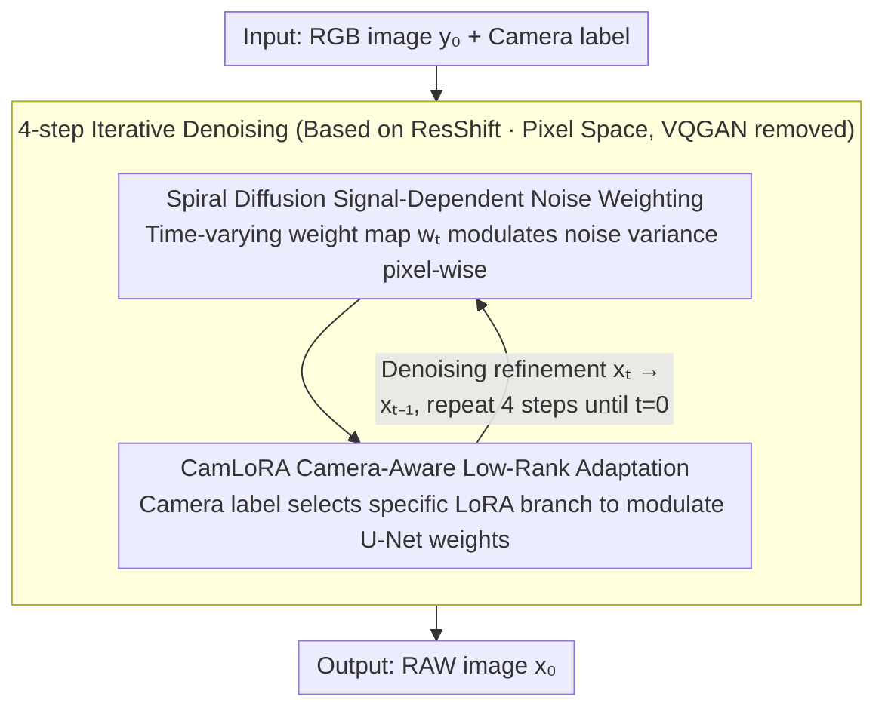

# SpiralDiff: Spiral Diffusion with LoRA for RGB-to-RAW Conversion Across Cameras

**Conference**: CVPR2026  
**arXiv**: [2603.14885](https://arxiv.org/abs/2603.14885)  
**Code**: [Chuancy-TJU/SpiralDiff](https://github.com/Chuancy-TJU/SpiralDiff)  
**Area**: Object Detection / Image Signal Processing  
**Keywords**: RGB-to-RAW, Diffusion models, Signal-dependent noise, LoRA, Cross-camera adaptation, Object detection

## TL;DR

The authors propose SpiralDiff, a diffusion framework for RGB-to-RAW conversion that employs a signal-dependent noise weighting strategy to adapt to reconstruction difficulties across different pixel intensity regions and introduces the CamLoRA module to achieve lightweight cross-camera adaptation within a single model.

## Background & Motivation

1.  **RAW images provide richer information**: RAW data preserves linear radiometric response and high dynamic range. Performing tasks like denoising, low-light enhancement, and object detection directly in the RAW domain yields superior results. However, the scale and diversity of RAW datasets are far inferior to RGB datasets.
2.  **Demand for RGB-to-RAW conversion**: Synthesizing RAW data from massive RGB datasets avoids expensive sensor data acquisition. Current methods, however, perform poorly in high-intensity regions (overexposed or non-linear tone mapping).
3.  **Reconstruction difficulty varies with pixel intensity**: In low-brightness regions, the RGB-RAW residual is small and stable, allowing for high-fidelity recovery. In high-brightness or overexposed regions, residuals are large with high variance (due to multiplicative digital gain and value clipping), making it difficult for a uniform strategy to manage both.
4.  **Significant differences in multi-camera ISPs**: ISP pipelines (demosaicing, white balance, tone mapping, etc.) differ significantly across cameras. Naive mixed training leads to performance degradation.
5.  **Limitations of metadata-based methods**: Methods relying on ISP parameters or sampled RAW pixels often lack access to metadata in real-world scenarios.
6.  **Deficiencies of existing metadata-free methods**: Methods such as CycleISP, InvISP, and ReRAW adopt global uniform reconstruction strategies without adaptive processing for signal-dependent characteristics and lack cross-camera adaptation capabilities.

## Method

### Overall Architecture

SpiralDiff addresses two persistent issues in RGB-to-RAW conversion: the difficulty caused by large residuals and high variance in high-brightness/overexposed regions due to multiplicative gain and clipping, and the performance degradation caused by ISP differences across cameras. It is built upon ResShift (an efficient residual shift diffusion model) and requires only 4 sampling steps. Taking an RGB image and a camera label as input, a U-Net with Swin Transformer layers iteratively denoises and refines the target RAW from noisy RAW estimates. The entire process operates directly in pixel space (removing VQGAN latent space compression as it is trained on RGB and unsuitable for RAW) and employs two designs: signal-dependent noise weighting and CamLoRA to handle intensity adaptation and cross-camera adaptation, respectively.

### Key Designs

**1. Spiral Diffusion Signal-Dependent Noise Weighting: Allocating Reconstruction Difficulty by Pixel Intensity**

RGB pixel intensity is positively correlated with RGB-RAW residuals—dark regions have small, stable residuals for high-fidelity recovery, while bright regions have large residuals and uncertainty. SpiralDiff introduces a time-varying weight map $\mathbf{w}_t = \mathbf{x}_0 + \eta_t \mathbf{e}_0$ (approaching RGB $\mathbf{y}_0$ at $t=T$ and RAW $\mathbf{x}_0$ at $t=0$, enabling a smooth transition). In the forward process, $\mathbf{w}_t^2$ is used to modulate the noise variance of ResShift's isotropic Gaussian noise pixel-wise: low noise in dark areas ensures fidelity, while high noise in bright areas grants the model greater generative freedom. In the reverse process, the mean $\boldsymbol{\mu}_{t-1}$ remains a convex combination of denoising and clean terms, but the mixing coefficient $\boldsymbol{\gamma}_t$ depends on the spatial weight map, achieving pixel-adaptive fusion. When $\mathbf{w}_t \equiv 1$, it reduces to standard ResShift. Ablations show that static RGB weighting is even worse than the uniform baseline, proving that the "time-varying" aspect is critical.

**2. CamLoRA Camera-Aware Low-Rank Adaptation: Lightweight Adaptation for Multiple Cameras**

ISP pipelines vary significantly across cameras, and mixed training can cause mutual interference. CamLoRA adds camera-specific low-rank updates $\Delta \mathbf{W}_i = \mathbf{B}_i \mathbf{A}_i$ (rank $r=8$) to the $\mathbf{W}_q, \mathbf{W}_k, \mathbf{W}_v, \mathbf{W}_o$ layers of the Swin Transformer within the U-Net. During training, the shared backbone is updated using all data, while only the LoRA branch corresponding to the current camera label receives gradients. Extra parameters account for only 2.7% (1.05M), with one set of adapters per camera. It natively supports few-shot expansion—after pre-training a unified model, only one LoRA branch needs fine-tuning for a new camera. It reaches 42.85 dB PSNR with 1-shot learning, whereas training from scratch only achieves 39.83 dB.

### Loss & Training

Following the objective of ResShift: the network $f_\theta(\mathbf{x}_t, \mathbf{y}_0, t)$ is trained to predict $\mathbf{x}_0$, optimized via diffusion loss.

## Key Experimental Results

### Main Results — Quantitative Comparison Across Four Datasets

| Method | FiveK Canon | FiveK Nikon | NOD Nikon | NOD Sony |
|------|------------|------------|-----------|----------|
| CycleISP | 37.93 / 0.9913 | 40.18 / 0.9920 | 50.11 / 0.9985 | 46.57 / 0.9975 |
| InvISP | 36.81 / 0.9814 | 34.30 / 0.9163 | 48.29 / 0.9954 | 44.76 / 0.9922 |
| RAW-Diffusion | 39.96 / 0.9890 | 39.68 / 0.9866 | 50.52 / 0.9954 | 47.31 / 0.9908 |
| **SpiralDiff** | **42.82 / 0.9936** | **41.72 / 0.9925** | **53.64 / 0.9990** | **50.46 / 0.9980** |
| +CamLoRA (Merged) | 42.46 / 0.9934 | 43.82 / 0.9950 | 52.62 / 0.9988 | 50.08 / 0.9977 |

> SpiralDiff outperforms SOTA across the board in independent training settings, with PSNR gains of **+2.86 dB** (FiveK Canon) and **+3.12 dB** (NOD Nikon) over RAW-Diffusion.

### Overexposed Test Set Comparison

| Method | FiveK Canon PSNR | NOD Nikon PSNR |
|------|-----------------|----------------|
| RAW-Diffusion | 30.60 | 40.05 |
| **SpiralDiff** | **31.10** | **40.79** |

### Ablation Study

| Noise Weighting Strategy | FiveK Canon PSNR | NOD Nikon PSNR |
|-------------|-----------------|----------------|
| Baseline (Uniform Noise) | 41.40 | 53.48 |
| Static $\mathbf{y}_0$ Weighting | 40.06 | 53.42 |
| **Time-varying $\mathbf{w}_t$ Weighting** | **42.82** | **53.64** |

- Static RGB weighting performs worse than the baseline, verifying the necessity of time-varying weight maps.
- CamLoRA vs. Direct Camera Embedding: The embedding approach performs worse than the unconditional baseline, while CamLoRA effectively improves performance by approx. +0.5 dB.
- Plugin Experiment: Replacing the DDPM in RAW-Diffusion with SpiralDiff results in a PSNR improvement of +1.57 dB (FiveK Canon).

### Downstream Object Detection

| Training Data | NOD Nikon AP | NOD Sony AP |
|---------|-------------|-------------|
| RGB-only | 19.1 | 19.7 |
| RAW-only (100 samples) | 18.4 | 17.6 |
| RAW + BDD-RAW (Synthetic) | **26.7** | **29.0** |

> Synthetic RAW data significantly enhances object detection performance in low-data scenarios (+8.3/+11.4 AP gain).

## Highlights & Insights

1.  The **signal-dependent noise scheduling** concept is novel and intuitive—less noise in dark areas preserves details, while more noise in bright areas increases flexibility, aligning perfectly with physical characteristics.
2.  **CamLoRA** achieves a unified cross-camera model with only 2.7% parameter overhead and supports rapid few-shot adaptation to new cameras.
3.  **4-step sampling** provides high inference efficiency and practical utility.
4.  Comprehensive experiments: 4 datasets + overexposure testing + real ISP + downstream detection + thorough ablation.
5.  Significant improvements when used as a plugin for RAW-Diffusion demonstrate the versatility of SpiralDiff.

## Limitations & Future Work

1.  The design of the weight map $\mathbf{w}_t$ depends on the ground-truth $\mathbf{x}_0$, requiring network prediction during inference, which may introduce error accumulation.
2.  CamLoRA was validated on only 4 cameras; scalability to much larger camera pools (dozens of sensors) remains to be investigated.
3.  Pixel-space diffusion involves high computational overhead for high-resolution images; latent space acceleration has not yet been explored.
4.  Downstream detection experiments used a simple setup of 100 real RAW images + synthetic augmentation; effectiveness in larger-scale scenarios needs further validation.
5.  Noise weighting only considers pixel intensity and excludes structural information like spatial texture complexity.

## Related Work & Insights

| Dimension | CycleISP / InvISP | RAW-Diffusion | SpiralDiff |
|------|-------------------|---------------|------------|
| Noise Type | Non-diffusion | DDPM Isotropic | Signal-dependent time-varying |
| Cross-camera Support | No | No | CamLoRA |
| Sampling Steps | — | ~1000 | 4 |
| Overexposure Handling | Poor | Average | Good (Adaptive noise) |
| Few-shot | Not supported | Not supported | Supported (LoRA fine-tuning) |

## Rating

- Novelty: ⭐⭐⭐⭐ — Novel combination of signal-dependent noise, time-varying weight maps, and CamLoRA.
- Experimental Thoroughness: ⭐⭐⭐⭐⭐ — 4 datasets + overexposure / real ISP / downstream detection / ablation / plugin experiments.
- Writing Quality: ⭐⭐⭐⭐ — Clear motivation, complete formula derivation, and intuitive illustrations.
- Value: ⭐⭐⭐⭐ — Practical application value for RAW domain data augmentation and cross-camera adaptation.

<!-- RELATED:START -->

## Related Papers

- [\[CVPR 2026\] InvAD: Inversion-based Reconstruction-Free Anomaly Detection with Diffusion Models](invad_inversion-based_reconstruction-free_anomaly_detection_with_diffusion_model.md)
- [\[CVPR 2025\] Towards RAW Object Detection in Diverse Conditions](../../CVPR2025/object_detection/towards_raw_object_detection_in_diverse_conditions.md)
- [\[CVPR 2026\] Beyond Duality: A Hybrid Framework of Leveraging Shared and Private Features for RGB-Event Object Detection](beyond_duality_a_hybrid_framework_of_leveraging_shared_and_private_features_for_.md)
- [\[CVPR 2026\] UAV-CB: A Complex-Background RGB-T Dataset and Local Frequency Bridge Network for UAV Detection](uav-cb_a_complex-background_rgb-t_dataset_and_local_frequency_bridge_network_for.md)
- [\[ICCV 2025\] Diffusion Curriculum: Synthetic-to-Real Data Curriculum via Image-Guided Diffusion](../../ICCV2025/object_detection/diffusion_curriculum_synthetic-to-real_data_curriculum_via_image-guided_diffusio.md)

<!-- RELATED:END -->
