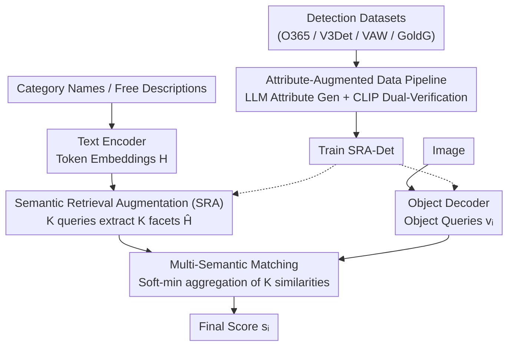

# SRA-Det: Learning Omni-Grained Open-Vocabulary Detection Beyond Category Names

**Conference**: CVPR 2026  
**Paper**: [CVF Open Access](https://openaccess.thecvf.com/content/CVPR2026/html/Yang_SRA-Det_Learning_Omni-Grained_Open-Vocabulary_Detection_Beyond_Category_Names_CVPR_2026_paper.html)  
**Code**: None  
**Area**: Object Detection / Open-Vocabulary Detection  
**Keywords**: Open-vocabulary detection, fine-grained recognition, semantic retrieval, soft-min matching, attribute-augmented data

## TL;DR
Addressing the issue where open-vocabulary detectors only match "category names" and remain insensitive to fine-grained attributes like color, material, and pattern, SRA-Det uses learnable retrieval queries to extract multiple semantic "facets" from text tokens. It employs soft-min matching as a "logic AND" to ensure all facets are satisfied. Combined with an attribute-augmented pipeline that uses LLMs for generation and CLIP for dual-verification, SRA-Det achieves 54.9 mAP on FG-OVD and maintains 40.4 AP on LVIS under zero-shot settings.

## Background & Motivation

**Background**: The mainstream approach for Open-Vocabulary Detection (OVD) leverages vision-language pre-training (e.g., CLIP) to align region features with text embeddings, enabling the recognition of arbitrary categories beyond the training vocabulary. Models like GLIP, GroundingDINO, OWL-ViT, YOLO-World, MM-GDINO, and LLMDet have demonstrated strong zero-shot generalization on COCO and LVIS.

**Limitations of Prior Work**: These methods and their evaluations remain at the "coarse-grained category" level—as long as the box matches the category, it is considered correct, regardless of whether the model truly understands fine-grained attributes in the description. Consequently, a detector that finds "a dog" might fail to distinguish "a dog with gray and white fur and blue eyes"; one that finds "a knife" might miss "a grey metal knife with a black plastic handle." Benchmarks like FG-OVD use "hard negative" descriptions differing by only one or two attributes to challenge detectors, where mainstream models exhibit significant performance drops.

**Key Challenge**: The root cause is that existing methods **compress the entire description into a single final text vector**. Even models like NoctOWL and HA-FGOVD, which have begun to emphasize attributes, eventually fuse attribute information linearly into a global vector. Once collapsed into a single vector, strong category semantics dominate attribute clues, allowing "partially matched" objects (violating one or two key attributes) to still receive high scores.

**Goal**: The authors decompose the problem into two sub-problems: (i) how text should be represented for visual matching, and (ii) how to obtain fine-grained attribute supervision at low cost on large-scale detection data.

**Key Insight**: A correct detection must **simultaneously** satisfy all semantic clues mentioned in the description. Therefore, the matching score should be a "logical AND" of these clues, rather than a weighted sum where weak attributes are masked by strong category signals. The prerequisite for an "AND" operation is explicitly decomposing the description into multiple facets for individual verification.

**Core Idea**: Use a small set of learnable retrieval queries to "retrieve" multiple complementary semantic facets from token-level text features, then use a differentiable soft-min to aggregate facet similarities. This ensures that any mismatched attribute significantly lowers the total score. Simultaneously, an LLM+CLIP pipeline automatically generates attribute supervision to feed this mechanism.

## Method

### Overall Architecture
SRA-Det consists of two complementary components: the **model side** replaces single-vector text representation with "multi-semantic facets + soft-min matching" to solve "how to represent and verify text"; the **data side** uses an automated pipeline to add dense visual attribute labels to large-scale detection data, solving "where fine-grained supervision comes from."

The model itself is a DETR-style dual-stream structure: an image encoder and object decoder produce $N$ object queries $v_i$, while a text encoder encodes category names or free-form descriptions into token embeddings. The key modification occurs in the text branch: the **Semantic Retrieval Augmentation (SRA)** module uses $K$ queries to extract $K$ semantic facets $\hat h_k$ from token embeddings. During inference, the **Multi-Semantic Matching** module calculates the similarity between each object query and these $K$ facets, aggregating them into a final score $s_i$ via soft-min. The training data is enriched by the **Attribute-Augmented Data Pipeline** before being fed into the detector.

### Key Designs

**1. Semantic Retrieval Augmentation (SRA): Decomposing a description into complementary facets**

This specifically addresses the issue of category semantics drowning out attributes in single-vector representations. The module takes $K$ retrieval queries $Q=\{q_1,\dots,q_K\}$ (set to $K=3$ in the paper) and text token sequences $H=\{h_1,\dots,h_L\}$ (from the last layer of the text encoder, excluding [SOS]/[EOS]). Each query uses attention to "read" these tokens and extract a semantic facet: $r_k=\mathrm{Attention}(q_k,H,H)$. To ensure different queries attend to different parts, the authors equip each query with learnable positional embeddings $p_k$ and inject the previous retrieval result as context for the next: $q_k=\mathrm{LN}(r_{k-1}+p_k)$, where the initial query is the global average pool $r_0=\mathrm{AvgPool}(H)$. This "query-by-query conditioning" ensures facets extract complementary information progressively.

The extracted $r_k$ is fused with the global text embedding $h_{\mathrm{eos}}$: $h'_k=h_{\mathrm{eos}}+r_k$, $h_k=h'_k+\mathrm{MLP}(\mathrm{LN}(h'_k))$, and finally projected and L2-normalized to obtain the multi-semantic representation $\hat H=\{\hat h_1,\dots,\hat h_K\}$. To ensure these $K$ facets are both diverse and comprehensive, two regularizations are applied to the attention maps $A=\{a_1,\dots,a_K\}$: a diversity loss $\mathcal L_{\mathrm{div}}=\frac{1}{K(K-1)}\sum_{i\neq j}\langle a_i,a_j\rangle^2$ to minimize overlap between queries, and a coverage loss $\mathcal L_{\mathrm{cov}}=\frac1L\sum_{j=1}^L\big(\frac1K\sum_{i=1}^K a_{i,j}-\frac1L\big)^2$ to encourage all valid tokens to be attended to.

**2. Multi-Semantic Matching (Soft-min): Differentiable logic AND for attribute satisfaction**

With $K$ semantic facets, how can they be aggregated to reflect "all must be satisfied"? For each object query $v_i$, similarities with each facet are computed: $s_{i,k}=\langle v_i,\hat h_k\rangle$. While a hard minimum $\min_k s_{i,k}$ represents a "logical AND" (veto power), it is non-differentiable and only propagates gradients to the minimum item, which can cause training collapse. The authors use soft-min instead:

$$s_i=-\tau\log\sum_{k=1}^{K}\exp\!\Big(-\frac{s_{i,k}}{\tau}\Big)+\tau\log K$$

When facet scores are close, it behaves like an average; when one score is significantly low, it approaches the minimum. Thus, a single mismatched attribute (e.g., mistaking "metal" for "rattan") is sufficient to drag down the overall score. This "short-board effect" is the fundamental difference from standard single-vector dot products, where weak attributes can be averaged out by strong category scores.

**3. Attribute-Augmented Data Pipeline: LLM generation and CLIP dual-verification**

A detector requires fine-grained supervision. Large-scale OVD datasets often lack attribute labels. To avoid high manual labeling costs and MLLM hallucinations, the pipeline follows three steps: (1) **Category-prior attribute generation**: LLM (DeepSeek V3.1) generates candidate visual attributes restricted to discriminative pure visual traits (color, shape, part, material, etc.). (2) **CLIP feature extraction**: RoI crops are passed through the CLIP image encoder with augmentations (padding and flipping) to obtain robust visual features $\hat f_{roi}$. Textual descriptions are encoded using multiple templates to get $\hat f^d_{attr}$ and $f^c_{attr} = \mathrm{norm}(f_{attr} + f_{class})$. (3) **Dual-verification labeling**: Only attributes where $s^d_{attr}>\max(s_{class},\gamma)$ and $s^c_{attr}>\max(s_{class},\gamma)$ are retained, ensuring attribute scores exceed the baseline category score.

### Loss & Training
The objective follows DETR-style detectors with the added regularizations:

$$\mathcal L=\mathcal L_{\mathrm{align}}+\mathcal L_{\mathrm{align\_des}}+\mathcal L_{\mathrm{box}}+\mathcal L_{\mathrm{GIoU}}+\mathcal L_{\mathrm{div}}+\mathcal L_{\mathrm{cov}}$$

Where $\mathcal L_{\mathrm{align}}$ and $\mathcal L_{\mathrm{align\_des}}$ are alignment losses for category names and augmented descriptions, respectively. The backbone is Swin-T, with Open-CLIP ViT-B/16 as the text encoder. Training is conducted with $K=3$, batch size 256, over 12 epochs.

## Key Experimental Results

### Main Results
In zero-shot settings, SRA-Det (Swin-T) achieves 54.9 mAP across eight FG-OVD sub-datasets, outpacing OWL-ViT(L/14) by 13.8 mAP and even exceeding the fine-tuned NoctOWLv2(L/14). It maintains 40.4 AP on LVIS minival.

| Benchmark | Metric | SRA-Det (Swin-T) | Comparison | Gain |
|------|------|------|----------|------|
| FG-OVD (Zero-shot, Avg 8 sets) | mAP | **54.9** | OWL-ViT(L/14) 41.1 | +13.8 |
| LVIS minival (Zero-shot) | AP | **40.4** | YOLO-World-L 35.4 | +5.0 |
| LVIS minival (Zero-shot) | AP | 40.4 | GroundingDINO 27.4 | +13.0 |
| FG-OVD (Fine-tuned) | mAP | **67.8** | GUIDED 66.4 | +1.4 |

Compared to MLLMs, SRA-Det (0.116B params) achieves a higher F1 (46.29) and Recall (51.71) on FG-OVD than Qwen3-VL-2B (2B) and Rex-Omni (4B), demonstrating superior parameter efficiency.

### Ablation Study

| Configuration | LVIS AP | FG-OVD Hard | Explanation |
|------|---------|-------------|------|
| V3Det only | 27.6 | 25.3 | Baseline |
| + Attr-Aug Data | 27.9 (+0.3) | 30.3 (+5.0) | Automated supervision |
| + VAW | 28.5 (+0.6) | 43.1 (+12.8) | Real attribute data impact |
| + O365 & GoldG | 40.4 (+11.9) | 45.2 (+2.1) | Massive data for category-level |
| w/o SRA | 28.5 | 40.8 | Removing facet-based retrieval |
| w/ SRA (Full) | 28.5 | 43.1 (+2.3) | Fine-grained improvement |

### Key Findings
- **SRA targets fine-grained needs**: Adding SRA kept LVIS AP at 28.5 while boosting FG-OVD Hard from 40.8 to 43.1, confirming that single vectors suffice for categories, but multiple facets are required for fine-grained verification.
- **Real data outperforms synthetic**: While automated data provided +5.0 mAP on FG-OVD Hard, real attribute data (VAW) provided +12.8 mAP, highlighting that explicit visual attribute supervision is the bottleneck.
- **Large detection sets primarily assist category levels**: O365 & GoldG significantly boosted LVIS (+11.9) but only marginally improved FG-OVD Hard (+2.1).

## Highlights & Insights
- **Differentiable Logic AND**: The soft-min operator smoothly interpolates between "average" and "minimum," allowing the model to punish partial matches while maintaining stable gradient flow.
- **Progressive Query Conditioning**: Initializing subsequent queries with previous results allows $K$ facets to be complementary rather than redundant, yielding a stable +0.8 mAP gain.
- **Robust Pipeline**: The "pure visual attribute + dual CLIP verification + higher than category score" filtering mechanism effectively mitigates LLM hallucinations and CLIP noise.

## Limitations & Future Work
- The pipeline's reliance on LLM generation and CLIP verification is imperfect and can introduce bias or noise. Performance remains limited for rare or ambiguous attributes with subtle visual evidence.
- The use of a fixed $K=3$ might not be optimal for long descriptions with many attributes. Future work could investigate adaptive $K$ or long-tail attribute reweighting.

## Related Work & Insights
- **vs HA-FGOVD / NoctOWL**: Whereas previous works still fuse attributes into a single vector (allowing category signals to mask attribute violations), SRA-Det uses distinct facets and soft-min to ensure an "all-or-nothing" satisfaction.
- **vs GUIDED**: GUIDED uses a three-stage pipeline (subject recognition, coarse detection, attribute discrimination). SRA-Det integrates multi-attribute consistency directly into the matching mechanism in an end-to-end fashion.
- **vs LLMDet / MM-GDINO**: These focus on scaling category-level AP via MLLM fine-tuning. SRA-Det focuses on fine-grained precision, outperforming them significantly on attribute-heavy benchmarks.

## Rating
- Novelty: ⭐⭐⭐⭐ Introducing "multi-semantic facets + soft-min AND" to OVD is clear and effective.
- Experimental Thoroughness: ⭐⭐⭐⭐ Coverage of LVIS/FG-OVD/OmniLabel plus extensive MLLM comparisons.
- Writing Quality: ⭐⭐⭐⭐ Logical flow and clear coupling between formulas and diagrams.
- Value: ⭐⭐⭐⭐ Addresses the coarse-to-fine gap in OVD with reusable matching and data paradigms.

<!-- RELATED:START -->

## Related Papers

- [\[CVPR 2026\] Consistency Beyond Contrast: Enhancing Open-Vocabulary Object Detection Robustness via Contextual Consistency Learning](consistency_beyond_contrast_enhancing_open-vocabulary_object_detection_robustnes.md)
- [\[CVPR 2026\] NoOVD: Novel Category Discovery and Embedding for Open-Vocabulary Object Detection](noovd_novel_category_discovery_and_embedding_for_open-vocabulary_object_detectio.md)
- [\[CVPR 2026\] Thermal-Det: Language-Guided Cross-Modal Distillation for Open-Vocabulary Thermal Object Detection](thermal-det_language-guided_cross-modal_distillation_for_open-vocabulary_thermal.md)
- [\[CVPR 2026\] WeDetect: Fast Open-Vocabulary Object Detection as Retrieval](wedetect_fast_open-vocabulary_object_detection_as_retrieval.md)
- [\[CVPR 2026\] ViTPrompt: Training-Free Prompt Refinement with Visual Tokens for Open-Vocabulary Detection](vitprompt_training-free_prompt_refinement_with_visual_tokens_for_open-vocabulary.md)

<!-- RELATED:END -->
