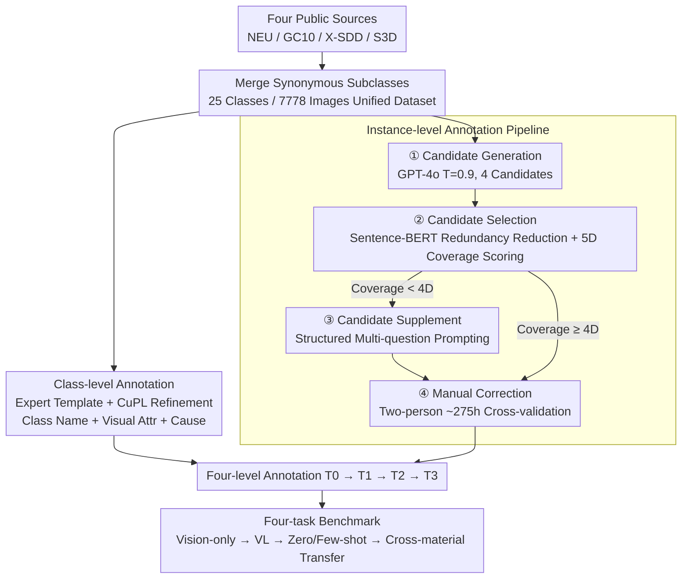

# SteelDefectX: A Coarse-to-Fine Vision-Language Dataset and Benchmark for Generalizable Steel Surface Defect Detection

**Conference**: CVPR 2026  
**arXiv**: [2603.21824](https://arxiv.org/abs/2603.21824)  
**Code**: [https://github.com/Zhaosxian/SteelDefectX](https://github.com/Zhaosxian/SteelDefectX)  
**Area**: Object Detection  
**Keywords**: Steel surface defect detection, vision-language dataset, coarse-to-fine annotation, zero-shot transfer, industrial quality inspection

## TL;DR

SteelDefectX is introduced as the first vision-language dataset for steel surface defect detection (7,778 images, 25 defect types), featuring coarse-to-fine text annotations from class-level to instance-level. A benchmark covering four tasks—vision-only classification, vision-language classification, zero/few-shot recognition, and zero-shot transfer—is established. Experiments demonstrate that high-quality text annotations significantly improve model interpretability, generalization, and cross-domain transfer capabilities.

## Background & Motivation

**Background**: Steel surface defect detection is a critical step in ensuring product quality in industrial manufacturing. Existing methods primarily rely on basic image classification or object detection models (ResNet, ViT, etc.) and have achieved high classification accuracy on specific datasets. Public datasets like NEU (6 classes, 1,800 images), GC10 (10 classes, 2,312 images), X-SDD (7 classes, 1,360 images), and S3D (5 classes, 880 images) have advanced this field.

**Limitations of Prior Work**: (1) Existing datasets only provide category labels or numerical annotations, lacking descriptive text and limiting the application of vision-language models (VLMs) in industry; (2) Simple class-name prompt templates (e.g., "A photo of scratches") fail to capture the rich visual variations of steel defects—where the same manufacturing process can produce vastly different visual patterns on different materials; (3) There is a lack of evaluation benchmarks for cross-material and cross-dataset generalization.

**Key Challenge**: While VLMs (like CLIP) exhibit strong zero-shot capabilities in natural images, their direct application to industrial defect data is poor (merely 14.8% zero-shot accuracy at best), fundamentally due to the lack of professional industrial image-text pairs.

**Goal**: (1) Construct the first steel defect vision-language dataset with professional coarse-to-fine text annotations; (2) Establish a standardized benchmark covering multiple scenarios to evaluate VLM performance in industrial inspection; (3) Verify the effectiveness of high-quality text annotations in enhancing generalization and transfer capabilities.

**Key Insight**: Industrial defect detection requires not just category labels but also semantic understanding of defect types, visual attributes, and causes—an area where VLMs excel, provided high-quality image-text data is available.

**Core Idea**: By constructing coarse-to-fine vision-language annotations (class-level: defect type + visual attributes + causes; instance-level: shape + size + depth + location + contrast), industrial defect detection is elevated from pure vision classification to a vision-language semantic understanding task.

## Method

### Overall Architecture

The core contribution of SteelDefectX lies in the dataset and benchmark rather than a new model architecture. The methodology addresses three engineering questions: the source of images, the generation of text annotations, and the tasks used to validate the annotations. The process begins by aggregating images from four public sources (NEU, GC10, X-SDD, S3D), merging semantically similar subcategories into a unified dataset of 25 classes and 7,778 images. Two levels of text granularity are assigned: class-level descriptions written by domain experts characterizing commonalities, and instance-level descriptions automatically generated by GPT-4o and refined by humans to capture specific morphology. Finally, a four-task benchmark (vision-only → vision-language → zero/few-shot → cross-material transfer) evaluates the incremental gains provided by the annotations.

### Key Designs

**1. Class-level Annotation: Consistent Semantic Anchors across Samples**

A single class name (e.g., "scratches") is too sparse for VLMs to align with real visual patterns of defects. Class-level annotations decompose each category into three semantic components: defect name (e.g., "punching"), representative visual attributes (e.g., "circular holes"), and possible industrial causes (e.g., "equipment malfunction"). Domain experts first write initial templates based on steel manufacturing knowledge, which are then refined using candidates generated via the CuPL method to form natural language sentences. These descriptions provide stable conceptual anchors in semantic space for each defect type, helping the model understand "what it looks like and why it occurs."

**2. Instance-level Annotation Pipeline: Auto-generation + Structured QA + Manual Refinement**

Class-level descriptions cannot handle intra-class visual variation. A dedicated fine-grained description is required for each image. To balance cost and quality, a four-step pipeline is used. First is **Candidate Generation**, using GPT-4o with a high temperature (0.9) to generate four diverse candidates. This is followed by **Candidate Selection**, where Sentence-BERT calculates cosine similarity to keep at most three distinct descriptions. Each is scored for "semantic coverage" via a 5-bit vector $\mathbf{b}=[b_1,\dots,b_5]$ (representing shape, size, depth, location, and contrast). The comprehensive score is:

$$S(d_i) = 0.6\cdot\frac{\lVert b_i\rVert_1}{5} + 0.4\cdot D(d_i)$$

where diversity $D(d_i)$ ensures variety and coverage $\lVert b_i\rVert_1$ ensures information density. If no candidate covers $\geq 4$ dimensions, **Candidate Supplement** is triggered using structured prompts to fill missing info. Finally, **Manual Correction** is performed by two annotators over 275 hours.

**3. Four-task Benchmark: Quantifying Incremental Gains**

The benchmark consists of four increasingly difficult scenarios sharing the same four levels of annotation (T0: class template, T1: class-level, T2: GPT-4o-generated, T3: manually refined). Task 1 (vision-only) uses ResNet/ViT with a linear head as a baseline. Task 2 (vision-language classification) uses CLIP with Adapter fine-tuning, training on T3 while testing on T0 to test semantic transfer. Task 3 (zero/few-shot) compares T0 and T3 across 1/2/4/8-shot settings. Task 4 (zero-shot transfer) tests models trained on steel data directly on aluminum (MSD-Cls) and seamless steel tube (CGFSDS-9) defects.

### Loss & Training

Vision-only classification utilizes SGD (momentum 0.9, weight decay 1e-4), initial learning rate 0.1 (decayed 10× every 30 epochs), for 100 epochs. Vision-language classification adopts the CLIP-Adapter framework with Adam (lr=1e-4), symmetric cross-entropy loss, for 20 epochs. Data is split 7:3 for training/testing.

## Key Experimental Results

### Main Results

Vision-only Classification (Task 1):

| Model | Acc (%) | mAcc (%) |
|------|---------|----------|
| ShuffleNetV2 | 96.34 | 94.98 |
| ResNet-101 | 93.63 | 91.19 |
| ViT-B/16 | 44.84 | 40.31 |

Vision-language Classification (Task 2, Train T3/Test T0):

| Model | Backbone | Acc (%) | mAcc (%) |
|------|----------|---------|----------|
| Long-CLIP | ViT-L/14 | **93.63** | **92.56** |
| OpenCLIP | ViT-L/14 | 88.21 | 87.54 |
| CLIP | ViT-B/16 | 81.84 | 81.14 |

Zero-shot Transfer (Task 4, Long-CLIP ViT-L/14):

| Annotation Level | Aluminum Acc | Steel Tube Acc |
|---------|-----------|-------------|
| Zero-shot | 8.60 | 25.11 |
| T0 (Class Name) | 12.90 | 28.31 |
| T1 (Class-level) | 20.43 | 33.79 |
| T2 (GPT-4o) | 25.27 | 34.25 |
| T3 (Manual Refined) | **29.03** | **40.18** |

### Ablation Study

Comparison of annotation levels (Zero-shot Recognition Task 3):

| Annotation Level | SteelDefectX Zero-shot Acc |
|---------|----------------------|
| T0 (Class Template) | 7.57 |
| T1 (Class-level) | 11.27 |

Few-shot recognition vs. shot count:

| Method | 1-shot | 8-shot |
|------|--------|--------|
| Long-CLIP-Adapter (T0) | ~60% | ~88% |
| Tip-Adapter-F (T0) | ~55% | ~85% |

### Key Findings

- **ViT severely underfits on small datasets**: ViT-B/16 yielded only 44.84%, far below CNNs (ShuffleNetV2 96.34%), as CNN inductive bias is advantageous on small datasets.
- **Annotation level monotonically improves transfer performance**: Accuracy on aluminum increased from 12.90% to 29.03% across T0→T1→T2→T3, showing that annotation quality determines cross-domain transfer.
- **Long-CLIP performs best in VL classification**: Achieving 93.63% accuracy, it rivals pure vision CNNs and shows better robustness on long-tail classes (smaller Acc-mAcc gap).
- **Pre-trained VLMs perform poorly on industrial defects**: Zero-shot CLIP achieved only 7.57%, highlighting the gap between natural image pre-training and industrial defect domains.
- Heatmap visualizations show that T3 annotations allow the model to focus precisely on defect regions, whereas T0 annotations result in scattered attention.

## Highlights & Insights

- **5D Semantic Coverage Framework (Shape/Size/Depth/Location/Contrast)**: Provides a reproducible structured standard for industrial defect annotation, moving away from subjective descriptions. This is more standardized and controllable than free-form text.
- **Hierarchical Annotation Design**: The T0→T1→T2→T3 comparison clearly shows the marginal contribution of each level, guiding industrial data collection efforts—even without manual refinement (T2), GPT-4o generated labels provide significant gains.
- **Cross-material Zero-shot Transfer Feasibility**: While 29.03% transfer accuracy is not high in absolute terms, it represents a 3.4× improvement over the zero-shot baseline (8.60%), proving the potential of VL alignment for cross-material generalization.

## Limitations & Future Work

- Dataset scale is still limited (7,778 images) compared to natural image datasets, potentially limiting VLM training.
- Current support is limited to image-level classification and VL alignment; lack of pixel-level segmentation annotations restricts use in detection and segmentation tasks.
- GPT-4o generated text may contain hallucinations; manual verification is costly.
- Some of the 25 classes are extremely sparse (e.g., "crease" has only 50 images), presenting a long-tail issue.
- Absolute accuracy for zero-shot transfer remains low (29%/40%), far from practical deployment.
- Systemic comparison with the latest industrial anomaly detection methods (e.g., AnomalyGPT, WinCLIP) is missing.

## Related Work & Insights

- **vs. Traditional Datasets (NEU/GC10, etc.)**: While traditional datasets only provide labels, SteelDefectX introduces semantic understanding, shifting the paradigm from "classification" to "understanding."
- **vs. MMAD (Multimodal Anomaly Detection)**: MMAD lacks professional defect attribute descriptions. SteelDefectX’s 5D framework is more structured and industrially oriented.
- **vs. WinCLIP/CAM-CLIP**: These methods adapt CLIP to industry but are limited by text-side data quality. SteelDefectX addresses this bottleneck by providing high-quality pre-training data.
- The construction pipeline serves as a general paradigm for building VL datasets in other vertical domains.

## Rating

- Novelty: ⭐⭐⭐⭐ Introducing the vision-language paradigm to industrial defect detection is a valuable innovation; the 5D framework is a methodological contribution.
- Experimental Thoroughness: ⭐⭐⭐⭐ The four-task benchmark is comprehensive, though comparisons with recent industrial VLMs are missing.
- Writing Quality: ⭐⭐⭐⭐⭐ Detailed and clear description of the dataset construction process with informative figures.
- Value: ⭐⭐⭐⭐ High value as the first steel defect vision-language dataset; the methodology is highly generalizable.

<!-- RELATED:START -->

## Related Papers

- [\[CVPR 2026\] LocateAnything3D: Vision-Language 3D Detection with Chain-of-Sight](locateanything3d_vision-language_3d_detection_with_chain-of-sight.md)
- [\[CVPR 2026\] VisualAD: Language-Free Zero-Shot Anomaly Detection via Vision Transformer](visualad_language-free_zero-shot_anomaly_detection_via_vision_transformer.md)
- [\[CVPR 2026\] Mining Instance-Centric Vision-Language Contexts for Human-Object Interaction Detection](mining_instance-centric_vision-language_contexts_for_human-object_interaction_de.md)
- [\[CVPR 2026\] CrossVL: Complexity-Aware Feature Routing and Paired Curriculum for Cross-View Vision-Language Detection](crossvl_complexity-aware_feature_routing_and_paired_curriculum_for_cross-view_vi.md)
- [\[CVPR 2026\] UniSpector: Towards Universal Open-set Defect Recognition via Spectral-Contrastive Visual Prompting](unispector_towards_universal_open-set_defect_recognition_via_spectral-contrastiv.md)

<!-- RELATED:END -->
