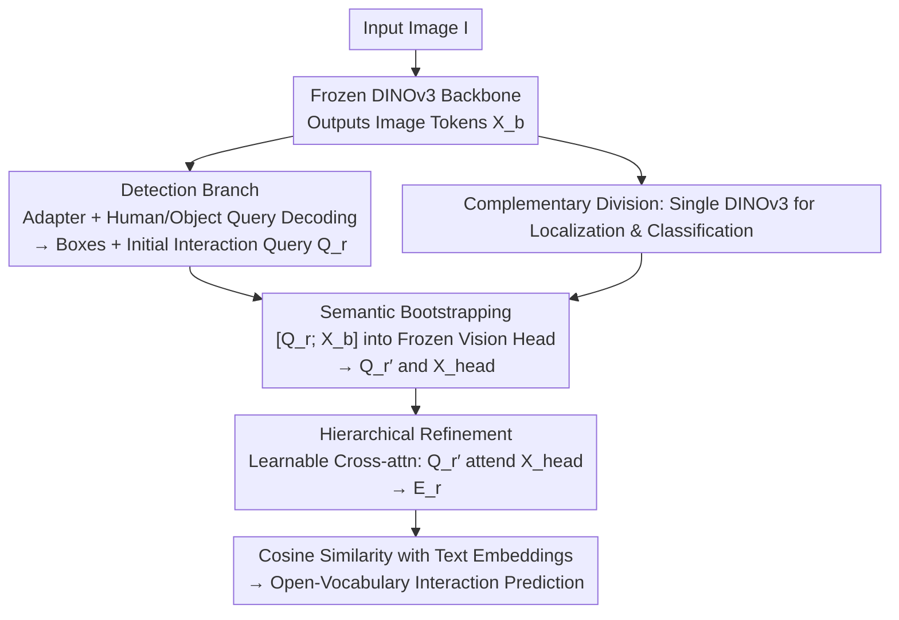

# SL-HOI: Streamlined Open-Vocabulary Human-Object Interaction Detection

**Conference**: CVPR 2026  
**Paper**: [CVF Open Access](https://openaccess.thecvf.com/content/CVPR2026/html/Sun_Streamlined_Open-Vocabulary_Human-Object_Interaction_Detection_CVPR_2026_paper.html)  
**Code**: https://github.com/MPI-Lab/SL-HOI  
**Area**: Object Detection / Human-Object Interaction Detection  
**Keywords**: Open-vocabulary HOI, DINOv3, Single-VLM detection, Semantic bootstrapping, Representation gap

## TL;DR
SL-HOI utilizes a single frozen DINOv3 (dino.txt variant) for open-vocabulary HOI detection—using the backbone for precise localization and a text-aligned vision head for open-vocabulary interaction classification. By "inserting interaction queries and image tokens together into the frozen vision head," the representation gap is bridged. With only a small number of trainable parameters, it achieves SOTA performance on SWiG-HOI and HICO-DET.

## Background & Motivation

**Background**: Open-vocabulary HOI detection aims to localize all "human-object pairs" in an image and recognize their interaction actions, including those not seen during training. Current mainstream methods rely on pre-trained VLMs for generalization, falling into two categories: "VLM-collaborated" (traditional HOI detector + VLM), where the VLM provides generalizable representations; and "VLM-only," which adapts a VLM into an HOI detector for both detection and classification.

**Limitations of Prior Work**: The first category requires training two independent models, leading to structural complexity and cross-model representation gaps. The second category, usually based on CLIP, struggles with detection precision because CLIP's training objective focuses on "global image vs. full sentence" features, failing to extract fine-grained regional features necessary for instance localization.

**Key Challenge**: HOI detection requires two contrasting feature types—**fine-grained local localization features** (to find human/object boxes) and **global relational semantic features** (to understand interactions and generalize). Splitting these tasks between two models creates a cross-model gap, while forcing them into a single CLIP model results in a trade-off.

**Key Insight**: The authors observe a natural "functional division" within dino.txt (DINOv3 + vision head variant). Visualizing the attention maps of the last self-attention block reveals that the DINOv3 backbone attention is highly focused on small, specific regions (suitable for localization), while the vision head attention is holistic, aggregating global relational context (suitable for interaction classification). Since one model naturally possesses both complementary features, an external second model is unnecessary.

**Core Idea**: A **single frozen DINOv3** is used for both localization and classification. The backbone provides fine-grained features for detection, and the vision head performs open-vocabulary classification. The representation gap is eliminated by "allowing interaction queries and image tokens to share the same forward pass of the frozen vision head." The entire DINOv3 remains frozen, with only a few parameters added for training.

## Method

### Overall Architecture

SL-HOI is a one-stage framework built on a frozen DINOv3 (dino.txt variant, ViT-L/16). Given an image $I\in\mathbb{R}^{H\times W\times 3}$, the frozen backbone produces image tokens $X_b\in\mathbb{R}^{N\times D}$, which are fed into two branches:

- **Detection Branch** (Standard HOI detection decoder): After dimension reduction, positional encoding, and a detection adapter, a set of human queries $Q_h$ and object queries $Q_o$ use cross-attention to obtain $E_h, E_o$ for human/object box regression.
- **Interaction Classification Branch** (Core contribution): $E_h$ and $E_o$ are element-wise averaged and projected into initial interaction queries $Q_r$. Crucially, $Q_r$ and backbone image tokens $X_b$ are fed **together** into the frozen vision head. This yields semantically enhanced queries $Q_r'$ and query-modulated image tokens $X_{\text{head}}$. Finally, a learnable cross-attention block allows $Q_r'$ to re-attend to $X_{\text{head}}$, producing $E_r$ for open-vocabulary classification.

### Key Designs

**1. Complementary Division: Single Frozen DINOv3 for Localization and Classification**

This design addresses the dilemma of "two models → cross-model gap" vs. "single CLIP → weak localization." The authors split dino.txt into two complementary parts: the DINOv3 backbone (pre-trained with large-scale self-supervision and Gram anchoring for dense spatial details) for localization of humans and objects, and the vision head (two self-attention blocks projecting joined tokens into text embedding space) for holistic relational context and classification. All DINOv3 parameters are **frozen**, with only a few learnable parameters added (detection adapter, detection decoder, last cross-attention block), maintaining self-supervised feature quality while adapting to HOI.

**2. Semantic Bootstrapping: Inserting Queries into the Vision Head**

Directly applying cross-attention between interaction queries $Q_r$ and vision head outputs is ineffective due to the representation gap. Instead, the authors force both into the same representation space: $[Q_r';\,X_{\text{head}}]=\mathcal{F}_{\text{head}}([Q_r;\,X_b])$. This step has **zero additional training cost** as the vision head is frozen. It allows interaction queries to pass through the pre-trained head pathway, aligning them with the text-semantic space to create $Q_r'$. This process also produces **query-modulated image tokens** $X_{\text{head}}$, which contain task-relevant interaction cues. Ablations show that blocking the influence of queries on tokens via attention masking leads to performance drops across all metrics.

**3. Hierarchical Refinement: Learnable Cross-attention using Modulated Tokens**

To utilize all available information, a lightweight learnable decoder $\mathcal{G}_{\text{decoder}}$ is introduced. The semantically enhanced queries $Q_r'$ attend to the modulated tokens $X_{\text{head}}$: $E_r=\mathcal{G}_{\text{decoder}}(Q_r',\,X_{\text{head}})$. This forms a "coarse alignment followed by focused refinement" process. Semantic bootstrapping handles global semantic alignment in the frozen head (improving unseen/rare generalization), while hierarchical refinement performs learnable focusing for the HOI task (improving rare/non-rare). This creates a **Local-Global-Local** inference flow. Finally, $E_r$ is projected into the text space for cosine similarity with category embeddings: $p_{ij}=\dfrac{\exp(\tau\cos(e_r'^{(i)},e_t^{(j)}))}{\sum_{k\in\mathcal{R}}\exp(\tau\cos(e_r'^{(i)},e_t^{(k)}))}$.

### Loss & Training

DINOv3 is frozen throughout. Trainable components include the detection adapter ($L_E=2$ self-attention layers), detection decoder ($L_D=3$ layers, $N_q=64$ queries each for human/object), and a 1-layer cross-attention decoder ($D=1024$). Optimized with AdamW, learning rate $1\times10^{-4}$, on 8× RTX 4090 GPUs. SWiG-HOI uses in-batch contrastive objectives, while HICO-DET uses classification over the full category set.

## Key Experimental Results

### Main Results (Open-Vocabulary Setting)

SWiG-HOI (approx. 5,500 relationship classes, >1,000 unseen), mAP%:

| Method | Unseen | Rare | Non-rare | Full |
|------|--------|------|----------|------|
| THID | 10.04 | 12.82 | 17.67 | 13.26 |
| CMD-SE | 10.70 | 14.64 | 21.46 | 15.26 |
| INP-CC | 11.02 | 16.74 | 22.84 | 16.74 |
| SGC-Net | 12.46 | 16.55 | 23.67 | 17.20 |
| MP-HOI-L (w/ Detection Pre-train) | - | 18.59 | 25.76 | 16.21 |
| **Ours (SL-HOI)** | **19.04** | **24.69** | **30.62** | **24.67** |

Ours outperforms the next best SGC-Net by 6.58% on Unseen and 7.47% on Full.

HICO-DET Open-Vocabulary (mAP%):

| Method | Backbone | Unseen | Seen | Full |
|------|----------|--------|------|------|
| INP-CC (no Detection Pre-train) | CLIP-ViT-B/16 | 17.38 | 24.74 | 23.13 |
| BC-HOI (w/ Detection Pre-train) | ResNet50+BLIP-2-ViT-G/14 | 42.31 | 40.67 | 40.99 |
| **Ours (SL-HOI)** | DINOv3-ViT-L/16 | 40.53 | 42.99 | 42.49 |

Compared to the "no detection pre-train" group, Ours shows gains of 17.26% / 14.65% / 15.27% across Unseen/Seen/Full.

### Ablation Study

Component analysis (SWiG-HOI, mAP%):

| Configuration | Unseen | Rare | Non-rare | Full |
|------|--------|------|----------|------|
| Baseline (late-fusion decoder) | 16.55 | 21.66 | 27.75 | 21.82 |
| + Semantic Bootstrapping | 18.09 | 23.27 | 28.83 | 23.28 |
| + Hierarchical Refinement (Full SL-HOI) | 19.04 | 24.69 | 30.62 | 24.67 |

### Key Findings
- **Component Specialization**: Semantic bootstrapping improves Unseen/Rare (generalization) using the frozen head's semantic space. Hierarchical refinement improves Rare/Non-rare by reusing task-modulated tokens.
- **Internal Pathway is Key**: "Bootstrapping" by sending queries through the internal frozen self-attention pathway is superior to simple late-fusion of outputs.
- **Bi-directional Query Interaction**: Using an attention mask to block query influence on image tokens degrades performance, proving queries help shape image representations.
- **Adapter Depth**: 2 self-attention layers work best for the detection adapter. Adding more layers harms the pre-trained DINOv3 features, contrasting with original DETR intuition.

## Highlights & Insights
- **Functional Division Discovery**: Visualizing attention maps to justify using a single model for dual tasks (Localization/Classification) provides a strong foundation for the architecture.
- **Transferable Alignment Trick**: Feeding "queries + tokens" together through the forward pass of a frozen pre-trained module to align them is a valuable insight for other "frozen model + adapter" tasks.
- **Refuting DETR Superstition**: The observation that shallower adapters are better when the backbone is frozen serves as a reminder that end-to-end training heuristics do not always apply to fine-tuning scenarios.

## Limitations & Future Work
- The computational cost of the ViT backbone in DINOv3 is higher than traditional CNN-based detectors.
- The method is tightly coupled with the specific "backbone + vision head" structure of dino.txt.
- HICO-DET Unseen performance is slightly lower than BC-HOI, suggesting that larger VLMs and detection-specific pre-training still hold advantages for extreme out-of-distribution categories.

## Related Work & Insights
- **vs. VLM-collaborated (HOICLIP, UniHOI)**: These use complex two-model structures with cross-model gaps. SL-HOI eliminates this via a single DINOv3.
- **vs. VLM-only (THID, CMD-SE, INP-CC)**: These rely on CLIP, which has weak localization. SL-HOI uses DINOv3, which is designed for dense spatial performance.
- **vs. Late-fusion Baselines**: Instead of simple late-stage fusion, SL-HOI utilizes internal feature interaction and token modulation, resulting in more comprehensive information usage.

## Rating
- Novelty: ⭐⭐⭐⭐⭐ Elegant dual-use of DINOv3 and unique bootstrapping alignment.
- Experimental Thoroughness: ⭐⭐⭐⭐⭐ Comprehensive coverage of benchmarks, open/closed sets, and varied ablations.
- Writing Quality: ⭐⭐⭐⭐ Solid logic driven by visualization; clear technical descriptions.
- Value: ⭐⭐⭐⭐ High performance with a streamlined architecture; reusable "internal-pass" alignment strategy.

<!-- RELATED:START -->

## Related Papers

- [\[CVPR 2026\] Black-Box Domain Adaptation for Object Detection with Retention-Driven Knowledge Compression](black-box_domain_adaptation_for_object_detection_with_retention-driven_knowledge.md)
- [\[CVPR 2026\] Show, Don't Tell: Detecting Novel Objects by Watching Human Videos](show_dont_tell_detecting_novel_objects_by_watching.md)
- [\[CVPR 2026\] CD-Buffer: Complementary Dual-Buffer Framework for Test-Time Adaptation in Adverse Weather Object Detection](cd-buffer_complementary_dual-buffer_framework_for_test-time_adaptation_in_advers.md)
- [\[CVPR 2026\] PaQ-DETR: Learning Pattern and Quality-Aware Dynamic Queries for Object Detection](paq-detr_learning_pattern_and_quality-aware_dynamic_queries_for_object_detection.md)
- [\[CVPR 2026\] Evaluating Few-Shot Pill Recognition Under Visual Domain Shift](evaluating_few-shot_pill_recognition_under_visual_domain_shift.md)

<!-- RELATED:END -->
