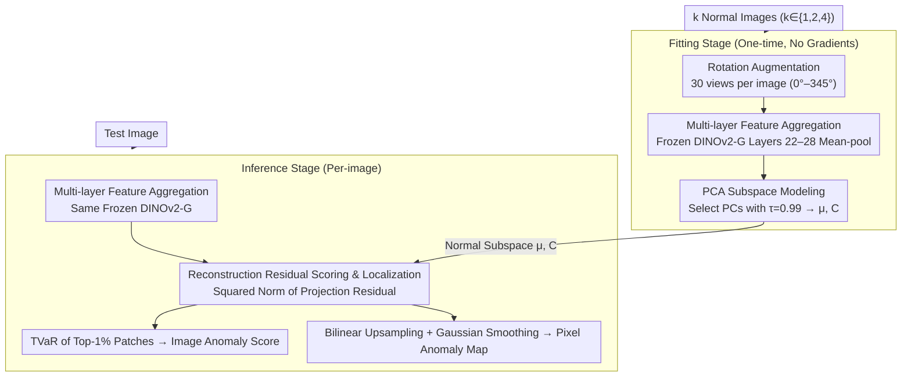

# SubspaceAD: Training-Free Few-Shot Anomaly Detection via Subspace Modeling

**Conference**: CVPR 2026  
**arXiv**: [2602.23013](https://arxiv.org/abs/2602.23013)  
**Code**: [https://github.com/CLendering/SubspaceAD](https://github.com/CLendering/SubspaceAD)  
**Area**: Object Detection  
**Keywords**: Few-shot Anomaly Detection, PCA, DINOv2, Training-free, Subspace Modeling

## TL;DR

SubspaceAD demonstrates that fitting a single PCA on features from a strong vision foundation model (DINOv2-G) is sufficient to outperform all few-shot anomaly detection methods requiring training, memory banks, or prompt tuning. In a 1-shot setting, it achieves 98.0% Image-level AUROC and 97.6% Pixel-level AUROC on MVTec-AD.

## Background & Motivation

**Background**: Mainstream industrial anomaly detection methods are categorized into three types: reconstruction-based (learning to reconstruct normal samples), memory bank-based (storing normal features for nearest neighbor search), and VLM-based (using text-guided detection with CLIP, etc.).

**Limitations of Prior Work**:
   - Reconstruction-based methods require training, hyperparameter tuning, and balancing reconstruction quality with anomaly sensitivity.
   - Memory bank-based methods require storing thousands to millions of patch descriptors and performing large-scale nearest neighbor searches during inference.
   - VLM-based methods rely on prompt tuning, auxiliary datasets, or domain-specific text priors.
   - All three categories are becoming increasingly complex (multi-stage training, data augmentation, hyperparameter tuning), making deployment difficult.

**Key Challenge**: Given that vision foundation models (e.g., DINOv2) already generate sufficiently strong feature representations, is such a complex downstream pipeline still necessary?

**Key Insight**: Leveraging classic statistical principles—anomalies (outliers) manifest as reconstruction residuals deviating from the principal component subspace of normal data.

**Core Idea**: Frozen DINOv2-G feature extraction + one-time PCA fitting of the normal subspace = training-free anomaly detection.

## Method

### Overall Architecture

SubspaceAD aims to answer a simple question: Since foundation models like DINOv2 already encode images into highly discriminative patch features, is a full suite of training, memory banks, or prompt tuning still needed for anomaly detection? The answer is no—anomalous regions can be identified simply by describing "normality" as a low-dimensional linear subspace. Consequently, the entire pipeline consists of only two steps with no learnable parameters: The fitting stage extracts **multi-layer features** from $k$ normal images ($k \in \{1,2,4\}$) after rotation augmentation and performs **PCA subspace modeling** to obtain the normal subspace (mean $\mu$ and principal component matrix $C$); the inference stage aggregates multi-layer features from a test image, projects them back into this subspace, and uses the **reconstruction residual** for scoring and localization—the energy lost during projection is directly treated as the anomaly score. The entire "model" consists of $\mu$ and $C$, occupying less than 1MB per category. The data flow for both stages and the three key designs is illustrated below:

### Key Designs

**1. Multi-layer Feature Aggregation: Stabilizing Covariance Estimation on Feature Layers**

The choice of feature layer for PCA fitting is critical. Deepest DINOv2 features tend to collapse local details into category-level abstractions, losing texture and structural cues essential for anomaly detection. Conversely, using a single layer may mix layer-specific variance into the covariance estimation, causing principal components to capture "layer noise" rather than "normal appearance." SubspaceAD averages patch features from intermediate layers 22–28: $x_p = \frac{1}{|\mathcal{L}|}\sum_{l \in \mathcal{L}} f_l(p)$, where $\mathcal{L}$ denotes layers 22–28. This preserves both semantic and structural information while canceling layer-specific variance, allowing PCA to capture stable patterns consistent across layers. Ablations show that using only the last layer yields ~95%, while multi-layer aggregation achieves 98.0%.

**2. PCA Subspace Modeling: Defining "Normality" via Eigenvalue Decomposition**

With stable features, normal samples are assumed to lie near a low-dimensional linear subspace: $x = \mu + Cz + \epsilon$, where $\mu$ is the mean, $C \in \mathbb{R}^{D \times r}$ consists of the top $r$ eigenvectors of the covariance matrix $\Sigma$, $z$ represents coordinates within the subspace, and $\epsilon$ is the residual. The number of principal components is determined automatically using an explained variance threshold $\tau = 0.99$, selecting the minimum $r$ such that:

$$\sum_{i=1}^r \lambda_i \geq \tau \sum_{i=1}^D \lambda_i$$

This ensures the subspace covers 99% of the normal feature variance. Since few-shot samples are insufficient for stable covariance estimation, the authors apply $N_a = 30$ random rotations (0°–345°) to each normal image to expand the viewpoints. The final model only needs to store $\mu \in \mathbb{R}^D$ and $C \in \mathbb{R}^{D \times r}$, resulting in a model size under 1MB per category.

**3. Reconstruction Residual Scoring and Localization: Anomalies as Energy Lost in Projection**

Since normal patches align with the subspace, the distance between a patch and the subspace indicates its anomalousness. By projecting a patch back, $x_\text{proj} = \mu + CC^\top(x_p - \mu)$, and taking the squared norm of the residual $S(x_p) = \|x_p - x_\text{proj}\|_2^2$ as the patch-level score, we obtain a statistically sound metric equivalent to the negative log-likelihood in directions orthogonal to the subspace. For the image-level score, Tail Value at Risk (TVaR) is used, averaging the top $\rho = 1\%$ patch scores to prevent normal background patches from diluting the signal. Pixel-level anomaly maps are generated via bilinear upsampling and Gaussian smoothing ($\sigma = 4$).

### Loss & Training

**Ours: Training-free**. The method involves only a single PCA fitting (i.e., one eigenvalue decomposition) without gradient updates or tuning loops. Inference takes approximately 300ms per image, where DINOv2 forward pass accounts for 270ms and subspace projection only 30ms—the bottleneck lies entirely in feature extraction.

## Key Experimental Results

### Main Results — 1-shot Anomaly Detection

| Dataset | Metric | SubspaceAD | AnomalyDINO | PromptAD | WinCLIP |
|--------|------|-----------|-------------|----------|---------|
| MVTec-AD | Image AUROC | **98.0** | 96.6 | 94.6 | 93.1 |
| MVTec-AD | Pixel AUROC | **97.6** | 96.8 | 95.9 | 95.2 |
| MVTec-AD | PRO | **93.7** | 92.7 | 87.9 | 87.1 |
| VisA | Image AUROC | **93.3** | 87.4 | 86.9 | 83.8 |
| VisA | Pixel AUROC | **98.3** | 97.8 | 96.7 | 96.4 |

In the 4-shot setting, SubspaceAD maintains a comprehensive lead (MVTec 98.4% / VisA 94.5%).

### Ablation Study

| Configuration | MVTec Image AUROC | Description |
|------|-------------------|------|
| Single Layer (Last) | ~95% | Loses low-level structural info |
| Multi-layer (22-28) | **98.0%** | Balances semantics and structure |
| $\tau = 0.95$ | ~97% | Too few components retained |
| $\tau = 0.99$ | **98.0%** | Optimal threshold |
| No Augmentation | ~96% | Rotation significantly improves results |
| 672px Resolution | **98.0%** | Superior to 518px |

### Key Findings
- On VisA, 1-shot Image-level AUROC exceeds AnomalyDINO by 5.9 percentage points (93.3% vs 87.4%).
- Multi-layer feature aggregation provides significant gains over using only the last layer by including local texture/structural information.
- The method also achieves SOTA in batched 0-shot settings (VisA 97.7%), demonstrating the universality of PCA subspace modeling.
- Storage is <1MB per category, much smaller than memory bank methods (tens to hundreds of MBs).
- Inference speed is 300ms/image, bottlenecked solely by the DINOv2 forward pass.

## Highlights & Insights
- **Elegance in Simplicity**: While others design complex pipelines, this work proves that the classic PCA method applied to strong features can outperform them all. It raises the question: is the complexity of many tasks rooted in the downstream method or the quality of feature representation?
- **Theoretical Guarantee**: Reconstruction residual equals the negative log-likelihood of the orthogonal subspace, providing a probabilistic basis for the scoring function.
- **Extremely Lightweight**: No training, no memory banks, and no prompt tuning. Models <1MB are truly ready for industrial deployment.
- **Clever Use of Augmentation**: Rotation is not just for "more data" but to ensure covariance estimation covers common orientation variances in industrial inspection.

## Limitations & Future Work
- The linear subspace assumption may be insufficient for modeling normal variations with non-linear distributions.
- Dependency on DINOv2-G (ViT-G) makes the overall model heavy (~1.1B parameters), with feature extraction being the primary bottleneck.
- Rotation augmentation assumptions might not apply to all categories (e.g., transistors, where rotation itself is an anomaly).
- Generalization to out-of-domain data (e.g., medical imaging) has not been verified.
- The PCA threshold $\tau$ and resolution require selection per dataset; though robust, the method is not entirely parameter-free.

## Rating
- Novelty: ⭐⭐⭐⭐ The novelty lies not in the method (PCA is classic), but in the insight—proving strong features + simple methods > complex pipelines.
- Experimental Thoroughness: ⭐⭐⭐⭐⭐ Comprehensive coverage of MVTec-AD and VisA across 0/1/2/4-shot settings with thorough ablations.
- Writing Quality: ⭐⭐⭐⭐⭐ Clear logical flow, repeatedly emphasizing why simple methods work.
- Value: ⭐⭐⭐⭐⭐ An immediately deployable solution for industry; reviewers will likely be impressed by the paper's simplicity.

## Related Papers

- [\[CVPR 2026\] Bidirectional Multimodal Prompt Learning with Scale-Aware Training for Few-Shot Multi-Class Anomaly Detection](bidirectional_multimodal_prompt_learning_with_scale-aware_training_for_few-shot_.md)
- [\[CVPR 2026\] Defect Cue-Preserved Structural Feature Refinement for Few-Shot Anomaly Detection](defect_cue-preserved_structural_feature_refinement_for_few-shot_anomaly_detectio.md)
- [\[CVPR 2025\] UniVAD: A Training-free Unified Model for Few-shot Visual Anomaly Detection](../../CVPR2025/object_detection/univad_a_training-free_unified_model_for_few-shot_visual_anomaly_detection.md)
- [\[CVPR 2026\] VisualAD: Language-Free Zero-Shot Anomaly Detection via Vision Transformer](visualad_language-free_zero-shot_anomaly_detection_via_vision_transformer.md)
- [\[CVPR 2026\] FastRef: Fast Prototype Refinement for Few-shot Industrial Anomaly Detection](fastref_fast_prototype_refinement_for_few-shot_industrial_anomaly_detection.md)

<!-- RELATED:END -->

<!-- RELATED:START -->

## Related Papers

- [\[CVPR 2026\] Bidirectional Multimodal Prompt Learning with Scale-Aware Training for Few-Shot Multi-Class Anomaly Detection](bidirectional_multimodal_prompt_learning_with_scale-aware_training_for_few-shot_.md)
- [\[CVPR 2026\] Defect Cue-Preserved Structural Feature Refinement for Few-Shot Anomaly Detection](defect_cue-preserved_structural_feature_refinement_for_few-shot_anomaly_detectio.md)
- [\[CVPR 2026\] FastRef: Fast Prototype Refinement for Few-shot Industrial Anomaly Detection](fastref_fast_prototype_refinement_for_few-shot_industrial_anomaly_detection.md)
- [\[CVPR 2026\] VisualAD: Language-Free Zero-Shot Anomaly Detection via Vision Transformer](visualad_language-free_zero-shot_anomaly_detection_via_vision_transformer.md)
- [\[CVPR 2026\] Remedying Target-Domain Astigmatism for Cross-Domain Few-Shot Object Detection](remedying_target-domain_astigmatism_for_cross-domain_few-shot_object_detection.md)

<!-- RELATED:END -->
