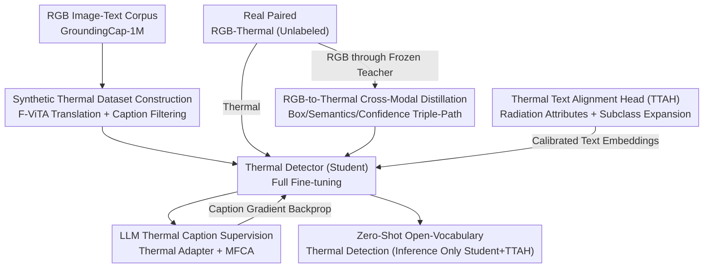

# Thermal-Det: Language-Guided Cross-Modal Distillation for Open-Vocabulary Thermal Object Detection

**Conference**: CVPR 2026  
**Paper**: [CVF Open Access](https://openaccess.thecvf.com/content/CVPR2026/html/Ranasinghe_Thermal-Det_Language-Guided_Cross-Modal_Distillation_for_Open-Vocabulary_Thermal_Object_Detection_CVPR_2026_paper.html)  
**Code**: To be confirmed  
**Area**: Object Detection / Open-Vocabulary Detection / Cross-Modal Distillation  
**Keywords**: Thermal Infrared Detection, Open-Vocabulary, Cross-Modal Distillation, Zero-Shot, Synthetic Data

## TL;DR
Thermal-Det utilizes "RGB-to-Thermal" translation to synthesize million-scale thermal data with text annotations for pre-training. It then employs a frozen RGB open-vocabulary detector as a teacher, transferring open-vocabulary capabilities to a thermal student through triple-path distillation (box/semantics/confidence). By combining a Thermal Text Alignment Head (TTAH) and thermal LLM caption supervision to calibrate the CLIP text space, it achieves **zero-shot open-vocabulary thermal detection without any thermal annotations**, outperforming RGB open-vocabulary detectors by 2–4% AP across 7 thermal benchmarks.

## Background & Motivation

**Background**: Open-vocabulary detection (OVD, such as GLIP, Grounding DINO, OWLv2, LLMDet) relies on large-scale RGB image-text pairs to learn text-conditioned visual representations, enabling the detection of unseen categories using natural language prompts. However, these capabilities are almost entirely confined to the visible spectrum.

**Limitations of Prior Work**: Thermal infrared imaging is indispensable in safety-critical scenarios like autonomous driving, security, and search-and-rescue. However, thermal detectors are generally **closed-set**, identifying only a few categories (e.g., pedestrians, vehicles) annotated in small datasets like KAIST, FLIR, or LLVIP, suffering from both a lack of annotations and category diversity. Directly applying RGB-trained OVDs to thermal imagery results in sharp performance collapses due to the modality gap (low texture, emissivity variations, weak contrast). Existing domain adaptation or adapter methods only align at the pixel or feature levels, ignoring the high-level semantic alignment required for open-world understanding, and still remain dependent on limited thermal annotations.

**Key Challenge**: Open-vocabulary detection requires massive language-annotated data, whereas thermal annotations are extremely expensive and scarce. This fundamental conflict is the root cause of the slow progress in thermal OVD.

**Goal**: Construct the **first zero-shot open-vocabulary thermal detection framework entirely without any thermal annotations**, internalizing thermal-specific contrast patterns while preserving language alignment capabilities.

**Key Insight**: Given the high cost of thermal annotations, this work (1) uses image translation to "texture" existing million-scale RGB image-text data into the thermal domain to obtain large-scale supervision; (2) distills open-vocabulary knowledge already learned by an RGB OVD teacher rather than learning semantics from scratch; and (3) specifically calibrates CLIP text embeddings that are biased by RGB statistics.

**Core Idea**: Synergize "synthetic thermal supervision + RGB-to-thermal cross-modal distillation + thermal-text alignment" to migrate open-vocabulary capabilities to the thermal domain **without annotations**.

## Method

### Overall Architecture

Thermal-Det is a dual-stream (RGB teacher + thermal student) open-vocabulary detector, augmented by a thermal-adaptive LLM for caption supervision. The entire system is trained jointly end-to-end. During inference, only the thermal student branch and the TTAH are retained (LLM and RGB teacher are discarded).

There are two types of training data: ① **Synthetic thermal data**—translating the million-scale RGB images from GroundingCap-1M into thermal via F-ViTA, where original bounding boxes, grounding phrases, and scene captions are reused to provide a strong initialization for the detector. ② **Real paired RGB-thermal data** (e.g., M3FD)—unlabeled, used solely for distillation. The detector receives thermal images $I_{th}$ and category queries encoded by a frozen CLIP text encoder, outputting boxes $\{B_i\}$ and similarity scores $\{s_i\}$ through transformer query-key-value decoding. Unlike adapter-based transfer, this work **fully fine-tunes** the detector, allowing convolutional and attention layers to adapt to thermal cues while maintaining alignment with the fixed CLIP text space.

The total loss combines four signals:

$$L_{total} = L_{det} + L_{KD} + L_{TTAH} + L_{cap}$$

Where $L_{det}=L_{cls}+L_{box}$ is the standard detection loss on synthetic thermal data ($L_{cls}$ performs cosine contrastive alignment between region features and text embeddings, and $L_{box}$ is the ℓ1 + GIoU/CIoU localization loss).

### Key Designs

**1. Synthetic Thermal Dataset Construction: Addressing annotation scarcity via RGB-to-thermal translation**

The first barrier to thermal open-vocabulary detection is the lack of large-scale language-annotated data. Instead of manual labeling, this work translates GroundingCap-1M (>1 million samples of $(I_{rgb}, T_g, B, T_c)$, including grounding phrases, boxes, and dense scene captions generated by Qwen2-VL-72B covering 13k+ categories derived from V3Det) into the thermal domain. Specifically, the F-ViTA cross-domain translation model is used to convert each $I_{rgb}$ into a synthetic thermal image $I_{th}^{syn}$. Since translation preserves scene structure and object geometry, the spatial positions of original bounding boxes remain valid. For the text side, a lightweight filter removes RGB-specific descriptors (e.g., red/blue/green, bright/sunlit), ensuring the captions remain semantically plausible and visually grounding under thermal representations. This provides an initialization rich in both geometry and language.

**2. RGB-to-Thermal Cross-Modal Distillation: Teacher-to-student transfer without annotations**

While synthetic data is plentiful, significant domain gaps exist between it and real thermal imagery in terms of appearance and feature statistics. Thermal-Det uses a frozen RGB OVD as a teacher and the thermal detector as a student. Distillation is performed on **real paired** RGB-thermal frames (spatially aligned, e.g., M3FD). The teacher processes $I_{rgb}$ to generate pseudo-labels (boxes, logits, similarity), and the student aligns its output across three complementary dimensions:

$$L_{KD} = L_{KD\text{-}box} + L_{KD\text{-}sem} + L_{KD\text{-}conf}$$

$L_{KD\text{-}box}$ uses GIoU to align boxes, forcing the student to replicate localization despite contrast differences. $L_{KD\text{-}sem}$ uses a cosine InfoNCE loss to align region features, inheriting semantic abstractions while retaining radiation cues. $L_{KD\text{-}conf}$ uses KL divergence to align category probability distributions, mimicking the teacher's soft decision boundaries to enhance robustness under low contrast. 

**3. Thermal Text Alignment Head (TTAH): Calibrating the RGB-biased CLIP space**

Even with visual fine-tuning, frozen CLIP text embeddings remain biased toward RGB statistics. TTAH is a lightweight module acting on the CLIP text branch. For each text token $t_c$, it retrieves attribute vectors $a_j$ from a **learnable radiation attribute library** (e.g., hot, silhouette, reflective) and processes them: $t_c^* = \text{LN}(\text{MLP}([t_c; a_j]))$. The calibrated embeddings replace the original ones. Training utilizes a contrastive loss $L_{TTAH\text{-}ctr}$ to pull thermal visual features $f_{th}$ toward calibrated text, with a drift regularization $L_{TTAH\text{-}drift}=\|t_c^*-t_c\|_2^2$. 

Crucially, it uses **subclass expansion + confidence-gated selection**: each base class $c$ is paired with $M$ attributes to generate thermal sub-labels. The student calculates similarities $s_{c,j}=\cos(f_{th}, t_{c,j}^*)$ and selects the best-matching sub-label as the effective representation $\tilde t_c$. This allows a "person" to adaptively become a "hot person" or "silhouette person" without extra labels.

**4. Thermal LLM Caption Supervision: Injecting linguistic reasoning**

Thermal-Det pairs the detector with an LLM to generate scene- and object-level captions. A **Thermal Adapter** (LoRA-style residual MLP) is inserted into LLM transformer blocks to specialize it for thermal semantics. A **Multimodal Fusion Cross-Attention (MFCA)** allows the LLM to attend to both thermal and RGB teacher features: $K=[\alpha K_{th}; \beta K_{rgb}]$, where $\alpha,\beta$ are learnable gates. During inference, the RGB component is absent ($\beta=0$), and MFCA collapses to pure thermal attention. The caption loss $L_{cap}$ reinforces cross-modal alignment using synthesized long descriptions and grounding phrases.

### Loss & Training

The four-path loss $L_{total}=L_{det}+L_{KD}+L_{TTAH}+L_{cap}$ is optimized end-to-end. Different branches are activated based on the batch: synthetic batches use $L_{det}+L_{cap}+L_{TTAH}$, while real paired batches activate $L_{KD}$. Inference retains only the student and TTAH, ensuring **no additional inference overhead**.

## Key Experimental Results

### Main Results: Zero-Shot Detection Transfer (Swin-T backbone, no thermal annotations)

| Dataset | Metric | Thermal-Det | LLMDet (CVPR'25) | G-DINO (ECCV'24) |
|--------|------|-------------|------------------|------------------|
| FLIR-Aligned | AP / AP50 | **0.372 / 0.664** | 0.359 / 0.628 | 0.337 / 0.636 |
| FLIR-V2 | AP / AP50 | **0.096 / 0.173** | 0.048 / 0.075 | 0.081 / 0.144 |
| CAMEL | AP / AP50 | **0.511 / 0.758** | 0.383 / 0.560 | 0.482 / 0.729 |
| Utokyo | AP / AP50 | **0.065 / 0.137** | 0.050 / 0.102 | 0.050 / 0.093 |
| LLVIP (Night) | AP / AP50 | **0.566 / 0.856** | — | — |

The framework consistently improves performance across 7 benchmarks by 2–4% AP over RGB-based OVDs.

### Ablation Study: Incremental Component Gains (AP)

| Configuration | FLIR-Aligned ΔAP | CAMEL ΔAP | Description |
|------|------------------|-----------|------|
| Zero-shot Baseline | 0.200 | 0.547 | Starting point |
| + Scene Caption $L_{cap\text{-}scene}$ | +0.012 | +0.006 | Global semantic consistency |
| + Object Caption $L_{cap\text{-}object}$ | +0.028 | +0.020 | Local alignment is more effective |
| + Distillation $L_{KD}$ | +0.021 | +0.012 | Knowledge transfer from paired data |
| **Final (incl. TTAH)** | **0.261** | **0.585** | Total +6.1% / +3.8% AP |

### Key Findings
- **Object-level > Scene-level captions**: Local phrase alignment (+0.028 AP) is significantly more effective than global descriptions (+0.012 AP), suggesting the bottleneck in thermal detection lies in fine-grained region grounding.
- **Failures in small/rare objects**: High performance on "person" (0.366 AP) but very poor on "motorcycle" (0.006 AP) or "traffic light". This mimics supervised trends, indicating sensor and scale limitations rather than a failure of the zero-shot mechanism.
- **Benefits scale with lower texture**: Gains are more pronounced on FLIR-Aligned than on CAMEL, highlighting the importance of distillation and alignment in texture-scarce domains.

## Highlights & Insights
- **"Translated Data + Teacher Distillation"**: Sidesteps the annotation crisis by treating mature RGB corpora and OVD teachers as "free" supervision sources—a paradigm applicable to other data-scarce modalities like SAR or event cameras.
- **Subclass Expansion in TTAH**: Expanding "person" into "hot/silhouette person" effectively performs thermal conditioning on the text side, correcting CLIP's RGB bias without extra labels.
- **Heavy Training, Light Inference**: The expensive LLM and teacher modules are only used during training, making the final student model deployment-friendly.
- **Gated MFCA Design**: The learnable gates $\alpha, \beta$ allow the model to handle training with paired data and inference without it through automatic attention collapse.

## Limitations & Future Work
- **Small/Rare Object Weakness**: Categories like motorcycles remain nearly undetectable (0.006 AP) due to thermal sensor limitations.
- **Dependency on Translation Quality**: The framework relies heavily on the fidelity of F-ViTA. Any geometric drift in translation would cause box-feature misalignment.
- **Paired Data Requirement**: Distillation requires spatially aligned RGB-thermal pairs (like M3FD), which are themselves somewhat limited in volume.
- **Future Directions**: Exploring unpaired distillation (e.g., via optical flow or geometric priors) or multi-scale enhancement for small objects.

## Related Work & Insights
- **vs. RGB OVDs**: Directly applying RGB OVDs to thermal data fails due to the modality gap; Thermal-Det bridges this gap while retaining semantic richness.
- **vs. Domain Adaptation**: While DA methods often require thermal labels and align at low levels, Thermal-Det uses **zero thermal annotations** and aligns at high semantic levels.
- **vs. Closed-set Thermal Detectors**: Traditional detectors are limited to few classes; Thermal-Det inherits oversight of 13k+ categories and supports natural language prompts.

## Rating
- Novelty: ⭐⭐⭐⭐⭐ First zero-annotation thermal OVD framework with a solid combination of synthesis, distillation, and TTAH.
- Experimental Thoroughness: ⭐⭐⭐⭐ Extensive benchmarks and ablations, though lacking robustness analysis on translation artifacts.
- Writing Quality: ⭐⭐⭐⭐ Clear structure with well-defined module responsibilities.
- Value: ⭐⭐⭐⭐⭐ Provides a reusable paradigm for open-vocabulary detection in label-scarce modalities.

<!-- RELATED:START -->

## Related Papers

- [\[CVPR 2026\] Incremental Object Detection via Future-Aware Decoupled Cross-Head Distillation](incremental_object_detection_via_future-aware_decoupled_cross-head_distillation.md)
- [\[CVPR 2026\] SRA-Det: Learning Omni-Grained Open-Vocabulary Detection Beyond Category Names](sra-det_learning_omni-grained_open-vocabulary_detection_beyond_category_names.md)
- [\[AAAI 2026\] VK-Det: Visual Knowledge Guided Prototype Learning for Open-Vocabulary Aerial Object Detection](../../AAAI2026/object_detection/vk-det_visual_knowledge_guided_prototype_learning_for_open-vocabulary_aerial_obj.md)
- [\[CVPR 2026\] WeDetect: Fast Open-Vocabulary Object Detection as Retrieval](wedetect_fast_open-vocabulary_object_detection_as_retrieval.md)
- [\[CVPR 2026\] DyFCLT: Dynamic Frequency-Decoupled Cross-Modal Learning Transformer for Multimodal Tiny Object Detection](dyfclt_dynamic_frequency-decoupled_cross-modal_learning_transformer_for_multimod.md)

<!-- RELATED:END -->
